---  
title: "URBA Top 13 2023 Status"  
date: 2023-08-21 6:00:00 -0500  
categories: model review projection  
layout: article  
aside:  
    toc: true  
---
# Current Team Rankings

# Standings

## Current Standings

| Club                 |   Played |   Wins |   Point Differential |   Losing Bonus Points |   Try Bonus Points |   Competition Points |
|:---------------------|---------:|-------:|---------------------:|----------------------:|-------------------:|---------------------:|
| SIC                  |        5 |      5 |                  117 |                     0 |                nan |                   23 |
| Newman               |        4 |      4 |                   55 |                     0 |                  4 |                   20 |
| Alumni               |        5 |      4 |                    8 |                     0 |                  0 |                   16 |
| Hindu                |        5 |      3 |                   48 |                     1 |                nan |                   15 |
| CUBA                 |        4 |      2 |                   26 |                     1 |                  3 |                   12 |
| Belgrano             |        5 |      2 |                  -30 |                     0 |                  2 |                   12 |
| CASI                 |        4 |      2 |                   18 |                     0 |                  1 |                   11 |
| San Luis             |        4 |      2 |                  -33 |                     0 |                  1 |                    9 |
| Atlético del Rosario |        4 |      1 |                  -26 |                     1 |                  3 |                    8 |
| Buenos Aires         |        4 |      0 |                  -28 |                     2 |                  1 |                    3 |
| La Plata             |        4 |      0 |                  -40 |                     2 |                  1 |                    3 |
| Pucara               |        4 |      0 |                 -115 |                     0 |                  1 |                    1 |

## Projected Remaining Table

| Club                 |   Matches Remaining |   Wins |   Point Differential |   Losing Bonus Points |   Try Bonus Points |   Competition Points |
|:---------------------|--------------------:|-------:|---------------------:|----------------------:|-------------------:|---------------------:|
| SIC                  |                   6 |    5.2 |                 61.9 |                   0.7 |                5.1 |                 26.6 |
| Newman               |                   6 |    4.6 |                 37.2 |                   1.2 |                4.4 |                 24.2 |
| Alumni               |                   6 |    4.2 |                 30.5 |                   1.5 |                4   |                 22.2 |
| Hindu                |                   6 |    3.8 |                 19.9 |                   1.8 |                3.4 |                 20.3 |
| Belgrano             |                   6 |    3.4 |                 16.8 |                   2.1 |                3.2 |                 19   |
| CUBA                 |                   6 |    3.4 |                  4.3 |                   2   |                3.1 |                 18.7 |
| Buenos Aires         |                   6 |    3.4 |                  3.3 |                   1.4 |                3.3 |                 18.4 |
| San Luis             |                   6 |    2.2 |                -17.2 |                   2.2 |                1.9 |                 12.7 |
| Atlético del Rosario |                   6 |    2.3 |                -23.1 |                   1.3 |                2.2 |                 12.7 |
| CASI                 |                   6 |    1.7 |                -18.4 |                   2.9 |                1.4 |                 11.1 |
| La Plata             |                   6 |    1.6 |                -27.3 |                   2.2 |                1.4 |                  9.9 |
| Pucara               |                   6 |    0.2 |                -88.4 |                   0.9 |                0.2 |                  1.9 |

## Projected Total Table

| Club                 |   Total Matches |   Wins |   Point Differential |   Losing Bonus Points |   Try Bonus Points |   Competition Points |
|:---------------------|----------------:|-------:|---------------------:|----------------------:|-------------------:|---------------------:|
| SIC                  |              11 |   10.2 |                178.9 |                   0.7 |                5.1 |                 49.6 |
| Newman               |              10 |    8.6 |                 92.2 |                   1.2 |                8.4 |                 44.2 |
| Alumni               |              11 |    8.2 |                 38.5 |                   1.5 |                4   |                 38.2 |
| Hindu                |              11 |    6.8 |                 67.9 |                   2.8 |                3.4 |                 35.3 |
| Belgrano             |              11 |    5.4 |                -13.2 |                   2.1 |                5.2 |                 31   |
| CUBA                 |              10 |    5.4 |                 30.3 |                   3   |                6.1 |                 30.7 |
| CASI                 |              10 |    3.7 |                 -0.4 |                   2.9 |                2.4 |                 22.1 |
| San Luis             |              10 |    4.2 |                -50.2 |                   2.2 |                2.9 |                 21.7 |
| Buenos Aires         |              10 |    3.4 |                -24.7 |                   3.4 |                4.3 |                 21.4 |
| Atlético del Rosario |              10 |    3.3 |                -49.1 |                   2.3 |                5.2 |                 20.7 |
| La Plata             |              10 |    1.6 |                -67.3 |                   4.2 |                2.4 |                 12.9 |
| Pucara               |              10 |    0.2 |               -203.4 |                   0.9 |                1.2 |                  2.9 |

# Completed Match Review

| Model | Percent Correct Predictions | Spread Error |
| ------ | ------ | ------ |
| Club Level | 61.5% | 10.8 |
| Player Level: Lineup | 56.0% | 14.0 |
| Player Level: Minutes | 52.0% | 14.5 |

# Future Predictions

## Week 6

### SIC V Pucara on 2023/08/26

Average Margin: SIC by 23.7

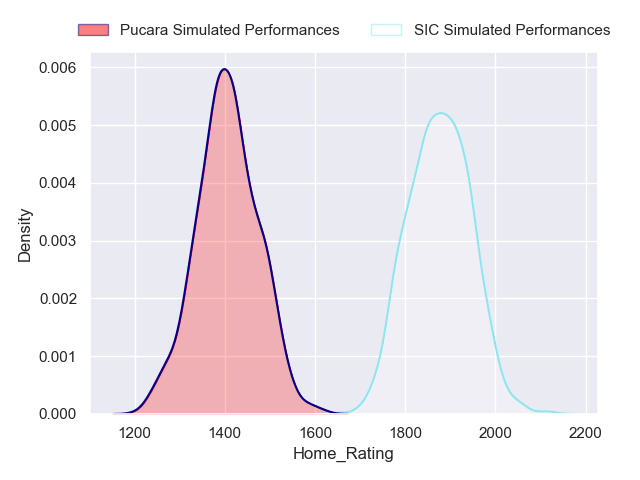

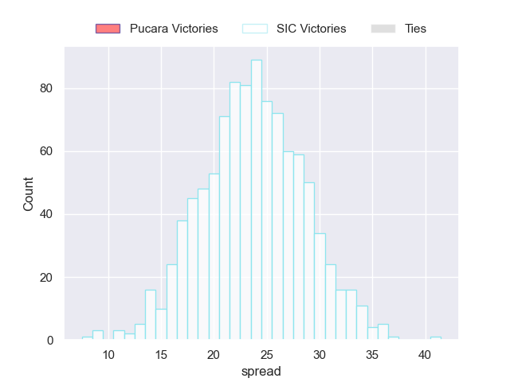

### San Luis V Belgrano on 2023/08/26

Average Margin: Belgrano by 2.8

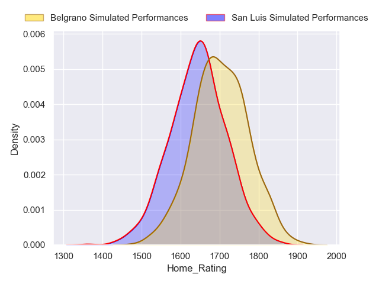

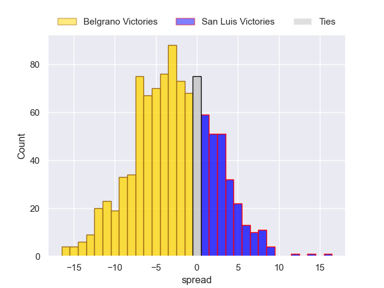

### Alumni V Newman on 2023/08/26

Average Margin: Alumni by 0.8

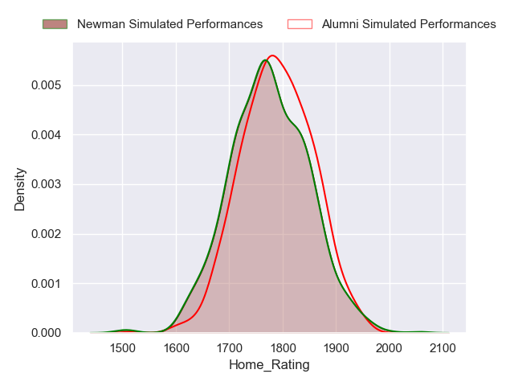

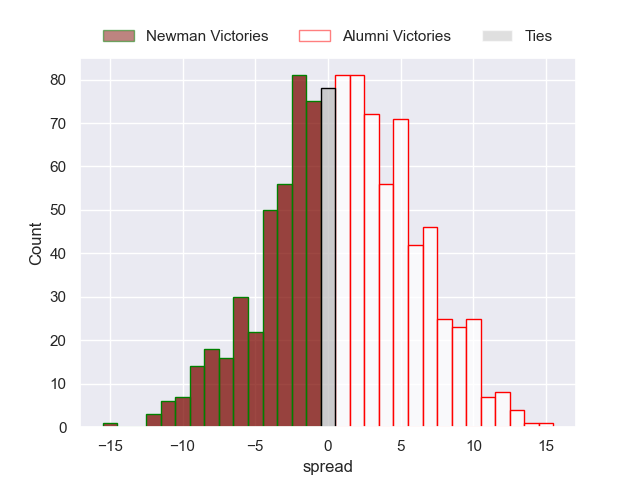

### Buenos Aires V CUBA on 2023/08/26

Average Margin: CUBA by 0.3

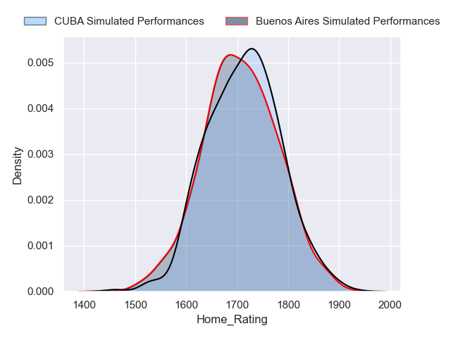

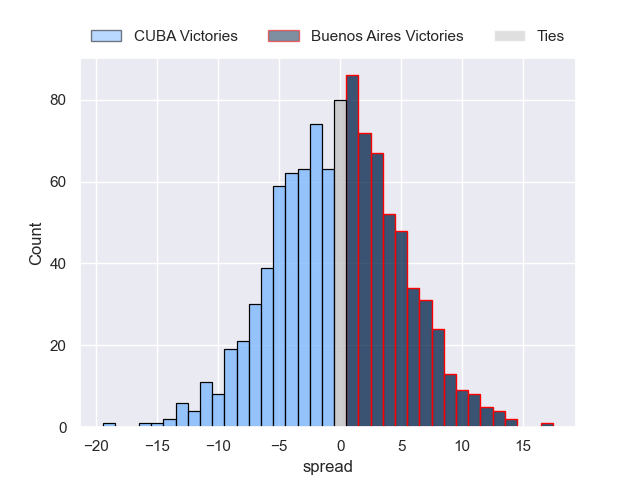

### La Plata V CASI on 2023/08/26

Average Margin: La Plata by 2.8

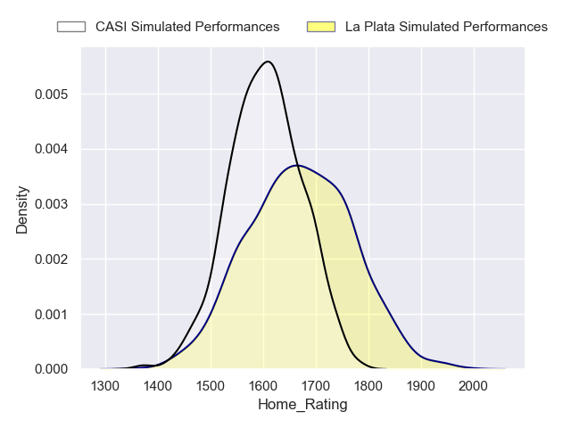
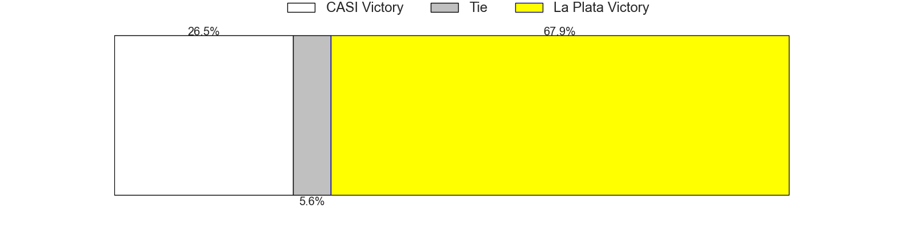
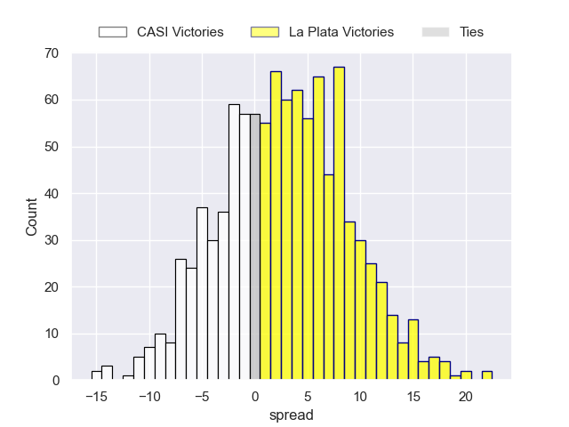

### Hindu V Atlético del Rosario on 2023/08/26

Average Margin: Hindu by 11.7

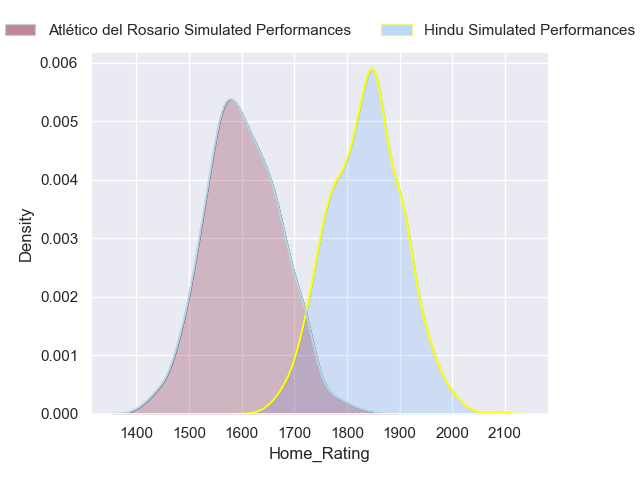

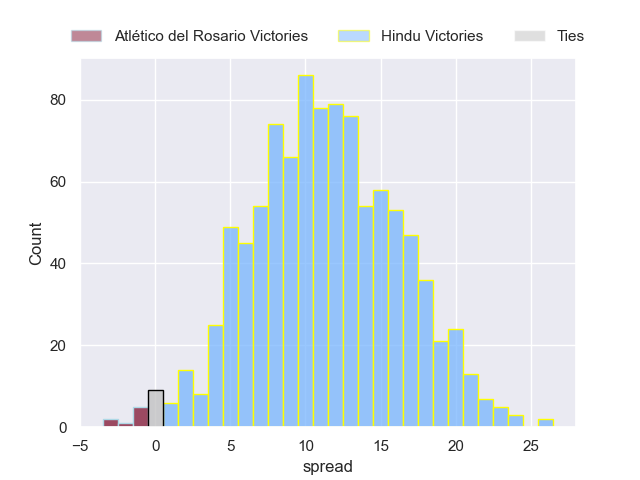

## Week 7

### CUBA V Alumni on 2023/09/02

Average Margin: CUBA by 2.7

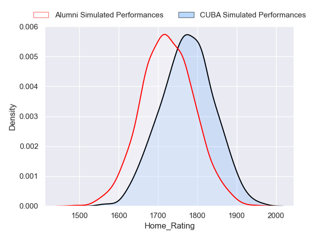
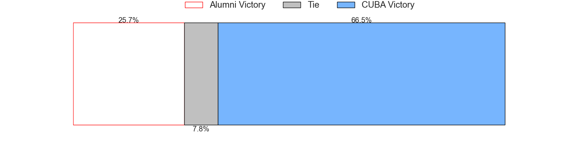
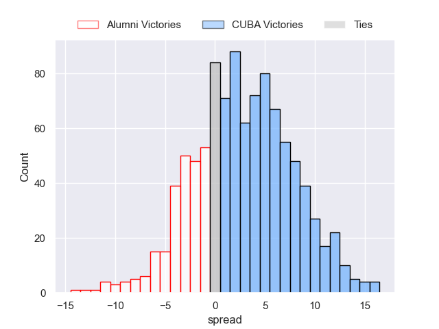

### Pucara V Buenos Aires on 2023/09/02

Average Margin: Buenos Aires by 8.0

### Newman V San Luis on 2023/09/02

Average Margin: Newman by 13.4

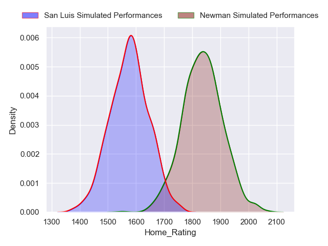

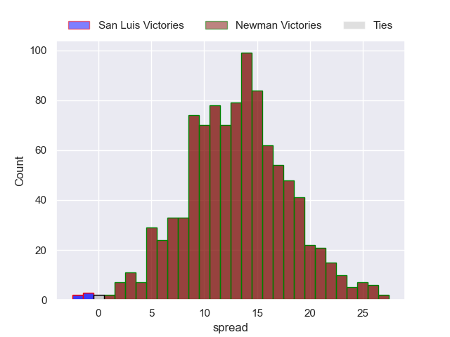

### CASI V SIC on 2023/09/02

Average Margin: SIC by 6.6

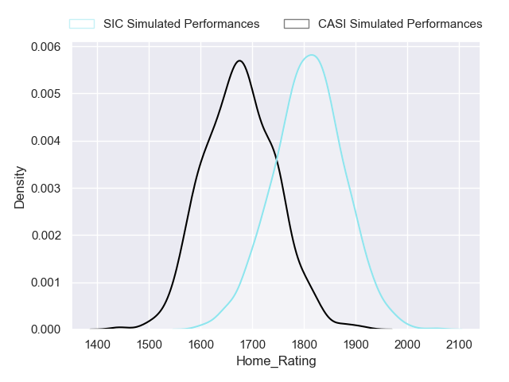
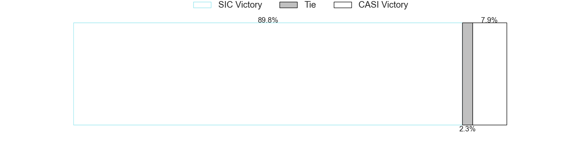
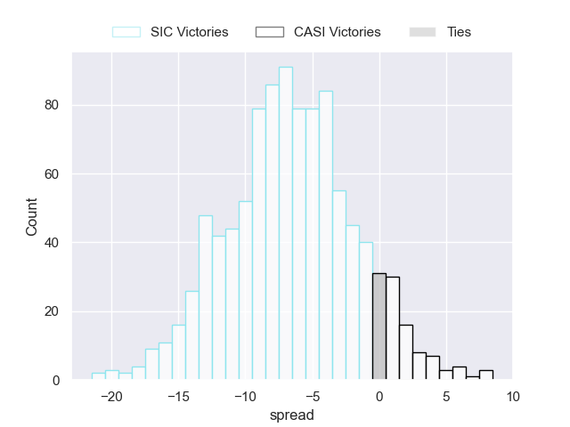

### Belgrano V Hindu on 2023/09/02

Average Margin: Hindu by 0.1

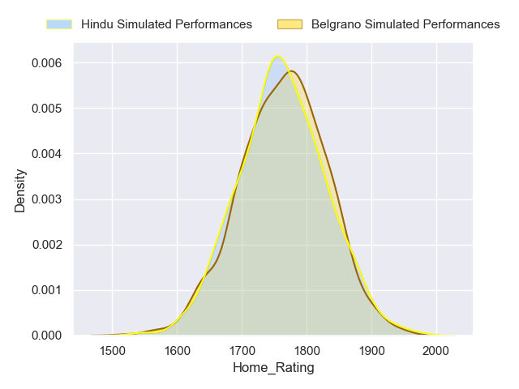

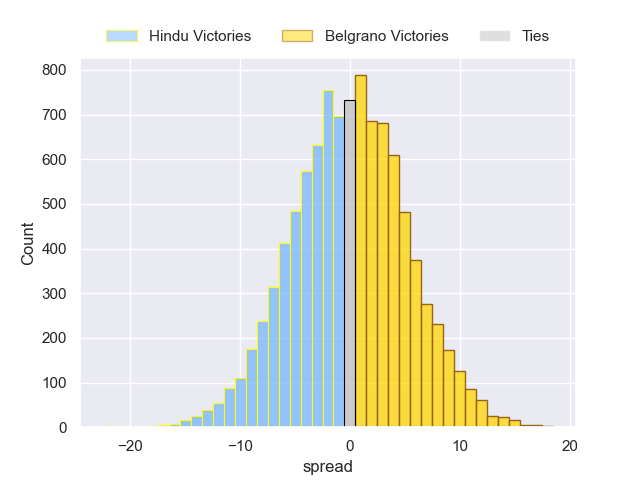

### Atlético del Rosario V La Plata on 2023/09/02

Average Margin: Atlético del Rosario by 3.8

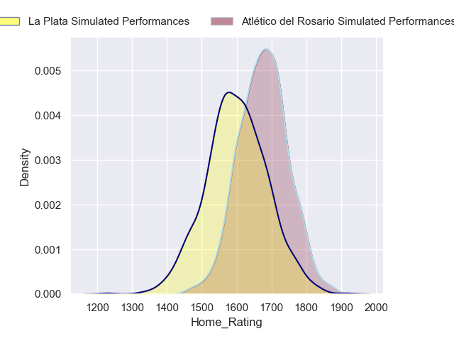
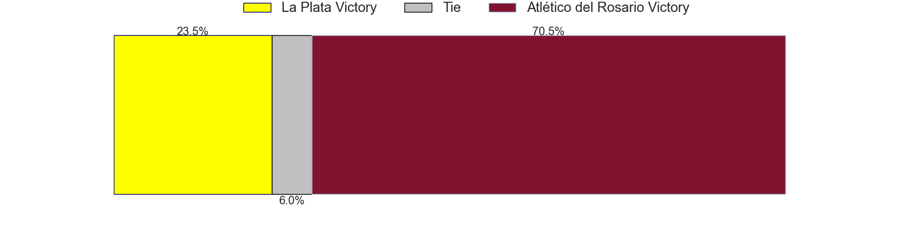
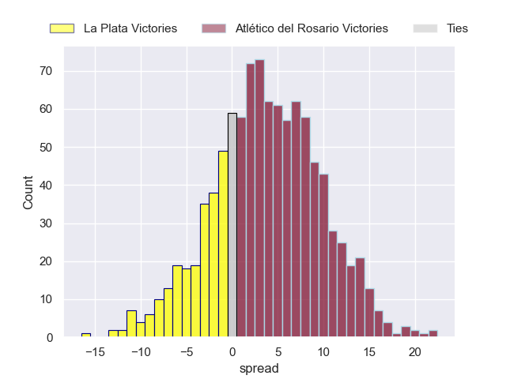

## Week 8

### San Luis V CUBA on 2023/09/16

Average Margin: CUBA by 3.2

### Belgrano V Newman on 2023/09/16

Average Margin: Newman by 0.3

### Buenos Aires V CASI on 2023/09/16

Average Margin: Buenos Aires by 4.6

### Alumni V Pucara on 2023/09/16

Average Margin: Alumni by 19.1

### SIC V Atlético del Rosario on 2023/09/16

Average Margin: SIC by 13.6

### Hindu V La Plata on 2023/09/16

Average Margin: Hindu by 11.6

## Week 9

### CUBA V Belgrano on 2023/09/23

Average Margin: CUBA by 4.2

### Atlético del Rosario V Buenos Aires on 2023/09/23

Average Margin: Atlético del Rosario by 1.8

### Pucara V San Luis on 2023/09/23

Average Margin: San Luis by 5.2

### CASI V Alumni on 2023/09/23

Average Margin: Alumni by 2.4

### La Plata V SIC on 2023/09/23

Average Margin: SIC by 7.4

### Newman V Hindu on 2023/09/23

Average Margin: Newman by 3.6

## Week 10

### Newman V CUBA on 2023/09/30

Average Margin: Newman by 6.4

### Belgrano V Pucara on 2023/09/30

Average Margin: Belgrano by 18.0

### Hindu V SIC on 2023/09/30

Average Margin: Hindu by 1.0

### Buenos Aires V La Plata on 2023/09/30

Average Margin: Buenos Aires by 5.1

### Alumni V Atlético del Rosario on 2023/09/30

Average Margin: Alumni by 8.8

### San Luis V CASI on 2023/09/30

Average Margin: San Luis by 1.5

## Week 11

### SIC V Buenos Aires on 2023/10/21

Average Margin: SIC by 12.2

### La Plata V Alumni on 2023/10/21

Average Margin: Alumni by 2.6

### Atlético del Rosario V San Luis on 2023/10/21

Average Margin: Atlético del Rosario by 5.0

### Pucara V Newman on 2023/10/21

Average Margin: Newman by 14.9

### CUBA V Hindu on 2023/10/21

Average Margin: CUBA by 0.6

### CASI V Belgrano on 2023/10/21

Average Margin: Belgrano by 1.0

