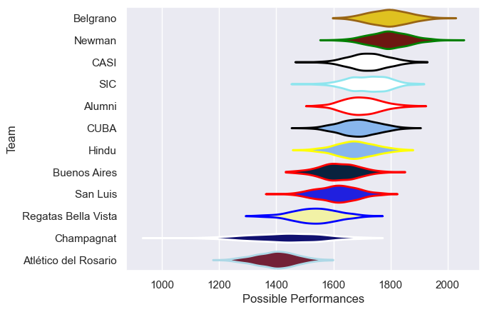
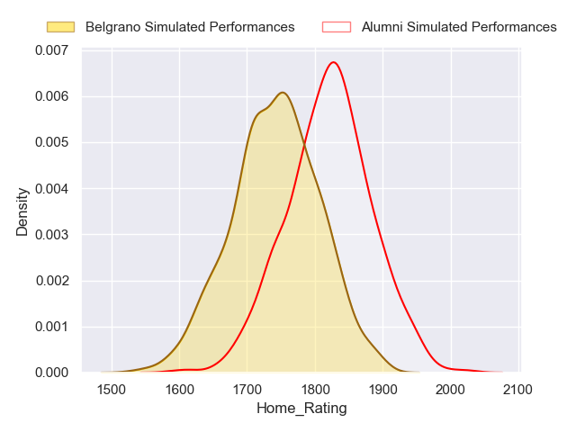
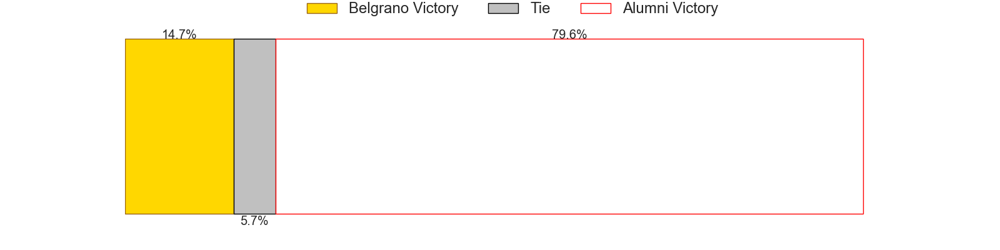

---  
title: "URBA Top 13 2024 Status"  
date: 2024-10-25 6:00:00 -0500  
categories: model review projection  
layout: article  
aside:  
    toc: true  
---
# Current Team Rankings

# Standings

## Current Standings

| Club                 |   Played |   Wins |   Point Differential |   Losing Bonus Points |   Try Bonus Points |   Competition Points |
|:---------------------|---------:|-------:|---------------------:|----------------------:|-------------------:|---------------------:|
| Newman               |       23 |     17 |                  247 |                     3 |                nan |                   81 |
| SIC                  |       22 |     17 |                  193 |                     1 |                nan |                   76 |
| Alumni               |       23 |     17 |                  134 |                     2 |                nan |                   76 |
| Belgrano             |       23 |     16 |                  182 |                     5 |                nan |                   69 |
| CASI                 |       22 |     13 |                  219 |                     5 |                nan |                   68 |
| San Luis             |       22 |     10 |                  -85 |                     6 |                nan |                   50 |
| CUBA                 |       22 |      8 |                   30 |                     7 |                nan |                   48 |
| Hindu                |       22 |     10 |                 -111 |                     4 |                nan |                   46 |
| Regatas Bella Vista  |       22 |      8 |                  -62 |                     6 |                nan |                   43 |
| Buenos Aires         |       21 |      8 |                 -119 |                     5 |                nan |                   37 |
| Champagnat           |       22 |      3 |                 -282 |                     8 |                nan |                   24 |
| Atlético del Rosario |       22 |      4 |                 -346 |                     2 |                nan |                   18 |

## Projected Remaining Table

| Club     |   Matches Remaining |   Wins |   Point Differential |   Losing Bonus Points |   Try Bonus Points |   Competition Points |
|:---------|--------------------:|-------:|---------------------:|----------------------:|-------------------:|---------------------:|
| Alumni   |                   1 |    0.8 |              4.05063 |                   0.2 |                0.2 |                  3.7 |
| Belgrano |                   1 |    0.2 |             -4.05063 |                   0.6 |                0.2 |                  1.5 |

## Projected Total Table

| Club                 |   Total Matches |   Wins |   Point Differential |   Losing Bonus Points |   Try Bonus Points |   Competition Points |
|:---------------------|----------------:|-------:|---------------------:|----------------------:|-------------------:|---------------------:|
| Newman               |              23 |   17   |              247     |                   3   |                0   |                 81   |
| Alumni               |              24 |   17.8 |              138.051 |                   2.2 |                0.2 |                 79.7 |
| SIC                  |              22 |   17   |              193     |                   1   |                0   |                 76   |
| Belgrano             |              24 |   16.2 |              177.949 |                   5.6 |                0.2 |                 70.5 |
| CASI                 |              22 |   13   |              219     |                   5   |                0   |                 68   |
| San Luis             |              22 |   10   |              -85     |                   6   |                0   |                 50   |
| CUBA                 |              22 |    8   |               30     |                   7   |                0   |                 48   |
| Hindu                |              22 |   10   |             -111     |                   4   |                0   |                 46   |
| Regatas Bella Vista  |              22 |    8   |              -62     |                   6   |                0   |                 43   |
| Buenos Aires         |              21 |    8   |             -119     |                   5   |                0   |                 37   |
| Champagnat           |              22 |    3   |             -282     |                   8   |                0   |                 24   |
| Atlético del Rosario |              22 |    4   |             -346     |                   2   |                0   |                 18   |

# Completed Match Review

| Model | Percent Correct Predictions | Spread Error |
| ------ | ------ | ------ |
| Club Level | 64.7% | 12.4 |
| Player Level: Lineup | 68.1% | 11.3 |
| Player Level: Minutes | 68.5% | 11.4 |

# Future Predictions

## Week 24

### Alumni V Belgrano on 2024/10/26

Average Margin: Alumni by 4.1

Average Scoreline: 30-26

