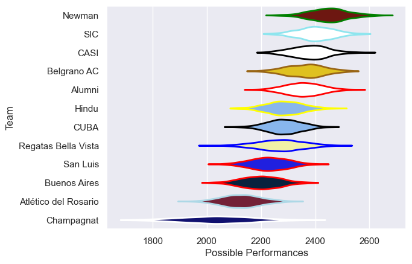

---  
title: "URBA Top 13 2024 Status"  
date: 2025-07-28 6:00:00 -0500  
categories: model review projection  
layout: article  
aside:  
    toc: true  
---
# Current Team Rankings

# Standings

## Current Standings

| Club                 |   Played |   Wins |   Point Differential |   Losing Bonus Points |   Try Bonus Points |   Competition Points |
|:---------------------|---------:|-------:|---------------------:|----------------------:|-------------------:|---------------------:|
| Newman               |       23 |     17 |                  247 |                     3 |                 10 |                   81 |
| Alumni               |       24 |     18 |                  137 |                     2 |                  6 |                   80 |
| SIC                  |       23 |     17 |                  193 |                     1 |                  7 |                   78 |
| Belgrano AC          |       24 |     16 |                  179 |                     6 |                    |                   70 |
| CASI                 |       22 |     13 |                  219 |                     5 |                  9 |                   68 |
| San Luis             |       22 |     10 |                  -85 |                     6 |                  4 |                   50 |
| CUBA                 |       22 |      8 |                   30 |                     7 |                  7 |                   48 |
| Hindu                |       22 |     10 |                 -111 |                     4 |                    |                   46 |
| Regatas Bella Vista  |       22 |      8 |                  -62 |                     6 |                  3 |                   43 |
| Buenos Aires         |       22 |      8 |                 -119 |                     5 |                    |                   39 |
| Champagnat           |       22 |      2 |                 -282 |                     8 |                  4 |                   24 |
| Atlético del Rosario |       22 |      3 |                 -346 |                     2 |                    |                   18 |

# Completed Match Review

| Model | Percent Correct Predictions | Spread Error |
| ------ | ------ | ------ |
| Club Level | 65.9% | 12.2 |
| Player Level: Lineup | nan% | nan |
| Player Level: Minutes | nan% | nan |

