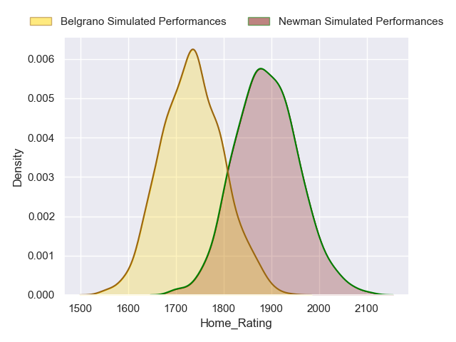
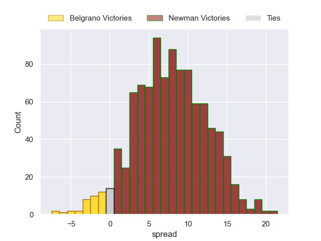
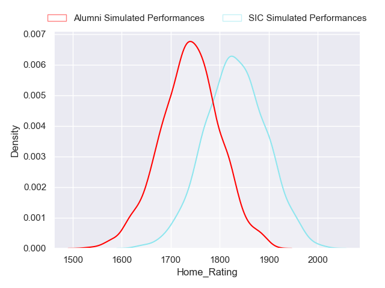
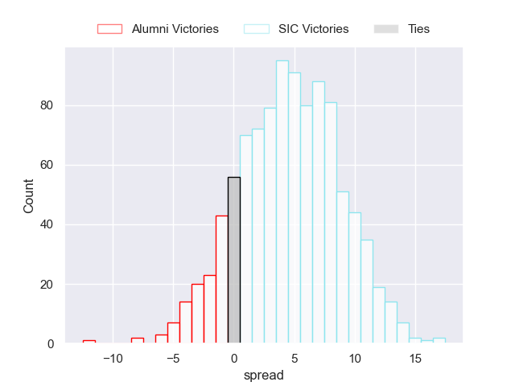

---  
title: "URBA Top 13 2024 Status"  
date: 2024-10-14 6:00:00 -0500  
categories: model review projection  
layout: article  
aside:  
    toc: true  
---
# Current Team Rankings

# Standings

## Current Standings

| Club                 |   Played |   Wins |   Point Differential |   Losing Bonus Points |   Try Bonus Points |   Competition Points |
|:---------------------|---------:|-------:|---------------------:|----------------------:|-------------------:|---------------------:|
| Newman               |       22 |     17 |                  248 |                     2 |                nan |                   81 |
| SIC                  |       21 |     17 |                  202 |                     1 |                nan |                   77 |
| Alumni               |       22 |     16 |                  125 |                     2 |                nan |                   72 |
| CASI                 |       22 |     13 |                  219 |                     5 |                nan |                   68 |
| Belgrano             |       22 |     15 |                  181 |                     5 |                nan |                   67 |
| San Luis             |       22 |     10 |                  -85 |                     6 |                nan |                   51 |
| CUBA                 |       22 |      8 |                   30 |                     7 |                nan |                   49 |
| Hindu                |       22 |     10 |                 -111 |                     4 |                nan |                   47 |
| Regatas Bella Vista  |       22 |      8 |                  -62 |                     6 |                nan |                   43 |
| Buenos Aires         |       21 |      8 |                 -119 |                     5 |                nan |                   37 |
| Champagnat           |       22 |      3 |                 -282 |                     8 |                nan |                   24 |
| Atlético del Rosario |       22 |      4 |                 -346 |                     2 |                nan |                   19 |

## Projected Remaining Table

| Club     |   Matches Remaining |   Wins |   Point Differential |   Losing Bonus Points |   Try Bonus Points |   Competition Points |
|:---------|--------------------:|-------:|---------------------:|----------------------:|-------------------:|---------------------:|
| Newman   |                   1 |    1   |              7.77416 |                   0   |                0.2 |                  4.1 |
| SIC      |                   1 |    0.9 |              4.6217  |                   0.1 |                0.2 |                  3.8 |
| Alumni   |                   1 |    0.1 |             -4.6217  |                   0.6 |                0.1 |                  1.2 |
| Belgrano |                   1 |    0   |             -7.77416 |                   0.4 |                0.1 |                  0.7 |

## Projected Total Table

| Club                 |   Total Matches |   Wins |   Point Differential |   Losing Bonus Points |   Try Bonus Points |   Competition Points |
|:---------------------|----------------:|-------:|---------------------:|----------------------:|-------------------:|---------------------:|
| Newman               |              23 |   18   |              255.774 |                   2   |                0.2 |                 85.1 |
| SIC                  |              22 |   17.9 |              206.622 |                   1.1 |                0.2 |                 80.8 |
| Alumni               |              23 |   16.1 |              120.378 |                   2.6 |                0.1 |                 73.2 |
| CASI                 |              22 |   13   |              219     |                   5   |                0   |                 68   |
| Belgrano             |              23 |   15   |              173.226 |                   5.4 |                0.1 |                 67.7 |
| San Luis             |              22 |   10   |              -85     |                   6   |                0   |                 51   |
| CUBA                 |              22 |    8   |               30     |                   7   |                0   |                 49   |
| Hindu                |              22 |   10   |             -111     |                   4   |                0   |                 47   |
| Regatas Bella Vista  |              22 |    8   |              -62     |                   6   |                0   |                 43   |
| Buenos Aires         |              21 |    8   |             -119     |                   5   |                0   |                 37   |
| Champagnat           |              22 |    3   |             -282     |                   8   |                0   |                 24   |
| Atlético del Rosario |              22 |    4   |             -346     |                   2   |                0   |                 19   |

# Completed Match Review

| Model | Percent Correct Predictions | Spread Error |
| ------ | ------ | ------ |
| Club Level | 65.6% | 12.4 |
| Player Level: Lineup | 69.0% | 11.2 |
| Player Level: Minutes | 68.5% | 11.4 |

# Future Predictions

## Week 23

### Newman V Belgrano on 2024/10/19

Average Margin: Newman by 7.8

Average Scoreline: 31-23

### SIC V Alumni on 2024/10/20

Average Margin: SIC by 4.6

Average Scoreline: 25-20

