---  
title: "URBA Top 13 2024 Status"  
date: 2024-08-30 6:00:00 -0500  
categories: model review projection  
layout: article  
aside:  
    toc: true  
---
# Current Team Rankings

# Standings

## Current Standings

| Club                 |   Played |   Wins |   Point Differential |   Losing Bonus Points |   Try Bonus Points |   Competition Points |
|:---------------------|---------:|-------:|---------------------:|----------------------:|-------------------:|---------------------:|
| Newman               |       16 |     12 |                  164 |                     1 |                nan |                   57 |
| Belgrano             |       16 |     13 |                  187 |                     2 |                nan |                   56 |
| SIC                  |       16 |     11 |                  131 |                     1 |                nan |                   54 |
| CASI                 |       16 |     10 |                  144 |                     3 |                nan |                   52 |
| Alumni               |       15 |     11 |                   48 |                     0 |                nan |                   49 |
| San Luis             |       16 |      8 |                  -61 |                     4 |                nan |                   40 |
| CUBA                 |       16 |      5 |                   42 |                     7 |                nan |                   35 |
| Hindu                |       16 |      7 |                  -77 |                     4 |                nan |                   34 |
| Buenos Aires         |       16 |      6 |                  -53 |                     5 |                nan |                   31 |
| Regatas Bella Vista  |       16 |      4 |                  -83 |                     4 |                nan |                   24 |
| Champagnat           |       16 |      3 |                 -170 |                     5 |                nan |                   19 |
| Atlético del Rosario |       15 |      2 |                 -272 |                     1 |                nan |                   10 |

## Projected Remaining Table

| Club                 |   Matches Remaining |   Wins |   Point Differential |   Losing Bonus Points |   Try Bonus Points |   Competition Points |
|:---------------------|--------------------:|-------:|---------------------:|----------------------:|-------------------:|---------------------:|
| Belgrano             |                   5 |    4.3 |             29.04    |                   0.7 |                1.9 |                 19.6 |
| Newman               |                   5 |    3.9 |             31.9492  |                   0.9 |                2.3 |                 18.8 |
| SIC                  |                   5 |    3.5 |             25.2077  |                   1.3 |                2.2 |                 17.5 |
| CASI                 |                   5 |    3.2 |             20.383   |                   1.3 |                2.2 |                 16.3 |
| CUBA                 |                   5 |    2.7 |             13.3949  |                   1.6 |                2.4 |                 14.9 |
| Alumni               |                   5 |    2.8 |              3.81172 |                   1.6 |                1.4 |                 14.3 |
| San Luis             |                   5 |    2.5 |              5.6807  |                   1.7 |                1.8 |                 13.6 |
| Regatas Bella Vista  |                   5 |    2.5 |             -6.19846 |                   1.1 |                1.5 |                 12.5 |
| Hindu                |                   5 |    2.5 |             -1.88953 |                   0.9 |                1.3 |                 12.1 |
| Buenos Aires         |                   5 |    1.2 |            -19.4441  |                   2.3 |                0.9 |                  8.1 |
| Atlético del Rosario |                   5 |    0.2 |            -48.6463  |                   1.4 |                2.2 |                  4.6 |
| Champagnat           |                   5 |    0.6 |            -53.2888  |                   1   |                0.6 |                  4   |

## Projected Total Table

| Club                 |   Total Matches |   Wins |   Point Differential |   Losing Bonus Points |   Try Bonus Points |   Competition Points |
|:---------------------|----------------:|-------:|---------------------:|----------------------:|-------------------:|---------------------:|
| Newman               |              21 |   15.9 |             195.949  |                   1.9 |                2.3 |                 75.8 |
| Belgrano             |              21 |   17.3 |             216.04   |                   2.7 |                1.9 |                 75.6 |
| SIC                  |              21 |   14.5 |             156.208  |                   2.3 |                2.2 |                 71.5 |
| CASI                 |              21 |   13.2 |             164.383  |                   4.3 |                2.2 |                 68.3 |
| Alumni               |              20 |   13.8 |              51.8117 |                   1.6 |                1.4 |                 63.3 |
| San Luis             |              21 |   10.5 |             -55.3193 |                   5.7 |                1.8 |                 53.6 |
| CUBA                 |              21 |    7.7 |              55.3949 |                   8.6 |                2.4 |                 49.9 |
| Hindu                |              21 |    9.5 |             -78.8895 |                   4.9 |                1.3 |                 46.1 |
| Buenos Aires         |              21 |    7.2 |             -72.4441 |                   7.3 |                0.9 |                 39.1 |
| Regatas Bella Vista  |              21 |    6.5 |             -89.1985 |                   5.1 |                1.5 |                 36.5 |
| Champagnat           |              21 |    3.6 |            -223.289  |                   6   |                0.6 |                 23   |
| Atlético del Rosario |              20 |    2.2 |            -320.646  |                   2.4 |                2.2 |                 14.6 |

# Completed Match Review

| Model | Percent Correct Predictions | Spread Error |
| ------ | ------ | ------ |
| Club Level | 64.2% | 12.9 |
| Player Level: Lineup | 42.9% | 11.1 |
| Player Level: Minutes | 52.9% | 11.1 |

# Future Predictions

## Week 17

### Hindu V Atlético del Rosario on 2024/08/31

Average Margin: Hindu by 12.4

Average Scoreline: 37-24

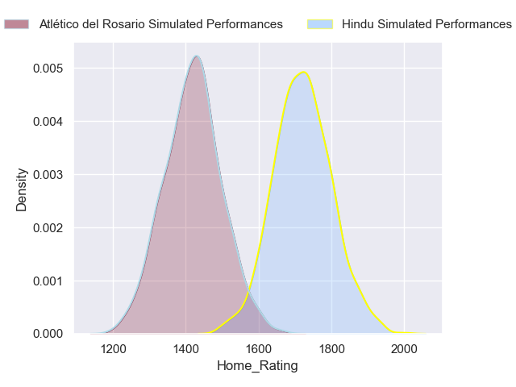

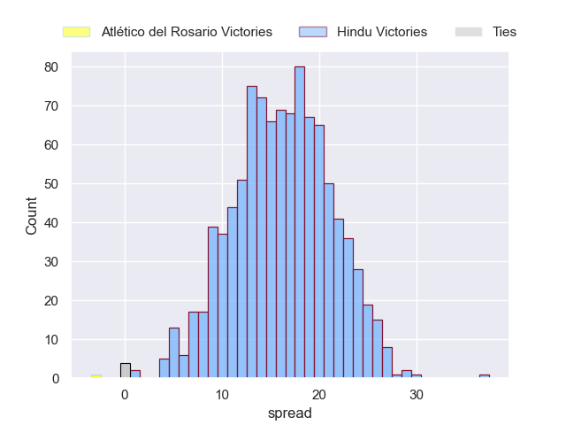

### Belgrano V Newman on 2024/08/31

Average Margin: Belgrano by 1.8

Average Scoreline: 23-21

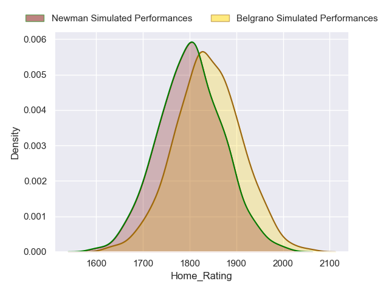

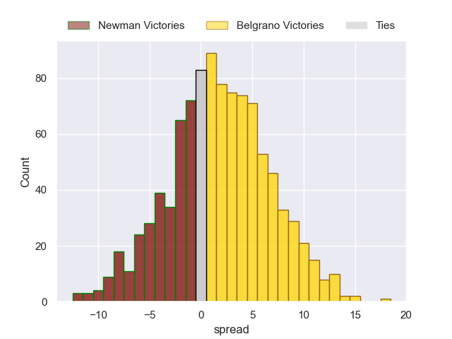

### Buenos Aires V Alumni on 2024/08/31

Average Margin: Alumni by 3.5

Average Scoreline: 27-24

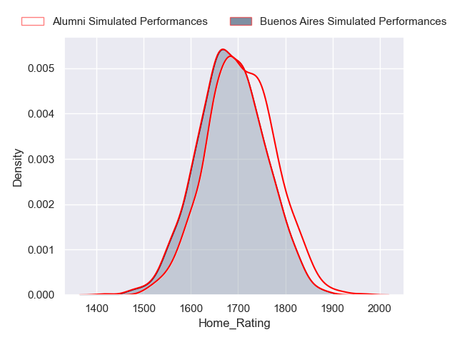

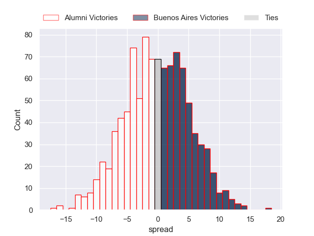

### San Luis V Champagnat on 2024/08/31

Average Margin: San Luis by 11.5

Average Scoreline: 31-19

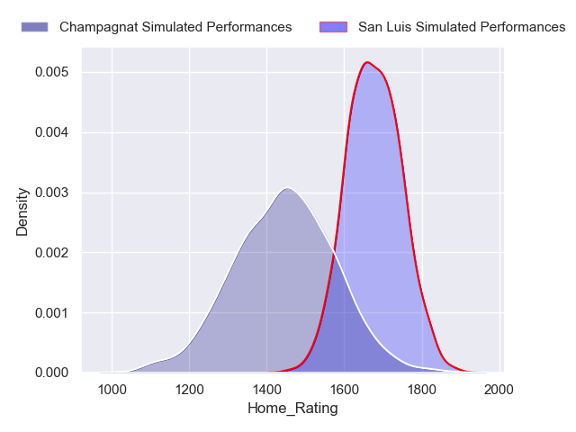

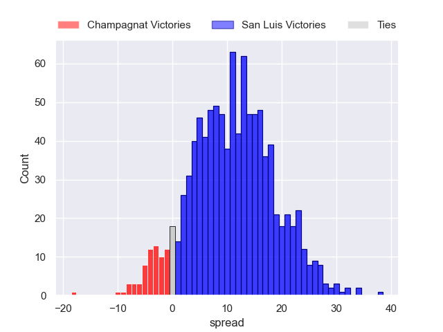

### CASI V CUBA on 2024/08/31

Average Margin: CASI by 4.3

Average Scoreline: 30-26

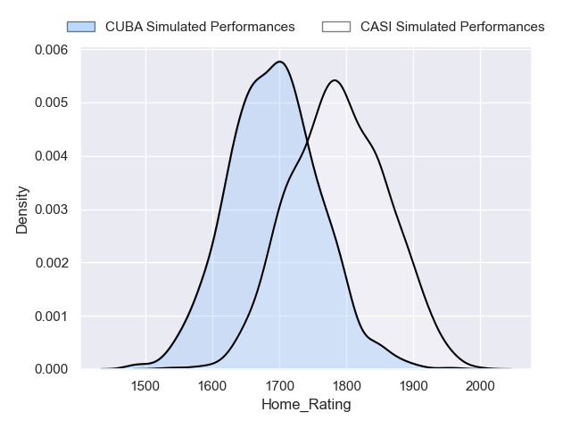

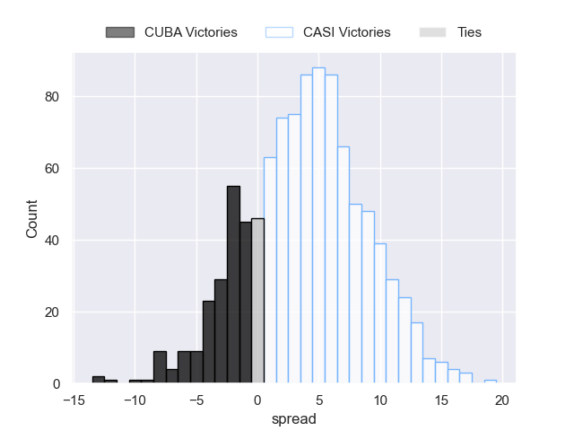

### Regatas Bella Vista V SIC on 2024/08/31

Average Margin: SIC by 5.1

Average Scoreline: 29-24

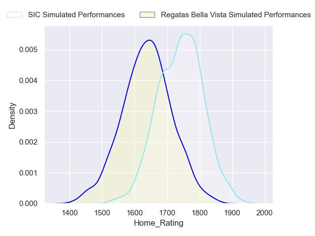

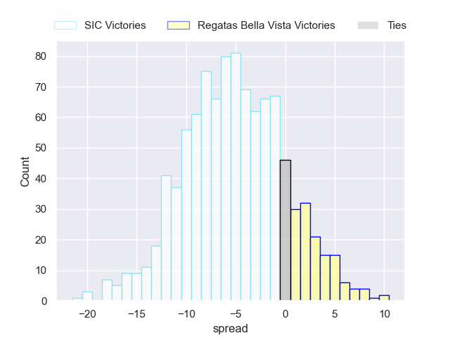

## Week 18

### Champagnat V Regatas Bella Vista on 2024/09/14

Average Margin: Regatas Bella Vista by 2.0

Average Scoreline: 28-26

### Atlético del Rosario V San Luis on 2024/09/14

Average Margin: San Luis by 4.8

Average Scoreline: 33-29

### Alumni V CUBA on 2024/09/14

Average Margin: Alumni by 4.9

Average Scoreline: 28-23

### SIC V CASI on 2024/09/14

Average Margin: SIC by 5.3

Average Scoreline: 36-30

### Newman V Hindu on 2024/09/14

Average Margin: Newman by 11.3

Average Scoreline: 32-21

### Buenos Aires V Belgrano on 2024/09/14

Average Margin: Belgrano by 7.0

Average Scoreline: 28-21

## Week 19

### CUBA V SIC on 2024/09/21

Average Margin: CUBA by 0.6

Average Scoreline: 26-26

### Hindu V Buenos Aires on 2024/09/21

Average Margin: Hindu by 6.8

Average Scoreline: 31-24

### San Luis V Newman on 2024/09/21

Average Margin: Newman by 5.5

Average Scoreline: 27-21

### Regatas Bella Vista V Atlético del Rosario on 2024/09/21

Average Margin: Regatas Bella Vista by 8.6

Average Scoreline: 34-26

### Belgrano V Alumni on 2024/09/21

Average Margin: Belgrano by 6.4

Average Scoreline: 31-24

### CASI V Champagnat on 2024/09/21

Average Margin: CASI by 15.0

Average Scoreline: 36-21

## Week 20

### Atlético del Rosario V CASI on 2024/09/28

Average Margin: CASI by 8.4

Average Scoreline: 42-34

### Alumni V SIC on 2024/09/28

Average Margin: Alumni by 1.9

Average Scoreline: 28-26

### Champagnat V CUBA on 2024/09/28

Average Margin: CUBA by 7.5

Average Scoreline: 32-24

### Newman V Regatas Bella Vista on 2024/09/28

Average Margin: Newman by 15.0

Average Scoreline: 32-17

### Belgrano V Hindu on 2024/09/28

Average Margin: Belgrano by 9.8

Average Scoreline: 32-22

### Buenos Aires V San Luis on 2024/09/28

Average Margin: Buenos Aires by 1.1

Average Scoreline: 24-23

## Week 21

### CUBA V Atlético del Rosario on 2024/10/05

Average Margin: CUBA by 14.4

Average Scoreline: 39-25

### Hindu V Alumni on 2024/10/05

Average Margin: Hindu by 0.1

Average Scoreline: 28-28

### San Luis V Belgrano on 2024/10/05

Average Margin: Belgrano by 4.0

Average Scoreline: 28-24

### Regatas Bella Vista V Buenos Aires on 2024/10/05

Average Margin: Regatas Bella Vista by 3.2

Average Scoreline: 24-20

### CASI V Newman on 2024/10/05

Average Margin: Newman by 2.0

Average Scoreline: 33-31

### SIC V Champagnat on 2024/10/05

Average Margin: SIC by 17.2

Average Scoreline: 35-18

