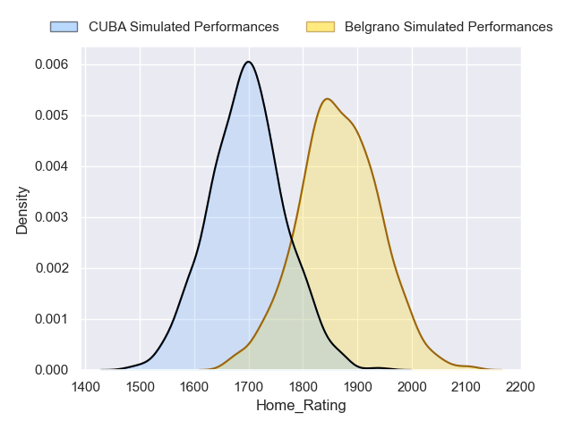
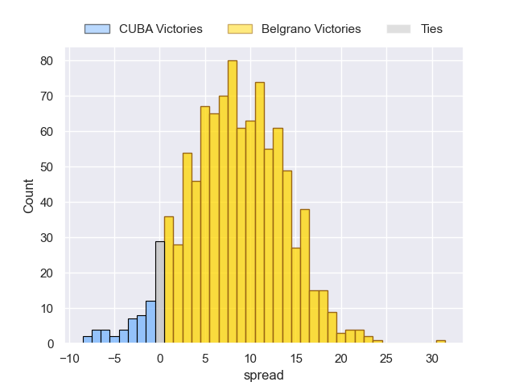
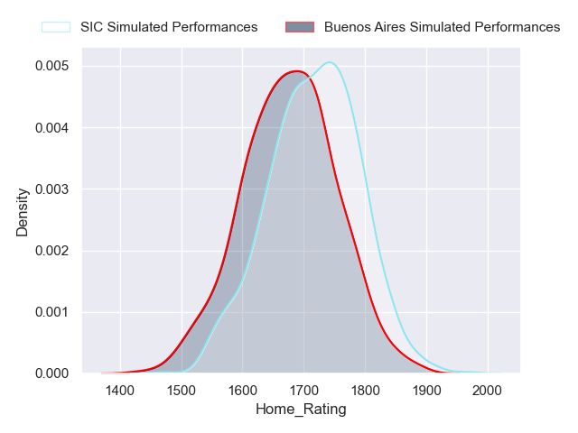
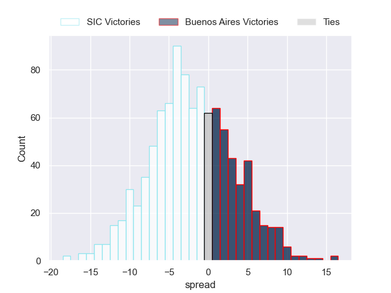

---  
title: "URBA Top 13 2024 Status"  
date: 2024-08-02 6:00:00 -0500  
categories: model review projection  
layout: article  
aside:  
    toc: true  
---
# Current Team Rankings

# Standings

## Current Standings

| Club                 |   Played |   Wins |   Point Differential |   Losing Bonus Points |   Try Bonus Points |   Competition Points |
|:---------------------|---------:|-------:|---------------------:|----------------------:|-------------------:|---------------------:|
| CASI                 |       13 |      9 |                  135 |                     2 |                  7 |                   47 |
| Belgrano             |       13 |     11 |                  160 |                     1 |                nan |                   46 |
| Newman               |       13 |      9 |                   99 |                     1 |                  8 |                   45 |
| Alumni               |       13 |     10 |                   37 |                     0 |                  5 |                   45 |
| SIC                  |       13 |      9 |                   96 |                     1 |                  6 |                   43 |
| CUBA                 |       13 |      5 |                   54 |                     5 |                  5 |                   32 |
| San Luis             |       13 |      6 |                  -42 |                     4 |                  3 |                   31 |
| Hindu                |       13 |      5 |                  -54 |                     4 |                nan |                   26 |
| Buenos Aires         |       13 |      5 |                  -45 |                     5 |                nan |                   25 |
| Regatas Bella Vista  |       13 |      3 |                  -66 |                     3 |                  2 |                   19 |
| Champagnat           |       13 |      3 |                 -122 |                     4 |                  2 |                   18 |
| Atlético del Rosario |       13 |      1 |                 -252 |                     1 |                nan |                    6 |

## Projected Remaining Table

| Club                 |   Matches Remaining |   Wins |   Point Differential |   Losing Bonus Points |   Try Bonus Points |   Competition Points |
|:---------------------|--------------------:|-------:|---------------------:|----------------------:|-------------------:|---------------------:|
| Belgrano             |                   9 |    8   |            79.9096   |                   0.9 |                4.4 |                 37.1 |
| Newman               |                   9 |    7.4 |            79.717    |                   1.2 |                5.7 |                 36.6 |
| CASI                 |                   9 |    6.3 |            42.5506   |                   2.2 |                4.1 |                 31.5 |
| SIC                  |                   9 |    5.8 |            29.1023   |                   2.6 |                3.2 |                 28.9 |
| CUBA                 |                   9 |    5.4 |            28.3406   |                   2.3 |                3.5 |                 27.2 |
| Alumni               |                   9 |    4.8 |             5.70841  |                   2.5 |                3   |                 24.6 |
| Hindu                |                   9 |    4.5 |             2.45427  |                   2.4 |                3.9 |                 24.2 |
| San Luis             |                   9 |    4.1 |             0.621813 |                   2.8 |                2.6 |                 22   |
| Buenos Aires         |                   9 |    3.9 |            -6.42844  |                   2.9 |                2.5 |                 21.1 |
| Regatas Bella Vista  |                   9 |    2.3 |           -50.6991   |                   2.5 |                2.1 |                 13.7 |
| Champagnat           |                   9 |    1.3 |           -99.0954   |                   1.8 |                0.9 |                  8   |
| Atlético del Rosario |                   9 |    0.2 |          -112.182    |                   1.5 |                3.8 |                  6.2 |

## Projected Total Table

| Club                 |   Total Matches |   Wins |   Point Differential |   Losing Bonus Points |   Try Bonus Points |   Competition Points |
|:---------------------|----------------:|-------:|---------------------:|----------------------:|-------------------:|---------------------:|
| Belgrano             |              22 |   19   |             239.91   |                   1.9 |                4.4 |                 83.1 |
| Newman               |              22 |   16.4 |             178.717  |                   2.2 |               13.7 |                 81.6 |
| CASI                 |              22 |   15.3 |             177.551  |                   4.2 |               11.1 |                 78.5 |
| SIC                  |              22 |   14.8 |             125.102  |                   3.6 |                9.2 |                 71.9 |
| Alumni               |              22 |   14.8 |              42.7084 |                   2.5 |                8   |                 69.6 |
| CUBA                 |              22 |   10.4 |              82.3406 |                   7.3 |                8.5 |                 59.2 |
| San Luis             |              22 |   10.1 |             -41.3782 |                   6.8 |                5.6 |                 53   |
| Hindu                |              22 |    9.5 |             -51.5457 |                   6.4 |                3.9 |                 50.2 |
| Buenos Aires         |              22 |    8.9 |             -51.4284 |                   7.9 |                2.5 |                 46.1 |
| Regatas Bella Vista  |              22 |    5.3 |            -116.699  |                   5.5 |                4.1 |                 32.7 |
| Champagnat           |              22 |    4.3 |            -221.095  |                   5.8 |                2.9 |                 26   |
| Atlético del Rosario |              22 |    1.2 |            -364.182  |                   2.5 |                3.8 |                 12.2 |

# Completed Match Review

| Model | Percent Correct Predictions | Spread Error |
| ------ | ------ | ------ |
| Club Level | 62.8% | 13.7 |
| Player Level: Lineup | 0.0% | nan |
| Player Level: Minutes | nan% | nan |

# Future Predictions

## Week 14

### Belgrano V CUBA on 2024/08/03

Average Margin: Belgrano by 8.3

Average Scoreline: 29-21

### Newman V Champagnat on 2024/08/03

Average Margin: Newman by 19.0

Average Scoreline: 33-14

### Hindu V CASI on 2024/08/03

Average Margin: CASI by 0.1

Average Scoreline: 31-31

### Atlético del Rosario V Alumni on 2024/08/03

Average Margin: Alumni by 9.9

Average Scoreline: 43-33

### Buenos Aires V SIC on 2024/08/03

Average Margin: SIC by 2.0

Average Scoreline: 25-23

### San Luis V Regatas Bella Vista on 2024/08/03

Average Margin: San Luis by 8.1

Average Scoreline: 33-25

## Week 15

### Champagnat V Buenos Aires on 2024/08/10

Average Margin: Buenos Aires by 4.5

Average Scoreline: 26-22

### SIC V Belgrano on 2024/08/10

Average Margin: Belgrano by 1.1

Average Scoreline: 25-24

### CUBA V Hindu on 2024/08/10

Average Margin: CUBA by 5.7

Average Scoreline: 27-21

### Atlético del Rosario V Newman on 2024/08/10

Average Margin: Newman by 14.5

Average Scoreline: 43-29

### CASI V San Luis on 2024/08/10

Average Margin: CASI by 8.0

Average Scoreline: 30-22

### Alumni V Regatas Bella Vista on 2024/08/10

Average Margin: Alumni by 10.6

Average Scoreline: 34-24

## Week 16

### San Luis V CUBA on 2024/08/17

Average Margin: San Luis by 0.2

Average Scoreline: 25-25

### Hindu V SIC on 2024/08/17

Average Margin: SIC by 0.1

Average Scoreline: 28-28

### Newman V Alumni on 2024/08/17

Average Margin: Newman by 8.8

Average Scoreline: 30-21

### Belgrano V Champagnat on 2024/08/17

Average Margin: Belgrano by 19.9

Average Scoreline: 34-14

### Buenos Aires V Atlético del Rosario on 2024/08/17

Average Margin: Buenos Aires by 12.9

Average Scoreline: 38-25

### Regatas Bella Vista V CASI on 2024/08/17

Average Margin: CASI by 6.4

Average Scoreline: 38-32

## Week 17

### Champagnat V Hindu on 2024/08/24

Average Margin: Hindu by 6.0

Average Scoreline: 30-24

### Newman V Buenos Aires on 2024/08/24

Average Margin: Newman by 12.1

Average Scoreline: 35-23

### Alumni V CASI on 2024/08/24

Average Margin: Alumni by 1.2

Average Scoreline: 32-30

### Atlético del Rosario V Belgrano on 2024/08/24

Average Margin: Belgrano by 15.5

Average Scoreline: 46-31

### CUBA V Regatas Bella Vista on 2024/08/24

Average Margin: CUBA by 11.9

Average Scoreline: 34-22

### SIC V San Luis on 2024/08/24

Average Margin: SIC by 7.6

Average Scoreline: 27-19

## Week 18

### Hindu V Atlético del Rosario on 2024/08/31

Average Margin: Hindu by 15.1

Average Scoreline: 46-31

### CASI V CUBA on 2024/08/31

Average Margin: CASI by 4.7

Average Scoreline: 28-24

### Regatas Bella Vista V SIC on 2024/08/31

Average Margin: SIC by 6.0

Average Scoreline: 32-26

### San Luis V Champagnat on 2024/08/31

Average Margin: San Luis by 11.9

Average Scoreline: 27-15

### Buenos Aires V Alumni on 2024/08/31

Average Margin: Alumni by 0.2

Average Scoreline: 23-23

### Belgrano V Newman on 2024/08/31

Average Margin: Belgrano by 3.9

Average Scoreline: 30-26

## Week 19

### Champagnat V Regatas Bella Vista on 2024/09/14

Average Margin: Champagnat by 0.5

Average Scoreline: 26-26

### Newman V Hindu on 2024/09/14

Average Margin: Newman by 9.7

Average Scoreline: 34-24

### Atlético del Rosario V San Luis on 2024/09/14

Average Margin: San Luis by 6.9

Average Scoreline: 37-30

### SIC V CASI on 2024/09/14

Average Margin: SIC by 2.8

Average Scoreline: 34-31

### Buenos Aires V Belgrano on 2024/09/14

Average Margin: Belgrano by 6.3

Average Scoreline: 32-26

### Alumni V CUBA on 2024/09/14

Average Margin: Alumni by 2.5

Average Scoreline: 28-26

## Week 20

### Hindu V Buenos Aires on 2024/09/21

Average Margin: Hindu by 5.7

Average Scoreline: 29-23

### Regatas Bella Vista V Atlético del Rosario on 2024/09/21

Average Margin: Regatas Bella Vista by 8.9

Average Scoreline: 39-30

### San Luis V Newman on 2024/09/21

Average Margin: Newman by 4.1

Average Scoreline: 29-25

### Belgrano V Alumni on 2024/09/21

Average Margin: Belgrano by 9.3

Average Scoreline: 30-21

### CUBA V SIC on 2024/09/21

Average Margin: CUBA by 2.2

Average Scoreline: 28-26

### CASI V Champagnat on 2024/09/21

Average Margin: CASI by 15.6

Average Scoreline: 39-24

## Week 21

### Alumni V SIC on 2024/09/28

Average Margin: Alumni by 1.4

Average Scoreline: 27-26

### Champagnat V CUBA on 2024/09/28

Average Margin: CUBA by 7.5

Average Scoreline: 27-20

### Belgrano V Hindu on 2024/09/28

Average Margin: Belgrano by 10.7

Average Scoreline: 33-22

### Newman V Regatas Bella Vista on 2024/09/28

Average Margin: Newman by 15.7

Average Scoreline: 37-21

### Buenos Aires V San Luis on 2024/09/28

Average Margin: Buenos Aires by 2.0

Average Scoreline: 26-24

### Atlético del Rosario V CASI on 2024/09/28

Average Margin: CASI by 11.5

Average Scoreline: 41-30

## Week 22

### Regatas Bella Vista V Buenos Aires on 2024/10/05

Average Margin: Buenos Aires by 0.4

Average Scoreline: 25-25

### Hindu V Alumni on 2024/10/05

Average Margin: Hindu by 2.0

Average Scoreline: 28-26

### CASI V Newman on 2024/10/05

Average Margin: CASI by 0.3

Average Scoreline: 26-26

### CUBA V Atlético del Rosario on 2024/10/05

Average Margin: CUBA by 16.9

Average Scoreline: 48-32

### SIC V Champagnat on 2024/10/05

Average Margin: SIC by 15.3

Average Scoreline: 36-21

### San Luis V Belgrano on 2024/10/05

Average Margin: Belgrano by 4.8

Average Scoreline: 30-25

