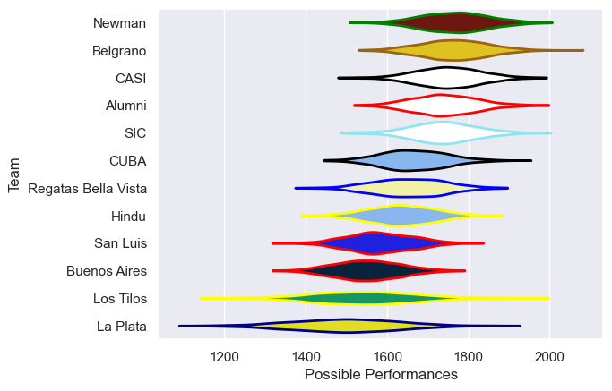

---  
title: "URBA Top 13 2025"  
date: 2025-08-18 6:00:00 -0500  
categories: model review projection  
layout: article  
aside:  
    toc: true  
---
# Team Rankings

# Standings

## Current Standings

| Club                |   Played |   Wins |   Point Differential |   Losing Bonus Points |   Try Bonus Points |   Competition Points |
|:--------------------|---------:|-------:|---------------------:|----------------------:|-------------------:|---------------------:|
| Belgrano AC         |       17 |     16 |                  209 |                     1 |                    |                   65 |
| CASI                |       17 |     14 |                  217 |                     1 |                  7 |                   64 |
| SIC                 |       17 |     12 |                   79 |                     3 |                  7 |                   58 |
| Newman              |       17 |     12 |                   62 |                     3 |                  5 |                   56 |
| Los Tilos           |       17 |     10 |                   32 |                     4 |                  6 |                   52 |
| Regatas Bella Vista |       17 |      8 |                  -10 |                     4 |                  4 |                   40 |
| CUBA                |       17 |      7 |                  -15 |                     7 |                  5 |                   40 |
| Alumni              |       17 |      7 |                  -54 |                     3 |                  5 |                   36 |
| Hindu               |       17 |      6 |                    5 |                     6 |                    |                   30 |
| La Plata            |       17 |      4 |                 -169 |                     7 |                  1 |                   24 |
| Buenos Aires        |       17 |      3 |                 -146 |                     6 |                    |                   18 |
| San Luis            |       17 |      2 |                 -210 |                     4 |                  1 |                   15 |

## Projected Remaining Table

| Club                |   To Play |   Projected Wins |   Projected Differential |   Projected Losing Bonus Points | Projected Try Bonus Points   |   Projected Competition Points |
|:--------------------|----------:|-----------------:|-------------------------:|--------------------------------:|:-----------------------------|-------------------------------:|
| Belgrano AC         |         6 |            3.877 |                   26.548 |                           1.041 |                              |                         17.025 |
| CASI                |         6 |            3.758 |                   19.99  |                           1.095 |                              |                         16.677 |
| Newman              |         6 |            3.401 |                   17.087 |                           1.296 |                              |                         15.424 |
| Alumni              |         6 |            3.109 |                    5.264 |                           1.391 |                              |                         14.429 |
| SIC                 |         6 |            3.057 |                    6.501 |                           1.473 |                              |                         14.303 |
| Los Tilos           |         6 |            2.973 |                    1.477 |                           1.397 |                              |                         13.857 |
| CUBA                |         6 |            2.921 |                    2.01  |                           1.563 |                              |                         13.855 |
| Hindu               |         6 |            2.623 |                   -5.884 |                           1.501 |                              |                         12.573 |
| Regatas Bella Vista |         6 |            2.513 |                   -8.948 |                           1.529 |                              |                         12.197 |
| La Plata            |         6 |            2.187 |                  -16.774 |                           1.566 |                              |                         10.872 |
| San Luis            |         6 |            1.969 |                  -25.241 |                           1.442 |                              |                          9.902 |
| Buenos Aires        |         6 |            1.923 |                  -22.03  |                           1.604 |                              |                          9.784 |

## Projected Total Table

| Club                |   Played |   Wins |   Point Differential |   Losing Bonus Points |   Try Bonus Points |   Competition Points |
|:--------------------|---------:|-------:|---------------------:|----------------------:|-------------------:|---------------------:|
| Belgrano AC         |       23 | 19.877 |              235.548 |                 2.041 |                    |               82.025 |
| CASI                |       23 | 17.758 |              236.99  |                 2.095 |                  7 |               80.677 |
| SIC                 |       23 | 15.057 |               85.501 |                 4.473 |                  7 |               72.303 |
| Newman              |       23 | 15.401 |               79.087 |                 4.296 |                  5 |               71.424 |
| Los Tilos           |       23 | 12.973 |               33.477 |                 5.397 |                  6 |               65.857 |
| CUBA                |       23 |  9.921 |              -12.99  |                 8.563 |                  5 |               53.855 |
| Regatas Bella Vista |       23 | 10.513 |              -18.948 |                 5.529 |                  4 |               52.197 |
| Alumni              |       23 | 10.109 |              -48.736 |                 4.391 |                  5 |               50.429 |
| Hindu               |       23 |  8.623 |               -0.884 |                 7.501 |                    |               42.573 |
| La Plata            |       23 |  6.187 |             -185.774 |                 8.566 |                  1 |               34.872 |
| Buenos Aires        |       23 |  4.923 |             -168.03  |                 7.604 |                    |               27.784 |
| San Luis            |       23 |  3.969 |             -235.241 |                 5.442 |                  1 |               24.902 |

# Completed Match Review

| Model | Percent Correct Predictions | Spread Error |
| ------ | ------ | ------ |
| Club Level | 76.8% | 9.0 |
| Player Level: Lineup | nan% | nan |
| Player Level: Minutes | nan% | nan |

# Future Predictions

## Week 18

### Buenos Aires V Newman on 2025/08/30

Average Margin: Newman by 4.0

### La Plata V Los Tilos on 2025/08/30

Average Margin: Los Tilos by 1.4

### CASI V San Luis on 2025/08/30

Average Margin: CASI by 9.0

### CUBA V SIC on 2025/08/30

Average Margin: CUBA by 0.1

### Belgrano AC V Regatas Bella Vista on 2025/08/30

Average Margin: Belgrano AC by 7.3

### Alumni V Hindu on 2025/08/30

Average Margin: Alumni by 3.0

## Week 19

### Hindu V Buenos Aires on 2025/09/06

Average Margin: Hindu by 4.3

### Regatas Bella Vista V CASI on 2025/09/06

Average Margin: CASI by 1.6

### SIC V Belgrano AC on 2025/09/06

Average Margin: Belgrano AC by 0.3

### San Luis V Alumni on 2025/09/06

Average Margin: Alumni by 0.6

### Newman V La Plata on 2025/09/06

Average Margin: Newman by 8.2

### Los Tilos V CUBA on 2025/09/06

Average Margin: Los Tilos by 2.6

## Week 20

### Alumni V Buenos Aires on 2025/09/13

Average Margin: Alumni by 4.9

### San Luis V Regatas Bella Vista on 2025/09/13

Average Margin: Regatas Bella Vista by 0.9

### Belgrano AC V Los Tilos on 2025/09/13

Average Margin: Belgrano AC by 6.7

### CUBA V Newman on 2025/09/13

Average Margin: Newman by 0.4

### La Plata V Hindu on 2025/09/13

Average Margin: Hindu by 0.8

### CASI V SIC on 2025/09/13

Average Margin: CASI by 3.7

## Week 21

### Hindu V CUBA on 2025/09/27

Average Margin: Hindu by 1.2

### Buenos Aires V La Plata on 2025/09/27

Average Margin: Buenos Aires by 1.8

### Los Tilos V CASI on 2025/09/27

Average Margin: CASI by 0.8

### Regatas Bella Vista V Alumni on 2025/09/27

Average Margin: Regatas Bella Vista by 2.6

### SIC V San Luis on 2025/09/27

Average Margin: SIC by 6.1

### Newman V Belgrano AC on 2025/09/27

Average Margin: Newman by 0.3

## Week 22

### San Luis V Los Tilos on 2025/10/04

Average Margin: Los Tilos by 1.5

### CASI V Newman on 2025/10/04

Average Margin: CASI by 3.0

### Belgrano AC V Hindu on 2025/10/04

Average Margin: Belgrano AC by 7.2

### Regatas Bella Vista V SIC on 2025/10/04

Average Margin: SIC by 0.1

### Alumni V La Plata on 2025/10/04

Average Margin: Alumni by 3.7

### CUBA V Buenos Aires on 2025/10/04

Average Margin: CUBA by 5.3

## Week 23

### Hindu V CASI on 2025/10/11

Average Margin: CASI by 1.9

### Los Tilos V Regatas Bella Vista on 2025/10/11

Average Margin: Los Tilos by 3.5

### Buenos Aires V Belgrano AC on 2025/10/11

Average Margin: Belgrano AC by 5.3

### La Plata V CUBA on 2025/10/11

Average Margin: CUBA by 0.9

### Newman V San Luis on 2025/10/11

Average Margin: Newman by 7.1

### SIC V Alumni on 2025/10/11

Average Margin: SIC by 4.4

