---  
title: "URBA Top 13 2025 Status"  
date: 2025-04-24 6:00:00 -0500  
categories: model review projection  
layout: article  
aside:  
    toc: true  
---
# Current Team Rankings

# Standings

## Current Standings

| Club                |   Played |   Wins |   Point Differential |   Losing Bonus Points |   Try Bonus Points |   Competition Points |
|:--------------------|---------:|-------:|---------------------:|----------------------:|-------------------:|---------------------:|
| Belgrano            |        3 |      3 |                   36 |                     0 |                nan |                   13 |
| CASI                |        2 |      2 |                   41 |                     0 |                  2 |                   10 |
| Alumni              |        2 |      2 |                   12 |                     0 |                  1 |                    9 |
| Regatas Bella Vista |        2 |      2 |                   11 |                     0 |                  1 |                    9 |
| Hindu               |        2 |      1 |                   25 |                     0 |                  1 |                    5 |
| SIC                 |        2 |      1 |                    6 |                     1 |                  0 |                    5 |
| Los Tilos           |        2 |      1 |                    0 |                     1 |                  0 |                    5 |
| San Luis            |        2 |      1 |                  -21 |                     0 |                  1 |                    5 |
| Newman              |        2 |      0 |                  -11 |                     1 |                  1 |                    2 |
| CUBA                |        2 |      0 |                  -12 |                     1 |                  0 |                    1 |
| Buenos Aires        |        2 |      0 |                  -15 |                     1 |                  0 |                    1 |
| La Plata Rugby Club |        1 |      0 |                  -16 |                     0 |                  0 |                    0 |
| La Plata            |        2 |      0 |                  -56 |                     0 |                  0 |                    0 |

## Projected Remaining Table

| Club                |   Matches Remaining |   Wins |   Point Differential |   Losing Bonus Points |   Try Bonus Points |   Competition Points |
|:--------------------|--------------------:|-------:|---------------------:|----------------------:|-------------------:|---------------------:|
| Newman              |                  20 |   14.2 |            124.274   |                   3.5 |                9.8 |                 70.1 |
| Belgrano            |                  20 |   13.8 |            112.631   |                   3.6 |                8.3 |                 67   |
| SIC                 |                  20 |   13.1 |             89.5488  |                   4   |                8.2 |                 64.4 |
| Alumni              |                  20 |   13   |             90.6677  |                   4.1 |                8   |                 64   |
| CASI                |                  20 |   13.2 |             90.9631  |                   4   |                7.1 |                 63.9 |
| CUBA                |                  20 |   10.7 |             21.2234  |                   4.9 |                6.5 |                 54.3 |
| Regatas Bella Vista |                  20 |    9.5 |             -6.38521 |                   5.2 |                5.6 |                 49   |
| Hindu               |                  20 |    8.4 |            -37.9735  |                   5.4 |                7.5 |                 46.6 |
| San Luis            |                  20 |    6.7 |            -92.4642  |                   5.5 |                4.3 |                 36.5 |
| Los Tilos           |                  20 |    6.3 |           -116.391   |                   4.9 |                3.7 |                 34   |
| Buenos Aires        |                  20 |    5.9 |           -121.743   |                   5.2 |                4.2 |                 32.8 |
| La Plata            |                  20 |    5.2 |           -154.352   |                   4.8 |                3.4 |                 29   |

## Projected Total Table

| Club                |   Total Matches |   Wins |   Point Differential |   Losing Bonus Points |   Try Bonus Points |   Competition Points |
|:--------------------|----------------:|-------:|---------------------:|----------------------:|-------------------:|---------------------:|
| Belgrano            |              23 |   16.8 |            148.631   |                   3.6 |                8.3 |                 80   |
| CASI                |              22 |   15.2 |            131.963   |                   4   |                9.1 |                 73.9 |
| Alumni              |              22 |   15   |            102.668   |                   4.1 |                9   |                 73   |
| Newman              |              22 |   14.2 |            113.274   |                   4.5 |               10.8 |                 72.1 |
| SIC                 |              22 |   14.1 |             95.5488  |                   5   |                8.2 |                 69.4 |
| Regatas Bella Vista |              22 |   11.5 |              4.61479 |                   5.2 |                6.6 |                 58   |
| CUBA                |              22 |   10.7 |              9.22339 |                   5.9 |                6.5 |                 55.3 |
| Hindu               |              22 |    9.4 |            -12.9735  |                   5.4 |                8.5 |                 51.6 |
| San Luis            |              22 |    7.7 |           -113.464   |                   5.5 |                5.3 |                 41.5 |
| Los Tilos           |              22 |    7.3 |           -116.391   |                   5.9 |                3.7 |                 39   |
| Buenos Aires        |              22 |    5.9 |           -136.743   |                   6.2 |                4.2 |                 33.8 |
| La Plata            |              22 |    5.2 |           -210.352   |                   4.8 |                3.4 |                 29   |
| La Plata Rugby Club |               1 |    0   |            -16       |                   0   |                0   |                  0   |

# Completed Match Review

| Model | Percent Correct Predictions | Spread Error |
| ------ | ------ | ------ |
| Club Level | 84.6% | 11.4 |
| Player Level: Lineup | 100.0% | 2.1 |
| Player Level: Minutes | 100.0% | 0.2 |

# Future Predictions

## Week 4

### Buenos Aires V Regatas Bella Vista on 2025/04/26

Average Margin: Regatas Bella Vista by 2.0

Average Scoreline: 24-22

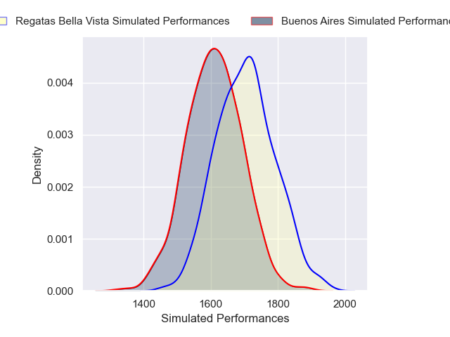

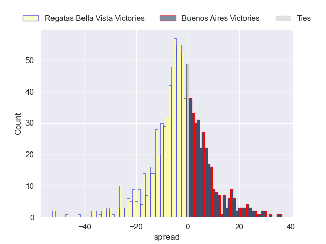

### CUBA V CASI on 2025/04/26

Average Margin: CASI by 1.0

Average Scoreline: 28-27

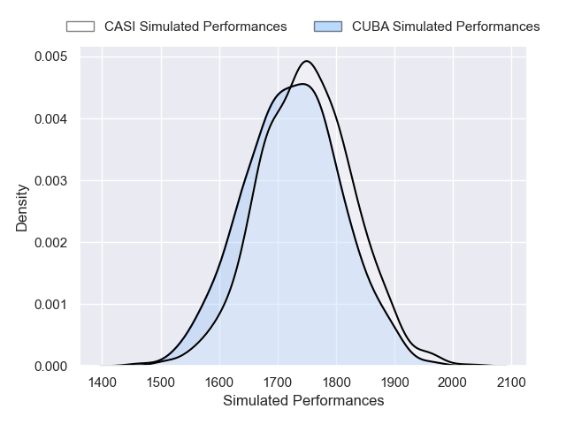

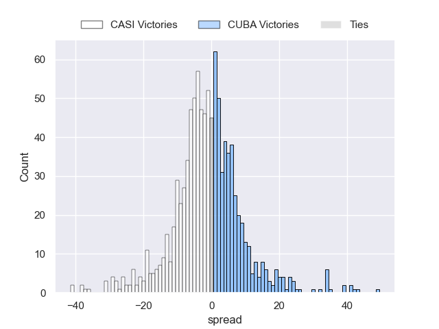

### Alumni V Belgrano on 2025/04/26

Average Margin: Alumni by 3.2

Average Scoreline: 30-26

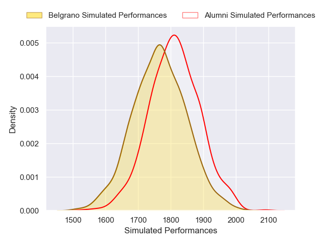
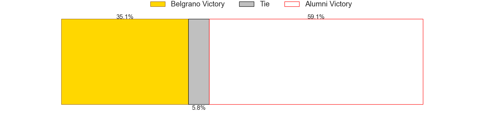
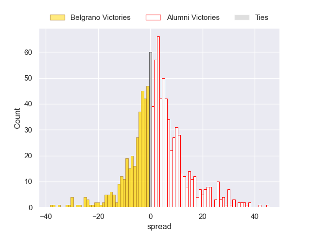

### La Plata V San Luis on 2025/04/26

Average Margin: San Luis by 0.8

Average Scoreline: 26-26

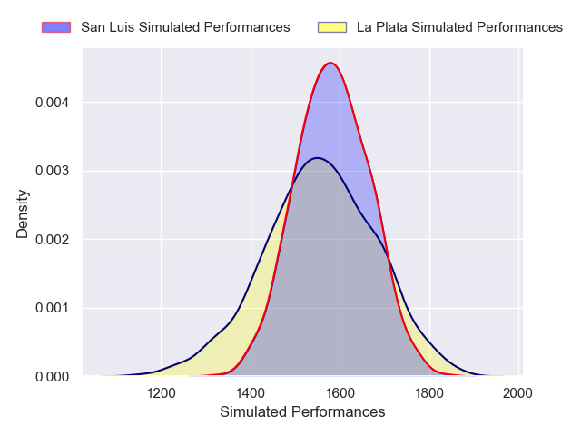

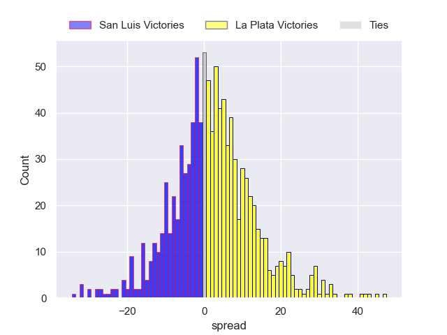

### Newman V Los Tilos on 2025/04/26

Average Margin: Newman by 14.8

Average Scoreline: 25-11

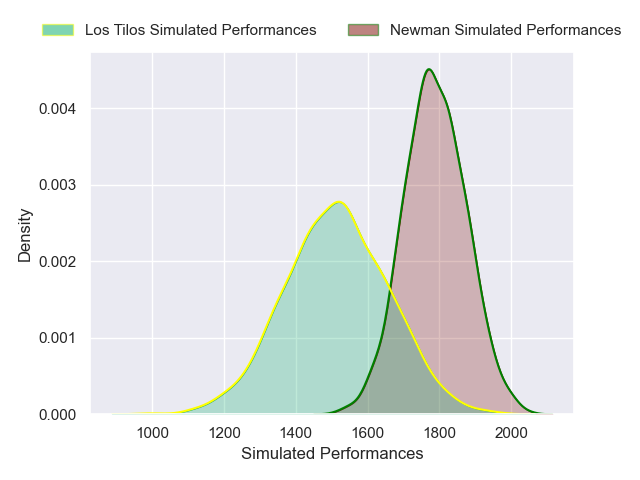

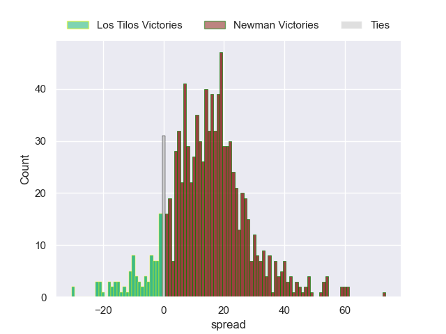

### Hindu V SIC on 2025/04/26

Average Margin: SIC by 2.2

Average Scoreline: 31-29

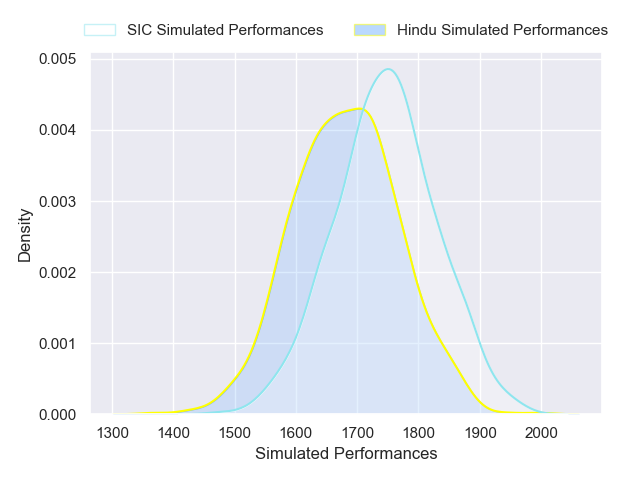

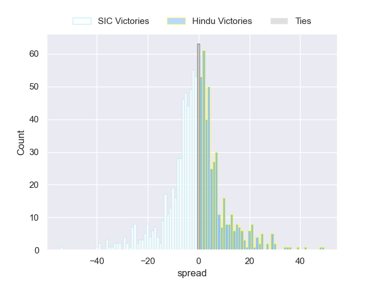

## Week 5

### San Luis V CUBA on 2025/05/03

Average Margin: CUBA by 0.9

Average Scoreline: 28-27

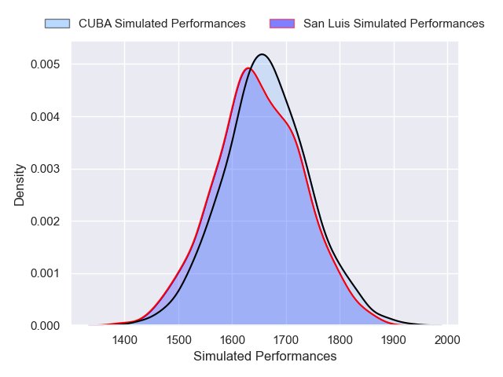

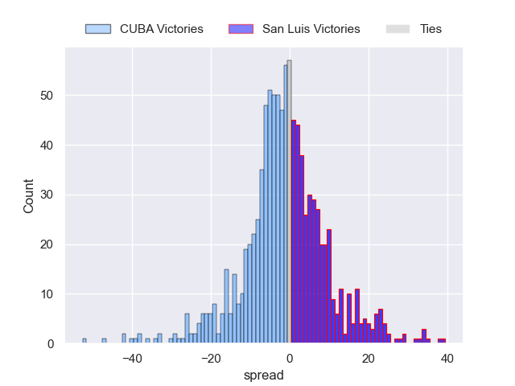

### SIC V Buenos Aires on 2025/05/03

Average Margin: SIC by 13.3

Average Scoreline: 32-19

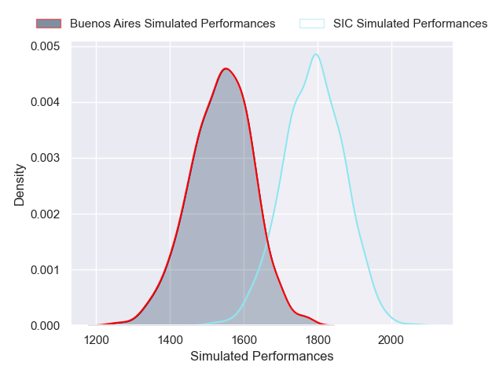
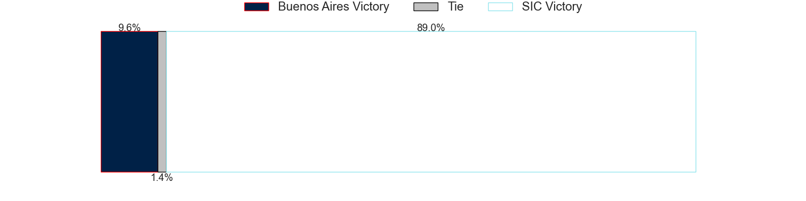
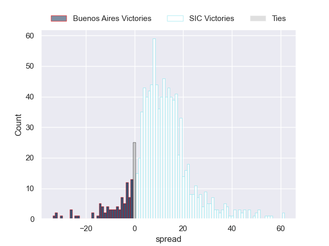

### Regatas Bella Vista V La Plata on 2025/05/03

Average Margin: Regatas Bella Vista by 11.5

Average Scoreline: 28-17

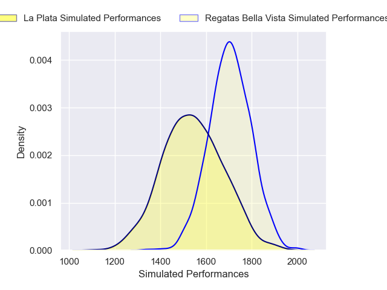
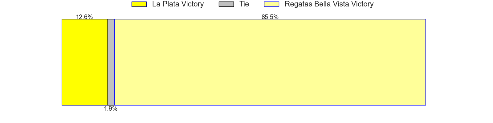
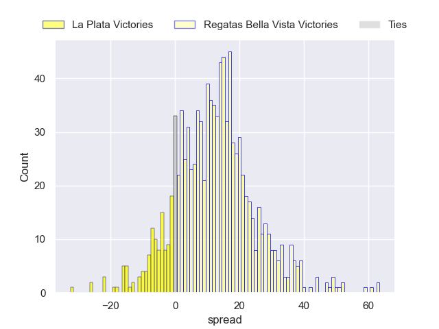

### Newman V Alumni on 2025/05/03

Average Margin: Newman by 5.0

Average Scoreline: 30-25

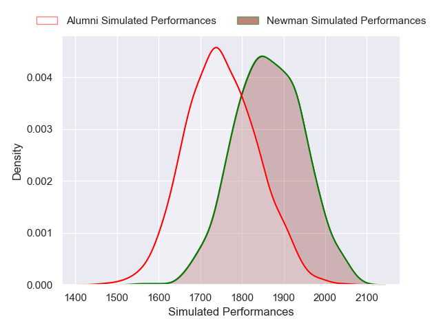

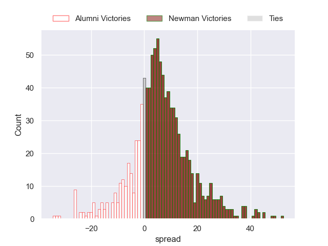

### Los Tilos V Hindu on 2025/05/03

Average Margin: Hindu by 0.8

Average Scoreline: 23-22

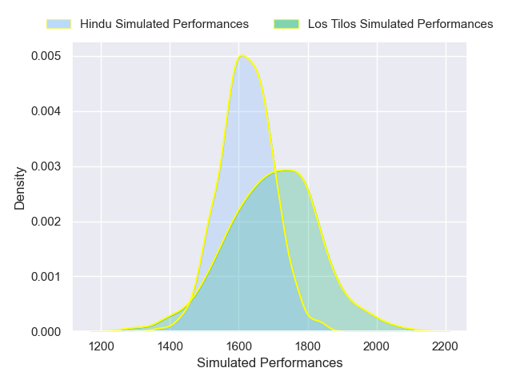

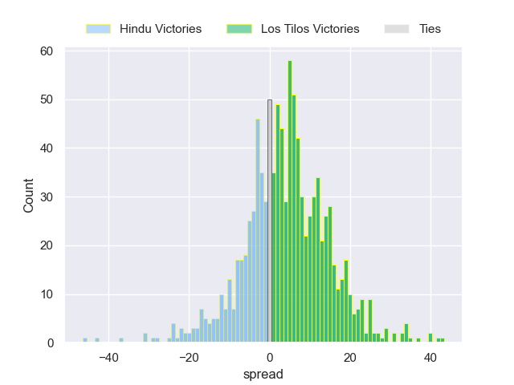

### CASI V Belgrano on 2025/05/03

Average Margin: CASI by 3.1

Average Scoreline: 29-26

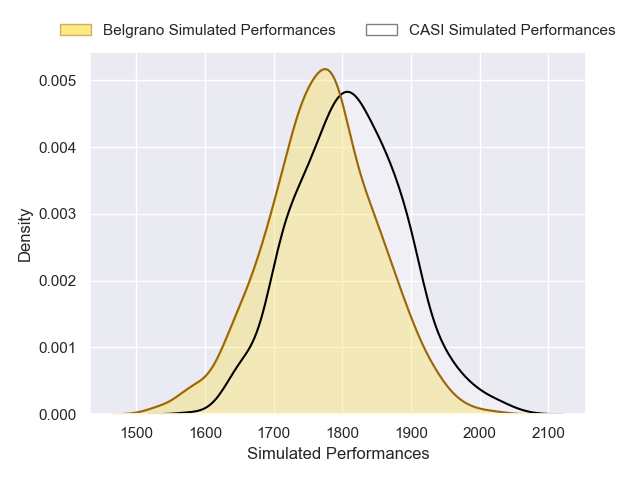

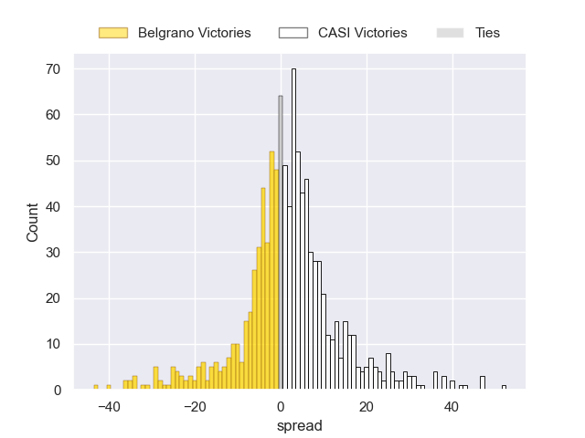

## Week 6

### La Plata V SIC on 2025/05/10

Average Margin: SIC by 9.1

Average Scoreline: 25-16

### Buenos Aires V Los Tilos on 2025/05/10

Average Margin: Buenos Aires by 4.3

Average Scoreline: 25-21

### Hindu V Newman on 2025/05/10

Average Margin: Newman by 3.7

Average Scoreline: 30-27

### CUBA V Regatas Bella Vista on 2025/05/10

Average Margin: CUBA by 4.6

Average Scoreline: 28-23

### Belgrano V San Luis on 2025/05/10

Average Margin: Belgrano by 13.8

Average Scoreline: 34-20

### Alumni V CASI on 2025/05/10

Average Margin: Alumni by 3.4

Average Scoreline: 30-27

## Week 7

### Regatas Bella Vista V Belgrano on 2025/05/17

Average Margin: Belgrano by 2.2

Average Scoreline: 28-26

### Los Tilos V La Plata on 2025/05/17

Average Margin: Los Tilos by 6.6

Average Scoreline: 29-22

### San Luis V CASI on 2025/05/17

Average Margin: CASI by 5.8

Average Scoreline: 32-26

### Newman V Buenos Aires on 2025/05/17

Average Margin: Newman by 15.2

Average Scoreline: 35-19

### SIC V CUBA on 2025/05/17

Average Margin: SIC by 7.6

Average Scoreline: 28-20

### Hindu V Alumni on 2025/05/17

Average Margin: Alumni by 2.9

Average Scoreline: 29-26

## Week 8

### CUBA V Los Tilos on 2025/05/31

Average Margin: CUBA by 9.7

Average Scoreline: 27-17

### Buenos Aires V Hindu on 2025/05/31

Average Margin: Hindu by 0.5

Average Scoreline: 26-25

### Belgrano V SIC on 2025/05/31

Average Margin: Belgrano by 5.2

Average Scoreline: 28-23

### Alumni V San Luis on 2025/05/31

Average Margin: Alumni by 12.2

Average Scoreline: 31-19

### CASI V Regatas Bella Vista on 2025/05/31

Average Margin: CASI by 9.3

Average Scoreline: 31-22

### La Plata V Newman on 2025/05/31

Average Margin: Newman by 11.1

Average Scoreline: 30-19

## Week 9

### Regatas Bella Vista V San Luis on 2025/06/07

Average Margin: Regatas Bella Vista by 7.2

Average Scoreline: 30-23

### Los Tilos V Belgrano on 2025/06/07

Average Margin: Belgrano by 8.0

Average Scoreline: 25-17

### Newman V CUBA on 2025/06/07

Average Margin: Newman by 8.7

Average Scoreline: 33-24

### Buenos Aires V Alumni on 2025/06/07

Average Margin: Alumni by 6.3

Average Scoreline: 25-18

### Hindu V La Plata on 2025/06/07

Average Margin: Hindu by 10.9

Average Scoreline: 31-20

### SIC V CASI on 2025/06/07

Average Margin: SIC by 3.1

Average Scoreline: 30-27

## Week 10

### Alumni V Regatas Bella Vista on 2025/06/14

Average Margin: Alumni by 9.6

Average Scoreline: 33-24

### San Luis V SIC on 2025/06/14

Average Margin: SIC by 4.7

Average Scoreline: 26-21

### CASI V Los Tilos on 2025/06/14

Average Margin: CASI by 13.6

Average Scoreline: 31-17

### CUBA V Hindu on 2025/06/14

Average Margin: CUBA by 5.8

Average Scoreline: 33-27

### La Plata V Buenos Aires on 2025/06/14

Average Margin: La Plata by 1.8

Average Scoreline: 26-24

### Belgrano V Newman on 2025/06/14

Average Margin: Belgrano by 4.0

Average Scoreline: 29-25

## Week 11

### SIC V Regatas Bella Vista on 2025/06/21

Average Margin: SIC by 8.8

Average Scoreline: 28-19

### Buenos Aires V CUBA on 2025/06/21

Average Margin: CUBA by 2.8

Average Scoreline: 29-26

### La Plata V Alumni on 2025/06/21

Average Margin: Alumni by 8.0

Average Scoreline: 25-17

### Los Tilos V San Luis on 2025/06/21

Average Margin: Los Tilos by 1.8

Average Scoreline: 27-25

### Newman V CASI on 2025/06/21

Average Margin: Newman by 4.9

Average Scoreline: 31-26

### Hindu V Belgrano on 2025/06/21

Average Margin: Belgrano by 4.0

Average Scoreline: 30-26

## Week 12

### Regatas Bella Vista V Los Tilos on 2025/06/28

Average Margin: Regatas Bella Vista by 9.3

Average Scoreline: 31-22

### CUBA V La Plata on 2025/06/28

Average Margin: CUBA by 11.4

Average Scoreline: 31-20

### San Luis V Newman on 2025/06/28

Average Margin: Newman by 6.1

Average Scoreline: 26-20

### Belgrano V Buenos Aires on 2025/06/28

Average Margin: Belgrano by 14.3

Average Scoreline: 36-22

### CASI V Hindu on 2025/06/28

Average Margin: CASI by 10.2

Average Scoreline: 36-26

### Alumni V SIC on 2025/06/28

Average Margin: Alumni by 4.6

Average Scoreline: 29-24

## Week 13

### Regatas Bella Vista V Newman on 2025/07/12

Average Margin: Newman by 2.4

Average Scoreline: 32-30

### San Luis V Hindu on 2025/07/12

Average Margin: San Luis by 0.9

Average Scoreline: 30-29

### SIC V Los Tilos on 2025/07/12

Average Margin: SIC by 12.7

Average Scoreline: 26-13

### Belgrano V La Plata on 2025/07/12

Average Margin: Belgrano by 16.5

Average Scoreline: 32-15

### CUBA V Alumni on 2025/07/12

Average Margin: Alumni by 0.4

Average Scoreline: 26-25

### CASI V Buenos Aires on 2025/07/12

Average Margin: CASI by 13.6

Average Scoreline: 37-24

## Week 14

### CUBA V Belgrano on 2025/07/19

Average Margin: Belgrano by 1.8

Average Scoreline: 27-25

### Alumni V Los Tilos on 2025/07/19

Average Margin: Alumni by 13.2

Average Scoreline: 29-16

### Hindu V Regatas Bella Vista on 2025/07/19

Average Margin: Hindu by 2.6

Average Scoreline: 29-26

### La Plata V CASI on 2025/07/19

Average Margin: CASI by 9.1

Average Scoreline: 29-20

### Newman V SIC on 2025/07/19

Average Margin: Newman by 5.0

Average Scoreline: 29-24

### Buenos Aires V San Luis on 2025/07/19

Average Margin: Buenos Aires by 2.2

Average Scoreline: 27-25

## Week 15

### Regatas Bella Vista V Buenos Aires on 2025/08/02

Average Margin: Regatas Bella Vista by 9.7

Average Scoreline: 33-23

### Los Tilos V Newman on 2025/08/02

Average Margin: Newman by 6.8

Average Scoreline: 25-18

### SIC V Hindu on 2025/08/02

Average Margin: SIC by 9.7

Average Scoreline: 34-24

### San Luis V La Plata on 2025/08/02

Average Margin: San Luis by 6.9

Average Scoreline: 32-25

### Belgrano V Alumni on 2025/08/02

Average Margin: Belgrano by 5.3

Average Scoreline: 30-25

### CASI V CUBA on 2025/08/02

Average Margin: CASI by 8.0

Average Scoreline: 32-24

## Week 16

### La Plata V Regatas Bella Vista on 2025/08/09

Average Margin: Regatas Bella Vista by 3.0

Average Scoreline: 26-23

### CUBA V San Luis on 2025/08/09

Average Margin: CUBA by 7.6

Average Scoreline: 33-25

### Belgrano V CASI on 2025/08/09

Average Margin: Belgrano by 4.5

Average Scoreline: 31-27

### Buenos Aires V SIC on 2025/08/09

Average Margin: SIC by 5.9

Average Scoreline: 26-20

### Hindu V Los Tilos on 2025/08/09

Average Margin: Hindu by 7.3

Average Scoreline: 28-20

### Alumni V Newman on 2025/08/09

Average Margin: Alumni by 2.9

Average Scoreline: 31-28

## Week 17

### Regatas Bella Vista V CUBA on 2025/08/16

Average Margin: Regatas Bella Vista by 3.5

Average Scoreline: 30-26

### CASI V Alumni on 2025/08/16

Average Margin: CASI by 4.1

Average Scoreline: 30-26

### San Luis V Belgrano on 2025/08/16

Average Margin: Belgrano by 5.7

Average Scoreline: 27-21

### SIC V La Plata on 2025/08/16

Average Margin: SIC by 14.0

Average Scoreline: 26-12

### Newman V Hindu on 2025/08/16

Average Margin: Newman by 10.2

Average Scoreline: 35-25

### Los Tilos V Buenos Aires on 2025/08/16

Average Margin: Los Tilos by 3.9

Average Scoreline: 27-23

## Week 18

### La Plata V Los Tilos on 2025/08/30

Average Margin: La Plata by 1.5

Average Scoreline: 24-23

### CUBA V SIC on 2025/08/30

Average Margin: SIC by 0.4

Average Scoreline: 26-26

### Buenos Aires V Newman on 2025/08/30

Average Margin: Newman by 7.9

Average Scoreline: 28-21

### CASI V San Luis on 2025/08/30

Average Margin: CASI by 11.8

Average Scoreline: 36-24

### Belgrano V Regatas Bella Vista on 2025/08/30

Average Margin: Belgrano by 10.0

Average Scoreline: 33-23

### Alumni V Hindu on 2025/08/30

Average Margin: Alumni by 9.9

Average Scoreline: 36-26

## Week 19

### Los Tilos V CUBA on 2025/09/06

Average Margin: CUBA by 1.4

Average Scoreline: 27-26

### Regatas Bella Vista V CASI on 2025/09/06

Average Margin: CASI by 1.7

Average Scoreline: 31-29

### Hindu V Buenos Aires on 2025/09/06

Average Margin: Hindu by 7.9

Average Scoreline: 30-22

### SIC V Belgrano on 2025/09/06

Average Margin: SIC by 2.2

Average Scoreline: 29-26

### San Luis V Alumni on 2025/09/06

Average Margin: Alumni by 3.8

Average Scoreline: 27-23

### Newman V La Plata on 2025/09/06

Average Margin: Newman by 14.4

Average Scoreline: 35-20

## Week 20

### Alumni V Buenos Aires on 2025/09/13

Average Margin: Alumni by 12.8

Average Scoreline: 35-22

### CUBA V Newman on 2025/09/13

Average Margin: Newman by 1.9

Average Scoreline: 30-28

### Belgrano V Los Tilos on 2025/09/13

Average Margin: Belgrano by 13.4

Average Scoreline: 32-19

### CASI V SIC on 2025/09/13

Average Margin: CASI by 4.6

Average Scoreline: 27-22

### San Luis V Regatas Bella Vista on 2025/09/13

Average Margin: San Luis by 0.6

Average Scoreline: 26-25

### La Plata V Hindu on 2025/09/13

Average Margin: Hindu by 1.4

Average Scoreline: 25-24

## Week 21

### Regatas Bella Vista V Alumni on 2025/09/27

Average Margin: Alumni by 1.1

Average Scoreline: 29-28

### Newman V Belgrano on 2025/09/27

Average Margin: Newman by 4.1

Average Scoreline: 30-26

### SIC V San Luis on 2025/09/27

Average Margin: SIC by 10.8

Average Scoreline: 31-20

### Los Tilos V CASI on 2025/09/27

Average Margin: CASI by 5.8

Average Scoreline: 30-25

### Hindu V CUBA on 2025/09/27

Average Margin: Hindu by 2.2

Average Scoreline: 25-23

### Buenos Aires V La Plata on 2025/09/27

Average Margin: Buenos Aires by 5.4

Average Scoreline: 28-23

## Week 22

### CASI V Newman on 2025/10/04

Average Margin: CASI by 3.1

Average Scoreline: 28-25

### CUBA V Buenos Aires on 2025/10/04

Average Margin: CUBA by 9.1

Average Scoreline: 34-25

### Alumni V La Plata on 2025/10/04

Average Margin: Alumni by 14.4

Average Scoreline: 35-20

### Belgrano V Hindu on 2025/10/04

Average Margin: Belgrano by 9.7

Average Scoreline: 34-25

### San Luis V Los Tilos on 2025/10/04

Average Margin: San Luis by 4.9

Average Scoreline: 29-24

### Regatas Bella Vista V SIC on 2025/10/04

Average Margin: SIC by 0.9

Average Scoreline: 26-25

## Week 23

### Los Tilos V Regatas Bella Vista on 2025/10/11

Average Margin: Regatas Bella Vista by 1.2

Average Scoreline: 26-25

### La Plata V CUBA on 2025/10/11

Average Margin: CUBA by 3.3

Average Scoreline: 27-24

### Newman V San Luis on 2025/10/11

Average Margin: Newman by 12.1

Average Scoreline: 36-24

### Hindu V CASI on 2025/10/11

Average Margin: CASI by 2.2

Average Scoreline: 30-28

### SIC V Alumni on 2025/10/11

Average Margin: SIC by 3.5

Average Scoreline: 28-25

### Buenos Aires V Belgrano on 2025/10/11

Average Margin: Belgrano by 6.8

Average Scoreline: 28-21

