---  
title: "URBA Top 13 2025 Status"  
date: 2025-04-10 6:00:00 -0500  
categories: model review projection  
layout: article  
aside:  
    toc: true  
---
# Current Team Rankings

# Standings

## Current Standings

| Club                |   Played |   Wins |   Point Differential |   Losing Bonus Points |   Try Bonus Points |   Competition Points |
|:--------------------|---------:|-------:|---------------------:|----------------------:|-------------------:|---------------------:|
| Belgrano            |        2 |      2 |                   32 |                     0 |                nan |                    9 |
| Hindu               |        1 |      1 |                   35 |                     0 |                  1 |                    5 |
| CASI                |        1 |      1 |                   15 |                     0 |                  1 |                    5 |
| Alumni              |        1 |      1 |                    8 |                     0 |                  1 |                    5 |
| Los Tilos           |        1 |      1 |                    4 |                     0 |                  0 |                    4 |
| Regatas Bella Vista |        1 |      1 |                    1 |                     0 |                  0 |                    4 |
| Newman              |        1 |      0 |                   -1 |                     1 |                  1 |                    2 |
| SIC                 |        1 |      0 |                   -4 |                     1 |                  0 |                    1 |
| CUBA                |        1 |      0 |                   -8 |                     0 |                  0 |                    0 |
| Buenos Aires        |        1 |      0 |                  -15 |                     0 |                  0 |                    0 |
| La Plata            |        1 |      0 |                  -16 |                     0 |                  0 |                    0 |
| La Plata Rugby Club |        1 |      0 |                  -16 |                     0 |                  0 |                    0 |
| San Luis            |        1 |      0 |                  -35 |                     0 |                  0 |                    0 |

## Projected Remaining Table

| Club                |   Matches Remaining |   Wins |   Point Differential |   Losing Bonus Points |   Try Bonus Points |   Competition Points |
|:--------------------|--------------------:|-------:|---------------------:|----------------------:|-------------------:|---------------------:|
| Newman              |                  21 |   15   |            136.169   |                   3.6 |                9.6 |                 73.2 |
| Belgrano            |                  21 |   14.9 |            127.834   |                   3.6 |                8.1 |                 71.3 |
| Alumni              |                  21 |   14.1 |            109.931   |                   4   |                8   |                 68.6 |
| CASI                |                  21 |   13.9 |            101.118   |                   4.1 |                7.7 |                 67.4 |
| SIC                 |                  21 |   12.8 |             65.677   |                   4.6 |                7.3 |                 63.1 |
| CUBA                |                  21 |   10.5 |              3.46975 |                   5.3 |                6.1 |                 53.6 |
| Regatas Bella Vista |                  21 |   10.1 |             -7.86819 |                   5.4 |                5.5 |                 51.2 |
| Hindu               |                  21 |    9.4 |            -25.7871  |                   5.6 |                6.4 |                 49.8 |
| San Luis            |                  21 |    7   |           -101.147   |                   5.6 |                4.7 |                 38.2 |
| Los Tilos           |                  21 |    6.3 |           -137.433   |                   5   |                4.1 |                 34.4 |
| La Plata            |                  21 |    6.3 |           -132.761   |                   5.1 |                3.8 |                 34   |
| Buenos Aires        |                  21 |    5.7 |           -139.202   |                   5.6 |                3.8 |                 32   |

## Projected Total Table

| Club                |   Total Matches |   Wins |   Point Differential |   Losing Bonus Points |   Try Bonus Points |   Competition Points |
|:--------------------|----------------:|-------:|---------------------:|----------------------:|-------------------:|---------------------:|
| Belgrano            |              23 |   16.9 |            159.834   |                   3.6 |                8.1 |                 80.3 |
| Newman              |              22 |   15   |            135.169   |                   4.6 |               10.6 |                 75.2 |
| Alumni              |              22 |   15.1 |            117.931   |                   4   |                9   |                 73.6 |
| CASI                |              22 |   14.9 |            116.118   |                   4.1 |                8.7 |                 72.4 |
| SIC                 |              22 |   12.8 |             61.677   |                   5.6 |                7.3 |                 64.1 |
| Regatas Bella Vista |              22 |   11.1 |             -6.86819 |                   5.4 |                5.5 |                 55.2 |
| Hindu               |              22 |   10.4 |              9.21289 |                   5.6 |                7.4 |                 54.8 |
| CUBA                |              22 |   10.5 |             -4.53025 |                   5.3 |                6.1 |                 53.6 |
| Los Tilos           |              22 |    7.3 |           -133.433   |                   5   |                4.1 |                 38.4 |
| San Luis            |              22 |    7   |           -136.147   |                   5.6 |                4.7 |                 38.2 |
| La Plata            |              22 |    6.3 |           -148.761   |                   5.1 |                3.8 |                 34   |
| Buenos Aires        |              22 |    5.7 |           -154.202   |                   5.6 |                3.8 |                 32   |
| La Plata Rugby Club |               1 |    0   |            -16       |                   0   |                0   |                  0   |

# Completed Match Review

| Model | Percent Correct Predictions | Spread Error |
| ------ | ------ | ------ |
| Club Level | 71.4% | 13.3 |
| Player Level: Lineup | 100.0% | 19.6 |
| Player Level: Minutes | 50.0% | 24.2 |

# Future Predictions

## Week 3

### SIC V Newman on 2025/04/12

Average Margin: SIC by 0.5

Average Scoreline: 28-28

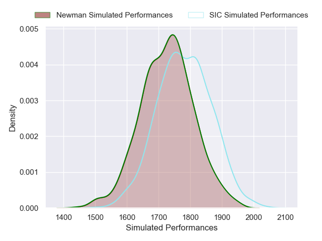

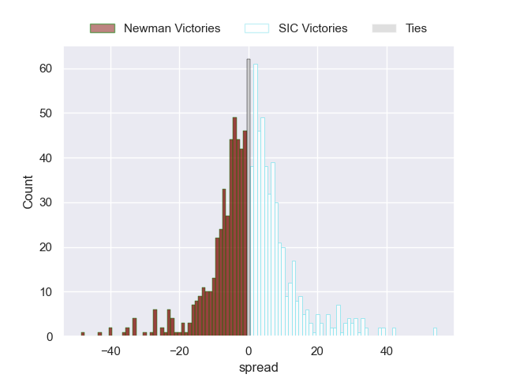

### Los Tilos V Alumni on 2025/04/12

Average Margin: Alumni by 8.8

Average Scoreline: 37-28

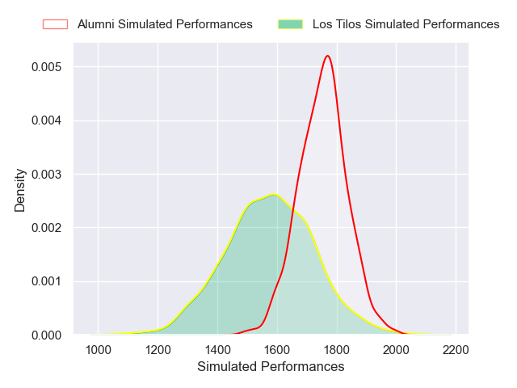
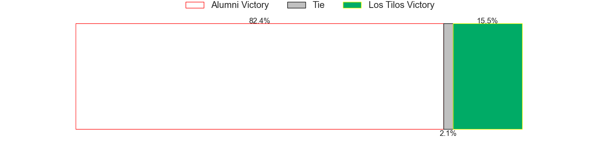
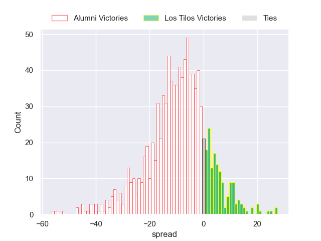

### Regatas Bella Vista V Hindu on 2025/04/12

Average Margin: Regatas Bella Vista by 4.3

Average Scoreline: 34-30

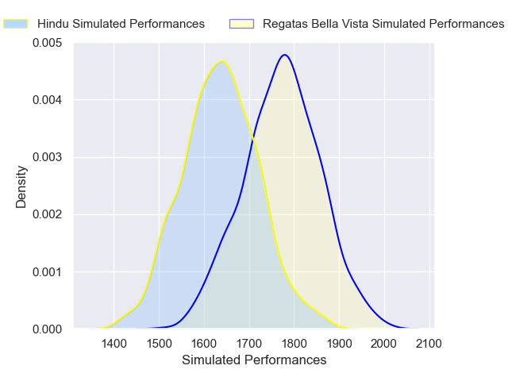

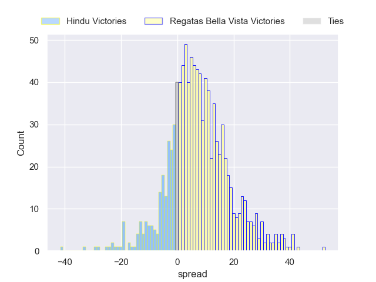

### Belgrano V CUBA on 2025/04/12

Average Margin: Belgrano by 11.5

Average Scoreline: 32-21

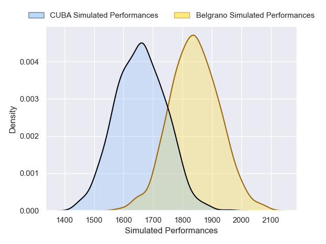

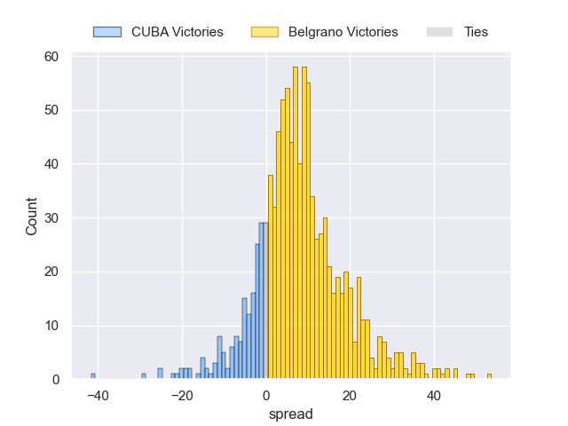

### San Luis V Buenos Aires on 2025/04/12

Average Margin: San Luis by 5.9

Average Scoreline: 29-23

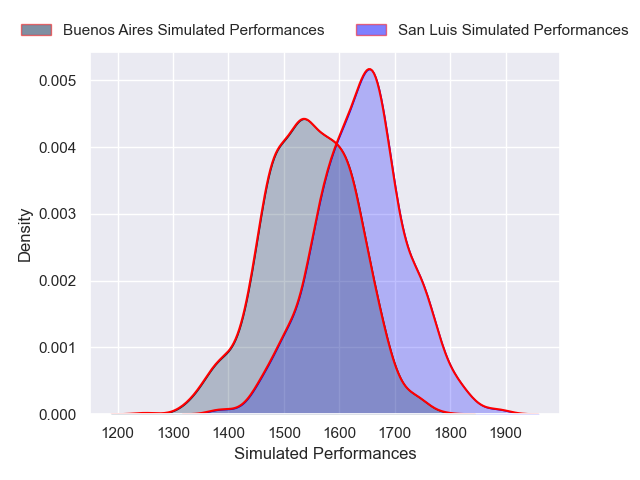

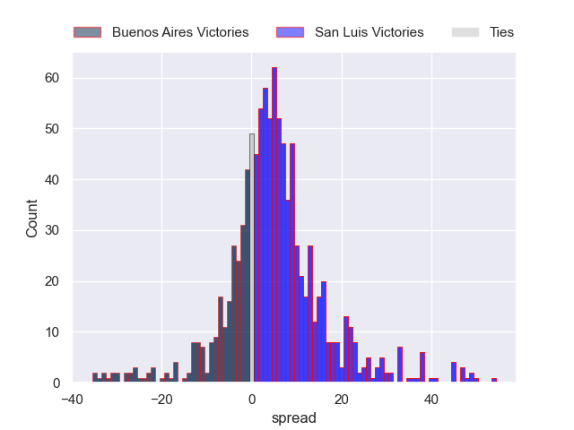

### CASI V La Plata on 2025/04/12

Average Margin: CASI by 14.8

Average Scoreline: 37-22

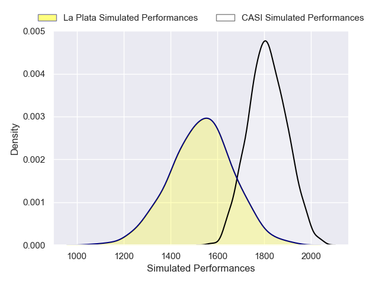

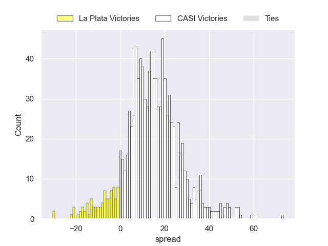

## Week 4

### Newman V Los Tilos on 2025/04/26

Average Margin: Newman by 16.7

Average Scoreline: 38-21

### Alumni V Belgrano on 2025/04/26

Average Margin: Alumni by 2.7

Average Scoreline: 32-30

### Hindu V SIC on 2025/04/26

Average Margin: SIC by 0.4

Average Scoreline: 27-27

### CUBA V CASI on 2025/04/26

Average Margin: CASI by 1.7

Average Scoreline: 36-34

### Buenos Aires V Regatas Bella Vista on 2025/04/26

Average Margin: Regatas Bella Vista by 2.3

Average Scoreline: 38-36

### La Plata V San Luis on 2025/04/26

Average Margin: La Plata by 1.9

Average Scoreline: 34-32

## Week 5

### Newman V Alumni on 2025/05/03

Average Margin: Newman by 5.2

Average Scoreline: 30-25

### CASI V Belgrano on 2025/05/03

Average Margin: CASI by 2.2

Average Scoreline: 32-29

### Regatas Bella Vista V La Plata on 2025/05/03

Average Margin: Regatas Bella Vista by 9.6

Average Scoreline: 33-23

### San Luis V CUBA on 2025/05/03

Average Margin: CUBA by 0.9

Average Scoreline: 31-30

### Los Tilos V Hindu on 2025/05/03

Average Margin: Hindu by 1.6

Average Scoreline: 29-27

### SIC V Buenos Aires on 2025/05/03

Average Margin: SIC by 12.4

Average Scoreline: 34-22

## Week 6

### Alumni V CASI on 2025/05/10

Average Margin: Alumni by 4.0

Average Scoreline: 34-30

### Belgrano V San Luis on 2025/05/10

Average Margin: Belgrano by 14.1

Average Scoreline: 36-21

### CUBA V Regatas Bella Vista on 2025/05/10

Average Margin: CUBA by 5.4

Average Scoreline: 30-25

### La Plata V SIC on 2025/05/10

Average Margin: SIC by 6.6

Average Scoreline: 32-25

### Hindu V Newman on 2025/05/10

Average Margin: Newman by 3.6

Average Scoreline: 37-33

### Buenos Aires V Los Tilos on 2025/05/10

Average Margin: Buenos Aires by 3.7

Average Scoreline: 32-29

## Week 7

### SIC V CUBA on 2025/05/17

Average Margin: SIC by 7.1

Average Scoreline: 29-22

### Regatas Bella Vista V Belgrano on 2025/05/17

Average Margin: Belgrano by 3.1

Average Scoreline: 31-28

### Newman V Buenos Aires on 2025/05/17

Average Margin: Newman by 15.5

Average Scoreline: 37-21

### Hindu V Alumni on 2025/05/17

Average Margin: Alumni by 2.3

Average Scoreline: 35-33

### San Luis V CASI on 2025/05/17

Average Margin: CASI by 6.9

Average Scoreline: 40-33

### Los Tilos V La Plata on 2025/05/17

Average Margin: Los Tilos by 3.4

Average Scoreline: 30-26

## Week 8

### La Plata V Newman on 2025/05/31

Average Margin: Newman by 9.3

Average Scoreline: 35-26

### CUBA V Los Tilos on 2025/05/31

Average Margin: CUBA by 10.4

Average Scoreline: 34-23

### Buenos Aires V Hindu on 2025/05/31

Average Margin: Hindu by 2.8

Average Scoreline: 37-34

### CASI V Regatas Bella Vista on 2025/05/31

Average Margin: CASI by 9.6

Average Scoreline: 33-23

### Belgrano V SIC on 2025/05/31

Average Margin: Belgrano by 6.8

Average Scoreline: 30-23

### Alumni V San Luis on 2025/05/31

Average Margin: Alumni by 13.2

Average Scoreline: 35-22

## Week 9

### Hindu V La Plata on 2025/06/07

Average Margin: Hindu by 9.1

Average Scoreline: 34-25

### SIC V CASI on 2025/06/07

Average Margin: SIC by 2.3

Average Scoreline: 33-31

### Regatas Bella Vista V San Luis on 2025/06/07

Average Margin: Regatas Bella Vista by 7.4

Average Scoreline: 32-25

### Buenos Aires V Alumni on 2025/06/07

Average Margin: Alumni by 7.7

Average Scoreline: 38-31

### Newman V CUBA on 2025/06/07

Average Margin: Newman by 10.3

Average Scoreline: 34-23

### Los Tilos V Belgrano on 2025/06/07

Average Margin: Belgrano by 8.8

Average Scoreline: 36-27

## Week 10

### CUBA V Hindu on 2025/06/14

Average Margin: CUBA by 4.1

Average Scoreline: 30-26

### Belgrano V Newman on 2025/06/14

Average Margin: Belgrano by 2.9

Average Scoreline: 29-26

### La Plata V Buenos Aires on 2025/06/14

Average Margin: La Plata by 4.0

Average Scoreline: 30-26

### Alumni V Regatas Bella Vista on 2025/06/14

Average Margin: Alumni by 9.3

Average Scoreline: 30-21

### San Luis V SIC on 2025/06/14

Average Margin: SIC by 3.8

Average Scoreline: 29-25

### CASI V Los Tilos on 2025/06/14

Average Margin: CASI by 14.1

Average Scoreline: 37-23

## Week 11

### La Plata V Alumni on 2025/06/21

Average Margin: Alumni by 7.5

Average Scoreline: 39-32

### Los Tilos V San Luis on 2025/06/21

Average Margin: Los Tilos by 1.7

Average Scoreline: 32-30

### SIC V Regatas Bella Vista on 2025/06/21

Average Margin: SIC by 7.6

Average Scoreline: 28-21

### Hindu V Belgrano on 2025/06/21

Average Margin: Belgrano by 3.0

Average Scoreline: 32-29

### Newman V CASI on 2025/06/21

Average Margin: Newman by 5.2

Average Scoreline: 35-30

### Buenos Aires V CUBA on 2025/06/21

Average Margin: CUBA by 3.0

Average Scoreline: 32-28

## Week 12

### CUBA V La Plata on 2025/06/28

Average Margin: CUBA by 9.7

Average Scoreline: 33-23

### Alumni V SIC on 2025/06/28

Average Margin: Alumni by 5.6

Average Scoreline: 29-24

### Regatas Bella Vista V Los Tilos on 2025/06/28

Average Margin: Regatas Bella Vista by 9.2

Average Scoreline: 33-24

### San Luis V Newman on 2025/06/28

Average Margin: Newman by 7.7

Average Scoreline: 37-29

### CASI V Hindu on 2025/06/28

Average Margin: CASI by 8.8

Average Scoreline: 35-27

### Belgrano V Buenos Aires on 2025/06/28

Average Margin: Belgrano by 14.6

Average Scoreline: 36-21

## Week 13

### SIC V Los Tilos on 2025/07/12

Average Margin: SIC by 12.3

Average Scoreline: 34-22

### CUBA V Alumni on 2025/07/12

Average Margin: Alumni by 1.6

Average Scoreline: 31-30

### Belgrano V La Plata on 2025/07/12

Average Margin: Belgrano by 14.4

Average Scoreline: 35-21

### San Luis V Hindu on 2025/07/12

Average Margin: San Luis by 0.1

Average Scoreline: 30-30

### Regatas Bella Vista V Newman on 2025/07/12

Average Margin: Newman by 3.3

Average Scoreline: 31-27

### CASI V Buenos Aires on 2025/07/12

Average Margin: CASI by 13.6

Average Scoreline: 39-26

## Week 14

### CUBA V Belgrano on 2025/07/19

Average Margin: Belgrano by 2.6

Average Scoreline: 32-29

### La Plata V CASI on 2025/07/19

Average Margin: CASI by 6.8

Average Scoreline: 38-31

### Hindu V Regatas Bella Vista on 2025/07/19

Average Margin: Hindu by 3.9

Average Scoreline: 30-26

### Newman V SIC on 2025/07/19

Average Margin: Newman by 6.7

Average Scoreline: 31-24

### Buenos Aires V San Luis on 2025/07/19

Average Margin: Buenos Aires by 2.5

Average Scoreline: 32-30

### Alumni V Los Tilos on 2025/07/19

Average Margin: Alumni by 14.4

Average Scoreline: 35-21

## Week 15

### SIC V Hindu on 2025/08/02

Average Margin: SIC by 7.6

Average Scoreline: 31-23

### Los Tilos V Newman on 2025/08/02

Average Margin: Newman by 8.0

Average Scoreline: 38-30

### Belgrano V Alumni on 2025/08/02

Average Margin: Belgrano by 4.2

Average Scoreline: 30-25

### CASI V CUBA on 2025/08/02

Average Margin: CASI by 8.7

Average Scoreline: 37-29

### Regatas Bella Vista V Buenos Aires on 2025/08/02

Average Margin: Regatas Bella Vista by 8.9

Average Scoreline: 31-22

### San Luis V La Plata on 2025/08/02

Average Margin: San Luis by 4.7

Average Scoreline: 31-26

## Week 16

### La Plata V Regatas Bella Vista on 2025/08/09

Average Margin: Regatas Bella Vista by 1.4

Average Scoreline: 33-32

### CUBA V San Luis on 2025/08/09

Average Margin: CUBA by 8.2

Average Scoreline: 33-25

### Hindu V Los Tilos on 2025/08/09

Average Margin: Hindu by 8.9

Average Scoreline: 32-23

### Buenos Aires V SIC on 2025/08/09

Average Margin: SIC by 5.2

Average Scoreline: 35-30

### Belgrano V CASI on 2025/08/09

Average Margin: Belgrano by 5.1

Average Scoreline: 33-28

### Alumni V Newman on 2025/08/09

Average Margin: Alumni by 2.2

Average Scoreline: 31-28

## Week 17

### Los Tilos V Buenos Aires on 2025/08/16

Average Margin: Los Tilos by 4.2

Average Scoreline: 32-28

### Newman V Hindu on 2025/08/16

Average Margin: Newman by 9.9

Average Scoreline: 34-24

### SIC V La Plata on 2025/08/16

Average Margin: SIC by 12.0

Average Scoreline: 34-22

### Regatas Bella Vista V CUBA on 2025/08/16

Average Margin: Regatas Bella Vista by 2.9

Average Scoreline: 26-23

### San Luis V Belgrano on 2025/08/16

Average Margin: Belgrano by 6.7

Average Scoreline: 34-27

### CASI V Alumni on 2025/08/16

Average Margin: CASI by 3.5

Average Scoreline: 32-29

## Week 18

### La Plata V Los Tilos on 2025/08/30

Average Margin: La Plata by 3.3

Average Scoreline: 32-29

### Alumni V Hindu on 2025/08/30

Average Margin: Alumni by 9.8

Average Scoreline: 33-23

### CUBA V SIC on 2025/08/30

Average Margin: CUBA by 0.7

Average Scoreline: 28-28

### Belgrano V Regatas Bella Vista on 2025/08/30

Average Margin: Belgrano by 9.8

Average Scoreline: 30-21

### CASI V San Luis on 2025/08/30

Average Margin: CASI by 12.1

Average Scoreline: 38-26

### Buenos Aires V Newman on 2025/08/30

Average Margin: Newman by 8.5

Average Scoreline: 38-29

## Week 19

### SIC V Belgrano on 2025/09/06

Average Margin: SIC by 1.0

Average Scoreline: 30-29

### Regatas Bella Vista V CASI on 2025/09/06

Average Margin: CASI by 1.0

Average Scoreline: 31-30

### San Luis V Alumni on 2025/09/06

Average Margin: Alumni by 5.4

Average Scoreline: 38-33

### Newman V La Plata on 2025/09/06

Average Margin: Newman by 13.8

Average Scoreline: 36-22

### Los Tilos V CUBA on 2025/09/06

Average Margin: CUBA by 1.9

Average Scoreline: 33-31

### Hindu V Buenos Aires on 2025/09/06

Average Margin: Hindu by 8.6

Average Scoreline: 30-21

## Week 20

### Belgrano V Los Tilos on 2025/09/13

Average Margin: Belgrano by 13.8

Average Scoreline: 35-21

### CUBA V Newman on 2025/09/13

Average Margin: Newman by 2.1

Average Scoreline: 33-31

### San Luis V Regatas Bella Vista on 2025/09/13

Average Margin: San Luis by 0.1

Average Scoreline: 32-32

### Alumni V Buenos Aires on 2025/09/13

Average Margin: Alumni by 14.4

Average Scoreline: 36-21

### La Plata V Hindu on 2025/09/13

Average Margin: Hindu by 0.8

Average Scoreline: 33-32

### CASI V SIC on 2025/09/13

Average Margin: CASI by 5.4

Average Scoreline: 32-27

## Week 21

### Los Tilos V CASI on 2025/09/27

Average Margin: CASI by 5.4

Average Scoreline: 40-35

### Hindu V CUBA on 2025/09/27

Average Margin: Hindu by 3.2

Average Scoreline: 28-25

### Buenos Aires V La Plata on 2025/09/27

Average Margin: Buenos Aires by 3.0

Average Scoreline: 31-28

### Regatas Bella Vista V Alumni on 2025/09/27

Average Margin: Alumni by 2.0

Average Scoreline: 30-28

### Newman V Belgrano on 2025/09/27

Average Margin: Newman by 4.6

Average Scoreline: 31-26

### SIC V San Luis on 2025/09/27

Average Margin: SIC by 10.7

Average Scoreline: 34-23

## Week 22

### CUBA V Buenos Aires on 2025/10/04

Average Margin: CUBA by 9.7

Average Scoreline: 33-24

### San Luis V Los Tilos on 2025/10/04

Average Margin: San Luis by 5.1

Average Scoreline: 32-27

### CASI V Newman on 2025/10/04

Average Margin: CASI by 2.1

Average Scoreline: 30-28

### Alumni V La Plata on 2025/10/04

Average Margin: Alumni by 13.8

Average Scoreline: 36-22

### Regatas Bella Vista V SIC on 2025/10/04

Average Margin: Regatas Bella Vista by 0.7

Average Scoreline: 25-24

### Belgrano V Hindu on 2025/10/04

Average Margin: Belgrano by 10.0

Average Scoreline: 35-25

## Week 23

### Los Tilos V Regatas Bella Vista on 2025/10/11

Average Margin: Regatas Bella Vista by 0.6

Average Scoreline: 34-33

### Newman V San Luis on 2025/10/11

Average Margin: Newman by 13.7

Average Scoreline: 37-23

### Buenos Aires V Belgrano on 2025/10/11

Average Margin: Belgrano by 7.1

Average Scoreline: 38-30

### Hindu V CASI on 2025/10/11

Average Margin: CASI by 1.0

Average Scoreline: 31-30

### La Plata V CUBA on 2025/10/11

Average Margin: CUBA by 1.2

Average Scoreline: 29-28

### SIC V Alumni on 2025/10/11

Average Margin: SIC by 2.0

Average Scoreline: 29-27

