---  
title: "URBA Top 13 2025 Status"  
date: 2025-03-28 6:00:00 -0500  
categories: model review projection  
layout: article  
aside:  
    toc: true  
---
# Current Team Rankings

# Standings

## Projected Total Table

| Club                |   Total Matches |   Wins |   Point Differential |   Losing Bonus Points |   Try Bonus Points |   Competition Points |
|:--------------------|----------------:|-------:|---------------------:|----------------------:|-------------------:|---------------------:|
| Newman              |              22 |   16.8 |            182.034   |                   3.1 |               10.2 |                 80.5 |
| Alumni              |              22 |   15   |            118.896   |                   4.1 |                9   |                 73.1 |
| Belgrano            |              22 |   14.7 |            108.761   |                   4.3 |                8.6 |                 71.6 |
| SIC                 |              22 |   14.5 |            105.472   |                   4.3 |                9.1 |                 71.3 |
| CASI                |              22 |   13.8 |             84.0884  |                   4.7 |                7.2 |                 67   |
| CUBA                |              22 |   10.7 |             -4.32238 |                   5.5 |                6.5 |                 54.9 |
| Hindu               |              22 |    9.1 |            -50.6536  |                   5.8 |                7.7 |                 50   |
| Regatas Bella Vista |              22 |    8.8 |            -56.231   |                   5.8 |                4.6 |                 45.8 |
| La Plata            |              22 |    8.7 |            -71.2225  |                   5.3 |                4.9 |                 45   |
| San Luis            |              22 |    8.4 |            -73.2869  |                   5.8 |                5.3 |                 44.6 |
| Buenos Aires        |              22 |    6.9 |           -115.394   |                   5.9 |                5.1 |                 38.7 |
| Los Tilos           |              22 |    4.6 |           -228.14    |                   4.7 |                3.5 |                 26.6 |

# Future Predictions

## Week 1

### Buenos Aires V CASI on 2025/04/05

Average Margin: CASI by 5.8

Average Scoreline: 32-26

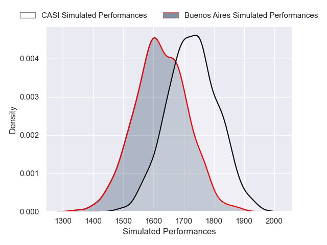

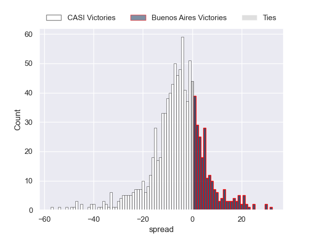

### La Plata V Belgrano on 2025/04/05

Average Margin: Belgrano by 5.4

Average Scoreline: 38-33

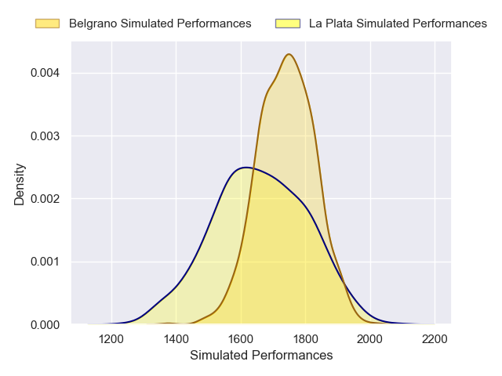

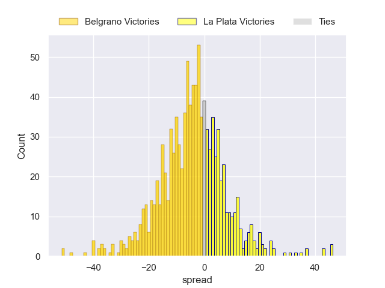

### Alumni V CUBA on 2025/04/05

Average Margin: Alumni by 9.7

Average Scoreline: 26-16

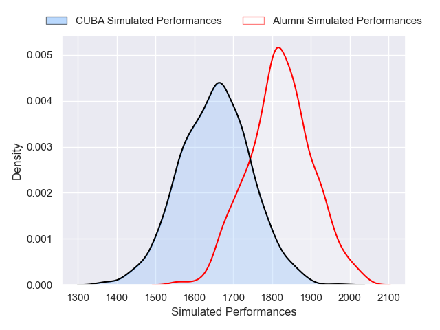
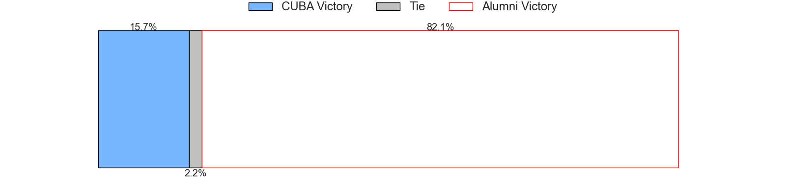
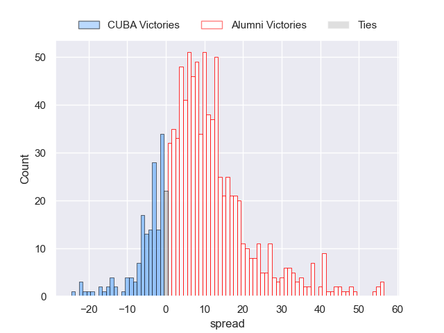

### Los Tilos V SIC on 2025/04/05

Average Margin: SIC by 13.2

Average Scoreline: 42-29

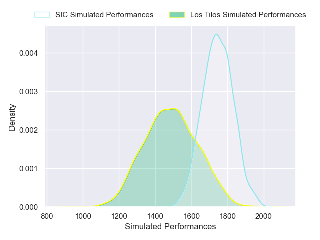

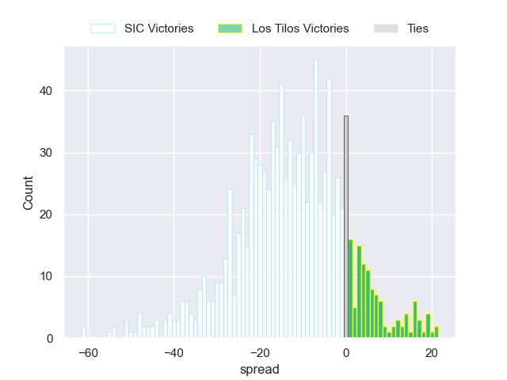

### Hindu V San Luis on 2025/04/05

Average Margin: Hindu by 5.2

Average Scoreline: 32-27

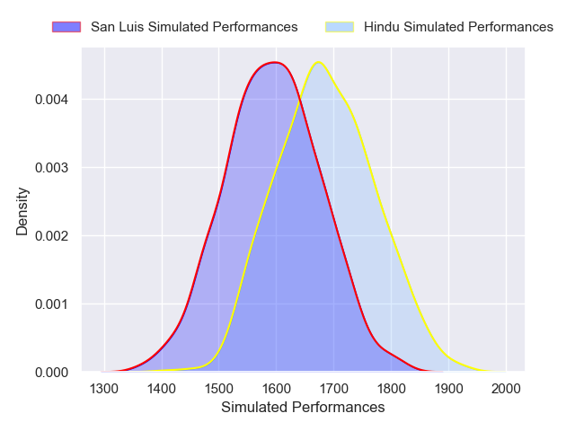

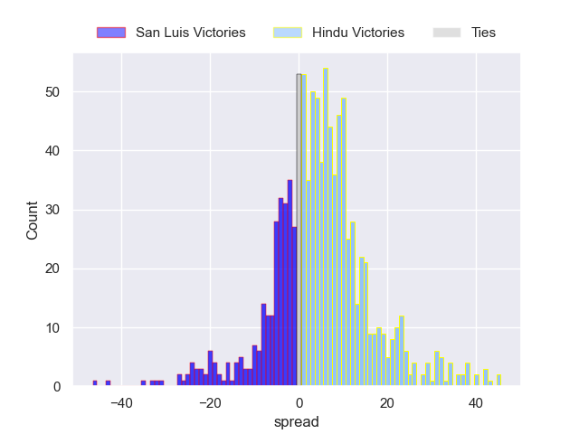

### Newman V Regatas Bella Vista on 2025/04/05

Average Margin: Newman by 14.2

Average Scoreline: 26-12

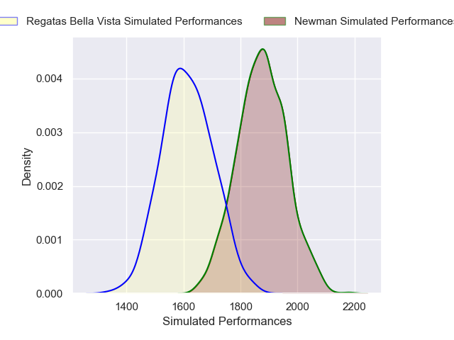
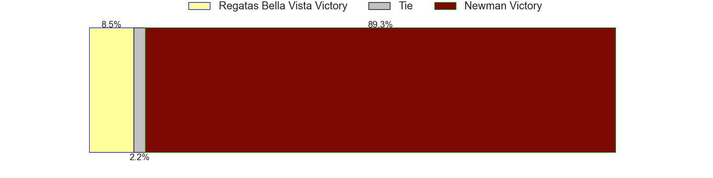
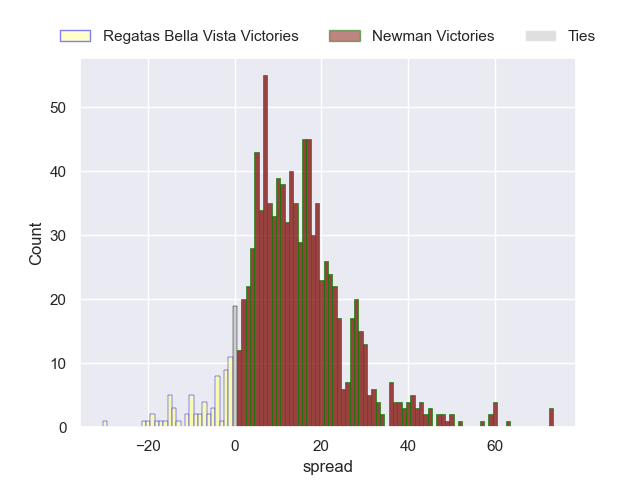

## Week 2

### CASI V La Plata on 2025/04/12

Average Margin: CASI by 10.5

Average Scoreline: 28-18

### SIC V Newman on 2025/04/12

Average Margin: SIC by 0.9

Average Scoreline: 30-29

### San Luis V Buenos Aires on 2025/04/12

Average Margin: San Luis by 5.8

Average Scoreline: 29-23

### Los Tilos V Alumni on 2025/04/12

Average Margin: Alumni by 13.2

Average Scoreline: 38-25

### Belgrano V CUBA on 2025/04/12

Average Margin: Belgrano by 8.4

Average Scoreline: 26-18

### Regatas Bella Vista V Hindu on 2025/04/12

Average Margin: Regatas Bella Vista by 3.4

Average Scoreline: 25-22

## Week 3

### CUBA V CASI on 2025/04/26

Average Margin: CASI by 0.2

Average Scoreline: 34-34

### Alumni V Belgrano on 2025/04/26

Average Margin: Alumni by 4.2

Average Scoreline: 34-30

### Newman V Los Tilos on 2025/04/26

Average Margin: Newman by 23.3

Average Scoreline: 38-14

### Hindu V SIC on 2025/04/26

Average Margin: SIC by 3.8

Average Scoreline: 35-31

### Buenos Aires V Regatas Bella Vista on 2025/04/26

Average Margin: Buenos Aires by 0.8

Average Scoreline: 24-23

### La Plata V San Luis on 2025/04/26

Average Margin: La Plata by 3.4

Average Scoreline: 31-27

## Week 4

### CASI V Belgrano on 2025/05/03

Average Margin: CASI by 2.5

Average Scoreline: 33-31

### Los Tilos V Hindu on 2025/05/03

Average Margin: Hindu by 5.1

Average Scoreline: 33-28

### San Luis V CUBA on 2025/05/03

Average Margin: San Luis by 0.2

Average Scoreline: 27-27

### Regatas Bella Vista V La Plata on 2025/05/03

Average Margin: Regatas Bella Vista by 4.5

Average Scoreline: 26-21

### SIC V Buenos Aires on 2025/05/03

Average Margin: SIC by 12.8

Average Scoreline: 29-16

### Newman V Alumni on 2025/05/03

Average Margin: Newman by 6.2

Average Scoreline: 30-24

## Week 5

### CUBA V Regatas Bella Vista on 2025/05/10

Average Margin: CUBA by 6.4

Average Scoreline: 31-25

### Hindu V Newman on 2025/05/10

Average Margin: Newman by 7.0

Average Scoreline: 34-27

### Buenos Aires V Los Tilos on 2025/05/10

Average Margin: Buenos Aires by 9.1

Average Scoreline: 26-17

### Belgrano V San Luis on 2025/05/10

Average Margin: Belgrano by 11.3

Average Scoreline: 26-15

### Alumni V CASI on 2025/05/10

Average Margin: Alumni by 5.4

Average Scoreline: 32-26

### La Plata V SIC on 2025/05/10

Average Margin: SIC by 3.9

Average Scoreline: 34-30

## Week 6

### San Luis V CASI on 2025/05/17

Average Margin: CASI by 3.7

Average Scoreline: 36-32

### SIC V CUBA on 2025/05/17

Average Margin: SIC by 8.4

Average Scoreline: 26-17

### Los Tilos V La Plata on 2025/05/17

Average Margin: La Plata by 3.3

Average Scoreline: 32-28

### Regatas Bella Vista V Belgrano on 2025/05/17

Average Margin: Belgrano by 3.9

Average Scoreline: 30-26

### Hindu V Alumni on 2025/05/17

Average Margin: Alumni by 3.0

Average Scoreline: 34-31

### Newman V Buenos Aires on 2025/05/17

Average Margin: Newman by 15.7

Average Scoreline: 30-15

## Week 7

### Belgrano V SIC on 2025/05/31

Average Margin: Belgrano by 3.6

Average Scoreline: 29-25

### Alumni V San Luis on 2025/05/31

Average Margin: Alumni by 11.9

Average Scoreline: 29-17

### CASI V Regatas Bella Vista on 2025/05/31

Average Margin: CASI by 9.3

Average Scoreline: 31-22

### La Plata V Newman on 2025/05/31

Average Margin: Newman by 7.9

Average Scoreline: 36-28

### CUBA V Los Tilos on 2025/05/31

Average Margin: CUBA by 13.3

Average Scoreline: 30-17

### Buenos Aires V Hindu on 2025/05/31

Average Margin: Buenos Aires by 1.0

Average Scoreline: 30-29

## Week 8

### Hindu V La Plata on 2025/06/07

Average Margin: Hindu by 5.0

Average Scoreline: 30-25

### Buenos Aires V Alumni on 2025/06/07

Average Margin: Alumni by 6.0

Average Scoreline: 35-29

### Newman V CUBA on 2025/06/07

Average Margin: Newman by 10.7

Average Scoreline: 31-20

### Los Tilos V Belgrano on 2025/06/07

Average Margin: Belgrano by 10.6

Average Scoreline: 37-26

### SIC V CASI on 2025/06/07

Average Margin: SIC by 4.3

Average Scoreline: 34-30

### Regatas Bella Vista V San Luis on 2025/06/07

Average Margin: Regatas Bella Vista by 4.8

Average Scoreline: 25-21

## Week 9

### La Plata V Buenos Aires on 2025/06/14

Average Margin: La Plata by 5.5

Average Scoreline: 31-26

### CASI V Los Tilos on 2025/06/14

Average Margin: CASI by 16.2

Average Scoreline: 33-17

### CUBA V Hindu on 2025/06/14

Average Margin: CUBA by 5.8

Average Scoreline: 30-24

### Belgrano V Newman on 2025/06/14

Average Margin: Belgrano by 0.8

Average Scoreline: 29-28

### Alumni V Regatas Bella Vista on 2025/06/14

Average Margin: Alumni by 10.8

Average Scoreline: 31-20

### San Luis V SIC on 2025/06/14

Average Margin: SIC by 3.9

Average Scoreline: 31-27

## Week 10

### Hindu V Belgrano on 2025/06/21

Average Margin: Belgrano by 3.5

Average Scoreline: 33-29

### Buenos Aires V CUBA on 2025/06/21

Average Margin: CUBA by 1.2

Average Scoreline: 32-31

### SIC V Regatas Bella Vista on 2025/06/21

Average Margin: SIC by 10.2

Average Scoreline: 30-20

### Newman V CASI on 2025/06/21

Average Margin: Newman by 7.9

Average Scoreline: 36-28

### Los Tilos V San Luis on 2025/06/21

Average Margin: San Luis by 3.8

Average Scoreline: 29-25

### La Plata V Alumni on 2025/06/21

Average Margin: Alumni by 4.5

Average Scoreline: 34-30

## Week 11

### Regatas Bella Vista V Los Tilos on 2025/06/28

Average Margin: Regatas Bella Vista by 11.0

Average Scoreline: 29-18

### CASI V Hindu on 2025/06/28

Average Margin: CASI by 9.4

Average Scoreline: 34-25

### Belgrano V Buenos Aires on 2025/06/28

Average Margin: Belgrano by 13.1

Average Scoreline: 33-20

### San Luis V Newman on 2025/06/28

Average Margin: Newman by 7.4

Average Scoreline: 32-25

### Alumni V SIC on 2025/06/28

Average Margin: Alumni by 4.6

Average Scoreline: 29-25

### CUBA V La Plata on 2025/06/28

Average Margin: CUBA by 6.8

Average Scoreline: 30-23

## Week 12

### SIC V Los Tilos on 2025/07/12

Average Margin: SIC by 16.2

Average Scoreline: 34-17

### Regatas Bella Vista V Newman on 2025/07/12

Average Margin: Newman by 6.1

Average Scoreline: 31-25

### San Luis V Hindu on 2025/07/12

Average Margin: San Luis by 3.4

Average Scoreline: 32-28

### CUBA V Alumni on 2025/07/12

Average Margin: Alumni by 2.0

Average Scoreline: 32-31

### Belgrano V La Plata on 2025/07/12

Average Margin: Belgrano by 10.5

Average Scoreline: 30-19

### CASI V Buenos Aires on 2025/07/12

Average Margin: CASI by 12.4

Average Scoreline: 36-23

## Week 13

### Hindu V Regatas Bella Vista on 2025/07/19

Average Margin: Hindu by 3.8

Average Scoreline: 32-28

### Newman V SIC on 2025/07/19

Average Margin: Newman by 6.9

Average Scoreline: 30-24

### CUBA V Belgrano on 2025/07/19

Average Margin: Belgrano by 0.9

Average Scoreline: 32-31

### La Plata V CASI on 2025/07/19

Average Margin: CASI by 2.7

Average Scoreline: 34-32

### Buenos Aires V San Luis on 2025/07/19

Average Margin: Buenos Aires by 1.5

Average Scoreline: 29-28

### Alumni V Los Tilos on 2025/07/19

Average Margin: Alumni by 16.9

Average Scoreline: 35-18

## Week 14

### Regatas Bella Vista V Buenos Aires on 2025/08/02

Average Margin: Regatas Bella Vista by 6.8

Average Scoreline: 28-21

### SIC V Hindu on 2025/08/02

Average Margin: SIC by 9.8

Average Scoreline: 30-21

### Belgrano V Alumni on 2025/08/02

Average Margin: Belgrano by 3.4

Average Scoreline: 30-26

### Los Tilos V Newman on 2025/08/02

Average Margin: Newman by 12.8

Average Scoreline: 37-24

### CASI V CUBA on 2025/08/02

Average Margin: CASI by 7.4

Average Scoreline: 33-26

### San Luis V La Plata on 2025/08/02

Average Margin: San Luis by 3.5

Average Scoreline: 28-25

## Week 15

### Hindu V Los Tilos on 2025/08/09

Average Margin: Hindu by 9.9

Average Scoreline: 32-22

### Belgrano V CASI on 2025/08/09

Average Margin: Belgrano by 5.1

Average Scoreline: 33-28

### CUBA V San Luis on 2025/08/09

Average Margin: CUBA by 6.9

Average Scoreline: 30-23

### La Plata V Regatas Bella Vista on 2025/08/09

Average Margin: La Plata by 3.5

Average Scoreline: 31-28

### Alumni V Newman on 2025/08/09

Average Margin: Alumni by 0.6

Average Scoreline: 28-27

### Buenos Aires V SIC on 2025/08/09

Average Margin: SIC by 4.7

Average Scoreline: 32-27

## Week 16

### Regatas Bella Vista V CUBA on 2025/08/16

Average Margin: Regatas Bella Vista by 1.5

Average Scoreline: 29-28

### San Luis V Belgrano on 2025/08/16

Average Margin: Belgrano by 4.3

Average Scoreline: 34-29

### Newman V Hindu on 2025/08/16

Average Margin: Newman by 12.9

Average Scoreline: 32-20

### Los Tilos V Buenos Aires on 2025/08/16

Average Margin: Buenos Aires by 0.6

Average Scoreline: 29-28

### SIC V La Plata on 2025/08/16

Average Margin: SIC by 10.0

Average Scoreline: 31-22

### CASI V Alumni on 2025/08/16

Average Margin: CASI by 2.3

Average Scoreline: 33-31

## Week 17

### Buenos Aires V Newman on 2025/08/30

Average Margin: Newman by 8.5

Average Scoreline: 37-28

### La Plata V Los Tilos on 2025/08/30

Average Margin: La Plata by 9.9

Average Scoreline: 30-20

### CASI V San Luis on 2025/08/30

Average Margin: CASI by 10.0

Average Scoreline: 33-23

### Belgrano V Regatas Bella Vista on 2025/08/30

Average Margin: Belgrano by 10.4

Average Scoreline: 29-19

### CUBA V SIC on 2025/08/30

Average Margin: SIC by 0.7

Average Scoreline: 28-27

### Alumni V Hindu on 2025/08/30

Average Margin: Alumni by 10.4

Average Scoreline: 31-21

## Week 18

### San Luis V Alumni on 2025/09/06

Average Margin: Alumni by 3.9

Average Scoreline: 34-31

### Hindu V Buenos Aires on 2025/09/06

Average Margin: Hindu by 6.3

Average Scoreline: 30-24

### SIC V Belgrano on 2025/09/06

Average Margin: SIC by 4.0

Average Scoreline: 30-26

### Los Tilos V CUBA on 2025/09/06

Average Margin: CUBA by 5.0

Average Scoreline: 33-28

### Newman V La Plata on 2025/09/06

Average Margin: Newman by 13.4

Average Scoreline: 32-19

### Regatas Bella Vista V CASI on 2025/09/06

Average Margin: CASI by 2.0

Average Scoreline: 29-27

## Week 19

### Belgrano V Los Tilos on 2025/09/13

Average Margin: Belgrano by 15.8

Average Scoreline: 34-18

### Alumni V Buenos Aires on 2025/09/13

Average Margin: Alumni by 12.3

Average Scoreline: 32-20

### CUBA V Newman on 2025/09/13

Average Margin: Newman by 3.7

Average Scoreline: 32-28

### La Plata V Hindu on 2025/09/13

Average Margin: La Plata by 2.9

Average Scoreline: 30-27

### CASI V SIC on 2025/09/13

Average Margin: CASI by 2.4

Average Scoreline: 31-28

### San Luis V Regatas Bella Vista on 2025/09/13

Average Margin: San Luis by 2.8

Average Scoreline: 31-28

## Week 20

### Regatas Bella Vista V Alumni on 2025/09/27

Average Margin: Alumni by 3.6

Average Scoreline: 30-27

### Hindu V CUBA on 2025/09/27

Average Margin: Hindu by 2.2

Average Scoreline: 29-27

### Newman V Belgrano on 2025/09/27

Average Margin: Newman by 6.7

Average Scoreline: 32-25

### Buenos Aires V La Plata on 2025/09/27

Average Margin: Buenos Aires by 1.9

Average Scoreline: 30-28

### Los Tilos V CASI on 2025/09/27

Average Margin: CASI by 8.5

Average Scoreline: 36-27

### SIC V San Luis on 2025/09/27

Average Margin: SIC by 10.3

Average Scoreline: 29-19

## Week 21

### Belgrano V Hindu on 2025/10/04

Average Margin: Belgrano by 9.8

Average Scoreline: 30-20

### Alumni V La Plata on 2025/10/04

Average Margin: Alumni by 11.2

Average Scoreline: 32-20

### CASI V Newman on 2025/10/04

Average Margin: Newman by 0.5

Average Scoreline: 31-31

### CUBA V Buenos Aires on 2025/10/04

Average Margin: CUBA by 8.1

Average Scoreline: 33-25

### San Luis V Los Tilos on 2025/10/04

Average Margin: San Luis by 8.4

Average Scoreline: 29-20

### Regatas Bella Vista V SIC on 2025/10/04

Average Margin: SIC by 2.7

Average Scoreline: 29-26

## Week 22

### Hindu V CASI on 2025/10/11

Average Margin: CASI by 2.0

Average Scoreline: 32-30

### Los Tilos V Regatas Bella Vista on 2025/10/11

Average Margin: Regatas Bella Vista by 2.1

Average Scoreline: 31-29

### Newman V San Luis on 2025/10/11

Average Margin: Newman by 12.6

Average Scoreline: 31-18

### Buenos Aires V Belgrano on 2025/10/11

Average Margin: Belgrano by 5.4

Average Scoreline: 36-30

### SIC V Alumni on 2025/10/11

Average Margin: SIC by 3.3

Average Scoreline: 30-27

### La Plata V CUBA on 2025/10/11

Average Margin: La Plata by 2.0

Average Scoreline: 32-30

