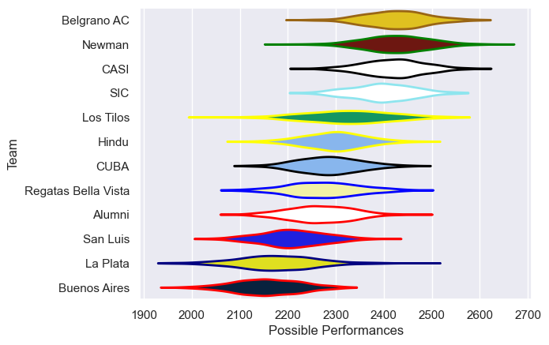

---  
title: "URBA Top 13 2025 Status"  
date: 2025-07-28 6:00:00 -0500  
categories: model review projection  
layout: article  
aside:  
    toc: true  
---
# Current Team Rankings

# Standings

## Current Standings

| Club                |   Played |   Wins |   Point Differential |   Losing Bonus Points |   Try Bonus Points |   Competition Points |
|:--------------------|---------:|-------:|---------------------:|----------------------:|-------------------:|---------------------:|
| CASI                |       14 |     12 |                  211 |                     1 |                  6 |                   55 |
| Belgrano AC         |       14 |     13 |                  177 |                     1 |                    |                   53 |
| SIC                 |       14 |      9 |                   49 |                     3 |                  5 |                   44 |
| Newman              |       14 |      9 |                   30 |                     3 |                  4 |                   43 |
| Los Tilos           |       14 |      8 |                   18 |                     3 |                  5 |                   42 |
| Alumni              |       14 |      7 |                  -17 |                     3 |                  5 |                   36 |
| CUBA                |       14 |      6 |                  -18 |                     5 |                  4 |                   33 |
| Regatas Bella Vista |       14 |      6 |                  -17 |                     3 |                  3 |                   30 |
| Hindu               |       14 |      6 |                   38 |                     5 |                    |                   29 |
| La Plata            |       14 |      3 |                 -136 |                     7 |                  1 |                   20 |
| Buenos Aires        |       14 |      3 |                 -120 |                     4 |                    |                   16 |
| San Luis            |       14 |      1 |                 -215 |                     3 |                  1 |                   10 |

## Projected Remaining Table

| Club                |   To Play |   Projected Wins |   Projected Differential |   Projected Losing Bonus Points | Projected Try Bonus Points   |   Projected Competition Points |
|:--------------------|----------:|-----------------:|-------------------------:|--------------------------------:|:-----------------------------|-------------------------------:|
| Belgrano AC         |         9 |            5.96  |                   43.033 |                           1.537 |                              |                         26.125 |
| CASI                |         9 |            5.51  |                   31.853 |                           1.779 |                              |                         24.569 |
| SIC                 |         9 |            5.015 |                   17.858 |                           1.997 |                              |                         22.855 |
| Newman              |         9 |            4.741 |                   12.864 |                           2.064 |                              |                         21.948 |
| Los Tilos           |         9 |            4.354 |                    1.882 |                           2.187 |                              |                         20.421 |
| Regatas Bella Vista |         9 |            4.295 |                   -0.973 |                           2.247 |                              |                         20.255 |
| CUBA                |         9 |            4.24  |                   -0.739 |                           2.173 |                              |                         19.995 |
| Alumni              |         9 |            4.146 |                   -5.022 |                           2.119 |                              |                         19.511 |
| Hindu               |         9 |            3.967 |                   -7.991 |                           2.288 |                              |                         19.018 |
| La Plata            |         9 |            3.613 |                  -17.993 |                           2.279 |                              |                         17.573 |
| Buenos Aires        |         9 |            2.907 |                  -31.493 |                           2.515 |                              |                         14.953 |
| San Luis            |         9 |            2.811 |                  -43.279 |                           2.191 |                              |                         14.153 |

## Projected Total Table

| Club                |   Played |   Wins |   Point Differential |   Losing Bonus Points |   Try Bonus Points |   Competition Points |
|:--------------------|---------:|-------:|---------------------:|----------------------:|-------------------:|---------------------:|
| CASI                |       23 | 17.51  |              242.853 |                 2.779 |                  6 |               79.569 |
| Belgrano AC         |       23 | 18.96  |              220.033 |                 2.537 |                    |               79.125 |
| SIC                 |       23 | 14.015 |               66.858 |                 4.997 |                  5 |               66.855 |
| Newman              |       23 | 13.741 |               42.864 |                 5.064 |                  4 |               64.948 |
| Los Tilos           |       23 | 12.354 |               19.882 |                 5.187 |                  5 |               62.421 |
| Alumni              |       23 | 11.146 |              -22.022 |                 5.119 |                  5 |               55.511 |
| CUBA                |       23 | 10.24  |              -18.739 |                 7.173 |                  4 |               52.995 |
| Regatas Bella Vista |       23 | 10.295 |              -17.973 |                 5.247 |                  3 |               50.255 |
| Hindu               |       23 |  9.967 |               30.009 |                 7.288 |                    |               48.018 |
| La Plata            |       23 |  6.613 |             -153.993 |                 9.279 |                  1 |               37.573 |
| Buenos Aires        |       23 |  5.907 |             -151.493 |                 6.515 |                    |               30.953 |
| San Luis            |       23 |  3.811 |             -258.279 |                 5.191 |                  1 |               24.153 |

# Completed Match Review

| Model | Percent Correct Predictions | Spread Error |
| ------ | ------ | ------ |
| Club Level | 71.0% | 10.0 |
| Player Level: Lineup | nan% | nan |
| Player Level: Minutes | nan% | nan |

# Future Predictions

## Week 15

### San Luis V La Plata on 2025/08/02

Average Margin: La Plata by 0.0

### SIC V Hindu on 2025/08/02

Average Margin: SIC by 3.4

### Los Tilos V Newman on 2025/08/02

Average Margin: Los Tilos by 0.9

### Belgrano AC V Alumni on 2025/08/02

Average Margin: Belgrano AC by 7.1

### CASI V CUBA on 2025/08/02

Average Margin: CASI by 6.3

### Regatas Bella Vista V Buenos Aires on 2025/08/02

Average Margin: Regatas Bella Vista by 4.4

## Week 16

### Buenos Aires V SIC on 2025/08/09

Average Margin: SIC by 2.8

### Hindu V Los Tilos on 2025/08/09

Average Margin: Hindu by 2.4

### Alumni V Newman on 2025/08/09

Average Margin: Alumni by 0.1

### CUBA V San Luis on 2025/08/09

Average Margin: CUBA by 7.0

### La Plata V Regatas Bella Vista on 2025/08/09

Average Margin: Regatas Bella Vista by 0.5

### Belgrano AC V CASI on 2025/08/09

Average Margin: Belgrano AC by 2.6

## Week 17

### Regatas Bella Vista V CUBA on 2025/08/16

Average Margin: Regatas Bella Vista by 2.2

### SIC V La Plata on 2025/08/16

Average Margin: SIC by 6.3

### Los Tilos V Buenos Aires on 2025/08/16

Average Margin: Los Tilos by 5.9

### Newman V Hindu on 2025/08/16

Average Margin: Newman by 3.7

### San Luis V Belgrano AC on 2025/08/16

Average Margin: Belgrano AC by 7.7

### CASI V Alumni on 2025/08/16

Average Margin: CASI by 5.8

## Week 18

### La Plata V Los Tilos on 2025/08/30

Average Margin: La Plata by 0.5

### CASI V San Luis on 2025/08/30

Average Margin: CASI by 10.3

### CUBA V SIC on 2025/08/30

Average Margin: CUBA by 0.2

### Alumni V Hindu on 2025/08/30

Average Margin: Alumni by 2.1

### Belgrano AC V Regatas Bella Vista on 2025/08/30

Average Margin: Belgrano AC by 7.4

### Buenos Aires V Newman on 2025/08/30

Average Margin: Newman by 2.5

## Week 19

### SIC V Belgrano AC on 2025/09/06

Average Margin: Belgrano AC by 0.6

### Regatas Bella Vista V CASI on 2025/09/06

Average Margin: CASI by 1.6

### Newman V La Plata on 2025/09/06

Average Margin: Newman by 5.6

### San Luis V Alumni on 2025/09/06

Average Margin: Alumni by 1.5

### Los Tilos V CUBA on 2025/09/06

Average Margin: Los Tilos by 2.6

### Hindu V Buenos Aires on 2025/09/06

Average Margin: Hindu by 4.1

## Week 20

### Alumni V Buenos Aires on 2025/09/13

Average Margin: Alumni by 5.1

### La Plata V Hindu on 2025/09/13

Average Margin: Hindu by 0.2

### CUBA V Newman on 2025/09/13

Average Margin: CUBA by 0.4

### San Luis V Regatas Bella Vista on 2025/09/13

Average Margin: Regatas Bella Vista by 1.4

### Belgrano AC V Los Tilos on 2025/09/13

Average Margin: Belgrano AC by 6.9

### CASI V SIC on 2025/09/13

Average Margin: CASI by 3.8

## Week 21

### Buenos Aires V La Plata on 2025/09/27

Average Margin: Buenos Aires by 2.3

### Los Tilos V CASI on 2025/09/27

Average Margin: CASI by 1.1

### Hindu V CUBA on 2025/09/27

Average Margin: Hindu by 2.1

### SIC V San Luis on 2025/09/27

Average Margin: SIC by 7.5

### Newman V Belgrano AC on 2025/09/27

Average Margin: Belgrano AC by 0.5

### Regatas Bella Vista V Alumni on 2025/09/27

Average Margin: Regatas Bella Vista by 1.6

## Week 22

### CUBA V Buenos Aires on 2025/10/04

Average Margin: CUBA by 5.1

### Belgrano AC V Hindu on 2025/10/04

Average Margin: Belgrano AC by 6.3

### CASI V Newman on 2025/10/04

Average Margin: CASI by 4.2

### San Luis V Los Tilos on 2025/10/04

Average Margin: Los Tilos by 0.7

### Regatas Bella Vista V SIC on 2025/10/04

Average Margin: Regatas Bella Vista by 0.5

### Alumni V La Plata on 2025/10/04

Average Margin: Alumni by 3.7

## Week 23

### Buenos Aires V Belgrano AC on 2025/10/11

Average Margin: Belgrano AC by 4.0

### Newman V San Luis on 2025/10/11

Average Margin: Newman by 7.2

### Hindu V CASI on 2025/10/11

Average Margin: CASI by 1.2

### SIC V Alumni on 2025/10/11

Average Margin: SIC by 3.0

### Los Tilos V Regatas Bella Vista on 2025/10/11

Average Margin: Los Tilos by 2.5

### La Plata V CUBA on 2025/10/11

Average Margin: La Plata by 0.1

