# Team Rankings

# Standings

## Current Standings

| Club                 |   Played |   Wins |   Point Differential |   Losing Bonus Points |   Try Bonus Points |   Competition Points |
|:---------------------|---------:|-------:|---------------------:|----------------------:|-------------------:|---------------------:|
| Hindu                |       10 |      9 |                  132 |                     1 |                    |                   37 |
| SIC                  |       10 |      8 |                  130 |                     1 |                  4 |                   37 |
| Newman               |        8 |      7 |                  129 |                     0 |                  6 |                   34 |
| CASI                 |       10 |      6 |                   72 |                     3 |                  7 |                   34 |
| Alumni               |       12 |      6 |                   19 |                     4 |                  5 |                   33 |
| Belgrano AC          |       12 |      5 |                  -59 |                     3 |                  5 |                   28 |
| Regatas Bella Vista  |        8 |      5 |                   -9 |                     1 |                  4 |                   25 |
| CUBA                 |       11 |      3 |                   18 |                     7 |                  5 |                   24 |
| La Plata             |       11 |      4 |                  -26 |                     3 |                  1 |                   20 |
| Atlético del Rosario |       12 |      4 |                  -68 |                     4 |                    |                   20 |
| Champagnat           |       10 |      4 |                  -87 |                     1 |                  2 |                   19 |
| Los Tilos            |        8 |      3 |                  -59 |                     2 |                  4 |                   18 |
| Buenos Aires         |        9 |      3 |                  -96 |                     2 |                    |                   14 |
| Los Matreros         |        9 |      3 |                  -96 |                     1 |                  1 |                   14 |

## Projected Remaining Table

| Club                 |   To Play |   Projected Wins |   Projected Differential |   Projected Losing Bonus Points |   Projected Try Bonus Points |   Projected Competition Points |
|:---------------------|----------:|-----------------:|-------------------------:|--------------------------------:|-----------------------------:|-------------------------------:|
| CASI                 |        12 |            8.227 |                   84.413 |                           2.179 |                            3 |                         38.929 |
| Newman               |        11 |            9.027 |                  119.621 |                           1.263 |                            1 |                         38.867 |
| SIC                  |        11 |            8.271 |                   96.087 |                           1.705 |                            3 |                         38.435 |
| Alumni               |        12 |            6.213 |                   22.147 |                           3.052 |                            2 |                         30.886 |
| Hindu                |        11 |            6.881 |                   43.064 |                           2.331 |                              |                         30.689 |
| Belgrano AC          |        11 |            5.676 |                    8.204 |                           2.713 |                            1 |                         27.351 |
| Los Tilos            |         9 |            5.242 |                   30.454 |                           2.148 |                            3 |                         26.848 |
| CUBA                 |        10 |            4.97  |                   12.352 |                           2.589 |                            3 |                         26.229 |
| Atlético del Rosario |        13 |            4.427 |                  -56.914 |                           2.9   |                              |                         21.436 |
| La Plata             |        10 |            3.041 |                  -55.072 |                           2.395 |                              |                         15.249 |
| Regatas Bella Vista  |         9 |            2.907 |                  -33.915 |                           2.474 |                              |                         14.724 |
| Champagnat           |        10 |            2.597 |                  -67.773 |                           2.024 |                            1 |                         13.918 |
| Los Matreros         |        12 |            2.377 |                 -145.433 |                           1.76  |                            2 |                         13.684 |
| Buenos Aires         |         9 |            2.678 |                  -57.235 |                           1.82  |                              |                         13.108 |

## Projected Total Table

| Club                 |   Played |   Wins |   Point Differential |   Losing Bonus Points |   Try Bonus Points |   Competition Points |
|:---------------------|---------:|-------:|---------------------:|----------------------:|-------------------:|---------------------:|
| SIC                  |       21 | 16.271 |              226.087 |                 2.705 |                  7 |               75.435 |
| CASI                 |       22 | 14.227 |              156.413 |                 5.179 |                 10 |               72.929 |
| Newman               |       19 | 16.027 |              248.621 |                 1.263 |                  7 |               72.867 |
| Hindu                |       21 | 15.881 |              175.064 |                 3.331 |                    |               67.689 |
| Alumni               |       24 | 12.213 |               41.147 |                 7.052 |                  7 |               63.886 |
| Belgrano AC          |       23 | 10.676 |              -50.796 |                 5.713 |                  6 |               55.351 |
| CUBA                 |       21 |  7.97  |               30.352 |                 9.589 |                  8 |               50.229 |
| Los Tilos            |       17 |  8.242 |              -28.546 |                 4.148 |                  7 |               44.848 |
| Atlético del Rosario |       25 |  8.427 |             -124.914 |                 6.9   |                    |               41.436 |
| Regatas Bella Vista  |       17 |  7.907 |              -42.915 |                 3.474 |                  4 |               39.724 |
| La Plata             |       21 |  7.041 |              -81.072 |                 5.395 |                  1 |               35.249 |
| Champagnat           |       20 |  6.597 |             -154.773 |                 3.024 |                  3 |               32.918 |
| Los Matreros         |       21 |  5.377 |             -241.433 |                 2.76  |                  3 |               27.684 |
| Buenos Aires         |       18 |  5.678 |             -153.235 |                 3.82  |                    |               27.108 |

# Completed Match Review

| Model | Percent Correct Predictions | Spread Error |
| ------ | ------ | ------ |
| Club Level | 76.6% | 8.0 |
| Player Level: Lineup | nan% | nan |
| Player Level: Minutes | nan% | nan |

# Future Predictions

## Week 13

### Los Tilos V CUBA on 2026/05/09

Average Margin: Los Tilos by 4.9

### Regatas Bella Vista V Belgrano AC on 2026/05/09

Average Margin: Regatas Bella Vista by 3.4

### Hindu V Newman on 2026/05/09

Average Margin: Hindu by 1.8

### La Plata V SIC on 2026/05/09

Average Margin: SIC by 11.1

### Atlético del Rosario V Buenos Aires on 2026/05/09

Average Margin: Atlético del Rosario by 4.7

### Champagnat V Alumni on 2026/05/09

Average Margin: Alumni by 0.6

### Los Matreros V CASI on 2026/05/09

Average Margin: CASI by 9.9

## Week 14

### Alumni V Hindu on 2026/05/16

Average Margin: Hindu by 2.3

### Champagnat V Los Matreros on 2026/05/16

Average Margin: Champagnat by 9.7

### Buenos Aires V Los Tilos on 2026/05/16

Average Margin: Los Tilos by 1.4

### SIC V Regatas Bella Vista on 2026/05/16

Average Margin: SIC by 10.6

### Belgrano AC V Atlético del Rosario on 2026/05/16

Average Margin: Belgrano AC by 8.5

### Newman V La Plata on 2026/05/16

Average Margin: Newman by 19.4

### CUBA V CASI on 2026/05/16

Average Margin: CASI by 2.4

## Week 15

### La Plata V Alumni on 2026/05/23

Average Margin: Alumni by 3.6

### Los Tilos V Belgrano AC on 2026/05/23

Average Margin: Los Tilos by 4.1

### Hindu V Champagnat on 2026/05/23

Average Margin: Hindu by 14.0

### Atlético del Rosario V SIC on 2026/05/23

Average Margin: SIC by 8.5

### Regatas Bella Vista V Newman on 2026/05/23

Average Margin: Newman by 5.1

### Los Matreros V CUBA on 2026/05/23

Average Margin: CUBA by 2.3

### CASI V Buenos Aires on 2026/05/23

Average Margin: CASI by 14.2

## Week 16

### Hindu V Los Tilos on 2026/07/04

Average Margin: Hindu by 3.5

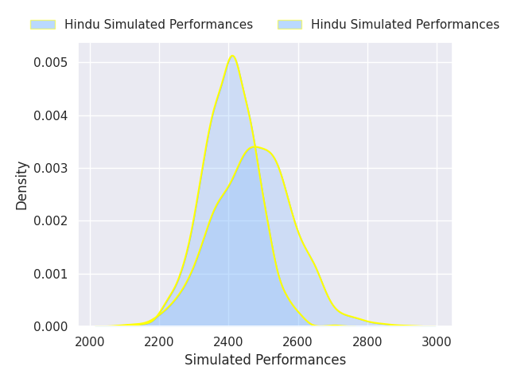

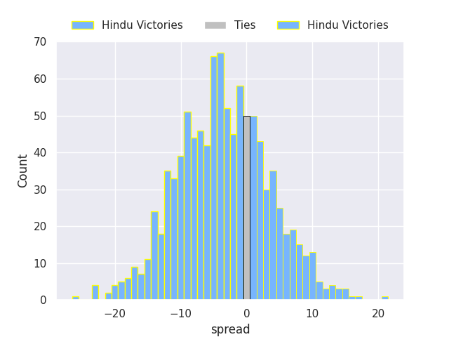

### Los Matreros V Regatas Bella Vista on 2026/07/04

Average Margin: Los Matreros by 5.1

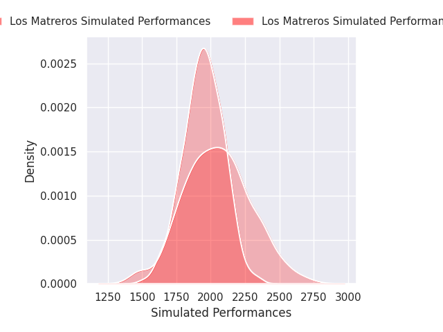

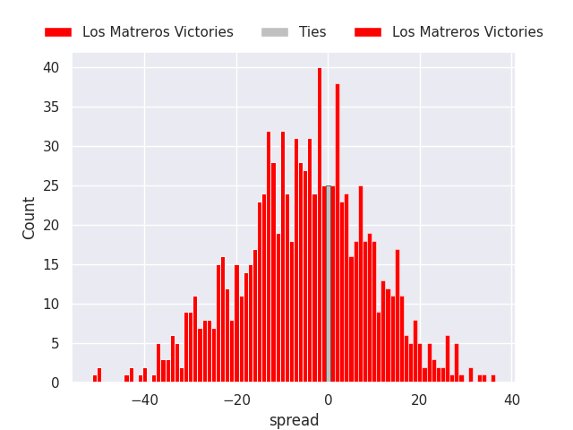

### Atlético del Rosario V La Plata on 2026/07/04

Average Margin: Atlético del Rosario by 4.3

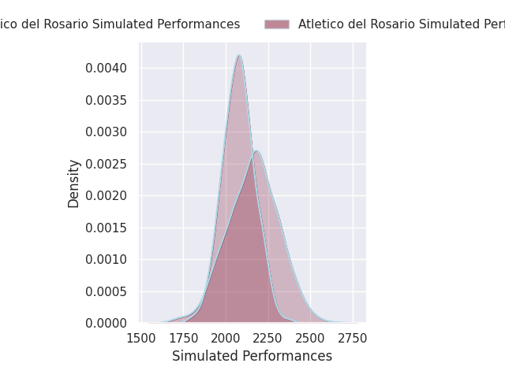
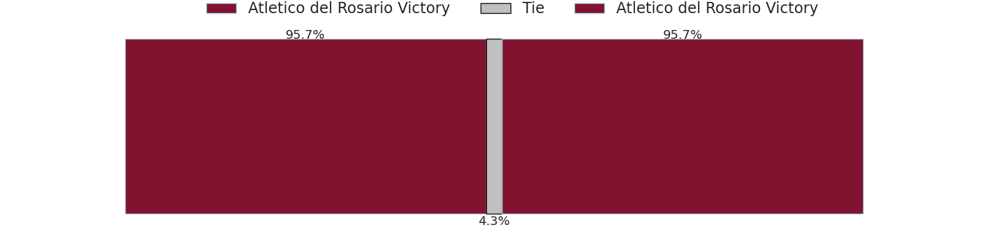
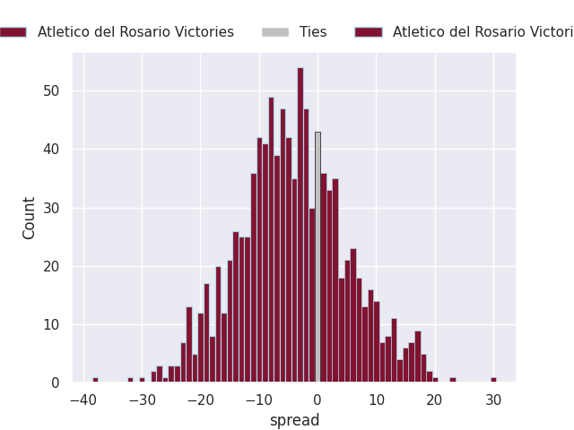

### Alumni V CUBA on 2026/07/04

Average Margin: Alumni by 4.3

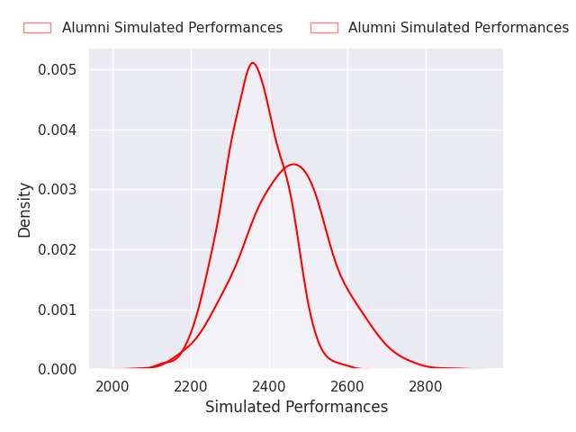

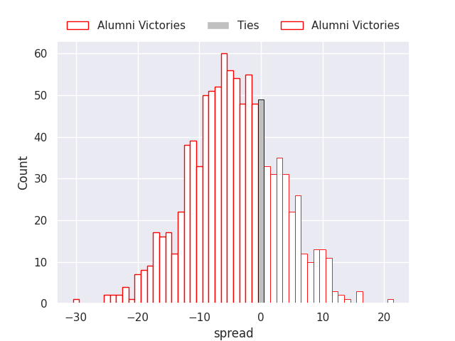

### CASI V Champagnat on 2026/07/04

Average Margin: CASI by 3.1

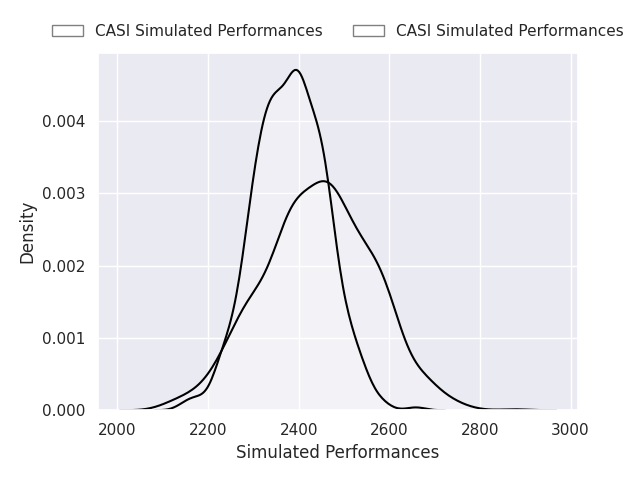

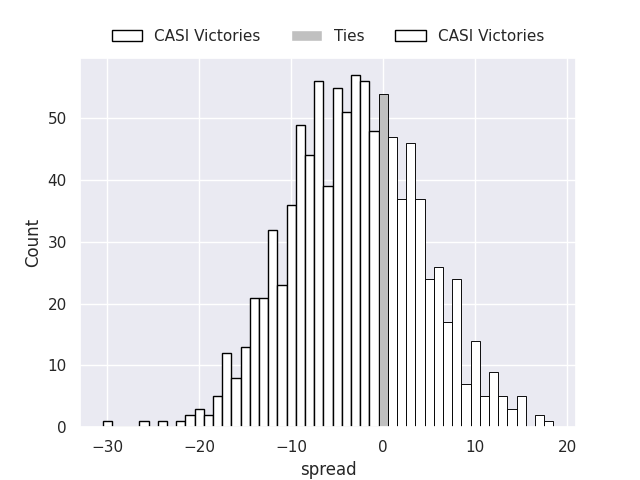

### Newman V Buenos Aires on 2026/07/04

Average Margin: Newman by 20.4

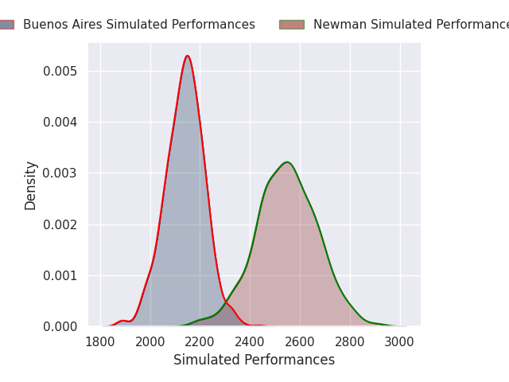
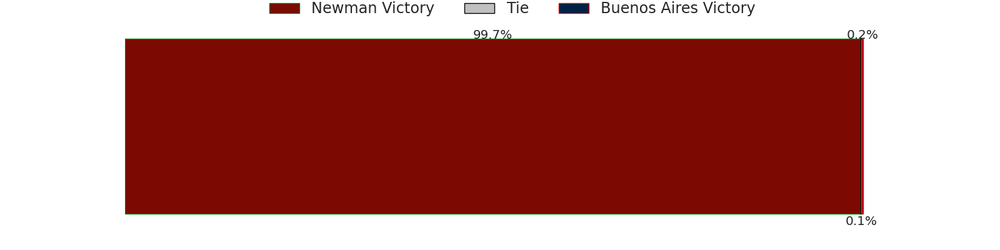
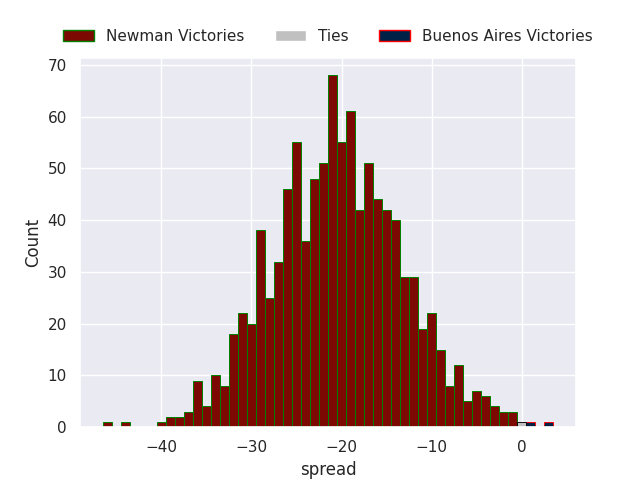

### Belgrano AC V SIC on 2026/07/04

Average Margin: SIC by 1.7

## Week 17

### Atlético del Rosario V Regatas Bella Vista on 2026/07/11

Average Margin: Atlético del Rosario by 4.0

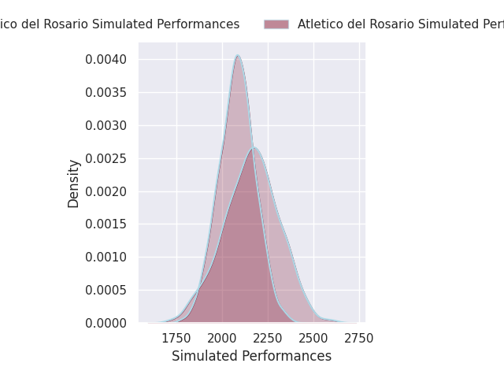
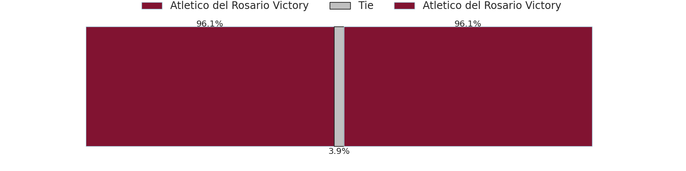
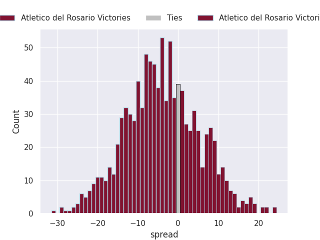

### Newman V Belgrano AC on 2026/07/11

Average Margin: Newman by 11.9

### La Plata V Los Tilos on 2026/07/11

Average Margin: La Plata by 3.6

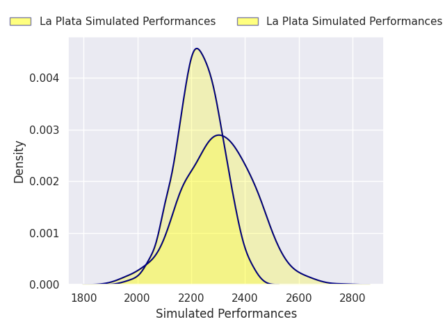

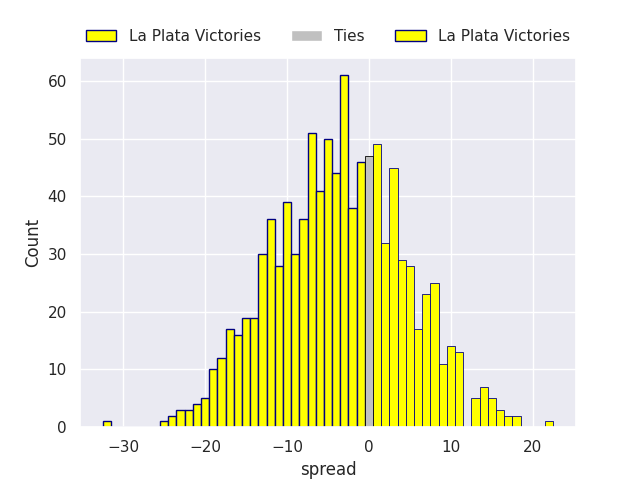

### CASI V Hindu on 2026/07/11

Average Margin: CASI by 3.4

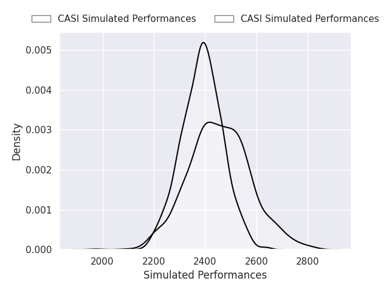

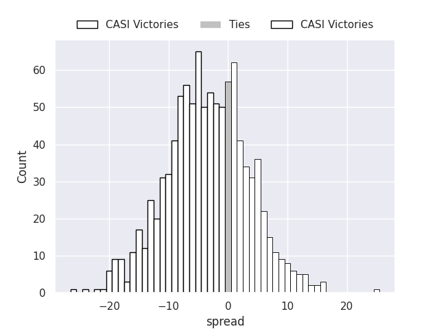

### Alumni V Buenos Aires on 2026/07/11

Average Margin: Alumni by 4.2

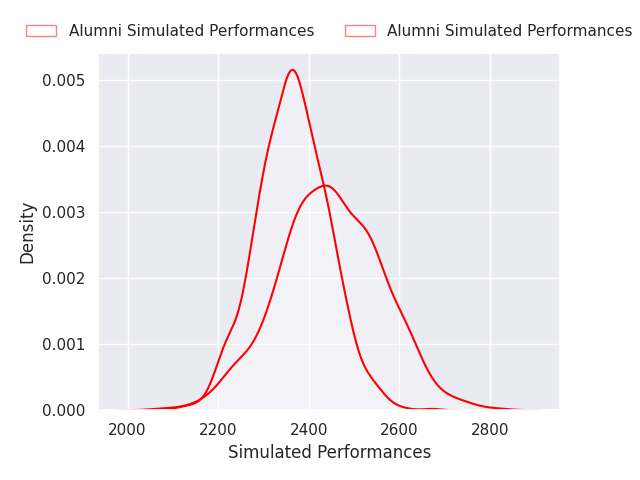

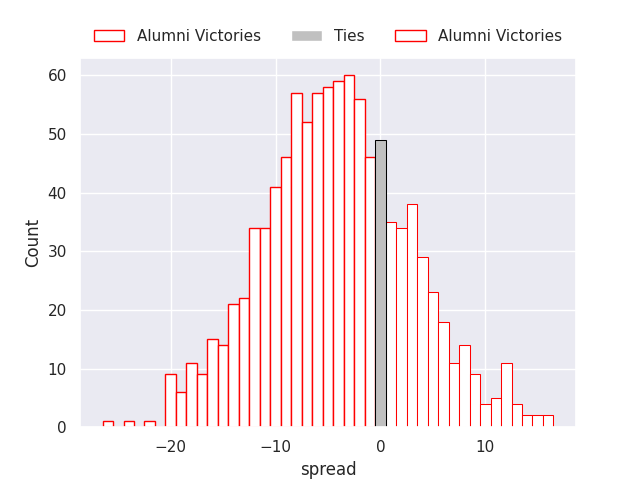

### Champagnat V CUBA on 2026/07/11

Average Margin: CUBA by 0.7

### Los Matreros V SIC on 2026/07/11

Average Margin: SIC by 18.1

## Week 18

### Belgrano AC V Alumni on 2026/07/18

Average Margin: Belgrano AC by 1.5

### CUBA V Hindu on 2026/07/18

Average Margin: Hindu by 4.9

### SIC V Newman on 2026/07/18

Average Margin: SIC by 0.1

### Los Tilos V Regatas Bella Vista on 2026/07/18

Average Margin: Los Tilos by 5.1

### CASI V La Plata on 2026/07/18

Average Margin: CASI by 11.4

### Atlético del Rosario V Los Matreros on 2026/07/18

Average Margin: Atlético del Rosario by 10.5

### Buenos Aires V Champagnat on 2026/07/18

Average Margin: Buenos Aires by 3.3

## Week 19

### Atlético del Rosario V Los Tilos on 2026/08/01

Average Margin: Los Tilos by 5.7

### Los Matreros V Newman on 2026/08/01

Average Margin: Newman by 20.3

### La Plata V CUBA on 2026/08/01

Average Margin: La Plata by 3.3

### Hindu V Buenos Aires on 2026/08/01

Average Margin: Hindu by 16.3

### Champagnat V Belgrano AC on 2026/08/01

Average Margin: Belgrano AC by 5.8

### Alumni V SIC on 2026/08/01

Average Margin: Alumni by 1.0

### Regatas Bella Vista V CASI on 2026/08/01

Average Margin: CASI by 2.6

## Week 20

### SIC V Champagnat on 2026/08/15

Average Margin: SIC by 16.5

### Newman V Alumni on 2026/08/15

Average Margin: Newman by 9.5

### CASI V Atlético del Rosario on 2026/08/15

Average Margin: CASI by 18.7

### Buenos Aires V La Plata on 2026/08/15

Average Margin: La Plata by 1.2

### CUBA V Regatas Bella Vista on 2026/08/15

Average Margin: CUBA by 2.4

### Belgrano AC V Hindu on 2026/08/15

Average Margin: Hindu by 0.6

### Los Tilos V Los Matreros on 2026/08/15

Average Margin: Los Tilos by 19.2

## Week 21

### Atlético del Rosario V CUBA on 2026/08/22

Average Margin: CUBA by 3.9

### La Plata V Belgrano AC on 2026/08/22

Average Margin: Belgrano AC by 1.1

### Regatas Bella Vista V Buenos Aires on 2026/08/22

Average Margin: Regatas Bella Vista by 9.1

### Los Tilos V CASI on 2026/08/22

Average Margin: CASI by 1.2

### Los Matreros V Alumni on 2026/08/22

Average Margin: Alumni by 15.0

### Champagnat V Newman on 2026/08/22

Average Margin: Newman by 12.7

### Hindu V SIC on 2026/08/22

Average Margin: Hindu by 2.4

## Week 22

### CASI V Los Matreros on 2026/08/29

Average Margin: CASI by 24.1

### Newman V Hindu on 2026/08/29

Average Margin: Newman by 7.9

### Alumni V Champagnat on 2026/08/29

Average Margin: Alumni by 15.3

### Belgrano AC V Regatas Bella Vista on 2026/08/29

Average Margin: Belgrano AC by 6.4

### Buenos Aires V Atlético del Rosario on 2026/08/29

Average Margin: Buenos Aires by 6.8

### SIC V La Plata on 2026/08/29

Average Margin: SIC by 12.8

### CUBA V Los Tilos on 2026/08/29

Average Margin: CUBA by 2.2

## Week 23

### Newman V Regatas Bella Vista on 2026/09/12

Average Margin: Newman by 14.3

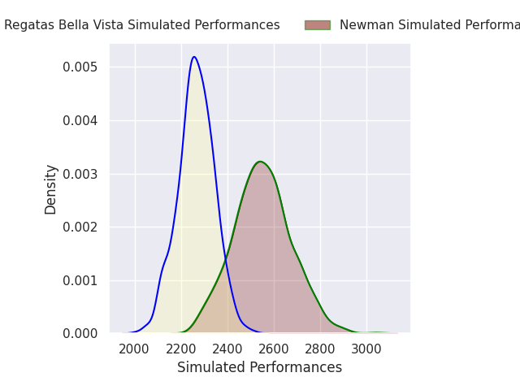
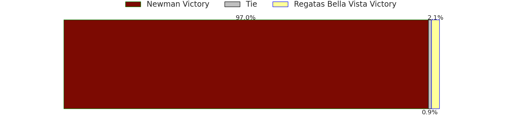
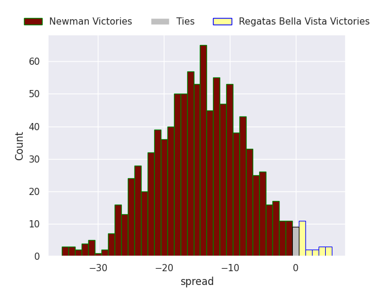

### Belgrano AC V Los Tilos on 2026/09/12

Average Margin: Belgrano AC by 6.6

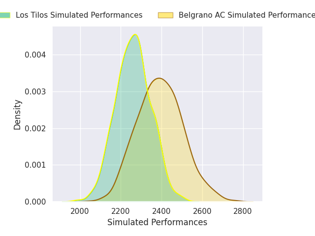
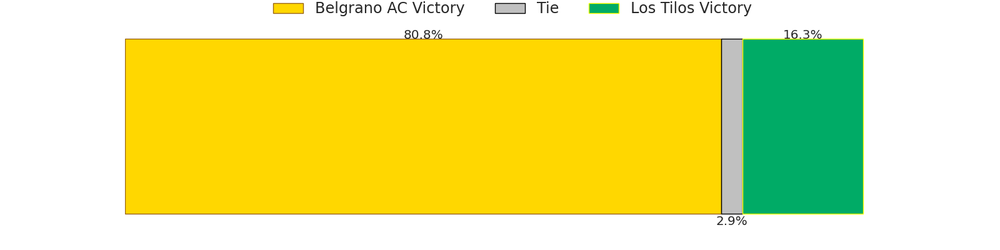
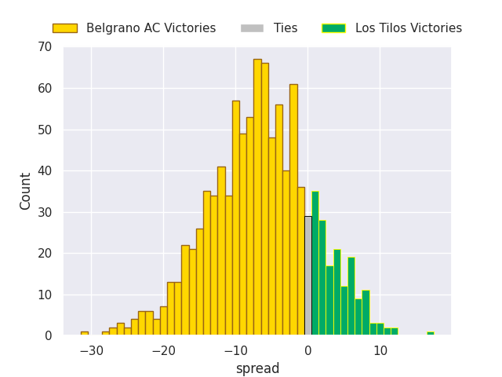

### SIC V Atlético del Rosario on 2026/09/12

Average Margin: SIC by 20.0

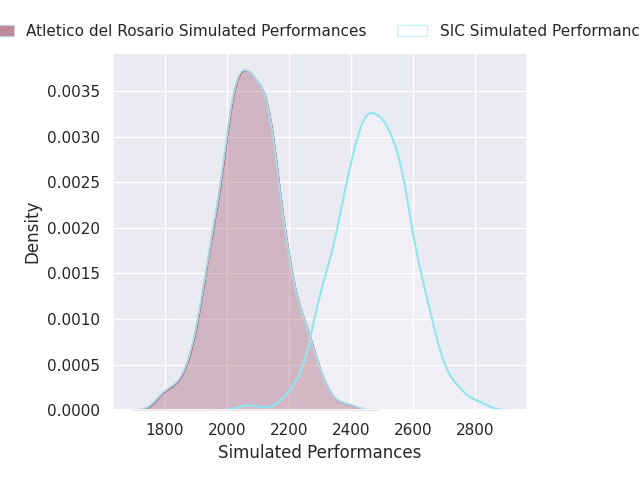
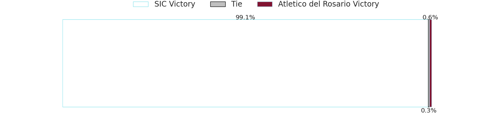
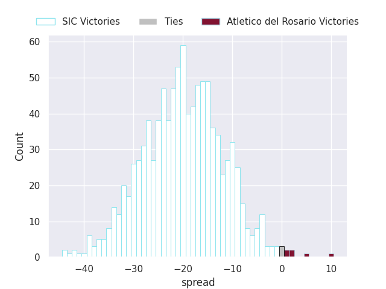

### CUBA V Los Matreros on 2026/09/12

Average Margin: CUBA by 16.4

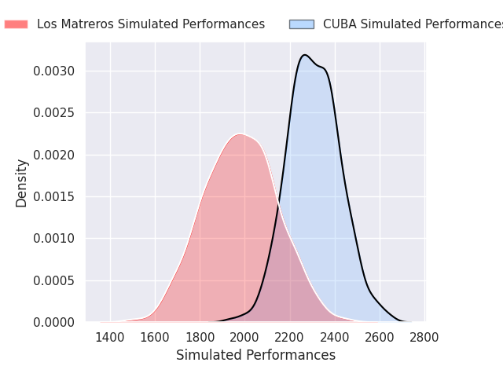
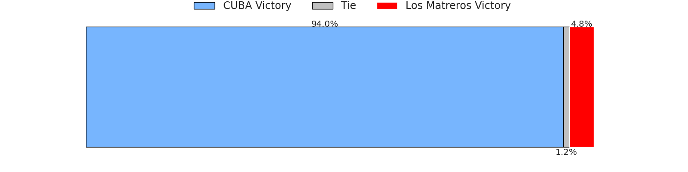
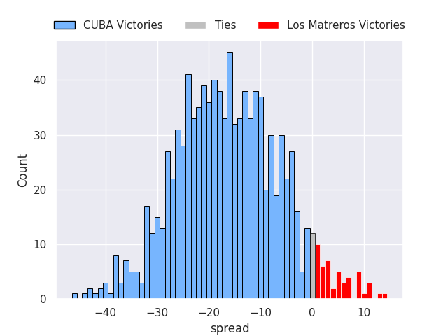

### Champagnat V Hindu on 2026/09/12

Average Margin: Hindu by 8.6

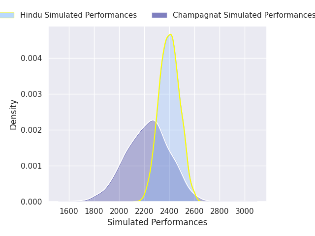

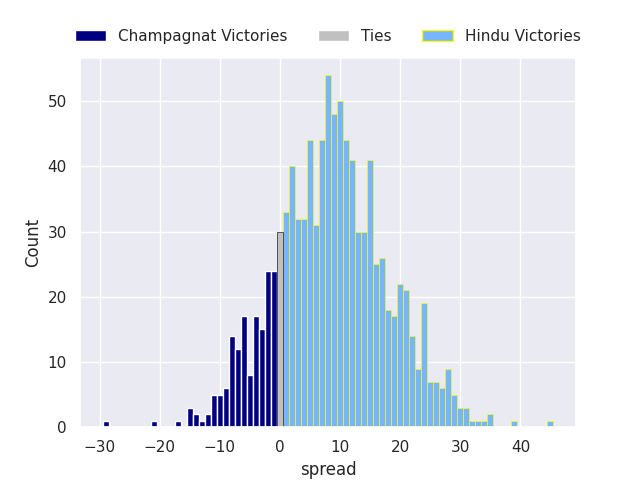

