# Team Rankings

# Standings

## Current Standings

| Club                 |   Played |   Wins |   Point Differential |   Losing Bonus Points |   Try Bonus Points |   Competition Points |
|:---------------------|---------:|-------:|---------------------:|----------------------:|-------------------:|---------------------:|
| Hindu                |       10 |      9 |                  132 |                     1 |                    |                   37 |
| Newman               |        8 |      7 |                  129 |                     0 |                  6 |                   34 |
| CASI                 |       10 |      6 |                   72 |                     3 |                  7 |                   34 |
| SIC                  |        9 |      7 |                  106 |                     1 |                  3 |                   32 |
| Alumni               |       10 |      5 |                   19 |                     3 |                  5 |                   28 |
| Regatas Bella Vista  |        8 |      5 |                   -9 |                     1 |                  4 |                   25 |
| Belgrano AC          |       10 |      4 |                  -59 |                     2 |                  4 |                   22 |
| CUBA                 |        9 |      2 |                   18 |                     6 |                  4 |                   18 |
| Los Tilos            |        8 |      3 |                  -59 |                     2 |                  4 |                   18 |
| La Plata             |        9 |      3 |                  -26 |                     3 |                    |                   15 |
| Atlético del Rosario |       10 |      3 |                  -68 |                     3 |                    |                   15 |
| Buenos Aires         |        8 |      3 |                  -72 |                     2 |                    |                   14 |
| Los Matreros         |        9 |      3 |                  -96 |                     1 |                  1 |                   14 |
| Champagnat           |        8 |      3 |                  -87 |                     0 |                  1 |                   13 |

## Projected Remaining Table

| Club                 |   To Play |   Projected Wins |   Projected Differential |   Projected Losing Bonus Points |   Projected Try Bonus Points |   Projected Competition Points |
|:---------------------|----------:|-----------------:|-------------------------:|--------------------------------:|-----------------------------:|-------------------------------:|
| SIC                  |        11 |            8.151 |                   86.618 |                           1.738 |                            3 |                         37.934 |
| CASI                 |        10 |            7.634 |                   97.679 |                           1.302 |                            3 |                         35.346 |
| Newman               |        10 |            7.947 |                   96.565 |                           1.304 |                            1 |                         34.606 |
| Alumni               |        12 |            6.931 |                   39.653 |                           2.725 |                            2 |                         33.229 |
| CUBA                 |        12 |            5.925 |                    6.747 |                           3.361 |                            3 |                         31.213 |
| Los Tilos            |        10 |            5.777 |                   31.513 |                           2.44  |                            3 |                         29.404 |
| Belgrano AC          |        12 |            5.994 |                    4.963 |                           3.157 |                            1 |                         29.149 |
| Hindu                |        10 |            6.283 |                   40.41  |                           2.198 |                              |                         28.106 |
| Regatas Bella Vista  |        10 |            4.741 |                    9.729 |                           2.423 |                              |                         22.029 |
| Atlético del Rosario |        12 |            4.007 |                  -48.765 |                           2.875 |                              |                         19.693 |
| La Plata             |        12 |            3.453 |                  -69.299 |                           3.097 |                              |                         17.725 |
| Champagnat           |        12 |            3.277 |                  -81.771 |                           2.285 |                            1 |                         16.951 |
| Buenos Aires         |        11 |            3.013 |                  -68.972 |                           2.354 |                              |                         14.982 |
| Los Matreros         |        10 |            1.407 |                 -145.07  |                           1.311 |                            2 |                          9.203 |

## Projected Total Table

| Club                 |   Played |   Wins |   Point Differential |   Losing Bonus Points |   Try Bonus Points |   Competition Points |
|:---------------------|---------:|-------:|---------------------:|----------------------:|-------------------:|---------------------:|
| SIC                  |       20 | 15.151 |              192.618 |                 2.738 |                  6 |               69.934 |
| CASI                 |       20 | 13.634 |              169.679 |                 4.302 |                 10 |               69.346 |
| Newman               |       18 | 14.947 |              225.565 |                 1.304 |                  7 |               68.606 |
| Hindu                |       20 | 15.283 |              172.41  |                 3.198 |                    |               65.106 |
| Alumni               |       22 | 11.931 |               58.653 |                 5.725 |                  7 |               61.229 |
| Belgrano AC          |       22 |  9.994 |              -54.037 |                 5.157 |                  5 |               51.149 |
| CUBA                 |       21 |  7.925 |               24.747 |                 9.361 |                  7 |               49.213 |
| Los Tilos            |       18 |  8.777 |              -27.487 |                 4.44  |                  7 |               47.404 |
| Regatas Bella Vista  |       18 |  9.741 |                0.729 |                 3.423 |                  4 |               47.029 |
| Atlético del Rosario |       22 |  7.007 |             -116.765 |                 5.875 |                    |               34.693 |
| La Plata             |       21 |  6.453 |              -95.299 |                 6.097 |                    |               32.725 |
| Champagnat           |       20 |  6.277 |             -168.771 |                 2.285 |                  2 |               29.951 |
| Buenos Aires         |       19 |  6.013 |             -140.972 |                 4.354 |                    |               28.982 |
| Los Matreros         |       19 |  4.407 |             -241.07  |                 2.311 |                  3 |               23.203 |

# Completed Match Review

| Model | Percent Correct Predictions | Spread Error |
| ------ | ------ | ------ |
| Club Level | 74.3% | 8.3 |
| Player Level: Lineup | nan% | nan |
| Player Level: Minutes | nan% | nan |

# Future Predictions

## Week 11

### Los Tilos V CUBA on 2026/05/09

Average Margin: Los Tilos by 4.8

### La Plata V SIC on 2026/05/09

Average Margin: SIC by 11.0

### Champagnat V Alumni on 2026/05/09

Average Margin: Alumni by 1.0

### Los Matreros V CASI on 2026/05/09

Average Margin: CASI by 9.8

### Hindu V Newman on 2026/05/09

Average Margin: Hindu by 1.9

### Atlético del Rosario V Buenos Aires on 2026/05/09

Average Margin: Atlético del Rosario by 5.2

### Regatas Bella Vista V Belgrano AC on 2026/05/09

Average Margin: Regatas Bella Vista by 4.0

## Week 12

### Alumni V Hindu on 2026/05/16

Average Margin: Hindu by 1.9

### Champagnat V Los Matreros on 2026/05/16

Average Margin: Champagnat by 9.3

### Belgrano AC V Atlético del Rosario on 2026/05/16

Average Margin: Belgrano AC by 8.3

### Newman V La Plata on 2026/05/16

Average Margin: Newman by 19.5

### SIC V Regatas Bella Vista on 2026/05/16

Average Margin: SIC by 10.6

### CUBA V CASI on 2026/05/16

Average Margin: CASI by 2.4

### Buenos Aires V Los Tilos on 2026/05/16

Average Margin: Los Tilos by 0.7

## Week 13

### Regatas Bella Vista V Newman on 2026/05/23

Average Margin: Newman by 5.1

### Los Tilos V Belgrano AC on 2026/05/23

Average Margin: Los Tilos by 3.8

### Hindu V Champagnat on 2026/05/23

Average Margin: Hindu by 14.7

### La Plata V Alumni on 2026/05/23

Average Margin: Alumni by 4.2

### Atlético del Rosario V SIC on 2026/05/23

Average Margin: SIC by 8.9

### Los Matreros V CUBA on 2026/05/23

Average Margin: CUBA by 2.6

### CASI V Buenos Aires on 2026/05/23

Average Margin: CASI by 14.4

## Week 14

### La Plata V Regatas Bella Vista on 2026/06/27

Average Margin: La Plata by 3.7

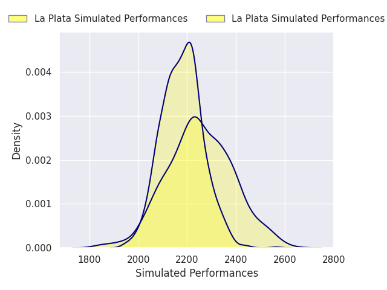

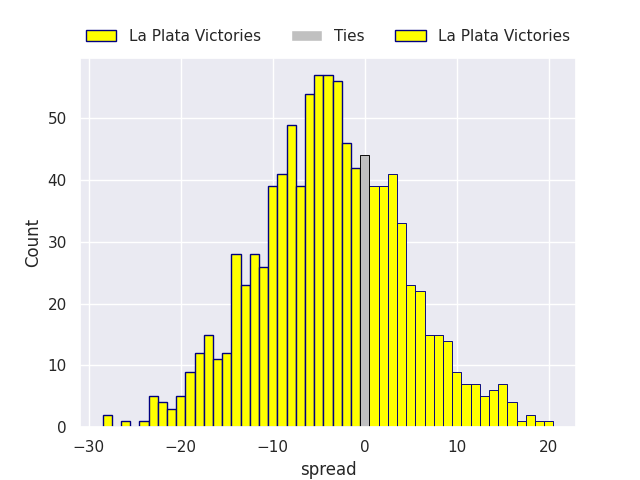

### Alumni V CASI on 2026/06/27

Average Margin: Alumni by 4.1

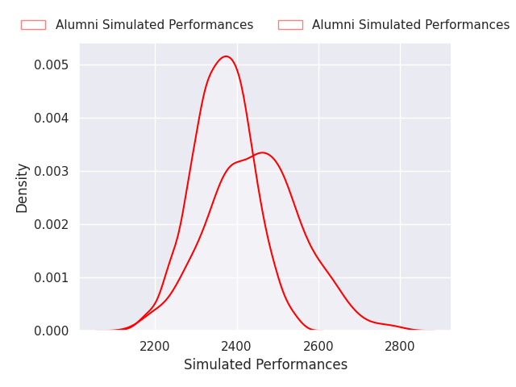

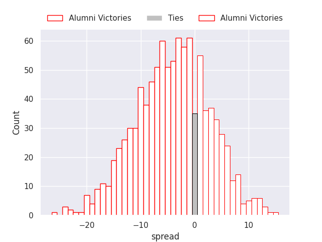

### Buenos Aires V SIC on 2026/06/27

Average Margin: SIC by 9.7

### Champagnat V Los Tilos on 2026/06/27

Average Margin: Champagnat by 3.8

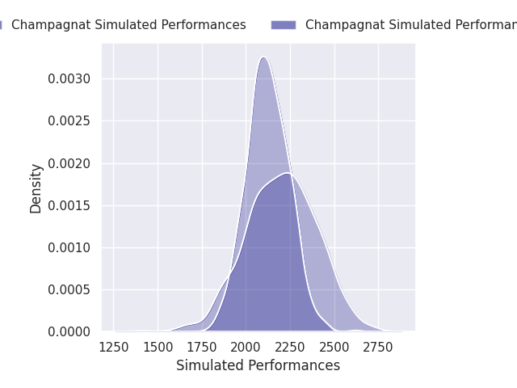

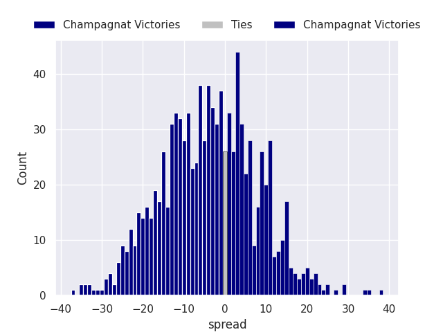

### CUBA V Newman on 2026/06/27

Average Margin: CUBA by 4.1

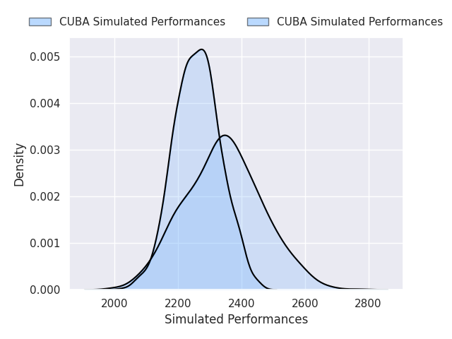

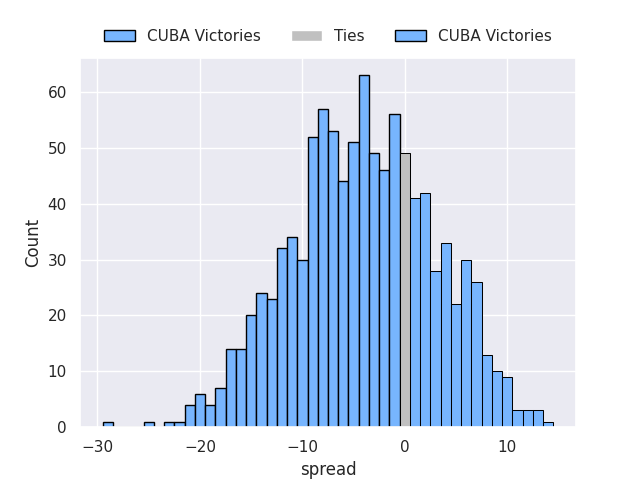

### Atlético del Rosario V Hindu on 2026/06/27

Average Margin: Atlético del Rosario by 3.2

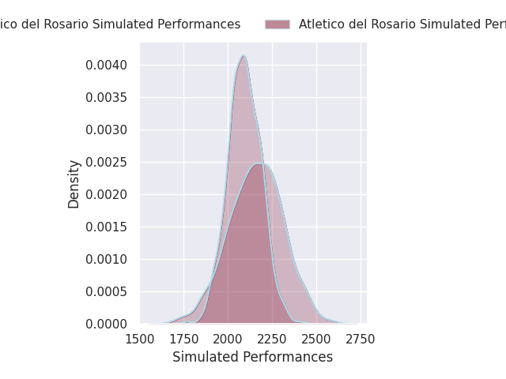

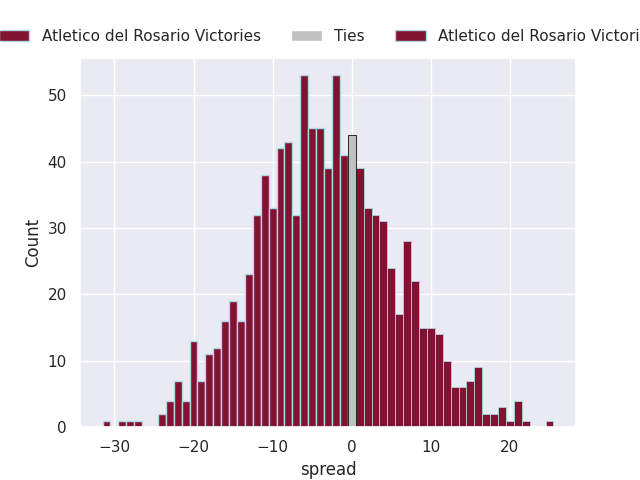

### Belgrano AC V Los Matreros on 2026/06/27

Average Margin: Belgrano AC by 3.9

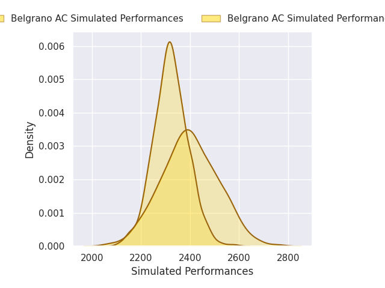

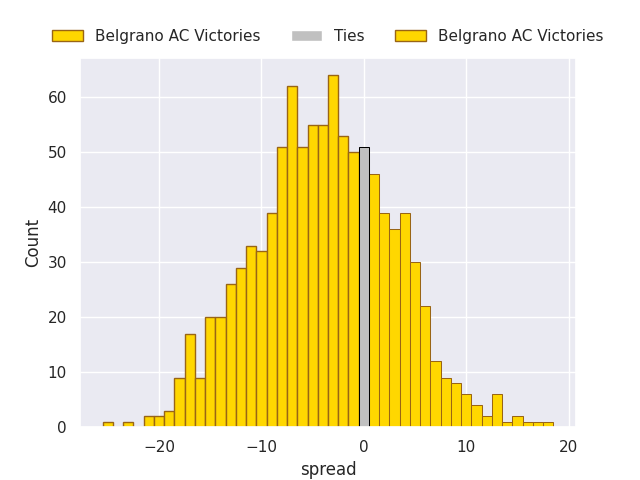

## Week 15

### Regatas Bella Vista V Los Matreros on 2026/07/04

Average Margin: Regatas Bella Vista by 18.5

### Atlético del Rosario V La Plata on 2026/07/04

Average Margin: La Plata by 0.5

### Los Tilos V Hindu on 2026/07/04

Average Margin: Hindu by 2.6

### CASI V Champagnat on 2026/07/04

Average Margin: CASI by 15.9

### CUBA V Alumni on 2026/07/04

Average Margin: Alumni by 1.0

### Buenos Aires V Newman on 2026/07/04

Average Margin: Newman by 13.2

### Belgrano AC V SIC on 2026/07/04

Average Margin: SIC by 1.3

## Week 16

### La Plata V Los Tilos on 2026/07/11

Average Margin: Los Tilos by 0.8

### Hindu V CASI on 2026/07/11

Average Margin: Hindu by 3.9

### Champagnat V CUBA on 2026/07/11

Average Margin: CUBA by 2.9

### Newman V Belgrano AC on 2026/07/11

Average Margin: Newman by 12.0

### Los Matreros V SIC on 2026/07/11

Average Margin: SIC by 17.6

### Alumni V Buenos Aires on 2026/07/11

Average Margin: Alumni by 14.7

### Regatas Bella Vista V Atlético del Rosario on 2026/07/11

Average Margin: Regatas Bella Vista by 12.3

## Week 17

### SIC V Newman on 2026/07/18

Average Margin: SIC by 0.3

### Los Tilos V Regatas Bella Vista on 2026/07/18

Average Margin: Los Tilos by 4.6

### CASI V La Plata on 2026/07/18

Average Margin: CASI by 13.7

### CUBA V Hindu on 2026/07/18

Average Margin: Hindu by 3.3

### Buenos Aires V Champagnat on 2026/07/18

Average Margin: Buenos Aires by 5.0

### Belgrano AC V Alumni on 2026/07/18

Average Margin: Belgrano AC by 2.0

### Atlético del Rosario V Los Matreros on 2026/07/18

Average Margin: Atlético del Rosario by 10.5

## Week 18

### La Plata V CUBA on 2026/08/01

Average Margin: CUBA by 0.8

### Champagnat V Belgrano AC on 2026/08/01

Average Margin: Belgrano AC by 5.9

### Hindu V Buenos Aires on 2026/08/01

Average Margin: Hindu by 16.2

### Los Matreros V Newman on 2026/08/01

Average Margin: Newman by 18.9

### Atlético del Rosario V Los Tilos on 2026/08/01

Average Margin: Los Tilos by 4.9

### Alumni V SIC on 2026/08/01

Average Margin: Alumni by 1.7

### Regatas Bella Vista V CASI on 2026/08/01

Average Margin: CASI by 2.9

## Week 19

### CUBA V Regatas Bella Vista on 2026/08/15

Average Margin: CUBA by 3.8

### CASI V Atlético del Rosario on 2026/08/15

Average Margin: CASI by 17.9

### SIC V Champagnat on 2026/08/15

Average Margin: SIC by 17.2

### Los Tilos V Los Matreros on 2026/08/15

Average Margin: Los Tilos by 19.2

### Newman V Alumni on 2026/08/15

Average Margin: Newman by 9.7

### Buenos Aires V La Plata on 2026/08/15

Average Margin: Buenos Aires by 1.8

### Belgrano AC V Hindu on 2026/08/15

Average Margin: Hindu by 0.6

## Week 20

### Los Tilos V CASI on 2026/08/22

Average Margin: CASI by 1.0

### Hindu V SIC on 2026/08/22

Average Margin: Hindu by 2.8

### La Plata V Belgrano AC on 2026/08/22

Average Margin: Belgrano AC by 3.6

### Atlético del Rosario V CUBA on 2026/08/22

Average Margin: CUBA by 4.6

### Los Matreros V Alumni on 2026/08/22

Average Margin: Alumni by 15.1

### Regatas Bella Vista V Buenos Aires on 2026/08/22

Average Margin: Regatas Bella Vista by 8.7

### Champagnat V Newman on 2026/08/22

Average Margin: Newman by 12.9

## Week 21

### SIC V La Plata on 2026/08/29

Average Margin: SIC by 14.5

### CUBA V Los Tilos on 2026/08/29

Average Margin: CUBA by 3.6

### Newman V Hindu on 2026/08/29

Average Margin: Newman by 7.4

### Buenos Aires V Atlético del Rosario on 2026/08/29

Average Margin: Buenos Aires by 6.9

### Alumni V Champagnat on 2026/08/29

Average Margin: Alumni by 15.7

### CASI V Los Matreros on 2026/08/29

Average Margin: CASI by 23.7

### Belgrano AC V Regatas Bella Vista on 2026/08/29

Average Margin: Belgrano AC by 6.6

