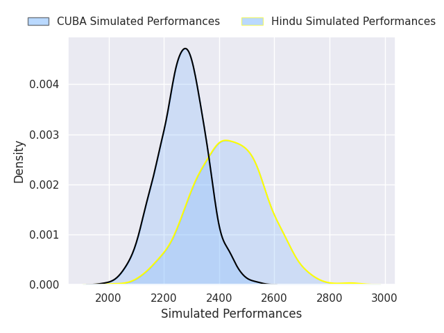
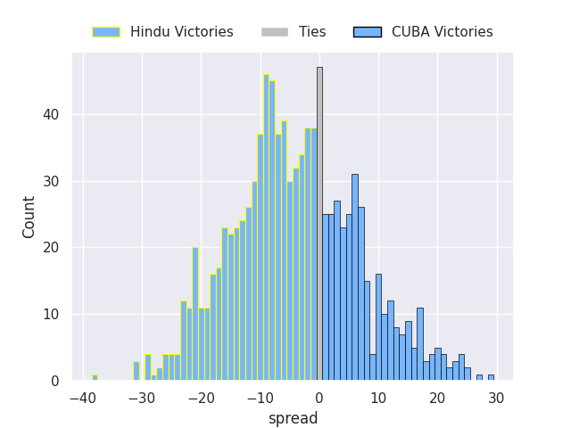
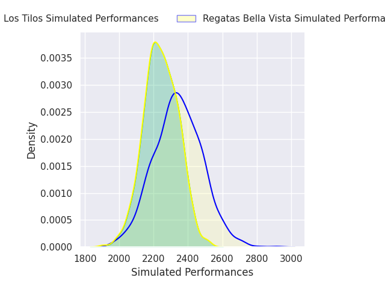
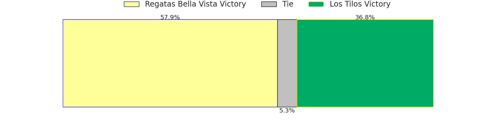
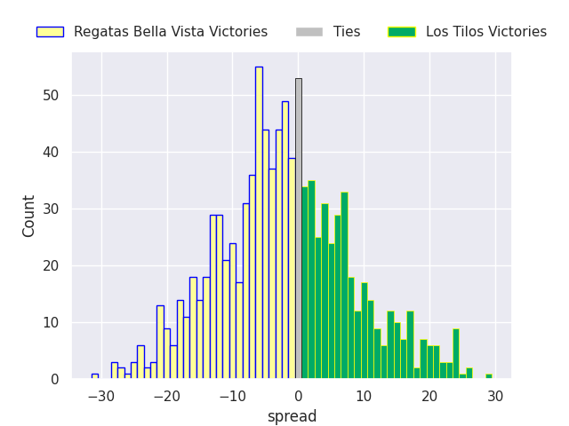
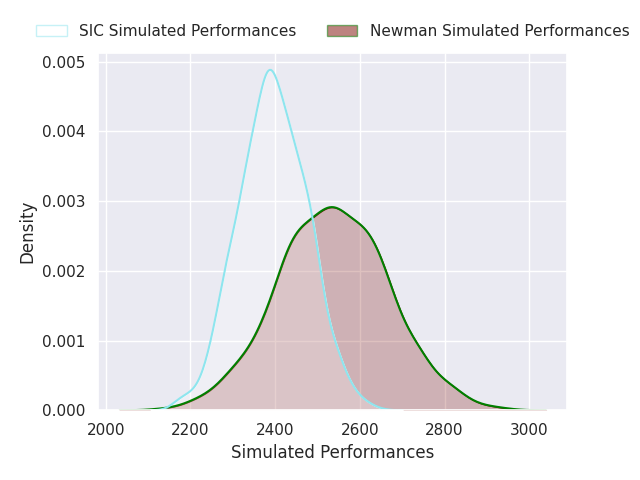
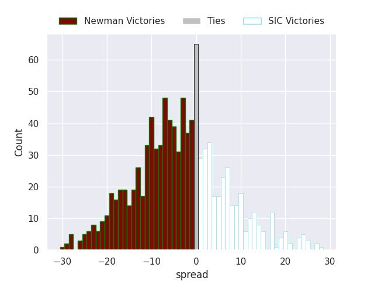
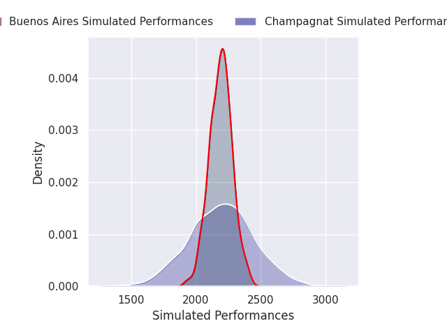
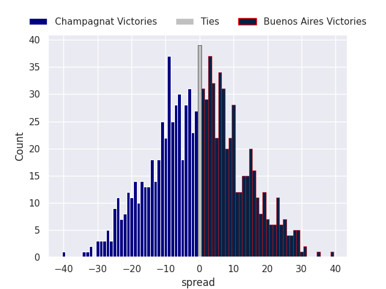

# Team Rankings

# Standings

## Current Standings

| Club                 |   Played |   Wins |   Point Differential |   Losing Bonus Points |   Try Bonus Points |   Competition Points |
|:---------------------|---------:|-------:|---------------------:|----------------------:|-------------------:|---------------------:|
| SIC                  |        2 |      2 |                   45 |                     0 |                  1 |                    9 |
| Newman               |        2 |      2 |                   36 |                     0 |                  1 |                    9 |
| Hindu                |        2 |      2 |                   37 |                     0 |                    |                    8 |
| Regatas Bella Vista  |        2 |      1 |                    6 |                     1 |                  2 |                    7 |
| CASI                 |        2 |      1 |                   21 |                     1 |                  1 |                    6 |
| Alumni               |        2 |      1 |                   -3 |                     1 |                    |                    5 |
| Los Matreros         |        2 |      1 |                   -3 |                     1 |                    |                    5 |
| Champagnat           |        2 |      1 |                  -20 |                     0 |                  1 |                    5 |
| Atlético del Rosario |        2 |      1 |                   -1 |                     0 |                    |                    4 |
| Buenos Aires         |        2 |      1 |                  -23 |                     0 |                    |                    4 |
| Los Tilos            |        2 |      1 |                  -30 |                     0 |                    |                    4 |
| CUBA                 |        2 |      0 |                   -6 |                     2 |                    |                    2 |
| La Plata             |        2 |      0 |                  -11 |                     2 |                    |                    2 |
| Belgrano AC          |        2 |      0 |                  -48 |                     0 |                    |                    0 |

## Projected Remaining Table

| Club                 |   To Play |   Projected Wins |   Projected Differential |   Projected Losing Bonus Points | Projected Try Bonus Points   |   Projected Competition Points |
|:---------------------|----------:|-----------------:|-------------------------:|--------------------------------:|:-----------------------------|-------------------------------:|
| CASI                 |         1 |            0.66  |                    4.652 |                           0.165 |                              |                          2.887 |
| Los Matreros         |         1 |            0.669 |                   10.827 |                           0.145 |                              |                          2.873 |
| Hindu                |         1 |            0.645 |                    4.134 |                           0.182 |                              |                          2.856 |
| Newman               |         1 |            0.629 |                    3.611 |                           0.178 |                              |                          2.824 |
| Regatas Bella Vista  |         1 |            0.579 |                    2.002 |                           0.211 |                              |                          2.633 |
| Alumni               |         1 |            0.526 |                    1.334 |                           0.259 |                              |                          2.459 |
| Champagnat           |         1 |            0.488 |                    0.526 |                           0.216 |                              |                          2.246 |
| Buenos Aires         |         1 |            0.473 |                   -0.526 |                           0.185 |                              |                          2.155 |
| Belgrano AC          |         1 |            0.426 |                   -1.334 |                           0.281 |                              |                          2.081 |
| Los Tilos            |         1 |            0.368 |                   -2.002 |                           0.304 |                              |                          1.882 |
| SIC                  |         1 |            0.306 |                   -3.611 |                           0.285 |                              |                          1.639 |
| CUBA                 |         1 |            0.308 |                   -4.134 |                           0.248 |                              |                          1.574 |
| La Plata             |         1 |            0.299 |                   -4.652 |                           0.265 |                              |                          1.543 |
| Atlético del Rosario |         1 |            0.305 |                  -10.827 |                           0.183 |                              |                          1.455 |

## Projected Total Table

| Club                 |   Played |   Wins |   Point Differential |   Losing Bonus Points |   Try Bonus Points |   Competition Points |
|:---------------------|---------:|-------:|---------------------:|----------------------:|-------------------:|---------------------:|
| Newman               |        3 |  2.629 |               39.611 |                 0.178 |                  1 |               11.824 |
| Hindu                |        3 |  2.645 |               41.134 |                 0.182 |                    |               10.856 |
| SIC                  |        3 |  2.306 |               41.389 |                 0.285 |                  1 |               10.639 |
| Regatas Bella Vista  |        3 |  1.579 |                8.002 |                 1.211 |                  2 |                9.633 |
| CASI                 |        3 |  1.66  |               25.652 |                 1.165 |                  1 |                8.887 |
| Los Matreros         |        3 |  1.669 |                7.827 |                 1.145 |                    |                7.873 |
| Alumni               |        3 |  1.526 |               -1.666 |                 1.259 |                    |                7.459 |
| Champagnat           |        3 |  1.488 |              -19.474 |                 0.216 |                  1 |                7.246 |
| Buenos Aires         |        3 |  1.473 |              -23.526 |                 0.185 |                    |                6.155 |
| Los Tilos            |        3 |  1.368 |              -32.002 |                 0.304 |                    |                5.882 |
| Atlético del Rosario |        3 |  1.305 |              -11.827 |                 0.183 |                    |                5.455 |
| CUBA                 |        3 |  0.308 |              -10.134 |                 2.248 |                    |                3.574 |
| La Plata             |        3 |  0.299 |              -15.652 |                 2.265 |                    |                3.543 |
| Belgrano AC          |        3 |  0.426 |              -49.334 |                 0.281 |                    |                2.081 |

# Completed Match Review

| Model | Percent Correct Predictions | Spread Error |
| ------ | ------ | ------ |
| Club Level | 57.1% | 11.0 |
| Player Level: Lineup | nan% | nan |
| Player Level: Minutes | nan% | nan |

# Future Predictions

## Week 3

### Hindu V CUBA on 2026/03/28

Average Margin: Hindu by 4.1

### Alumni V Belgrano AC on 2026/03/28

Average Margin: Alumni by 1.3

### Regatas Bella Vista V Los Tilos on 2026/03/28

Average Margin: Regatas Bella Vista by 2.0

### Los Matreros V Atlético del Rosario on 2026/03/28

Average Margin: Los Matreros by 10.8

### Newman V SIC on 2026/03/28

Average Margin: Newman by 3.6

### La Plata V CASI on 2026/03/28

Average Margin: CASI by 4.7

### Champagnat V Buenos Aires on 2026/03/28

Average Margin: Champagnat by 0.5

