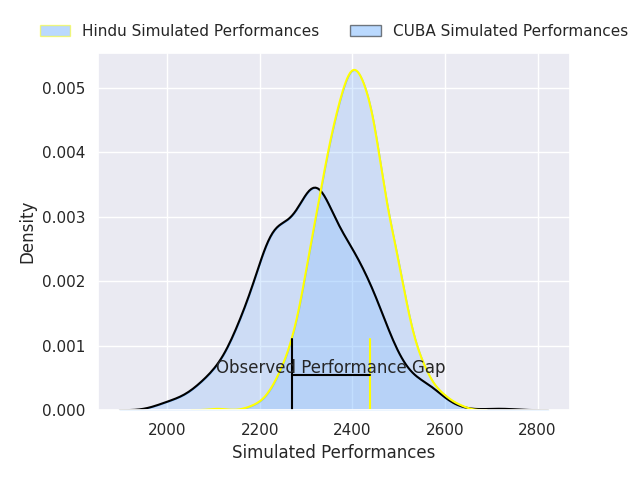
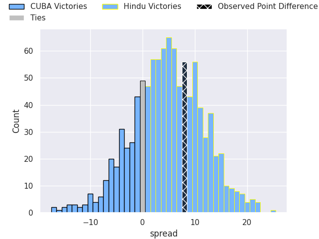
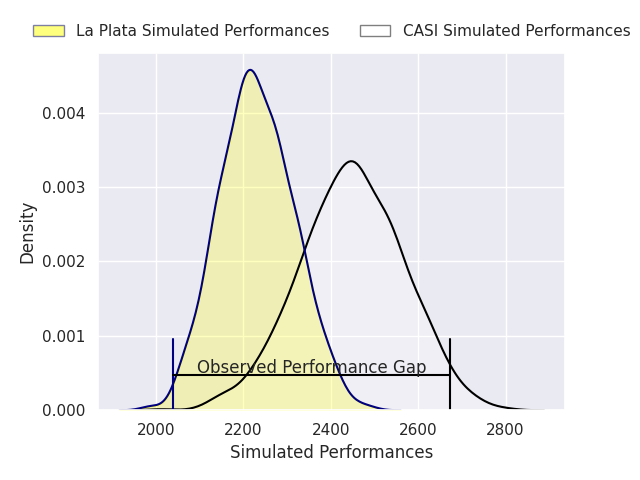
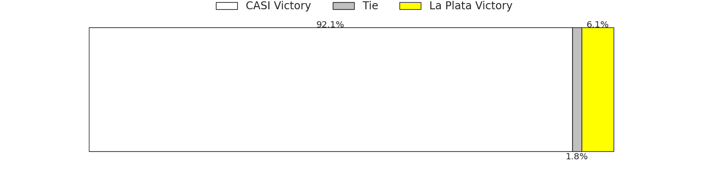
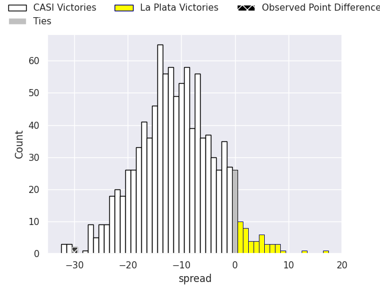

# Team Rankings

# Standings

## Current Standings

| Club                 |   Played |   Wins |   Point Differential |   Losing Bonus Points |   Try Bonus Points |   Competition Points |
|:---------------------|---------:|-------:|---------------------:|----------------------:|-------------------:|---------------------:|
| SIC                  |       12 |      9 |                  148 |                     1 |                  6 |                   43 |
| CASI                 |       14 |      8 |                   72 |                     3 |                  8 |                   43 |
| Hindu                |       12 |     10 |                  132 |                     1 |                  1 |                   42 |
| Alumni               |       15 |      7 |                    1 |                     4 |                  7 |                   39 |
| Belgrano AC          |       15 |      7 |                  -41 |                     3 |                  7 |                   38 |
| Newman               |        9 |      7 |                  116 |                     0 |                  6 |                   34 |
| CUBA                 |       13 |      4 |                   18 |                     7 |                  6 |                   29 |
| Atlético del Rosario |       15 |      6 |                  -35 |                     4 |                  1 |                   29 |
| La Plata             |       13 |      5 |                  -26 |                     4 |                  1 |                   25 |
| Regatas Bella Vista  |        9 |      5 |                  -42 |                     1 |                  4 |                   25 |
| Buenos Aires         |       11 |      5 |                  -65 |                     2 |                  2 |                   24 |
| Los Matreros         |       12 |      4 |                 -132 |                     1 |                  3 |                   20 |
| Champagnat           |       10 |      4 |                  -87 |                     1 |                  2 |                   19 |
| Los Tilos            |        8 |      3 |                  -59 |                     2 |                  4 |                   18 |

## Projected Remaining Table

| Club                 |   To Play |   Projected Wins |   Projected Differential |   Projected Losing Bonus Points |   Projected Try Bonus Points |   Projected Competition Points |
|:---------------------|----------:|-----------------:|-------------------------:|--------------------------------:|-----------------------------:|-------------------------------:|
| SIC                  |         9 |            7.008 |                   80.369 |                           1.236 |                            3 |                         32.774 |
| Newman               |         9 |            6.943 |                   75.888 |                           1.279 |                            1 |                         30.547 |
| CASI                 |         8 |            6.239 |                   75.444 |                           1.017 |                            3 |                         29.381 |
| Belgrano AC          |         9 |            6.158 |                   41.516 |                           1.587 |                            1 |                         27.839 |
| Los Tilos            |         9 |            5.455 |                   29.121 |                           1.91  |                            3 |                         27.478 |
| Hindu                |         9 |            5.988 |                   45.448 |                           1.781 |                              |                         26.451 |
| CUBA                 |         9 |            3.714 |                  -10.226 |                           2.596 |                            3 |                         21.184 |
| Alumni               |         8 |            3.506 |                   -6.896 |                           1.96  |                            2 |                         18.498 |
| Buenos Aires         |         8 |            3.421 |                  -15.081 |                           1.662 |                              |                         15.884 |
| Regatas Bella Vista  |         9 |            2.685 |                  -42.585 |                           2.438 |                              |                         13.722 |
| Los Matreros         |         9 |            2.077 |                  -79.424 |                           1.8   |                            2 |                         12.5   |
| Atlético del Rosario |         9 |            2.253 |                  -67.161 |                           1.929 |                              |                         11.389 |
| Champagnat           |         9 |            1.937 |                  -67.054 |                           1.951 |                            1 |                         11.111 |
| La Plata             |         8 |            1.724 |                  -59.359 |                           1.988 |                              |                          9.376 |

## Projected Total Table

| Club                 |   Played |   Wins |   Point Differential |   Losing Bonus Points |   Try Bonus Points |   Competition Points |
|:---------------------|---------:|-------:|---------------------:|----------------------:|-------------------:|---------------------:|
| SIC                  |       21 | 16.008 |              228.369 |                 2.236 |                  9 |               75.774 |
| CASI                 |       22 | 14.239 |              147.444 |                 4.017 |                 11 |               72.381 |
| Hindu                |       21 | 15.988 |              177.448 |                 2.781 |                  1 |               68.451 |
| Belgrano AC          |       24 | 13.158 |                0.516 |                 4.587 |                  8 |               65.839 |
| Newman               |       18 | 13.943 |              191.888 |                 1.279 |                  7 |               64.547 |
| Alumni               |       23 | 10.506 |               -5.896 |                 5.96  |                  9 |               57.498 |
| CUBA                 |       22 |  7.714 |                7.774 |                 9.596 |                  9 |               50.184 |
| Los Tilos            |       17 |  8.455 |              -29.879 |                 3.91  |                  7 |               45.478 |
| Atlético del Rosario |       24 |  8.253 |             -102.161 |                 5.929 |                  1 |               40.389 |
| Buenos Aires         |       19 |  8.421 |              -80.081 |                 3.662 |                  2 |               39.884 |
| Regatas Bella Vista  |       18 |  7.685 |              -84.585 |                 3.438 |                  4 |               38.722 |
| La Plata             |       21 |  6.724 |              -85.359 |                 5.988 |                  1 |               34.376 |
| Los Matreros         |       21 |  6.077 |             -211.424 |                 2.8   |                  5 |               32.5   |
| Champagnat           |       19 |  5.937 |             -154.054 |                 2.951 |                  3 |               30.111 |

# Completed Match Review

| Model | Percent Correct Predictions | Spread Error |
| ------ | ------ | ------ |
| Club Level | 69.7% | 9.8 |
| Player Level: Lineup | nan% | nan |
| Player Level: Minutes | nan% | nan |

# Future Predictions

## Week 16

### Hindu V Newman on 2026/05/09

Average Margin: Hindu by 1.2

### La Plata V SIC on 2026/05/09

Average Margin: SIC by 10.8

### Los Tilos V CUBA on 2026/05/09

Average Margin: Los Tilos by 4.7

### Atlético del Rosario V Buenos Aires on 2026/05/09

Average Margin: Atlético del Rosario by 5.4

### Regatas Bella Vista V Belgrano AC on 2026/05/09

Average Margin: Regatas Bella Vista by 3.9

### Champagnat V Alumni on 2026/05/09

Average Margin: Alumni by 0.7

### Los Matreros V CASI on 2026/05/09

Average Margin: CASI by 9.5

## Week 17

### Alumni V Hindu on 2026/05/16

Average Margin: Hindu by 2.5

### Newman V La Plata on 2026/05/16

Average Margin: Newman by 18.9

### CUBA V CASI on 2026/05/16

Average Margin: CASI by 2.5

### Buenos Aires V Los Tilos on 2026/05/16

Average Margin: Los Tilos by 0.7

### SIC V Regatas Bella Vista on 2026/05/16

Average Margin: SIC by 10.8

### Champagnat V Los Matreros on 2026/05/16

Average Margin: Champagnat by 9.5

### Belgrano AC V Atlético del Rosario on 2026/05/16

Average Margin: Belgrano AC by 8.5

## Week 18

### CASI V Buenos Aires on 2026/05/23

Average Margin: CASI by 14.2

### Hindu V Champagnat on 2026/05/23

Average Margin: Hindu by 14.1

### Los Tilos V Belgrano AC on 2026/05/23

Average Margin: Los Tilos by 4.1

### Regatas Bella Vista V Newman on 2026/05/23

Average Margin: Newman by 5.1

### Atlético del Rosario V SIC on 2026/05/23

Average Margin: SIC by 8.3

### Los Matreros V CUBA on 2026/05/23

Average Margin: CUBA by 2.1

### La Plata V Alumni on 2026/05/23

Average Margin: Alumni by 4.2

## Week 19

### Atlético del Rosario V Los Matreros on 2026/07/18

Average Margin: Atlético del Rosario by 3.1

### Belgrano AC V Alumni on 2026/07/18

Average Margin: Belgrano AC by 8.7

### SIC V Newman on 2026/07/18

Average Margin: SIC by 1.6

### CUBA V Hindu on 2026/07/18

Average Margin: Hindu by 8.6

### CASI V La Plata on 2026/07/18

Average Margin: CASI by 11.1

### Buenos Aires V Champagnat on 2026/07/18

Average Margin: Buenos Aires by 7.5

### Los Tilos V Regatas Bella Vista on 2026/07/18

Average Margin: Los Tilos by 6.6

## Week 20

### Los Matreros V Newman on 2026/08/01

Average Margin: Newman by 12.5

### Atlético del Rosario V Los Tilos on 2026/08/01

Average Margin: Los Tilos by 6.3

### Champagnat V Belgrano AC on 2026/08/01

Average Margin: Belgrano AC by 7.8

### La Plata V CUBA on 2026/08/01

Average Margin: La Plata by 5.8

### Regatas Bella Vista V CASI on 2026/08/01

Average Margin: CASI by 3.2

### Alumni V SIC on 2026/08/01

Average Margin: SIC by 3.3

### Hindu V Buenos Aires on 2026/08/01

Average Margin: Hindu by 13.3

## Week 21

### CUBA V Regatas Bella Vista on 2026/08/15

Average Margin: CUBA by 0.9

### SIC V Champagnat on 2026/08/15

Average Margin: SIC by 16.1

### Newman V Alumni on 2026/08/15

Average Margin: Newman by 12.1

### CASI V Atlético del Rosario on 2026/08/15

Average Margin: CASI by 18.2

### Los Tilos V Los Matreros on 2026/08/15

Average Margin: Los Tilos by 13.9

### Buenos Aires V La Plata on 2026/08/15

Average Margin: Buenos Aires by 3.7

### Belgrano AC V Hindu on 2026/08/15

Average Margin: Belgrano AC by 1.4

## Week 22

### Los Matreros V Alumni on 2026/08/22

Average Margin: Alumni by 4.4

### Los Tilos V CASI on 2026/08/22

Average Margin: Los Tilos by 0.5

### Regatas Bella Vista V Buenos Aires on 2026/08/22

Average Margin: Regatas Bella Vista by 4.0

### Champagnat V Newman on 2026/08/22

Average Margin: Newman by 11.0

### Hindu V SIC on 2026/08/22

Average Margin: Hindu by 3.6

### Atlético del Rosario V CUBA on 2026/08/22

Average Margin: CUBA by 2.3

### La Plata V Belgrano AC on 2026/08/22

Average Margin: Belgrano AC by 3.9

## Week 23

### SIC V La Plata on 2026/08/29

Average Margin: SIC by 12.5

### CASI V Los Matreros on 2026/08/29

Average Margin: CASI by 17.1

### Buenos Aires V Atlético del Rosario on 2026/08/29

Average Margin: Buenos Aires by 11.3

### Newman V Hindu on 2026/08/29

Average Margin: Newman by 5.3

### Alumni V Champagnat on 2026/08/29

Average Margin: Alumni by 10.5

### Belgrano AC V Regatas Bella Vista on 2026/08/29

Average Margin: Belgrano AC by 10.3

### CUBA V Los Tilos on 2026/08/29

Average Margin: Los Tilos by 1.2

## Week 24

### Newman V Regatas Bella Vista on 2026/09/12

Average Margin: Newman by 13.6

### CUBA V Los Matreros on 2026/09/12

Average Margin: CUBA by 7.3

### Belgrano AC V Los Tilos on 2026/09/12

Average Margin: Belgrano AC by 8.9

### Champagnat V Hindu on 2026/09/12

Average Margin: Hindu by 8.8

### SIC V Atlético del Rosario on 2026/09/12

Average Margin: SIC by 20.6

