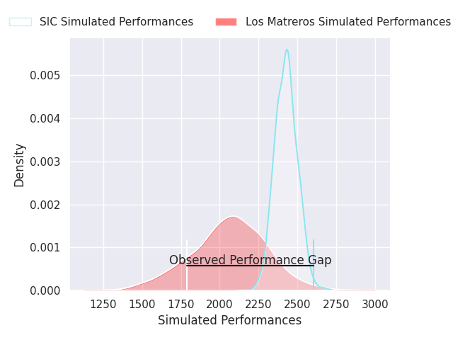
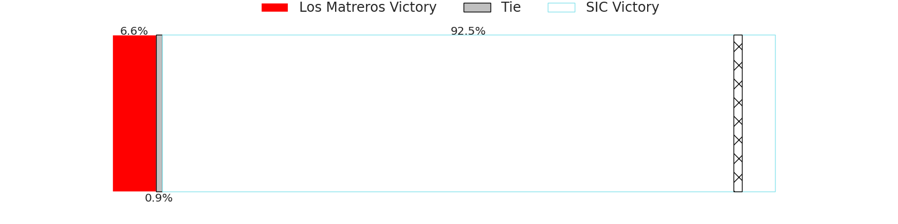
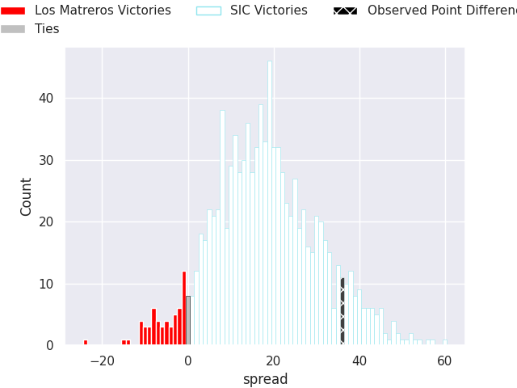
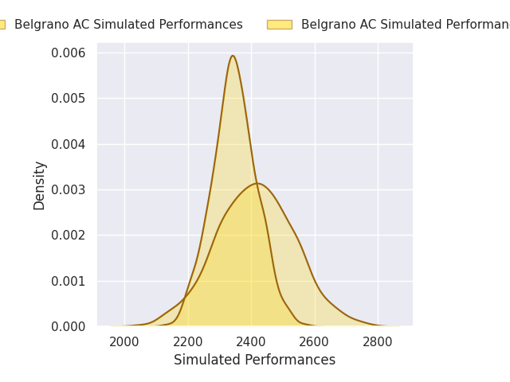
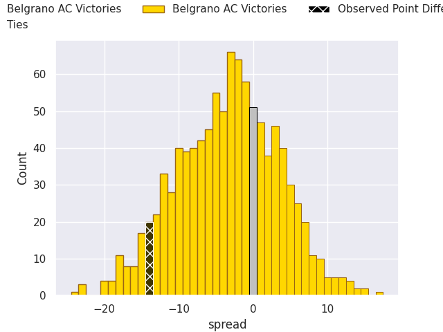
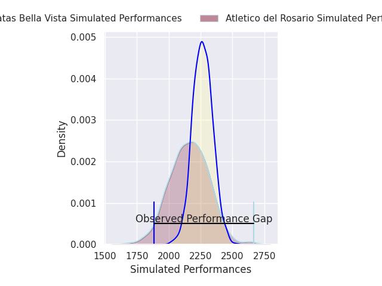
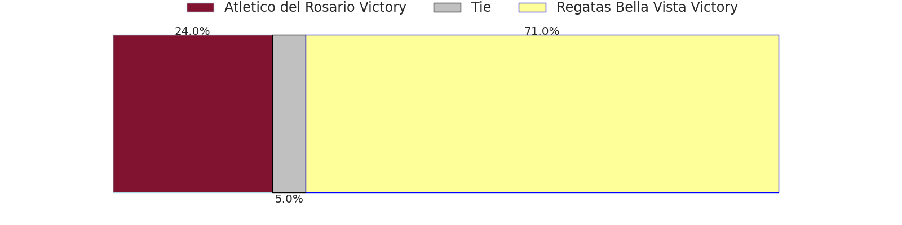
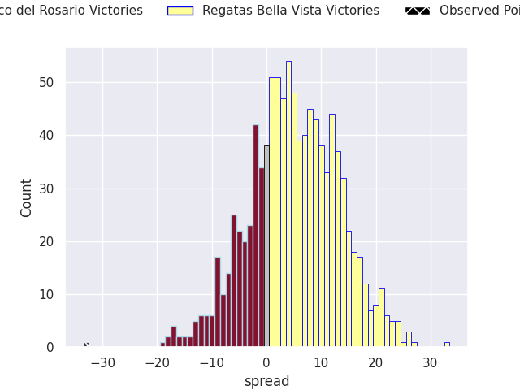

# Team Rankings

# Standings

## Current Standings

| Club                 |   Played |   Wins |   Point Differential |   Losing Bonus Points |   Try Bonus Points |   Competition Points |
|:---------------------|---------:|-------:|---------------------:|----------------------:|-------------------:|---------------------:|
| Hindu                |       12 |     10 |                  132 |                     1 |                  1 |                   42 |
| CASI                 |       12 |      7 |                   72 |                     3 |                  8 |                   39 |
| Alumni               |       14 |      7 |                   19 |                     4 |                  7 |                   39 |
| SIC                  |       11 |      8 |                  112 |                     1 |                  5 |                   38 |
| Newman               |        9 |      7 |                  116 |                     0 |                  6 |                   34 |
| Belgrano AC          |       13 |      6 |                  -41 |                     3 |                  6 |                   33 |
| Regatas Bella Vista  |        8 |      5 |                   -9 |                     1 |                  4 |                   25 |
| CUBA                 |       11 |      3 |                   18 |                     7 |                  5 |                   24 |
| Atlético del Rosario |       14 |      5 |                  -68 |                     4 |                    |                   24 |
| La Plata             |       11 |      4 |                  -26 |                     3 |                  1 |                   20 |
| Buenos Aires         |       10 |      4 |                  -83 |                     2 |                  1 |                   19 |
| Champagnat           |       10 |      4 |                  -87 |                     1 |                  2 |                   19 |
| Los Matreros         |       11 |      4 |                  -96 |                     1 |                  2 |                   19 |
| Los Tilos            |        8 |      3 |                  -59 |                     2 |                  4 |                   18 |

## Projected Remaining Table

| Club                 |   To Play |   Projected Wins |   Projected Differential |   Projected Losing Bonus Points |   Projected Try Bonus Points |   Projected Competition Points |
|:---------------------|----------:|-----------------:|-------------------------:|--------------------------------:|-----------------------------:|-------------------------------:|
| SIC                  |        10 |            7.589 |                   87.659 |                           1.479 |                            3 |                         35.383 |
| CASI                 |        10 |            7.413 |                   88.34  |                           1.489 |                            3 |                         34.715 |
| Belgrano AC          |        11 |            6.491 |                   28.628 |                           2.642 |                            1 |                         30.594 |
| Newman               |         9 |            6.835 |                   71.993 |                           1.303 |                            1 |                         30.157 |
| CUBA                 |        11 |            5.398 |                    7.652 |                           2.964 |                            3 |                         28.508 |
| Hindu                |         9 |            6.099 |                   48.671 |                           1.798 |                              |                         26.896 |
| Los Tilos            |         9 |            5.183 |                   23.391 |                           2.066 |                            3 |                         26.454 |
| Alumni               |         9 |            4.333 |                    3.458 |                           2.31  |                            2 |                         22.37  |
| Regatas Bella Vista  |        10 |            3.793 |                  -24.803 |                           2.582 |                              |                         18.376 |
| Buenos Aires         |         9 |            3.371 |                  -28.513 |                           2.03  |                              |                         16.054 |
| La Plata             |        10 |            2.912 |                  -57.869 |                           2.448 |                              |                         14.782 |
| Los Matreros         |        10 |            2.442 |                  -83.013 |                           1.976 |                            2 |                         14.236 |
| Champagnat           |         9 |            2.064 |                  -66.19  |                           1.964 |                            1 |                         11.59  |
| Atlético del Rosario |        10 |            1.882 |                  -99.404 |                           2.002 |                              |                          9.938 |

## Projected Total Table

| Club                 |   Played |   Wins |   Point Differential |   Losing Bonus Points |   Try Bonus Points |   Competition Points |
|:---------------------|---------:|-------:|---------------------:|----------------------:|-------------------:|---------------------:|
| CASI                 |       22 | 14.413 |              160.34  |                 4.489 |                 11 |               73.715 |
| SIC                  |       21 | 15.589 |              199.659 |                 2.479 |                  8 |               73.383 |
| Hindu                |       21 | 16.099 |              180.671 |                 2.798 |                  1 |               68.896 |
| Newman               |       18 | 13.835 |              187.993 |                 1.303 |                  7 |               64.157 |
| Belgrano AC          |       24 | 12.491 |              -12.372 |                 5.642 |                  7 |               63.594 |
| Alumni               |       23 | 11.333 |               22.458 |                 6.31  |                  9 |               61.37  |
| CUBA                 |       22 |  8.398 |               25.652 |                 9.964 |                  8 |               52.508 |
| Los Tilos            |       17 |  8.183 |              -35.609 |                 4.066 |                  7 |               44.454 |
| Regatas Bella Vista  |       18 |  8.793 |              -33.803 |                 3.582 |                  4 |               43.376 |
| Buenos Aires         |       19 |  7.371 |             -111.513 |                 4.03  |                  1 |               35.054 |
| La Plata             |       21 |  6.912 |              -83.869 |                 5.448 |                  1 |               34.782 |
| Atlético del Rosario |       24 |  6.882 |             -167.404 |                 6.002 |                    |               33.938 |
| Los Matreros         |       21 |  6.442 |             -179.013 |                 2.976 |                  4 |               33.236 |
| Champagnat           |       19 |  6.064 |             -153.19  |                 2.964 |                  3 |               30.59  |

# Completed Match Review

| Model | Percent Correct Predictions | Spread Error |
| ------ | ------ | ------ |
| Club Level | 72.4% | 9.0 |
| Player Level: Lineup | nan% | nan |
| Player Level: Minutes | nan% | nan |

# Future Predictions

## Week 15

### Regatas Bella Vista V Belgrano AC on 2026/05/09

Average Margin: Regatas Bella Vista by 3.8

### Champagnat V Alumni on 2026/05/09

Average Margin: Alumni by 0.9

### Hindu V Newman on 2026/05/09

Average Margin: Hindu by 1.9

### Los Tilos V CUBA on 2026/05/09

Average Margin: Los Tilos by 4.4

### Atlético del Rosario V Buenos Aires on 2026/05/09

Average Margin: Atlético del Rosario by 5.1

### La Plata V SIC on 2026/05/09

Average Margin: SIC by 11.2

### Los Matreros V CASI on 2026/05/09

Average Margin: CASI by 8.7

## Week 16

### Alumni V Hindu on 2026/05/16

Average Margin: Hindu by 2.4

### CUBA V CASI on 2026/05/16

Average Margin: CASI by 2.1

### Newman V La Plata on 2026/05/16

Average Margin: Newman by 19.8

### Buenos Aires V Los Tilos on 2026/05/16

Average Margin: Los Tilos by 1.1

### SIC V Regatas Bella Vista on 2026/05/16

Average Margin: SIC by 10.3

### Belgrano AC V Atlético del Rosario on 2026/05/16

Average Margin: Belgrano AC by 8.3

### Champagnat V Los Matreros on 2026/05/16

Average Margin: Champagnat by 8.7

## Week 17

### Atlético del Rosario V SIC on 2026/05/23

Average Margin: SIC by 8.8

### Los Matreros V CUBA on 2026/05/23

Average Margin: CUBA by 2.9

### Regatas Bella Vista V Newman on 2026/05/23

Average Margin: Newman by 5.4

### Hindu V Champagnat on 2026/05/23

Average Margin: Hindu by 14.4

### La Plata V Alumni on 2026/05/23

Average Margin: Alumni by 3.6

### CASI V Buenos Aires on 2026/05/23

Average Margin: CASI by 15.0

### Los Tilos V Belgrano AC on 2026/05/23

Average Margin: Los Tilos by 3.6

## Week 18

### Los Matreros V SIC on 2026/07/11

Average Margin: SIC by 9.5

### Buenos Aires V Alumni on 2026/07/11

Average Margin: Alumni by 2.8

### Belgrano AC V Newman on 2026/07/11

Average Margin: Belgrano AC by 3.4

### CASI V Hindu on 2026/07/11

Average Margin: CASI by 3.7

### Atlético del Rosario V Regatas Bella Vista on 2026/07/11

Average Margin: Regatas Bella Vista by 9.5

### La Plata V Los Tilos on 2026/07/11

Average Margin: La Plata by 3.4

### CUBA V Champagnat on 2026/07/11

Average Margin: CUBA by 3.3

## Week 19

### Buenos Aires V Champagnat on 2026/07/18

Average Margin: Buenos Aires by 5.5

### CUBA V Hindu on 2026/07/18

Average Margin: Hindu by 5.8

### SIC V Newman on 2026/07/18

Average Margin: SIC by 1.3

### CASI V La Plata on 2026/07/18

Average Margin: CASI by 12.9

### Atlético del Rosario V Los Matreros on 2026/07/18

Average Margin: Los Matreros by 1.5

### Belgrano AC V Alumni on 2026/07/18

Average Margin: Belgrano AC by 5.9

### Los Tilos V Regatas Bella Vista on 2026/07/18

Average Margin: Los Tilos by 4.6

## Week 20

### Champagnat V Belgrano AC on 2026/08/01

Average Margin: Belgrano AC by 6.0

### Alumni V SIC on 2026/08/01

Average Margin: SIC by 1.0

### Los Matreros V Newman on 2026/08/01

Average Margin: Newman by 10.7

### Hindu V Buenos Aires on 2026/08/01

Average Margin: Hindu by 15.5

### Atlético del Rosario V Los Tilos on 2026/08/01

Average Margin: Los Tilos by 9.7

### Regatas Bella Vista V CASI on 2026/08/01

Average Margin: CASI by 4.2

### La Plata V CUBA on 2026/08/01

Average Margin: La Plata by 4.0

## Week 21

### Buenos Aires V La Plata on 2026/08/15

Average Margin: Buenos Aires by 1.0

### Belgrano AC V Hindu on 2026/08/15

Average Margin: Hindu by 0.4

### CASI V Atlético del Rosario on 2026/08/15

Average Margin: CASI by 24.2

### Newman V Alumni on 2026/08/15

Average Margin: Newman by 10.8

### CUBA V Regatas Bella Vista on 2026/08/15

Average Margin: CUBA by 2.2

### Los Tilos V Los Matreros on 2026/08/15

Average Margin: Los Tilos by 12.3

### SIC V Champagnat on 2026/08/15

Average Margin: SIC by 15.9

## Week 22

### Regatas Bella Vista V Buenos Aires on 2026/08/22

Average Margin: Regatas Bella Vista by 8.2

### La Plata V Belgrano AC on 2026/08/22

Average Margin: Belgrano AC by 2.0

### Hindu V SIC on 2026/08/22

Average Margin: Hindu by 4.0

### Los Matreros V Alumni on 2026/08/22

Average Margin: Alumni by 4.2

### Los Tilos V CASI on 2026/08/22

Average Margin: CASI by 2.4

### Atlético del Rosario V CUBA on 2026/08/22

Average Margin: CUBA by 7.6

### Champagnat V Newman on 2026/08/22

Average Margin: Newman by 11.3

## Week 23

### Newman V Hindu on 2026/08/29

Average Margin: Newman by 4.6

### CUBA V Los Tilos on 2026/08/29

Average Margin: CUBA by 2.6

### Alumni V Champagnat on 2026/08/29

Average Margin: Alumni by 12.0

### Belgrano AC V Regatas Bella Vista on 2026/08/29

Average Margin: Belgrano AC by 7.0

### CASI V Los Matreros on 2026/08/29

Average Margin: CASI by 18.8

### SIC V La Plata on 2026/08/29

Average Margin: SIC by 11.5

### Buenos Aires V Atlético del Rosario on 2026/08/29

Average Margin: Buenos Aires by 12.6

## Week 24

### Newman V Regatas Bella Vista on 2026/09/12

Average Margin: Newman by 12.7

### Belgrano AC V Los Tilos on 2026/09/12

Average Margin: Belgrano AC by 7.4

### Champagnat V Hindu on 2026/09/12

Average Margin: Hindu by 8.9

### CUBA V Los Matreros on 2026/09/12

Average Margin: CUBA by 8.7

### SIC V Atlético del Rosario on 2026/09/12

Average Margin: SIC by 22.2

