# Team Rankings

# Standings

## Current Standings

| Club                 |   Played |   Wins |   Point Differential |   Losing Bonus Points |   Try Bonus Points |   Competition Points |
|:---------------------|---------:|-------:|---------------------:|----------------------:|-------------------:|---------------------:|
| Hindu                |       10 |      9 |                  132 |                     1 |                    |                   37 |
| SIC                  |       10 |      8 |                  130 |                     1 |                  4 |                   37 |
| Newman               |        8 |      7 |                  129 |                     0 |                  6 |                   34 |
| CASI                 |       10 |      6 |                   72 |                     3 |                  7 |                   34 |
| Alumni               |       12 |      6 |                   19 |                     4 |                  5 |                   33 |
| Belgrano AC          |       12 |      5 |                  -59 |                     3 |                  5 |                   28 |
| Regatas Bella Vista  |        8 |      5 |                   -9 |                     1 |                  4 |                   25 |
| CUBA                 |       11 |      3 |                   18 |                     7 |                  5 |                   24 |
| La Plata             |       11 |      4 |                  -26 |                     3 |                  1 |                   20 |
| Atlético del Rosario |       12 |      4 |                  -68 |                     4 |                    |                   20 |
| Champagnat           |       10 |      4 |                  -87 |                     1 |                  2 |                   19 |
| Los Tilos            |        8 |      3 |                  -59 |                     2 |                  4 |                   18 |
| Buenos Aires         |        9 |      3 |                  -96 |                     2 |                    |                   14 |
| Los Matreros         |        9 |      3 |                  -96 |                     1 |                  1 |                   14 |

## Projected Remaining Table

| Club                 |   To Play |   Projected Wins |   Projected Differential |   Projected Losing Bonus Points |   Projected Try Bonus Points |   Projected Competition Points |
|:---------------------|----------:|-----------------:|-------------------------:|--------------------------------:|-----------------------------:|-------------------------------:|
| Newman               |        11 |            9.099 |                  120.346 |                           1.149 |                            1 |                         39.059 |
| CASI                 |        12 |            8.249 |                   84.03  |                           2.104 |                            3 |                         38.928 |
| SIC                  |        11 |            8.354 |                   95.749 |                           1.581 |                            3 |                         38.613 |
| Alumni               |        12 |            6.281 |                   21.569 |                           3.029 |                            2 |                         31.077 |
| Hindu                |        11 |            6.804 |                   44.397 |                           2.415 |                              |                         30.527 |
| Belgrano AC          |        11 |            5.607 |                    7.216 |                           2.762 |                            1 |                         27.138 |
| Los Tilos            |         9 |            5.22  |                   30.36  |                           2.103 |                            3 |                         26.727 |
| CUBA                 |        10 |            4.857 |                    9.506 |                           2.599 |                            3 |                         25.981 |
| Atlético del Rosario |        13 |            4.511 |                  -55.457 |                           2.942 |                              |                         21.776 |
| La Plata             |        10 |            2.991 |                  -55.036 |                           2.49  |                              |                         15.194 |
| Regatas Bella Vista  |         9 |            2.949 |                  -33.345 |                           2.447 |                              |                         14.889 |
| Los Matreros         |        12 |            2.417 |                 -140.923 |                           1.774 |                            2 |                         13.902 |
| Champagnat           |        10 |            2.481 |                  -69.719 |                           2.146 |                            1 |                         13.526 |
| Buenos Aires         |         9 |            2.683 |                  -58.693 |                           1.836 |                              |                         13.04  |

## Projected Total Table

| Club                 |   Played |   Wins |   Point Differential |   Losing Bonus Points |   Try Bonus Points |   Competition Points |
|:---------------------|---------:|-------:|---------------------:|----------------------:|-------------------:|---------------------:|
| SIC                  |       21 | 16.354 |              225.749 |                 2.581 |                  7 |               75.613 |
| Newman               |       19 | 16.099 |              249.346 |                 1.149 |                  7 |               73.059 |
| CASI                 |       22 | 14.249 |              156.03  |                 5.104 |                 10 |               72.928 |
| Hindu                |       21 | 15.804 |              176.397 |                 3.415 |                    |               67.527 |
| Alumni               |       24 | 12.281 |               40.569 |                 7.029 |                  7 |               64.077 |
| Belgrano AC          |       23 | 10.607 |              -51.784 |                 5.762 |                  6 |               55.138 |
| CUBA                 |       21 |  7.857 |               27.506 |                 9.599 |                  8 |               49.981 |
| Los Tilos            |       17 |  8.22  |              -28.64  |                 4.103 |                  7 |               44.727 |
| Atlético del Rosario |       25 |  8.511 |             -123.457 |                 6.942 |                    |               41.776 |
| Regatas Bella Vista  |       17 |  7.949 |              -42.345 |                 3.447 |                  4 |               39.889 |
| La Plata             |       21 |  6.991 |              -81.036 |                 5.49  |                  1 |               35.194 |
| Champagnat           |       20 |  6.481 |             -156.719 |                 3.146 |                  3 |               32.526 |
| Los Matreros         |       21 |  5.417 |             -236.923 |                 2.774 |                  3 |               27.902 |
| Buenos Aires         |       18 |  5.683 |             -154.693 |                 3.836 |                    |               27.04  |

# Completed Match Review

| Model | Percent Correct Predictions | Spread Error |
| ------ | ------ | ------ |
| Club Level | 71.7% | 8.7 |
| Player Level: Lineup | nan% | nan |
| Player Level: Minutes | nan% | nan |

# Future Predictions

## Week 13

### La Plata V SIC on 2026/05/09

Average Margin: SIC by 11.3

### Los Tilos V CUBA on 2026/05/09

Average Margin: Los Tilos by 5.2

### Los Matreros V CASI on 2026/05/09

Average Margin: CASI by 9.0

### Hindu V Newman on 2026/05/09

Average Margin: Hindu by 1.5

### Atlético del Rosario V Buenos Aires on 2026/05/09

Average Margin: Atlético del Rosario by 4.8

### Champagnat V Alumni on 2026/05/09

Average Margin: Alumni by 1.1

### Regatas Bella Vista V Belgrano AC on 2026/05/09

Average Margin: Regatas Bella Vista by 3.8

## Week 14

### SIC V Regatas Bella Vista on 2026/05/16

Average Margin: SIC by 10.8

### CUBA V CASI on 2026/05/16

Average Margin: CASI by 2.6

### Buenos Aires V Los Tilos on 2026/05/16

Average Margin: Los Tilos by 0.8

### Belgrano AC V Atlético del Rosario on 2026/05/16

Average Margin: Belgrano AC by 8.4

### Champagnat V Los Matreros on 2026/05/16

Average Margin: Champagnat by 8.8

### Newman V La Plata on 2026/05/16

Average Margin: Newman by 19.7

### Alumni V Hindu on 2026/05/16

Average Margin: Hindu by 2.5

## Week 15

### La Plata V Alumni on 2026/05/23

Average Margin: Alumni by 4.1

### Los Matreros V CUBA on 2026/05/23

Average Margin: CUBA by 2.1

### Regatas Bella Vista V Newman on 2026/05/23

Average Margin: Newman by 5.4

### CASI V Buenos Aires on 2026/05/23

Average Margin: CASI by 14.5

### Los Tilos V Belgrano AC on 2026/05/23

Average Margin: Los Tilos by 3.9

### Atlético del Rosario V SIC on 2026/05/23

Average Margin: SIC by 8.3

### Hindu V Champagnat on 2026/05/23

Average Margin: Hindu by 14.4

## Week 16

### Atlético del Rosario V La Plata on 2026/07/04

Average Margin: Atlético del Rosario by 4.7

### Hindu V Los Tilos on 2026/07/04

Average Margin: Hindu by 3.6

### Belgrano AC V SIC on 2026/07/04

Average Margin: SIC by 1.7

### Los Matreros V Regatas Bella Vista on 2026/07/04

Average Margin: Los Matreros by 5.7

### CASI V Champagnat on 2026/07/04

Average Margin: CASI by 3.5

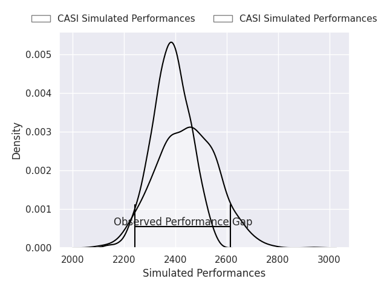

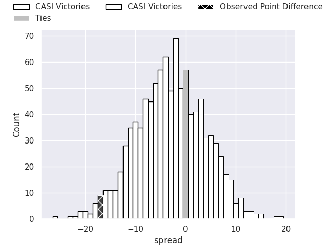

### Newman V Buenos Aires on 2026/07/04

Average Margin: Newman by 21.0

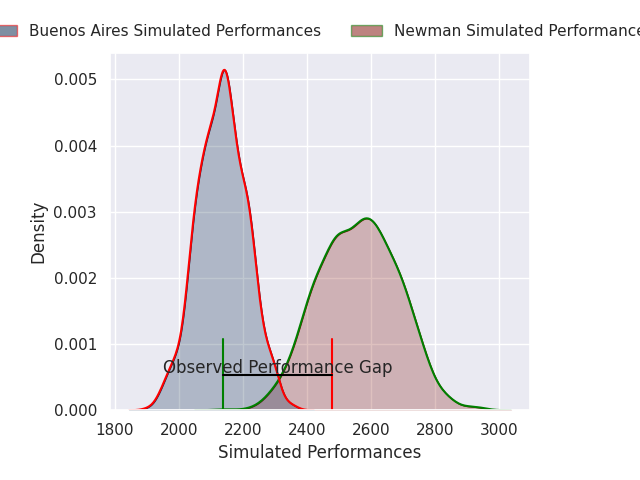

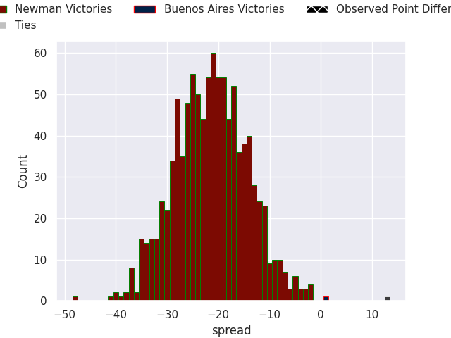

### Alumni V CUBA on 2026/07/04

Average Margin: Alumni by 4.2

## Week 17

### Los Matreros V SIC on 2026/07/11

Average Margin: SIC by 18.2

### CASI V Hindu on 2026/07/11

Average Margin: CASI by 3.4

### Newman V Belgrano AC on 2026/07/11

Average Margin: Newman by 12.0

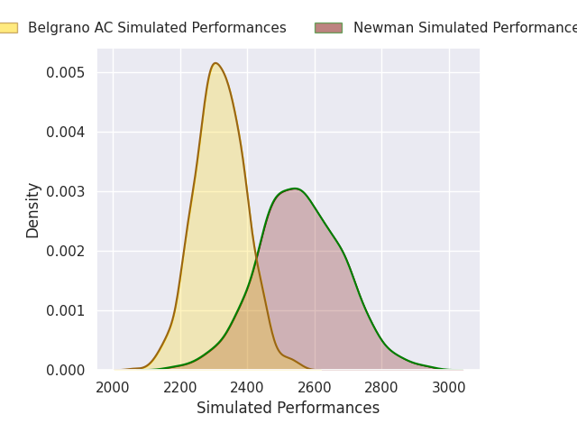
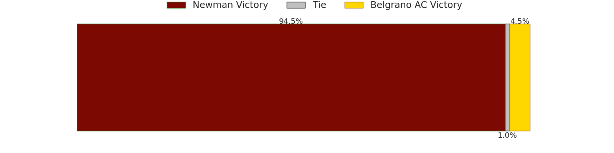
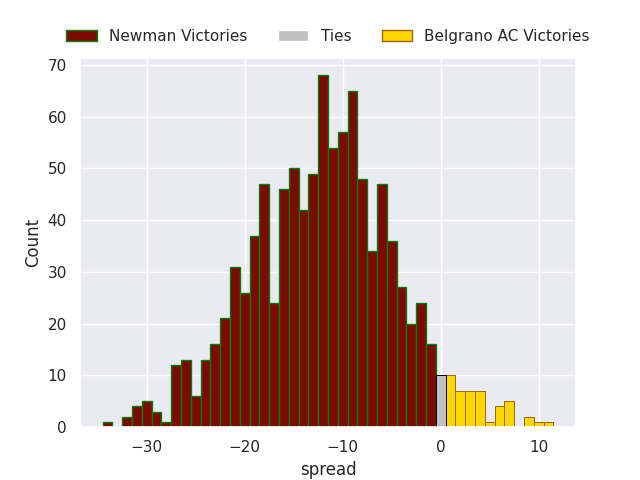

### Atlético del Rosario V Regatas Bella Vista on 2026/07/11

Average Margin: Atlético del Rosario by 3.8

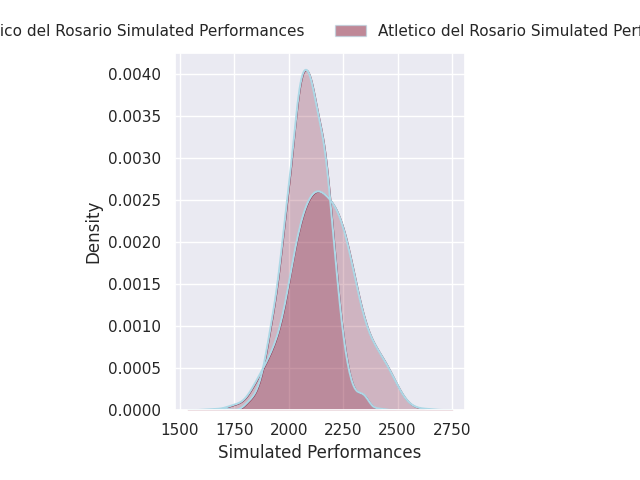
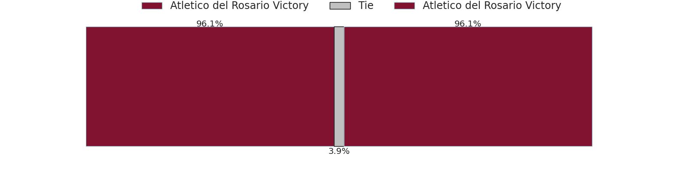
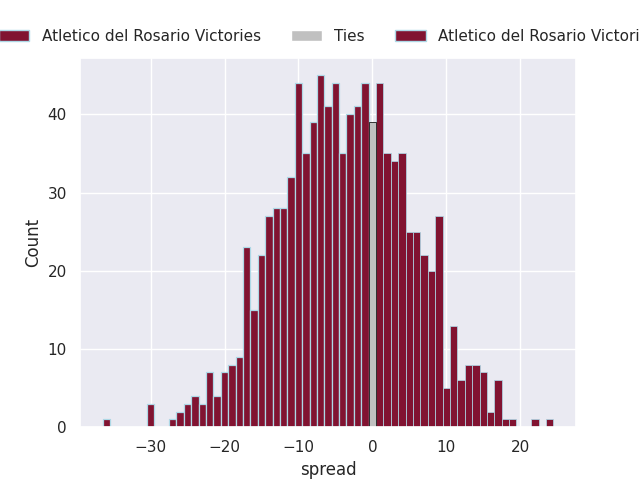

### Alumni V Buenos Aires on 2026/07/11

Average Margin: Alumni by 4.2

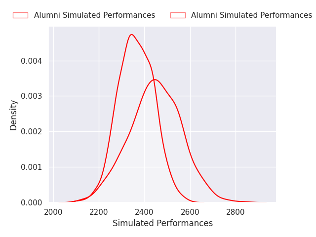

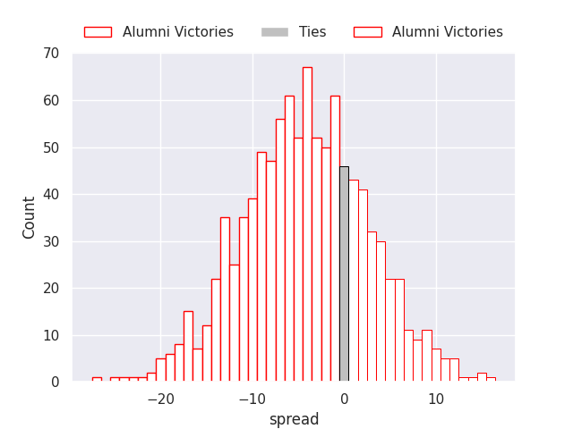

### La Plata V Los Tilos on 2026/07/11

Average Margin: La Plata by 3.5

### Champagnat V CUBA on 2026/07/11

Average Margin: CUBA by 0.8

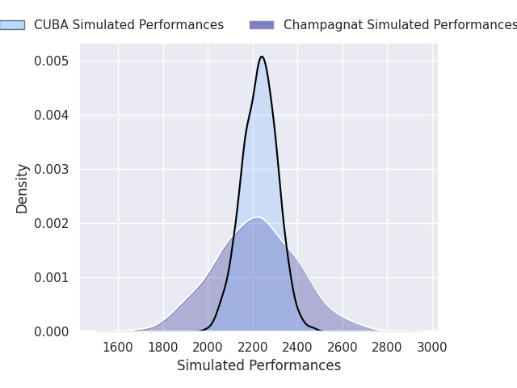

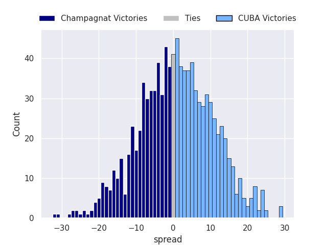

## Week 18

### SIC V Newman on 2026/07/18

Average Margin: SIC by 0.1

### Atlético del Rosario V Los Matreros on 2026/07/18

Average Margin: Atlético del Rosario by 10.4

### CASI V La Plata on 2026/07/18

Average Margin: CASI by 11.3

### Belgrano AC V Alumni on 2026/07/18

Average Margin: Belgrano AC by 1.1

### CUBA V Hindu on 2026/07/18

Average Margin: Hindu by 5.0

### Los Tilos V Regatas Bella Vista on 2026/07/18

Average Margin: Los Tilos by 4.8

### Buenos Aires V Champagnat on 2026/07/18

Average Margin: Buenos Aires by 3.5

## Week 19

### Regatas Bella Vista V CASI on 2026/08/01

Average Margin: CASI by 3.0

### Champagnat V Belgrano AC on 2026/08/01

Average Margin: Belgrano AC by 5.8

### Hindu V Buenos Aires on 2026/08/01

Average Margin: Hindu by 16.8

### Alumni V SIC on 2026/08/01

Average Margin: Alumni by 0.7

### Los Matreros V Newman on 2026/08/01

Average Margin: Newman by 19.7

### La Plata V CUBA on 2026/08/01

Average Margin: La Plata by 3.4

### Atlético del Rosario V Los Tilos on 2026/08/01

Average Margin: Los Tilos by 5.8

## Week 20

### CUBA V Regatas Bella Vista on 2026/08/15

Average Margin: CUBA by 2.0

### Los Tilos V Los Matreros on 2026/08/15

Average Margin: Los Tilos by 19.2

### SIC V Champagnat on 2026/08/15

Average Margin: SIC by 16.9

### CASI V Atlético del Rosario on 2026/08/15

Average Margin: CASI by 18.8

### Belgrano AC V Hindu on 2026/08/15

Average Margin: Hindu by 0.8

### Newman V Alumni on 2026/08/15

Average Margin: Newman by 10.1

### Buenos Aires V La Plata on 2026/08/15

Average Margin: La Plata by 1.3

## Week 21

### Hindu V SIC on 2026/08/22

Average Margin: Hindu by 2.4

### Los Matreros V Alumni on 2026/08/22

Average Margin: Alumni by 14.4

### Los Tilos V CASI on 2026/08/22

Average Margin: CASI by 1.2

### Atlético del Rosario V CUBA on 2026/08/22

Average Margin: CUBA by 3.4

### La Plata V Belgrano AC on 2026/08/22

Average Margin: Belgrano AC by 1.2

### Regatas Bella Vista V Buenos Aires on 2026/08/22

Average Margin: Regatas Bella Vista by 9.4

### Champagnat V Newman on 2026/08/22

Average Margin: Newman by 12.6

## Week 22

### CUBA V Los Tilos on 2026/08/29

Average Margin: CUBA by 2.0

### Belgrano AC V Regatas Bella Vista on 2026/08/29

Average Margin: Belgrano AC by 6.6

### SIC V La Plata on 2026/08/29

Average Margin: SIC by 12.2

### CASI V Los Matreros on 2026/08/29

Average Margin: CASI by 23.7

### Newman V Hindu on 2026/08/29

Average Margin: Newman by 7.5

### Buenos Aires V Atlético del Rosario on 2026/08/29

Average Margin: Buenos Aires by 6.4

### Alumni V Champagnat on 2026/08/29

Average Margin: Alumni by 15.0

## Week 23

### CUBA V Los Matreros on 2026/09/12

Average Margin: CUBA by 15.4

### Newman V Regatas Bella Vista on 2026/09/12

Average Margin: Newman by 13.9

### SIC V Atlético del Rosario on 2026/09/12

Average Margin: SIC by 19.5

### Belgrano AC V Los Tilos on 2026/09/12

Average Margin: Belgrano AC by 6.2

### Champagnat V Hindu on 2026/09/12

Average Margin: Hindu by 8.5

