# Team Rankings

# Standings

## Current Standings

| Club                 |   Played |   Wins |   Point Differential |   Losing Bonus Points |   Try Bonus Points |   Competition Points |
|:---------------------|---------:|-------:|---------------------:|----------------------:|-------------------:|---------------------:|
| CASI                 |       20 |     12 |                  151 |                     4 |                 12 |                   64 |
| Alumni               |       20 |     11 |                  108 |                     4 |                 11 |                   59 |
| SIC                  |       17 |     11 |                  168 |                     3 |                  8 |                   55 |
| Newman               |       13 |     11 |                  167 |                     0 |                  9 |                   53 |
| Belgrano AC          |       21 |      9 |                  -44 |                     5 |                 11 |                   52 |
| Hindu                |       16 |     12 |                  103 |                     1 |                  1 |                   50 |
| CUBA                 |       19 |      6 |                   -3 |                     9 |                  9 |                   42 |
| Buenos Aires         |       17 |      9 |                  -34 |                     3 |                  2 |                   41 |
| Atlético del Rosario |       21 |      8 |                  -75 |                     6 |                  2 |                   40 |
| Los Tilos            |       12 |      7 |                  -16 |                     2 |                  7 |                   37 |
| La Plata             |       17 |      7 |                 -104 |                     4 |                  1 |                   33 |
| Los Matreros         |       18 |      6 |                 -184 |                     2 |                  6 |                   32 |
| Regatas Bella Vista  |       13 |      6 |                  -53 |                     2 |                  5 |                   31 |
| Champagnat           |       14 |      4 |                 -184 |                     1 |                  2 |                   19 |

## Projected Remaining Table

| Club                 |   To Play |   Projected Wins |   Projected Differential |   Projected Losing Bonus Points |   Projected Try Bonus Points |   Projected Competition Points |
|:---------------------|----------:|-----------------:|-------------------------:|--------------------------------:|-----------------------------:|-------------------------------:|
| SIC                  |         9 |            7.26  |                   84.687 |                           1.065 |                            3 |                         33.605 |
| Newman               |         9 |            7.487 |                  105.727 |                           0.919 |                            1 |                         32.233 |
| Hindu                |         9 |            7.49  |                   98.954 |                           0.973 |                              |                         31.387 |
| CASI                 |         9 |            5.224 |                   33.958 |                           1.98  |                            3 |                         26.44  |
| Alumni               |         9 |            5.302 |                   31.905 |                           1.928 |                            2 |                         25.714 |
| Los Tilos            |         9 |            4.905 |                   13.512 |                           2.039 |                            3 |                         25.345 |
| Belgrano AC          |         9 |            5.256 |                   33.208 |                           1.815 |                            1 |                         24.435 |
| Buenos Aires         |         9 |            3.844 |                   -7.921 |                           2.078 |                              |                         18.084 |
| Champagnat           |         9 |            2.952 |                  -41.431 |                           2.019 |                            1 |                         15.285 |
| CUBA                 |         9 |            2.442 |                  -59.908 |                           1.7   |                            3 |                         14.88  |
| La Plata             |         9 |            3.177 |                  -37.484 |                           1.74  |                              |                         14.866 |
| Regatas Bella Vista  |         9 |            2.636 |                  -45.678 |                           2.394 |                              |                         13.51  |
| Los Matreros         |         9 |            1.629 |                 -106.711 |                           1.384 |                            2 |                         10.122 |
| Atlético del Rosario |         9 |            1.692 |                 -102.818 |                           1.421 |                              |                          8.549 |

## Projected Total Table

| Club                 |   Played |   Wins |   Point Differential |   Losing Bonus Points |   Try Bonus Points |   Competition Points |
|:---------------------|---------:|-------:|---------------------:|----------------------:|-------------------:|---------------------:|
| CASI                 |       29 | 17.224 |              184.958 |                 5.98  |                 15 |               90.44  |
| SIC                  |       26 | 18.26  |              252.687 |                 4.065 |                 11 |               88.605 |
| Newman               |       22 | 18.487 |              272.727 |                 0.919 |                 10 |               85.233 |
| Alumni               |       29 | 16.302 |              139.905 |                 5.928 |                 13 |               84.714 |
| Hindu                |       25 | 19.49  |              201.954 |                 1.973 |                  1 |               81.387 |
| Belgrano AC          |       30 | 14.256 |              -10.792 |                 6.815 |                 12 |               76.435 |
| Los Tilos            |       21 | 11.905 |               -2.488 |                 4.039 |                 10 |               62.345 |
| Buenos Aires         |       26 | 12.844 |              -41.921 |                 5.078 |                  2 |               59.084 |
| CUBA                 |       28 |  8.442 |              -62.908 |                10.7   |                 12 |               56.88  |
| Atlético del Rosario |       30 |  9.692 |             -177.818 |                 7.421 |                  2 |               48.549 |
| La Plata             |       26 | 10.177 |             -141.484 |                 5.74  |                  1 |               47.866 |
| Regatas Bella Vista  |       22 |  8.636 |              -98.678 |                 4.394 |                  5 |               44.51  |
| Los Matreros         |       27 |  7.629 |             -290.711 |                 3.384 |                  8 |               42.122 |
| Champagnat           |       23 |  6.952 |             -225.431 |                 3.019 |                  3 |               34.285 |

# Completed Match Review

| Model | Percent Correct Predictions | Spread Error |
| ------ | ------ | ------ |
| Club Level | 70.3% | 10.8 |
| Player Level: Lineup | nan% | nan |
| Player Level: Minutes | nan% | nan |

# Future Predictions

## Week 22

### Atlético del Rosario V Buenos Aires on 2026/05/09

Average Margin: Atlético del Rosario by 4.7

### Hindu V Newman on 2026/05/09

Average Margin: Hindu by 2.5

### La Plata V SIC on 2026/05/09

Average Margin: SIC by 11.9

### Los Tilos V CUBA on 2026/05/09

Average Margin: Los Tilos by 4.5

### Champagnat V Alumni on 2026/05/09

Average Margin: Alumni by 0.9

### Regatas Bella Vista V Belgrano AC on 2026/05/09

Average Margin: Regatas Bella Vista by 5.0

### Los Matreros V CASI on 2026/05/09

Average Margin: CASI by 8.7

## Week 23

### Champagnat V Los Matreros on 2026/05/16

Average Margin: Champagnat by 8.7

### Newman V La Plata on 2026/05/16

Average Margin: Newman by 20.0

### Belgrano AC V Atlético del Rosario on 2026/05/16

Average Margin: Belgrano AC by 7.3

### CUBA V CASI on 2026/05/16

Average Margin: CASI by 3.0

### SIC V Regatas Bella Vista on 2026/05/16

Average Margin: SIC by 11.7

### Alumni V Hindu on 2026/05/16

Average Margin: Hindu by 3.4

### Buenos Aires V Los Tilos on 2026/05/16

Average Margin: Los Tilos by 0.7

## Week 24

### Atlético del Rosario V SIC on 2026/05/23

Average Margin: SIC by 9.8

### CASI V Buenos Aires on 2026/05/23

Average Margin: CASI by 14.5

### La Plata V Alumni on 2026/05/23

Average Margin: Alumni by 3.4

### Los Matreros V CUBA on 2026/05/23

Average Margin: CUBA by 2.2

### Hindu V Champagnat on 2026/05/23

Average Margin: Hindu by 15.9

### Los Tilos V Belgrano AC on 2026/05/23

Average Margin: Los Tilos by 4.7

### Regatas Bella Vista V Newman on 2026/05/23

Average Margin: Newman by 6.7

## Week 25

### Los Matreros V Champagnat on 2026/09/05

Average Margin: Champagnat by 3.4

### Hindu V Alumni on 2026/09/05

Average Margin: Hindu by 6.2

### Regatas Bella Vista V SIC on 2026/09/05

Average Margin: SIC by 5.3

### Los Tilos V Buenos Aires on 2026/09/05

Average Margin: Los Tilos by 6.9

### Atlético del Rosario V Belgrano AC on 2026/09/05

Average Margin: Belgrano AC by 8.9

### La Plata V Newman on 2026/09/05

Average Margin: Newman by 7.9

### CASI V CUBA on 2026/09/05

Average Margin: CASI by 15.3

## Week 26

### Belgrano AC V Los Tilos on 2026/09/12

Average Margin: Belgrano AC by 1.9

### SIC V Atlético del Rosario on 2026/09/12

Average Margin: SIC by 21.8

### Alumni V La Plata on 2026/09/12

Average Margin: Alumni by 10.0

### CUBA V Los Matreros on 2026/09/12

Average Margin: CUBA by 12.2

### Buenos Aires V CASI on 2026/09/12

Average Margin: CASI by 0.4

### Champagnat V Hindu on 2026/09/12

Average Margin: Hindu by 12.4

### Newman V Regatas Bella Vista on 2026/09/12

Average Margin: Newman by 16.4

## Week 27

### Los Matreros V Hindu on 2026/09/26

Average Margin: Hindu by 19.7

### CASI V Belgrano AC on 2026/09/26

Average Margin: CASI by 6.2

### Atlético del Rosario V Newman on 2026/09/26

Average Margin: Newman by 18.8

### CUBA V Buenos Aires on 2026/09/26

Average Margin: Buenos Aires by 5.2

### Regatas Bella Vista V Alumni on 2026/09/26

Average Margin: Alumni by 4.2

### La Plata V Champagnat on 2026/09/26

Average Margin: La Plata by 12.1

### Los Tilos V SIC on 2026/09/26

Average Margin: Los Tilos by 1.1

## Week 28

### SIC V CASI on 2026/10/03

Average Margin: SIC by 5.4

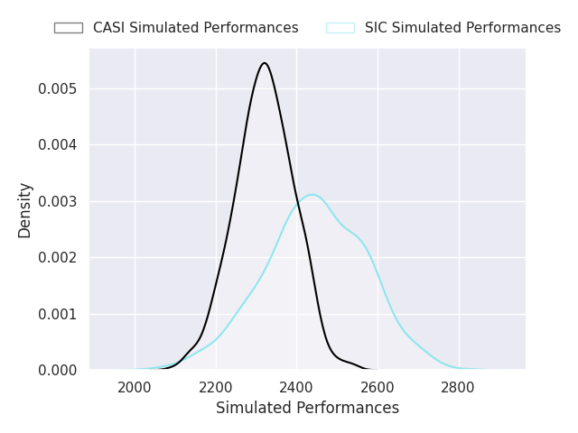

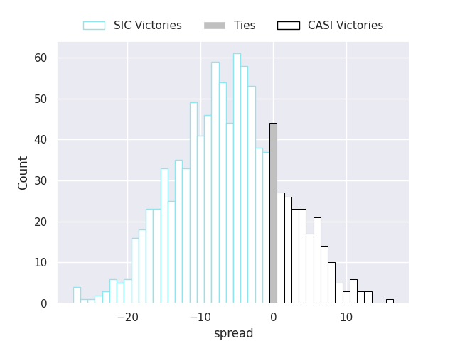

### Belgrano AC V CUBA on 2026/10/03

Average Margin: Belgrano AC by 12.7

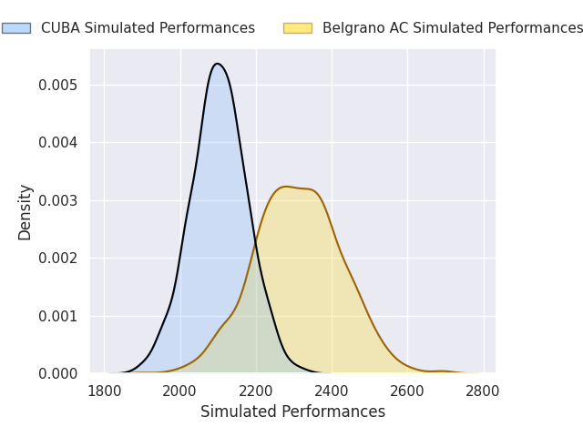

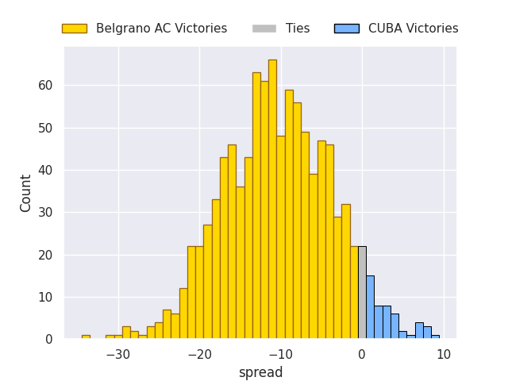

### Alumni V Atlético del Rosario on 2026/10/03

Average Margin: Alumni by 20.4

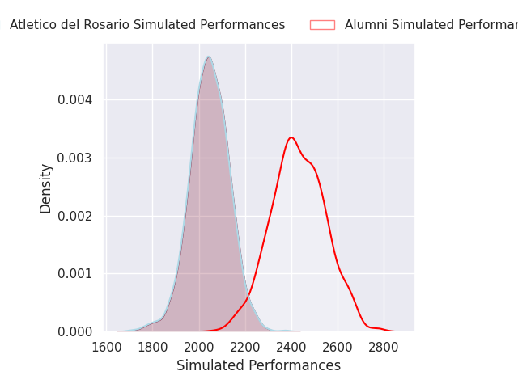
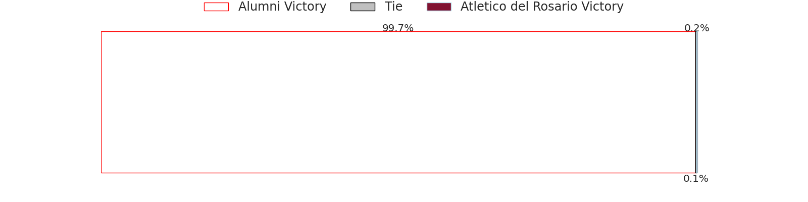
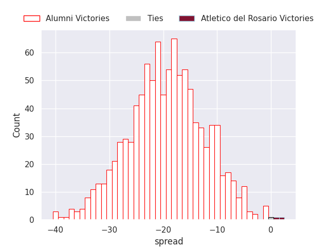

### Hindu V La Plata on 2026/10/03

Average Margin: Hindu by 11.4

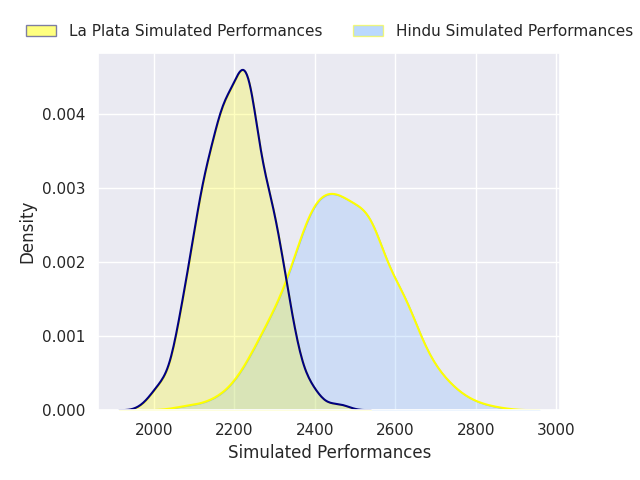

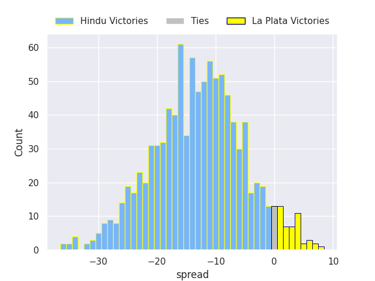

### Champagnat V Regatas Bella Vista on 2026/10/03

Average Margin: Regatas Bella Vista by 3.6

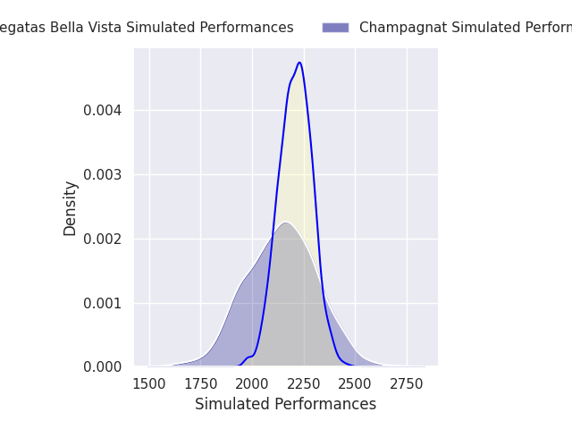
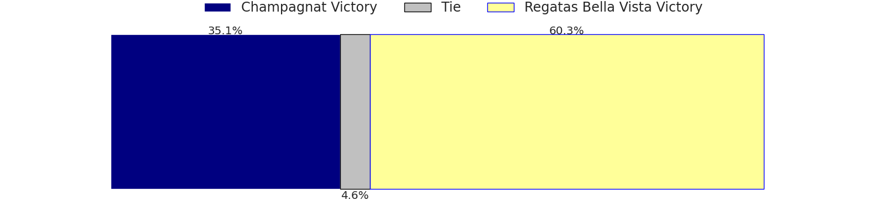
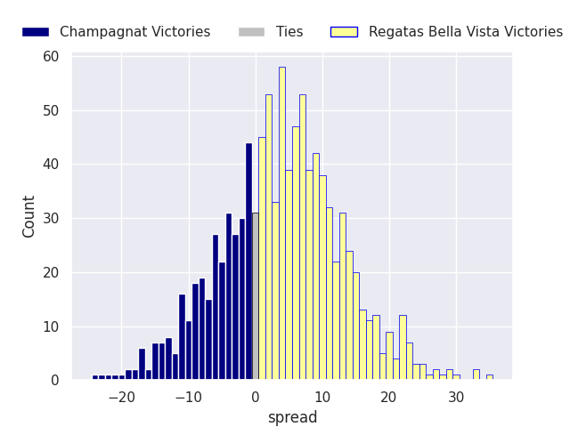

### Buenos Aires V Los Matreros on 2026/10/03

Average Margin: Buenos Aires by 20.0

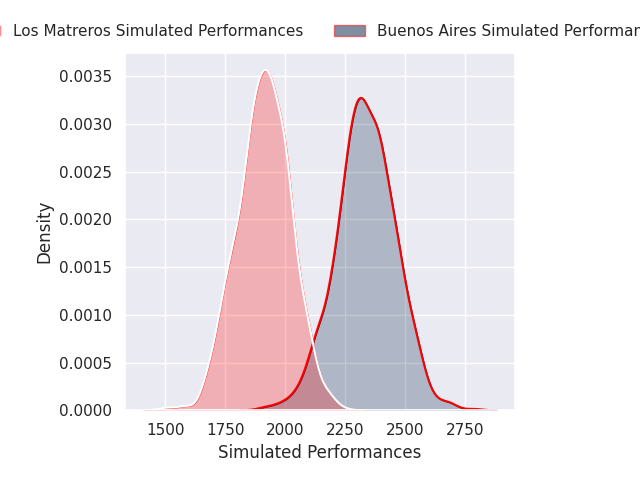
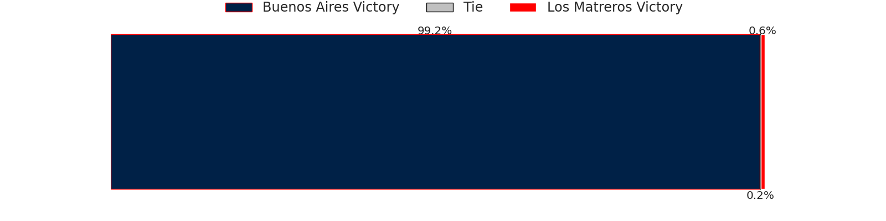
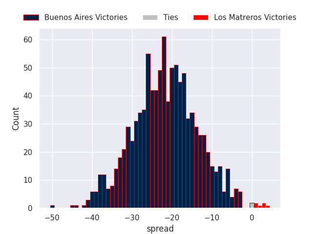

### Newman V Los Tilos on 2026/10/03

Average Margin: Newman by 12.1

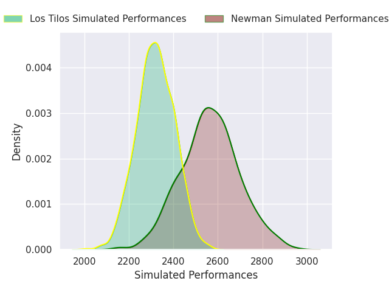

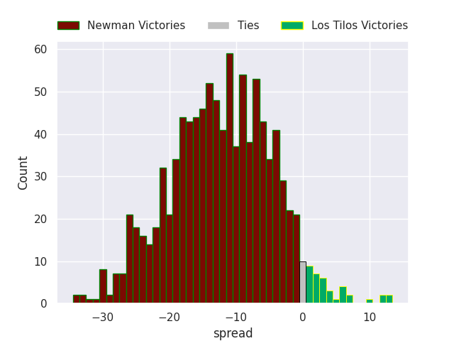

## Week 29

### Buenos Aires V Belgrano AC on 2026/10/10

Average Margin: Buenos Aires by 2.9

### Los Matreros V La Plata on 2026/10/10

Average Margin: La Plata by 10.6

### CASI V Newman on 2026/10/10

Average Margin: Newman by 3.8

### Atlético del Rosario V Champagnat on 2026/10/10

Average Margin: Atlético del Rosario by 1.4

### Regatas Bella Vista V Hindu on 2026/10/10

Average Margin: Hindu by 5.6

### Los Tilos V Alumni on 2026/10/10

Average Margin: Los Tilos by 2.4

### CUBA V SIC on 2026/10/10

Average Margin: SIC by 11.1

## Week 30

### Alumni V CASI on 2026/10/17

Average Margin: Alumni by 4.9

### Belgrano AC V Los Matreros on 2026/10/17

Average Margin: Belgrano AC by 21.2

### SIC V Buenos Aires on 2026/10/17

Average Margin: SIC by 8.8

### La Plata V Regatas Bella Vista on 2026/10/17

Average Margin: La Plata by 4.4

### Champagnat V Los Tilos on 2026/10/17

Average Margin: Los Tilos by 7.2

### Hindu V Atlético del Rosario on 2026/10/17

Average Margin: Hindu by 21.8

### Newman V CUBA on 2026/10/17

Average Margin: Newman by 22.5

