# Team Rankings

# Standings

## Current Standings

| Club                 |   Played |   Wins |   Point Differential |   Losing Bonus Points |   Try Bonus Points |   Competition Points |
|:---------------------|---------:|-------:|---------------------:|----------------------:|-------------------:|---------------------:|
| CASI                 |       15 |      9 |                  102 |                     3 |                  9 |                   48 |
| Hindu                |       13 |     11 |                  140 |                     1 |                  1 |                   46 |
| SIC                  |       13 |      9 |                  147 |                     2 |                  6 |                   44 |
| Alumni               |       16 |      8 |                    8 |                     4 |                  8 |                   44 |
| Belgrano AC          |       16 |      7 |                  -48 |                     4 |                  8 |                   40 |
| Newman               |       10 |      8 |                  117 |                     0 |                  6 |                   38 |
| CUBA                 |       14 |      4 |                   10 |                     7 |                  6 |                   29 |
| Atlético del Rosario |       16 |      6 |                  -45 |                     4 |                  1 |                   29 |
| Buenos Aires         |       12 |      6 |                  -50 |                     2 |                  2 |                   28 |
| Regatas Bella Vista  |       10 |      5 |                  -46 |                     2 |                  4 |                   26 |
| La Plata             |       14 |      5 |                  -56 |                     4 |                  1 |                   25 |
| Los Matreros         |       13 |      5 |                 -122 |                     1 |                  4 |                   25 |
| Los Tilos            |        9 |      4 |                  -55 |                     2 |                  4 |                   22 |
| Champagnat           |       11 |      4 |                 -102 |                     1 |                  2 |                   19 |

## Projected Remaining Table

| Club                 |   To Play |   Projected Wins |   Projected Differential |   Projected Losing Bonus Points |   Projected Try Bonus Points |   Projected Competition Points |
|:---------------------|----------:|-----------------:|-------------------------:|--------------------------------:|-----------------------------:|-------------------------------:|
| SIC                  |         8 |            6.475 |                   82.297 |                           0.925 |                            3 |                         30.183 |
| Newman               |         8 |            6.416 |                   75.892 |                           1.007 |                            1 |                         28.103 |
| CASI                 |         7 |            5.429 |                   66.167 |                           0.904 |                            3 |                         25.968 |
| Los Tilos            |         8 |            4.662 |                   21.195 |                           1.827 |                            3 |                         24.093 |
| Belgrano AC          |         8 |            5.216 |                   32.325 |                           1.561 |                            1 |                         24.059 |
| Hindu                |         8 |            5.241 |                   40.43  |                           1.642 |                              |                         23.214 |
| CUBA                 |         8 |            3.671 |                   -1.48  |                           2.194 |                            3 |                         20.646 |
| Alumni               |         7 |            3.37  |                    1.797 |                           1.673 |                            2 |                         17.635 |
| Buenos Aires         |         7 |            2.711 |                  -17.551 |                           1.568 |                              |                         12.776 |
| Regatas Bella Vista  |         8 |            2.391 |                  -36.74  |                           2.215 |                              |                         12.395 |
| Los Matreros         |         8 |            2.011 |                  -60.869 |                           1.691 |                            2 |                         12.123 |
| Champagnat           |         8 |            1.698 |                  -67.86  |                           1.459 |                            1 |                          9.581 |
| La Plata             |         7 |            1.591 |                  -52.166 |                           1.746 |                              |                          8.508 |
| Atlético del Rosario |         8 |            1.451 |                  -83.437 |                           1.512 |                              |                          7.64  |

## Projected Total Table

| Club                 |   Played |   Wins |   Point Differential |   Losing Bonus Points |   Try Bonus Points |   Competition Points |
|:---------------------|---------:|-------:|---------------------:|----------------------:|-------------------:|---------------------:|
| SIC                  |       21 | 15.475 |              229.297 |                 2.925 |                  9 |               74.183 |
| CASI                 |       22 | 14.429 |              168.167 |                 3.904 |                 12 |               73.968 |
| Hindu                |       21 | 16.241 |              180.43  |                 2.642 |                  1 |               69.214 |
| Newman               |       18 | 14.416 |              192.892 |                 1.007 |                  7 |               66.103 |
| Belgrano AC          |       24 | 12.216 |              -15.675 |                 5.561 |                  9 |               64.059 |
| Alumni               |       23 | 11.37  |                9.797 |                 5.673 |                 10 |               61.635 |
| CUBA                 |       22 |  7.671 |                8.52  |                 9.194 |                  9 |               49.646 |
| Los Tilos            |       17 |  8.662 |              -33.805 |                 3.827 |                  7 |               46.093 |
| Buenos Aires         |       19 |  8.711 |              -67.551 |                 3.568 |                  2 |               40.776 |
| Regatas Bella Vista  |       18 |  7.391 |              -82.74  |                 4.215 |                  4 |               38.395 |
| Los Matreros         |       21 |  7.011 |             -182.869 |                 2.691 |                  6 |               37.123 |
| Atlético del Rosario |       24 |  7.451 |             -128.437 |                 5.512 |                  1 |               36.64  |
| La Plata             |       21 |  6.591 |             -108.166 |                 5.746 |                  1 |               33.508 |
| Champagnat           |       19 |  5.698 |             -169.86  |                 2.459 |                  3 |               28.581 |

# Completed Match Review

| Model | Percent Correct Predictions | Spread Error |
| ------ | ------ | ------ |
| Club Level | 69.0% | 9.9 |
| Player Level: Lineup | nan% | nan |
| Player Level: Minutes | nan% | nan |

# Future Predictions

## Week 17

### Champagnat V Alumni on 2026/05/09

Average Margin: Alumni by 0.3

### Los Matreros V CASI on 2026/05/09

Average Margin: CASI by 9.9

### Hindu V Newman on 2026/05/09

Average Margin: Hindu by 1.5

### Los Tilos V CUBA on 2026/05/09

Average Margin: Los Tilos by 4.8

### Atlético del Rosario V Buenos Aires on 2026/05/09

Average Margin: Atlético del Rosario by 5.1

### La Plata V SIC on 2026/05/09

Average Margin: SIC by 10.9

### Regatas Bella Vista V Belgrano AC on 2026/05/09

Average Margin: Regatas Bella Vista by 3.7

## Week 18

### Champagnat V Los Matreros on 2026/05/16

Average Margin: Champagnat by 9.4

### Buenos Aires V Los Tilos on 2026/05/16

Average Margin: Los Tilos by 0.9

### Belgrano AC V Atlético del Rosario on 2026/05/16

Average Margin: Belgrano AC by 8.4

### Alumni V Hindu on 2026/05/16

Average Margin: Hindu by 2.0

### Newman V La Plata on 2026/05/16

Average Margin: Newman by 19.7

### CUBA V CASI on 2026/05/16

Average Margin: CASI by 2.2

### SIC V Regatas Bella Vista on 2026/05/16

Average Margin: SIC by 10.5

## Week 19

### Los Matreros V CUBA on 2026/05/23

Average Margin: CUBA by 2.6

### CASI V Buenos Aires on 2026/05/23

Average Margin: CASI by 14.1

### Atlético del Rosario V SIC on 2026/05/23

Average Margin: SIC by 8.8

### La Plata V Alumni on 2026/05/23

Average Margin: Alumni by 4.1

### Los Tilos V Belgrano AC on 2026/05/23

Average Margin: Los Tilos by 3.5

### Hindu V Champagnat on 2026/05/23

Average Margin: Hindu by 14.7

### Regatas Bella Vista V Newman on 2026/05/23

Average Margin: Newman by 5.3

## Week 20

### Alumni V SIC on 2026/08/01

Average Margin: SIC by 2.4

### Regatas Bella Vista V CASI on 2026/08/01

Average Margin: CASI by 4.1

### Hindu V Buenos Aires on 2026/08/01

Average Margin: Hindu by 13.3

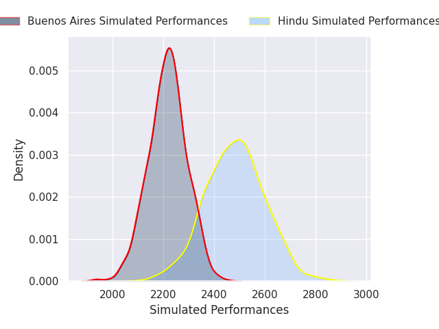

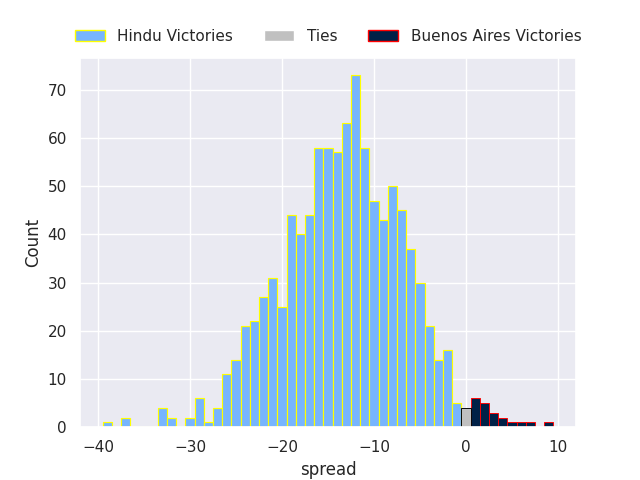

### Champagnat V Belgrano AC on 2026/08/01

Average Margin: Belgrano AC by 8.3

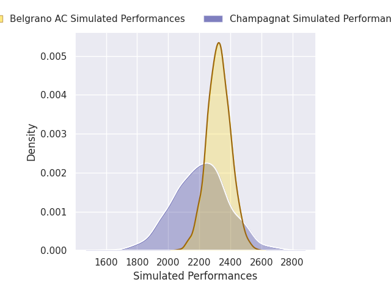
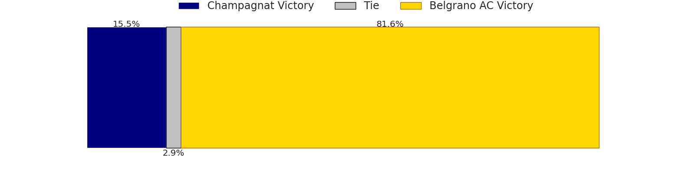
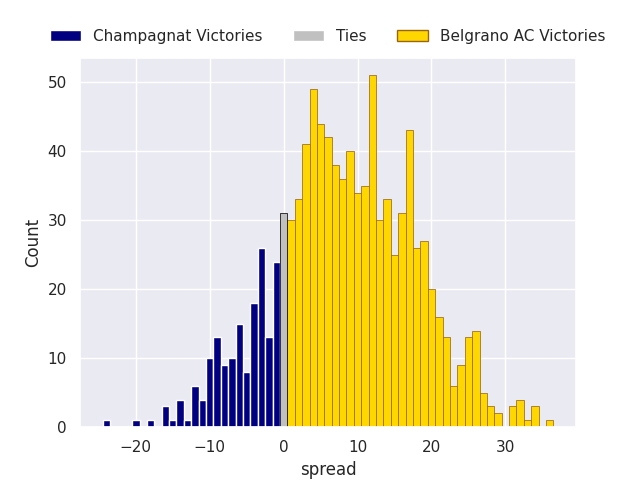

### La Plata V CUBA on 2026/08/01

Average Margin: La Plata by 5.2

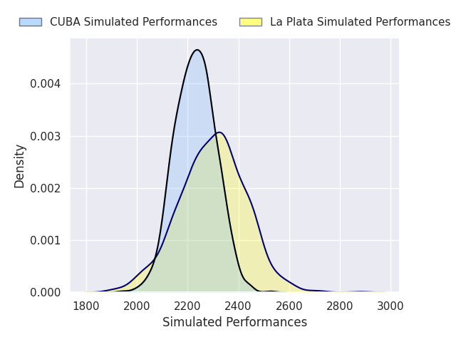
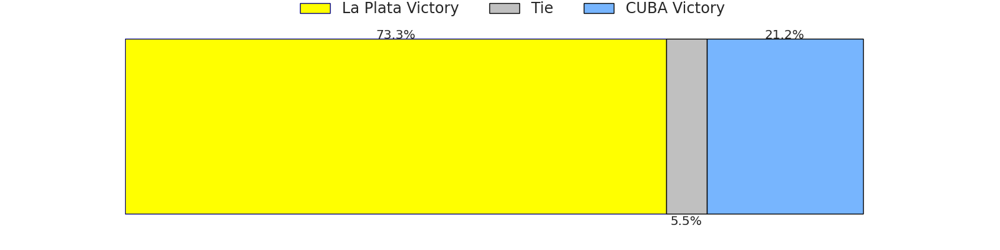
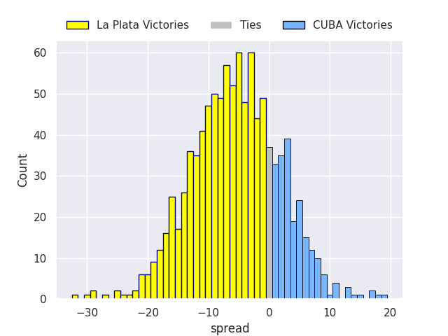

### Los Matreros V Newman on 2026/08/01

Average Margin: Newman by 9.2

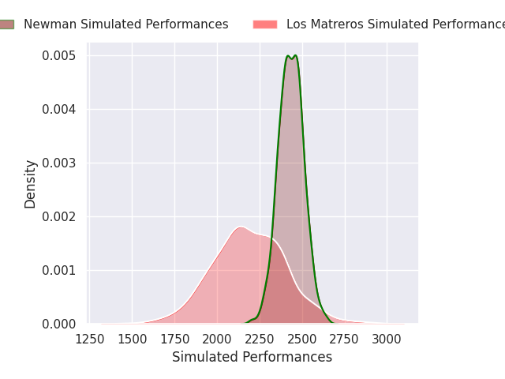
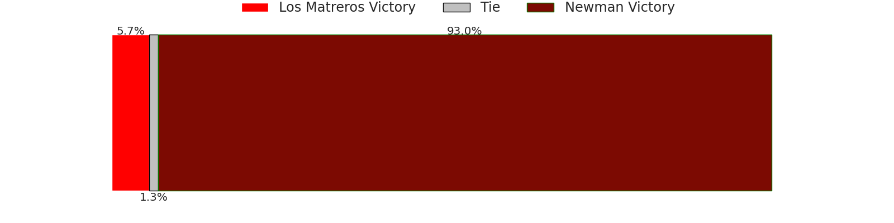
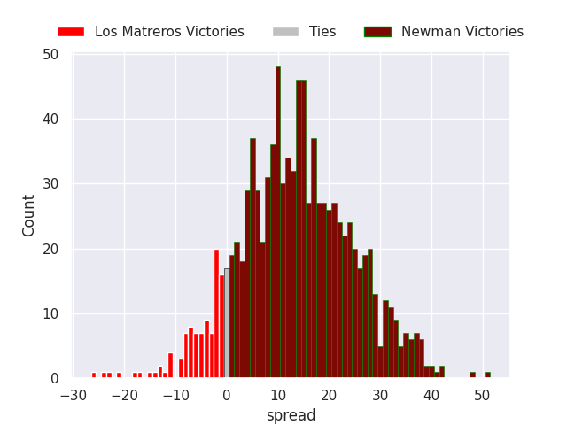

### Atlético del Rosario V Los Tilos on 2026/08/01

Average Margin: Los Tilos by 8.9

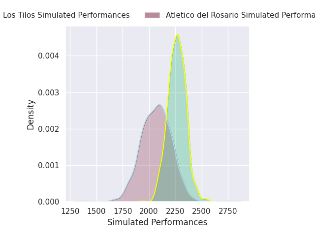
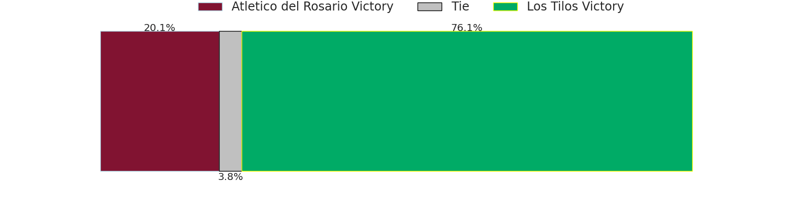
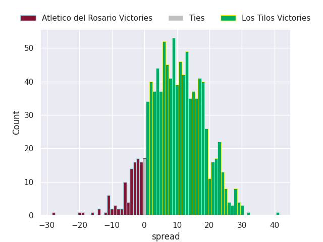

## Week 21

### Belgrano AC V Hindu on 2026/08/15

Average Margin: Belgrano AC by 0.4

### CASI V Atlético del Rosario on 2026/08/15

Average Margin: CASI by 21.5

### Buenos Aires V La Plata on 2026/08/15

Average Margin: Buenos Aires by 4.9

### CUBA V Regatas Bella Vista on 2026/08/15

Average Margin: CUBA by 0.6

### Los Tilos V Los Matreros on 2026/08/15

Average Margin: Los Tilos by 10.6

### Newman V Alumni on 2026/08/15

Average Margin: Newman by 11.6

### SIC V Champagnat on 2026/08/15

Average Margin: SIC by 17.8

## Week 22

### Los Tilos V CASI on 2026/08/22

Average Margin: CASI by 0.2

### Champagnat V Newman on 2026/08/22

Average Margin: Newman by 12.6

### Atlético del Rosario V CUBA on 2026/08/22

Average Margin: CUBA by 4.1

### Regatas Bella Vista V Buenos Aires on 2026/08/22

Average Margin: Regatas Bella Vista by 3.7

### La Plata V Belgrano AC on 2026/08/22

Average Margin: Belgrano AC by 4.6

### Hindu V SIC on 2026/08/22

Average Margin: Hindu by 3.5

### Los Matreros V Alumni on 2026/08/22

Average Margin: Alumni by 0.8

## Week 23

### Alumni V Champagnat on 2026/08/29

Average Margin: Alumni by 12.7

### Belgrano AC V Regatas Bella Vista on 2026/08/29

Average Margin: Belgrano AC by 9.8

### CASI V Los Matreros on 2026/08/29

Average Margin: CASI by 14.1

### Newman V Hindu on 2026/08/29

Average Margin: Newman by 5.3

### CUBA V Los Tilos on 2026/08/29

Average Margin: Los Tilos by 0.7

### Buenos Aires V Atlético del Rosario on 2026/08/29

Average Margin: Buenos Aires by 14.6

### SIC V La Plata on 2026/08/29

Average Margin: SIC by 13.2

## Week 24

### CUBA V Los Matreros on 2026/09/12

Average Margin: CUBA by 4.2

### Belgrano AC V Los Tilos on 2026/09/12

Average Margin: Belgrano AC by 8.1

### Newman V Regatas Bella Vista on 2026/09/12

Average Margin: Newman by 13.8

### SIC V Atlético del Rosario on 2026/09/12

Average Margin: SIC by 22.3

### Champagnat V Hindu on 2026/09/12

Average Margin: Hindu by 11.0

