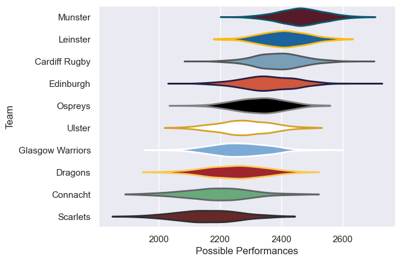

---  
title: "United Rugby Championship 08/09 Status"  
date: 2025-07-28 6:00:00 -0500  
categories: model review projection  
layout: article  
aside:  
    toc: true  
---
# Current Team Rankings

# Standings

## Current Standings

| Club             |   Played |   Wins |   Point Differential |   Losing Bonus Points |   Try Bonus Points |   Competition Points |
|:-----------------|---------:|-------:|---------------------:|----------------------:|-------------------:|---------------------:|
| Munster          |       18 |     14 |                  148 |                     1 |                  6 |                   63 |
| Edinburgh        |       18 |     11 |                  120 |                     5 |                  6 |                   55 |
| Leinster         |       18 |     11 |                  131 |                     2 |                  4 |                   52 |
| Ospreys          |       18 |     11 |                   78 |                     5 |                  3 |                   52 |
| Scarlets         |       18 |      9 |                  -19 |                     1 |                  3 |                   40 |
| Cardiff Rugby    |       18 |      8 |                  -39 |                     2 |                  2 |                   38 |
| Glasgow Warriors |       18 |      7 |                  -26 |                     5 |                  4 |                   37 |
| Ulster           |       18 |      7 |                  -33 |                     6 |                  2 |                   36 |
| Dragons          |       18 |      7 |                 -124 |                     4 |                  1 |                   33 |
| Connacht         |       18 |      4 |                 -236 |                     3 |                  1 |                   20 |

# Completed Match Review

| Model | Percent Correct Predictions | Spread Error |
| ------ | ------ | ------ |
| Club Level | 63.3% | 12.6 |
| Player Level: Lineup | nan% | nan |
| Player Level: Minutes | nan% | nan |

