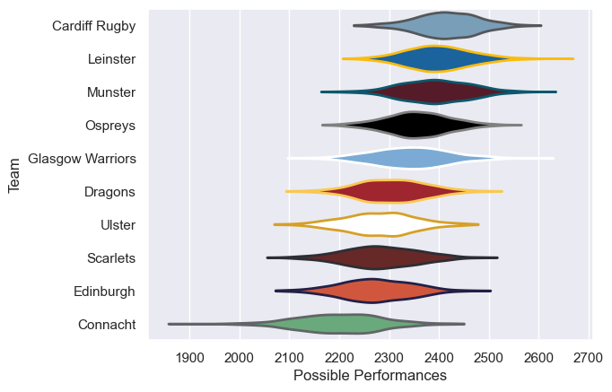

---  
title: "United Rugby Championship 09/10 Status"  
date: 2025-07-28 6:00:00 -0500  
categories: model review projection  
layout: article  
aside:  
    toc: true  
---
# Current Team Rankings

# Standings

## Current Standings

| Club             |   Played |   Wins |   Point Differential |   Losing Bonus Points |   Try Bonus Points |   Competition Points |
|:-----------------|---------:|-------:|---------------------:|----------------------:|-------------------:|---------------------:|
| Ospreys          |       20 |     13 |                  106 |                     3 |                  3 |                   60 |
| Leinster         |       20 |     14 |                   69 |                     3 |                  1 |                   60 |
| Glasgow Warriors |       19 |     11 |                   54 |                     1 |                  2 |                   51 |
| Munster          |       19 |      9 |                   32 |                     6 |                  3 |                   45 |
| Cardiff Rugby    |       18 |     10 |                   34 |                     2 |                  2 |                   44 |
| Edinburgh        |       18 |      8 |                   -6 |                     5 |                  3 |                   40 |
| Dragons          |       18 |      8 |                  -45 |                     2 |                  3 |                   39 |
| Ulster           |       18 |      7 |                  -13 |                     2 |                  4 |                   36 |
| Scarlets         |       18 |      5 |                  -21 |                     8 |                  1 |                   29 |
| Connacht         |       18 |      5 |                 -210 |                     3 |                    |                   25 |

# Completed Match Review

| Model | Percent Correct Predictions | Spread Error |
| ------ | ------ | ------ |
| Club Level | 61.3% | 10.1 |
| Player Level: Lineup | nan% | nan |
| Player Level: Minutes | nan% | nan |

