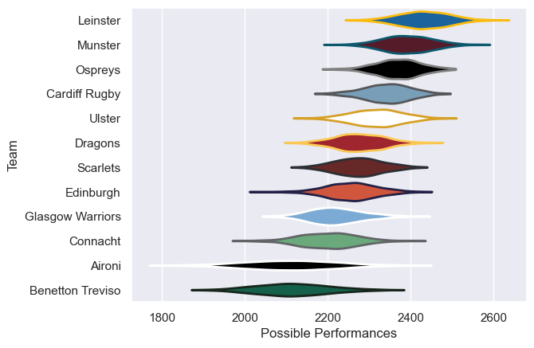

---  
title: "United Rugby Championship 10/11 Status"  
date: 2025-07-28 6:00:00 -0500  
categories: model review projection  
layout: article  
aside:  
    toc: true  
---
# Current Team Rankings

# Standings

## Current Standings

| Club             |   Played |   Wins |   Point Differential |   Losing Bonus Points |   Try Bonus Points |   Competition Points |
|:-----------------|---------:|-------:|---------------------:|----------------------:|-------------------:|---------------------:|
| Munster          |       24 |     21 |                  186 |                     2 |                  5 |                   91 |
| Leinster         |       24 |     16 |                  164 |                     3 |                  5 |                   74 |
| Ulster           |       23 |     15 |                   47 |                     2 |                  3 |                   67 |
| Ospreys          |       23 |     12 |                  128 |                     8 |                  5 |                   63 |
| Scarlets         |       22 |     12 |                   50 |                     7 |                  5 |                   62 |
| Cardiff Rugby    |       22 |     13 |                   87 |                     3 |                  3 |                   60 |
| Dragons          |       22 |     10 |                  -18 |                     4 |                  3 |                   49 |
| Edinburgh        |       22 |      9 |                  -39 |                     5 |                  2 |                   43 |
| Benetton Treviso |       22 |      9 |                 -128 |                     2 |                    |                   38 |
| Connacht         |       22 |      7 |                  -65 |                     6 |                  1 |                   37 |
| Glasgow Warriors |       22 |      6 |                 -142 |                     6 |                  1 |                   33 |
| Aironi           |       22 |      1 |                 -270 |                     8 |                    |                   12 |

# Completed Match Review

| Model | Percent Correct Predictions | Spread Error |
| ------ | ------ | ------ |
| Club Level | 71.9% | 8.6 |
| Player Level: Lineup | nan% | nan |
| Player Level: Minutes | nan% | nan |

