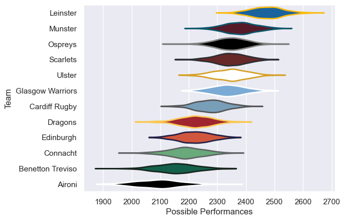

---  
title: "United Rugby Championship 11/12 Status"  
date: 2025-07-28 6:00:00 -0500  
categories: model review projection  
layout: article  
aside:  
    toc: true  
---
# Current Team Rankings

# Standings

## Current Standings

| Club             |   Played |   Wins |   Point Differential |   Losing Bonus Points |   Try Bonus Points |   Competition Points |
|:-----------------|---------:|-------:|---------------------:|----------------------:|-------------------:|---------------------:|
| Leinster         |       25 |     19 |                  246 |                     2 |                  5 |                   89 |
| Ospreys          |       23 |     17 |                  189 |                     3 |                  2 |                   75 |
| Glasgow Warriors |       23 |     13 |                  120 |                     4 |                  2 |                   66 |
| Munster          |       23 |     14 |                   87 |                     4 |                  3 |                   65 |
| Scarlets         |       22 |     12 |                   70 |                     5 |                  4 |                   61 |
| Ulster           |       22 |     12 |                   50 |                     3 |                  5 |                   56 |
| Cardiff Rugby    |       22 |     10 |                  -14 |                     5 |                  5 |                   50 |
| Connacht         |       22 |      7 |                 -112 |                     7 |                    |                   37 |
| Dragons          |       22 |      7 |                 -104 |                     5 |                  1 |                   36 |
| Benetton Treviso |       22 |      7 |                 -139 |                     5 |                  2 |                   35 |
| Edinburgh        |       22 |      6 |                 -134 |                     4 |                  2 |                   32 |
| Aironi           |       22 |      4 |                 -259 |                     5 |                  1 |                   22 |

# Completed Match Review

| Model | Percent Correct Predictions | Spread Error |
| ------ | ------ | ------ |
| Club Level | 71.9% | 9.1 |
| Player Level: Lineup | nan% | nan |
| Player Level: Minutes | nan% | nan |

