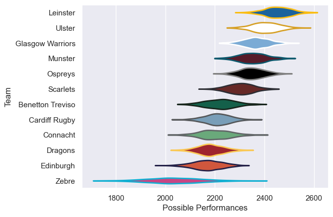

---  
title: "United Rugby Championship 12/13"  
date: 2025-07-29 6:00:00 -0500  
categories: model review projection  
layout: article  
aside:  
    toc: true  
---
# Current Team Rankings

# Standings

## Current Standings

| Club             |   Played |   Wins |   Point Differential |   Losing Bonus Points |   Try Bonus Points |   Competition Points |
|:-----------------|---------:|-------:|---------------------:|----------------------:|-------------------:|---------------------:|
| Ulster           |       24 |     18 |                  236 |                     4 |                  8 |                   86 |
| Leinster         |       24 |     19 |                  207 |                     1 |                  8 |                   85 |
| Glasgow Warriors |       23 |     16 |                  215 |                     4 |                  9 |                   77 |
| Ospreys          |       23 |     15 |                  140 |                     2 |                  2 |                   66 |
| Scarlets         |       23 |     15 |                   17 |                     3 |                  3 |                   66 |
| Munster          |       22 |     11 |                   53 |                     4 |                  3 |                   53 |
| Benetton Treviso |       22 |     10 |                  -36 |                     2 |                  4 |                   50 |
| Connacht         |       22 |      8 |                  -64 |                     3 |                  1 |                   38 |
| Cardiff Rugby    |       22 |      8 |                 -139 |                     5 |                  1 |                   38 |
| Edinburgh        |       22 |      7 |                 -105 |                     7 |                  1 |                   36 |
| Dragons          |       23 |      6 |                 -242 |                     3 |                  1 |                   28 |
| Zebre            |       22 |      0 |                 -282 |                     9 |                  1 |                   10 |

# Completed Match Review

| Model | Percent Correct Predictions | Spread Error |
| ------ | ------ | ------ |
| Club Level | 72.8% | 10.7 |
| Player Level: Lineup | nan% | nan |
| Player Level: Minutes | nan% | nan |

