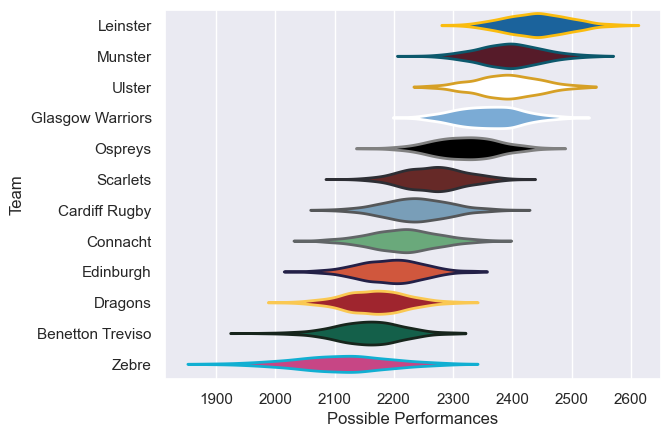

---  
title: "United Rugby Championship 13/14"  
date: 2025-07-29 6:00:00 -0500  
categories: model review projection  
layout: article  
aside:  
    toc: true  
---
# Current Team Rankings

# Standings

## Current Standings

| Club             |   Played |   Wins |   Point Differential |   Losing Bonus Points |   Try Bonus Points |   Competition Points |
|:-----------------|---------:|-------:|---------------------:|----------------------:|-------------------:|---------------------:|
| Glasgow Warriors |       25 |     19 |                  176 |                     3 |                  4 |                   87 |
| Leinster         |       23 |     18 |                  206 |                     4 |                  6 |                   84 |
| Munster          |       23 |     16 |                  198 |                     4 |                  7 |                   75 |
| Ulster           |       23 |     15 |                  147 |                     5 |                  6 |                   71 |
| Ospreys          |       22 |     13 |                  183 |                     6 |                  5 |                   65 |
| Scarlets         |       22 |     11 |                   -3 |                     6 |                  3 |                   55 |
| Cardiff Rugby    |       22 |      8 |                 -113 |                     6 |                  1 |                   41 |
| Edinburgh        |       22 |      7 |                 -129 |                     8 |                  2 |                   38 |
| Dragons          |       22 |      7 |                 -100 |                     5 |                    |                   35 |
| Connacht         |       22 |      6 |                 -138 |                     7 |                  2 |                   33 |
| Benetton Treviso |       22 |      5 |                 -215 |                     7 |                  1 |                   30 |
| Zebre            |       22 |      5 |                 -212 |                     5 |                    |                   29 |

# Completed Match Review

| Model | Percent Correct Predictions | Spread Error |
| ------ | ------ | ------ |
| Club Level | 70.4% | 9.5 |
| Player Level: Lineup | nan% | nan |
| Player Level: Minutes | nan% | nan |

