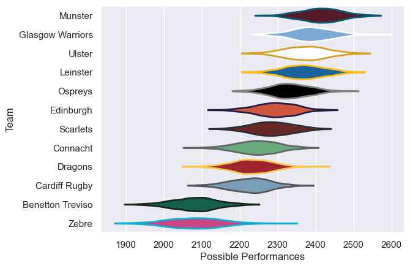

---  
title: "United Rugby Championship 14/15"  
date: 2025-07-29 6:00:00 -0500  
categories: model review projection  
layout: article  
aside:  
    toc: true  
---
# Current Team Rankings

# Standings

## Current Standings

| Club             |   Played |   Wins |   Point Differential |   Losing Bonus Points |   Try Bonus Points |   Competition Points |
|:-----------------|---------:|-------:|---------------------:|----------------------:|-------------------:|---------------------:|
| Glasgow Warriors |       25 |     17 |                  182 |                     0 |                  9 |                   83 |
| Munster          |       23 |     16 |                  217 |                     3 |                  7 |                   78 |
| Ospreys          |       23 |     16 |                  185 |                     3 |                  6 |                   75 |
| Ulster           |       23 |     14 |                  150 |                     4 |                  6 |                   70 |
| Leinster         |       22 |     11 |                  108 |                     4 |                  8 |                   62 |
| Scarlets         |       22 |     11 |                   64 |                     3 |                  4 |                   57 |
| Connacht         |       22 |     10 |                   28 |                     5 |                  3 |                   50 |
| Edinburgh        |       22 |     10 |                  -20 |                     3 |                  3 |                   48 |
| Dragons          |       22 |      8 |                  -91 |                     6 |                  4 |                   42 |
| Cardiff Rugby    |       22 |      7 |                 -115 |                     2 |                  3 |                   35 |
| Benetton Treviso |       22 |      3 |                 -335 |                     3 |                  2 |                   19 |
| Zebre            |       22 |      3 |                 -373 |                     3 |                    |                   15 |

# Completed Match Review

| Model | Percent Correct Predictions | Spread Error |
| ------ | ------ | ------ |
| Club Level | 70.4% | 9.7 |
| Player Level: Lineup | nan% | nan |
| Player Level: Minutes | nan% | nan |

