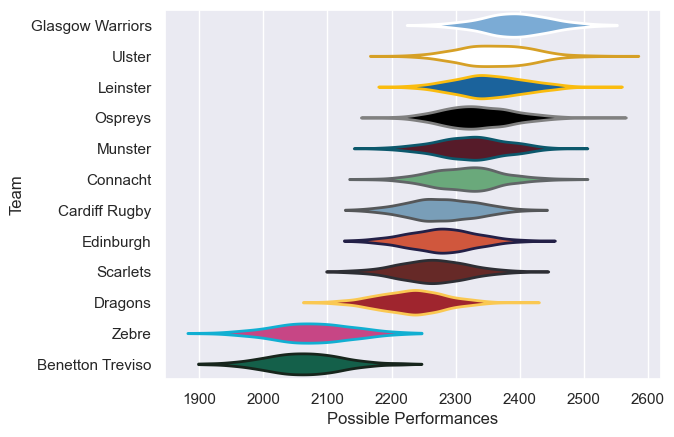

---  
title: "United Rugby Championship 15/16"  
date: 2025-07-29 6:00:00 -0500  
categories: model review projection  
layout: article  
aside:  
    toc: true  
---
# Current Team Rankings

# Standings

## Current Standings

| Club             |   Played |   Wins |   Point Differential |   Losing Bonus Points |   Try Bonus Points |   Competition Points |
|:-----------------|---------:|-------:|---------------------:|----------------------:|-------------------:|---------------------:|
| Connacht         |       25 |     16 |                  106 |                     5 |                  6 |                   79 |
| Leinster         |       23 |     17 |                  180 |                     3 |                  6 |                   77 |
| Glasgow Warriors |       23 |     14 |                  172 |                     7 |                  8 |                   73 |
| Ulster           |       23 |     14 |                  169 |                     5 |                  8 |                   69 |
| Munster          |       22 |     13 |                   42 |                     5 |                  6 |                   63 |
| Scarlets         |       22 |     14 |                   19 |                     5 |                  2 |                   63 |
| Cardiff Rugby    |       22 |     11 |                   81 |                     7 |                  5 |                   56 |
| Ospreys          |       22 |     11 |                   35 |                     3 |                  6 |                   55 |
| Edinburgh        |       22 |     11 |                   39 |                     8 |                  2 |                   54 |
| Dragons          |       22 |      4 |                 -139 |                    10 |                    |                   26 |
| Zebre            |       22 |      5 |                 -410 |                     1 |                  3 |                   24 |
| Benetton Treviso |       22 |      3 |                 -294 |                     8 |                    |                   20 |

# Completed Match Review

| Model | Percent Correct Predictions | Spread Error |
| ------ | ------ | ------ |
| Club Level | 71.9% | 9.6 |
| Player Level: Lineup | nan% | nan |
| Player Level: Minutes | nan% | nan |

