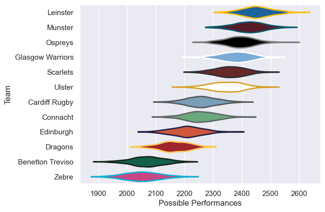

---  
title: "United Rugby Championship 16/17"  
date: 2025-07-29 6:00:00 -0500  
categories: model review projection  
layout: article  
aside:  
    toc: true  
---
# Current Team Rankings

# Standings

## Current Standings

| Club             |   Played |   Wins |   Point Differential |   Losing Bonus Points |   Try Bonus Points |   Competition Points |
|:-----------------|---------:|-------:|---------------------:|----------------------:|-------------------:|---------------------:|
| Munster          |       24 |     20 |                  282 |                     1 |                  9 |                   90 |
| Scarlets         |       24 |     19 |                  214 |                     0 |                 10 |                   86 |
| Leinster         |       23 |     18 |                  272 |                     1 |                 11 |                   84 |
| Ospreys          |       22 |     13 |                  162 |                     3 |                 10 |                   65 |
| Ulster           |       20 |     13 |                  143 |                     4 |                  5 |                   63 |
| Glasgow Warriors |       22 |     11 |                   76 |                     5 |                  9 |                   58 |
| Cardiff Rugby    |       22 |     11 |                   10 |                     4 |                  2 |                   52 |
| Connacht         |       22 |      9 |                  -85 |                     3 |                  5 |                   44 |
| Edinburgh        |       22 |      6 |                  -91 |                     6 |                  1 |                   31 |
| Dragons          |       21 |      4 |                 -180 |                     6 |                  1 |                   23 |
| Benetton Treviso |       22 |      5 |                 -348 |                     2 |                  1 |                   23 |
| Zebre            |       22 |      3 |                 -455 |                     6 |                  1 |                   19 |

# Completed Match Review

| Model | Percent Correct Predictions | Spread Error |
| ------ | ------ | ------ |
| Club Level | 72.2% | 11.5 |
| Player Level: Lineup | nan% | nan |
| Player Level: Minutes | nan% | nan |

