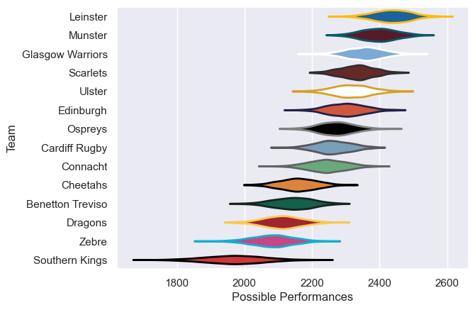

---  
title: "United Rugby Championship 17/18"  
date: 2025-07-29 6:00:00 -0500  
categories: model review projection  
layout: article  
aside:  
    toc: true  
---
# Current Team Rankings

# Standings

## Current Standings

| Club             |   Played |   Wins |   Point Differential |   Losing Bonus Points |   Try Bonus Points |   Competition Points |
|:-----------------|---------:|-------:|---------------------:|----------------------:|-------------------:|---------------------:|
| Scarlets         |       24 |     16 |                  205 |                     3 |                 12 |                   81 |
| Leinster         |       23 |     16 |                  236 |                     2 |                 10 |                   78 |
| Glasgow Warriors |       22 |     15 |                  233 |                     2 |                 12 |                   76 |
| Munster          |       23 |     14 |                  210 |                     6 |                 10 |                   74 |
| Edinburgh        |       22 |     15 |                  115 |                     2 |                  7 |                   69 |
| Ulster           |       22 |     13 |                   74 |                     2 |                  9 |                   67 |
| Cheetahs         |       22 |     12 |                   20 |                     5 |                  9 |                   62 |
| Benetton Treviso |       21 |     11 |                  -36 |                     5 |                  6 |                   55 |
| Cardiff Rugby    |       21 |     11 |                   20 |                     5 |                  5 |                   54 |
| Ospreys          |       22 |      9 |                 -115 |                     3 |                  4 |                   43 |
| Connacht         |       21 |      7 |                  -32 |                     6 |                  5 |                   39 |
| Zebre            |       21 |      7 |                 -185 |                     4 |                  3 |                   35 |
| Dragons          |       21 |      2 |                 -294 |                     4 |                  3 |                   19 |
| Southern Kings   |       21 |      1 |                 -451 |                     3 |                  4 |                   11 |

# Completed Match Review

| Model | Percent Correct Predictions | Spread Error |
| ------ | ------ | ------ |
| Club Level | 69.7% | 11.8 |
| Player Level: Lineup | nan% | nan |
| Player Level: Minutes | nan% | nan |

