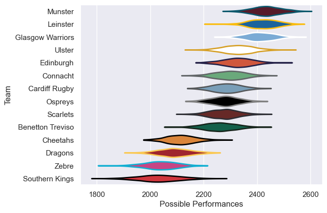

---  
title: "United Rugby Championship 18/19"  
date: 2025-07-29 6:00:00 -0500  
categories: model review projection  
layout: article  
aside:  
    toc: true  
---
# Current Team Rankings

# Standings

## Current Standings

| Club             |   Played |   Wins |   Point Differential |   Losing Bonus Points |   Try Bonus Points |   Competition Points |
|:-----------------|---------:|-------:|---------------------:|----------------------:|-------------------:|---------------------:|
| Glasgow Warriors |       23 |     17 |                  268 |                     3 |                 16 |                   87 |
| Leinster         |       23 |     17 |                  305 |                     2 |                 12 |                   84 |
| Munster          |       23 |     17 |                  251 |                     2 |                 11 |                   81 |
| Ulster           |       23 |     14 |                   -5 |                     1 |                  6 |                   67 |
| Connacht         |       22 |     12 |                   73 |                     6 |                  6 |                   60 |
| Ospreys          |       21 |     12 |                   41 |                     4 |                  6 |                   58 |
| Benetton Treviso |       22 |     11 |                   41 |                     4 |                  5 |                   57 |
| Cardiff Rugby    |       21 |     10 |                   46 |                     7 |                  7 |                   54 |
| Scarlets         |       21 |     10 |                   40 |                     5 |                  7 |                   52 |
| Edinburgh        |       21 |     10 |                   -5 |                     5 |                  5 |                   50 |
| Cheetahs         |       21 |      8 |                  -65 |                     3 |                  9 |                   46 |
| Dragons          |       21 |      5 |                 -260 |                     3 |                  1 |                   26 |
| Southern Kings   |       21 |      2 |                 -350 |                     7 |                  5 |                   22 |
| Zebre            |       21 |      3 |                 -380 |                     2 |                  5 |                   19 |

## Projected Remaining Table

| Club     |   To Play |   Projected Wins |   Projected Differential |   Projected Losing Bonus Points | Projected Try Bonus Points   |   Projected Competition Points |
|:---------|----------:|-----------------:|-------------------------:|--------------------------------:|:-----------------------------|-------------------------------:|
| Ospreys  |         1 |            0.672 |                    3.357 |                           0.154 |                              |                          2.958 |
| Scarlets |         1 |            0.27  |                   -3.357 |                           0.371 |                              |                          1.567 |

## Projected Total Table

| Club             |   Played |   Wins |   Point Differential |   Losing Bonus Points |   Try Bonus Points |   Competition Points |
|:-----------------|---------:|-------:|---------------------:|----------------------:|-------------------:|---------------------:|
| Glasgow Warriors |       23 | 17     |              268     |                 3     |                 16 |               87     |
| Leinster         |       23 | 17     |              305     |                 2     |                 12 |               84     |
| Munster          |       23 | 17     |              251     |                 2     |                 11 |               81     |
| Ulster           |       23 | 14     |               -5     |                 1     |                  6 |               67     |
| Ospreys          |       22 | 12.672 |               44.357 |                 4.154 |                  6 |               60.958 |
| Connacht         |       22 | 12     |               73     |                 6     |                  6 |               60     |
| Benetton Treviso |       22 | 11     |               41     |                 4     |                  5 |               57     |
| Cardiff Rugby    |       21 | 10     |               46     |                 7     |                  7 |               54     |
| Scarlets         |       22 | 10.27  |               36.643 |                 5.371 |                  7 |               53.567 |
| Edinburgh        |       21 | 10     |               -5     |                 5     |                  5 |               50     |
| Cheetahs         |       21 |  8     |              -65     |                 3     |                  9 |               46     |
| Dragons          |       21 |  5     |             -260     |                 3     |                  1 |               26     |
| Southern Kings   |       21 |  2     |             -350     |                 7     |                  5 |               22     |
| Zebre            |       21 |  3     |             -380     |                 2     |                  5 |               19     |

# Completed Match Review

| Model | Percent Correct Predictions | Spread Error |
| ------ | ------ | ------ |
| Club Level | 75.2% | 11.3 |
| Player Level: Lineup | nan% | nan |
| Player Level: Minutes | nan% | nan |

# Future Predictions

## Week 24

### Ospreys V Scarlets on 2019/05/18

Average Margin: Ospreys by 3.4

