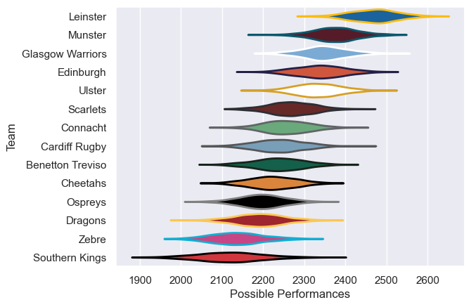

---  
title: "United Rugby Championship 19/20 Status"  
date: 2025-07-28 6:00:00 -0500  
categories: model review projection  
layout: article  
aside:  
    toc: true  
---
# Current Team Rankings

# Standings

## Current Standings

| Club             |   Played |   Wins |   Point Differential |   Losing Bonus Points |   Try Bonus Points |   Competition Points |
|:-----------------|---------:|-------:|---------------------:|----------------------:|-------------------:|---------------------:|
| Leinster         |       21 |     13 |                  295 |                     0 |                  6 |                   74 |
| Edinburgh        |       21 |     10 |                  163 |                     2 |                  2 |                   60 |
| Munster          |       21 |      9 |                  136 |                     2 |                  5 |                   59 |
| Ulster           |       21 |      8 |                  103 |                     2 |                  3 |                   55 |
| Scarlets         |       21 |      8 |                   39 |                     2 |                  2 |                   52 |
| Glasgow Warriors |       21 |      7 |                   38 |                     1 |                  5 |                   50 |
| Connacht         |       21 |      7 |                  -27 |                     1 |                  3 |                   48 |
| Benetton Treviso |       21 |      5 |                  -44 |                     4 |                  5 |                   47 |
| Cheetahs         |       21 |      6 |                   62 |                     3 |                  2 |                   45 |
| Cardiff Rugby    |       21 |      6 |                  -33 |                     2 |                  2 |                   44 |
| Dragons          |       21 |      5 |                 -111 |                     1 |                    |                   37 |
| Ospreys          |       21 |      2 |                 -161 |                     4 |                  1 |                   31 |
| Zebre            |       21 |      2 |                 -166 |                     2 |                  3 |                   31 |
| Southern Kings   |       21 |      1 |                 -294 |                     3 |                    |                   23 |

# Completed Match Review

| Model | Percent Correct Predictions | Spread Error |
| ------ | ------ | ------ |
| Club Level | 44.2% | 11.0 |
| Player Level: Lineup | nan% | nan |
| Player Level: Minutes | nan% | nan |

