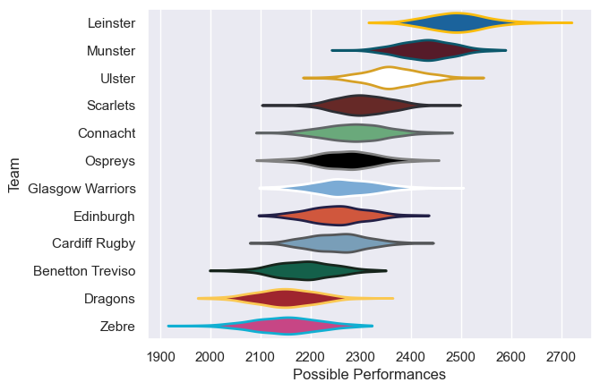

---  
title: "United Rugby Championship 20/21"  
date: 2025-07-29 6:00:00 -0500  
categories: model review projection  
layout: article  
aside:  
    toc: true  
---
# Current Team Rankings

# Standings

## Current Standings

| Club             |   Played |   Wins |   Point Differential |   Losing Bonus Points |   Try Bonus Points |   Competition Points |
|:-----------------|---------:|-------:|---------------------:|----------------------:|-------------------:|---------------------:|
| Leinster         |       21 |     19 |                  353 |                     1 |                 13 |                   90 |
| Munster          |       20 |     15 |                  178 |                     3 |                  7 |                   70 |
| Ulster           |       20 |     15 |                  163 |                     1 |                  8 |                   69 |
| Connacht         |       18 |      9 |                   12 |                     6 |                  8 |                   50 |
| Scarlets         |       18 |     10 |                   27 |                     4 |                  5 |                   49 |
| Cardiff Rugby    |       18 |      9 |                  -30 |                     1 |                  2 |                   39 |
| Ospreys          |       18 |      8 |                  -26 |                     3 |                  1 |                   38 |
| Edinburgh        |       21 |      5 |                 -100 |                     5 |                  1 |                   36 |
| Dragons          |       18 |      6 |                 -100 |                     3 |                  2 |                   31 |
| Glasgow Warriors |       16 |      6 |                  -42 |                     4 |                  2 |                   30 |
| Zebre            |       18 |      5 |                 -274 |                     2 |                    |                   22 |
| Benetton Treviso |       18 |      1 |                 -161 |                     7 |                  1 |                   14 |

# Completed Match Review

| Model | Percent Correct Predictions | Spread Error |
| ------ | ------ | ------ |
| Club Level | 62.5% | 10.7 |
| Player Level: Lineup | nan% | nan |
| Player Level: Minutes | nan% | nan |

