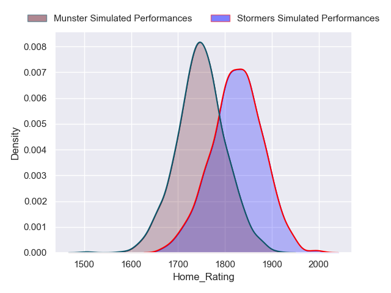
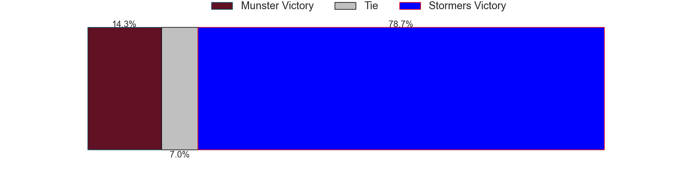
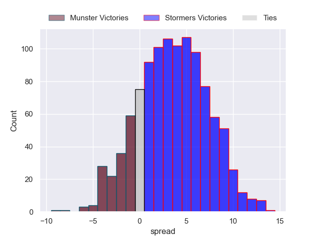

---  
title: "United Rugby Championship 2022 Status"  
date: 2023-05-19 6:00:00 -0500  
categories: model review projection  
layout: article  
aside:  
    toc: true  
---
# Standings

## Current Standings

| Club             |   Played |   Wins |   Point Differential |   Losing Bonus Points |   Try Bonus Points |   Competition Points |
|:-----------------|---------:|-------:|---------------------:|----------------------:|-------------------:|---------------------:|
| Leinster         |       20 |     17 |                  246 |                     1 |                 14 |                   85 |
| Stormers         |       20 |     15 |                  170 |                     3 |                 14 |                   77 |
| Ulster           |       19 |     13 |                  171 |                     5 |                 12 |                   69 |
| Munster          |       20 |     12 |                  123 |                     4 |                  9 |                   63 |
| Glasgow Warriors |       19 |     13 |                   86 |                     0 |                 11 |                   63 |
| Connacht         |       20 |     11 |                   17 |                     3 |                  8 |                   55 |
| Bulls            |       19 |     10 |                  153 |                     2 |                 11 |                   53 |
| Sharks           |       19 |      9 |                  -24 |                     2 |                  8 |                   48 |
| Lions            |       18 |      9 |                  -84 |                     2 |                  7 |                   45 |
| Cardiff Blues    |       18 |      9 |                  -45 |                     2 |                  6 |                   44 |
| Benetton Treviso |       18 |      8 |                  -93 |                     1 |                  8 |                   41 |
| Edinburgh        |       18 |      6 |                   -1 |                     6 |                  8 |                   38 |
| Scarlets         |       18 |      6 |                  -71 |                     3 |                nan |                   34 |
| Ospreys          |       18 |      6 |                 -114 |                     5 |                nan |                   34 |
| Dragons          |       18 |      4 |                 -143 |                     3 |                  5 |                   24 |
| Zebre            |       18 |      0 |                 -391 |                     5 |                  6 |                   11 |

## Projected Playoff Results

|          | Reach Final   | Win Final   |
|:---------|:--------------|:------------|
| Stormers | 100.0 %       | 84.6 %      |
| Munster  | 100.0 %       | 15.4 %      |

# Completed Match Review

| Model | Percent Correct Predictions | Spread Error |
| ------ | ------ | ------ |
| Club Level | 70.7% | 11.8 |
| Player Level: Lineup | 64.7% | 13.8 |
| Player Level: Minutes | 66.0% | 14.2 |

# Future Predictions

## Final

### Stormers V Munster on 2023/05/27

Average Margin: Stormers by 3.8

