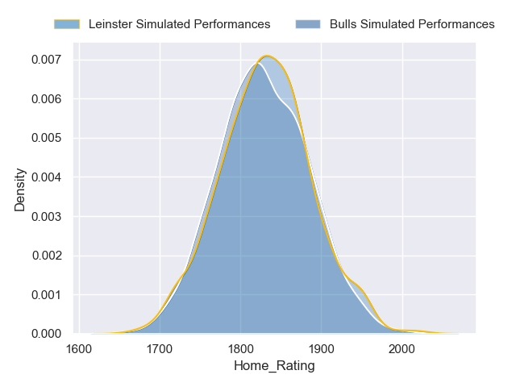
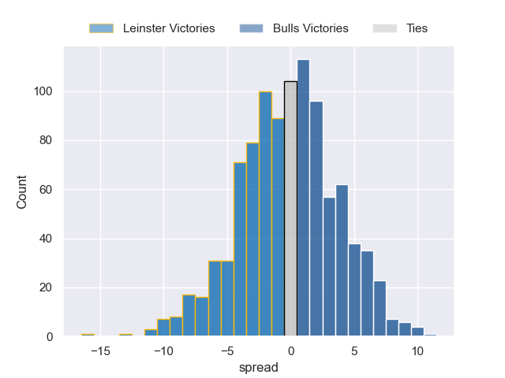
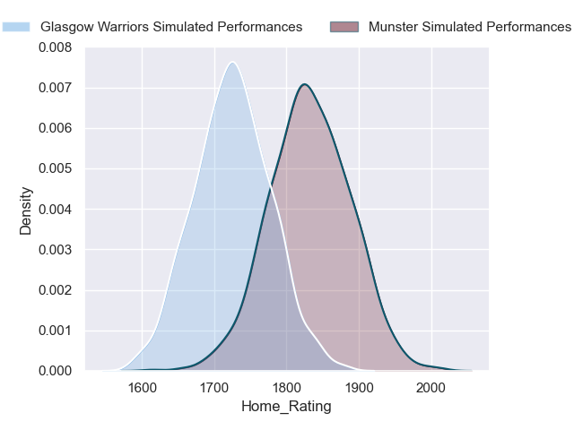
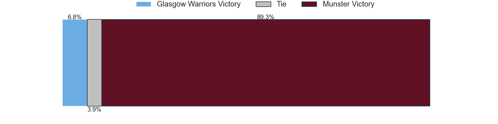
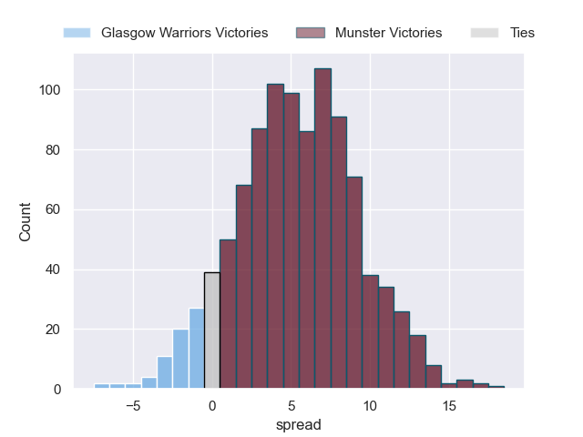

---  
title: "United Rugby Championship 2023 Status"  
date: 2024-06-10 6:00:00 -0500  
categories: model review projection  
layout: article  
aside:  
    toc: true  
---
# Current Team Rankings

# Standings

## Current Standings

| Club             |   Played |   Wins |   Point Differential |   Losing Bonus Points |   Try Bonus Points |   Competition Points |
|:-----------------|---------:|-------:|---------------------:|----------------------:|-------------------:|---------------------:|
| Munster          |       19 |     14 |                  181 |                     3 |                 11 |                   72 |
| Leinster         |       19 |     14 |                  227 |                     2 |                 12 |                   70 |
| Bulls            |       19 |     14 |                  213 |                     3 |                 11 |                   70 |
| Glasgow Warriors |       19 |     14 |                  183 |                     2 |                 11 |                   69 |
| Stormers         |       19 |     12 |                  103 |                     4 |                  7 |                   59 |
| Benetton Treviso |       19 |     11 |                    4 |                     3 |                  6 |                   55 |
| Ulster           |       19 |     11 |                    5 |                     5 |                  5 |                   54 |
| Lions            |       18 |      9 |                  128 |                     6 |                  8 |                   50 |
| Ospreys          |       19 |     10 |                  -51 |                     2 |                  8 |                   50 |
| Edinburgh        |       18 |     11 |                   19 |                     2 |                  3 |                   49 |
| Connacht         |       18 |      9 |                  -28 |                     5 |                  4 |                   45 |
| Cardiff Blues    |       18 |      4 |                  -25 |                    10 |                  4 |                   32 |
| Scarlets         |       18 |      5 |                 -262 |                     3 |                  4 |                   27 |
| Sharks           |       18 |      4 |                  -88 |                     6 |                  3 |                   25 |
| Dragons          |       18 |      3 |                 -311 |                     3 |                  1 |                   16 |
| Zebre            |       18 |      1 |                 -298 |                     5 |                  4 |                   15 |

## Projected Remaining Table

| Club             |   Matches Remaining |   Wins |   Point Differential |   Losing Bonus Points |   Try Bonus Points |   Competition Points |
|:-----------------|--------------------:|-------:|---------------------:|----------------------:|-------------------:|---------------------:|
| Munster          |                   1 |    0.9 |             5.36506  |                   0.1 |                0.2 |                  4   |
| Leinster         |                   1 |    0.5 |             0.141831 |                   0.5 |                0.3 |                  2.8 |
| Bulls            |                   1 |    0.5 |            -0.141831 |                   0.5 |                0.1 |                  2.5 |
| Glasgow Warriors |                   1 |    0.1 |            -5.36506  |                   0.6 |                0.2 |                  1.1 |

## Projected Total Table

| Club             |   Total Matches |   Wins |   Point Differential |   Losing Bonus Points |   Try Bonus Points |   Competition Points |
|:-----------------|----------------:|-------:|---------------------:|----------------------:|-------------------:|---------------------:|
| Munster          |              20 |   14.9 |              186.365 |                   3.1 |               11.2 |                 76   |
| Leinster         |              20 |   14.5 |              227.142 |                   2.5 |               12.3 |                 72.8 |
| Bulls            |              20 |   14.5 |              212.858 |                   3.5 |               11.1 |                 72.5 |
| Glasgow Warriors |              20 |   14.1 |              177.635 |                   2.6 |               11.2 |                 70.1 |
| Stormers         |              19 |   12   |              103     |                   4   |                7   |                 59   |
| Benetton Treviso |              19 |   11   |                4     |                   3   |                6   |                 55   |
| Ulster           |              19 |   11   |                5     |                   5   |                5   |                 54   |
| Lions            |              18 |    9   |              128     |                   6   |                8   |                 50   |
| Ospreys          |              19 |   10   |              -51     |                   2   |                8   |                 50   |
| Edinburgh        |              18 |   11   |               19     |                   2   |                3   |                 49   |
| Connacht         |              18 |    9   |              -28     |                   5   |                4   |                 45   |
| Cardiff Blues    |              18 |    4   |              -25     |                  10   |                4   |                 32   |
| Scarlets         |              18 |    5   |             -262     |                   3   |                4   |                 27   |
| Sharks           |              18 |    4   |              -88     |                   6   |                3   |                 25   |
| Dragons          |              18 |    3   |             -311     |                   3   |                1   |                 16   |
| Zebre            |              18 |    1   |             -298     |                   5   |                4   |                 15   |

# Completed Match Review

| Model | Percent Correct Predictions | Spread Error |
| ------ | ------ | ------ |
| Club Level | 77.0% | 10.3 |
| Player Level: Lineup | 77.9% | 10.2 |
| Player Level: Minutes | 78.6% | 10.1 |

# Future Predictions

## Week 20

### Bulls V Leinster on 2024/06/15

Average Margin: Leinster by 0.1

Average Scoreline: 27-27

### Munster V Glasgow Warriors on 2024/06/15

Average Margin: Munster by 5.4

Average Scoreline: 29-24

