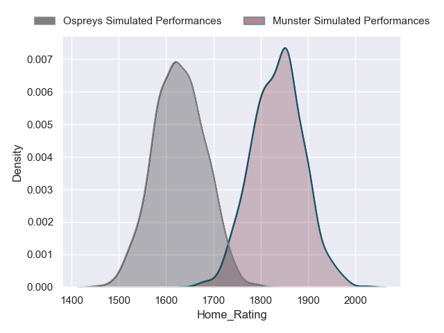
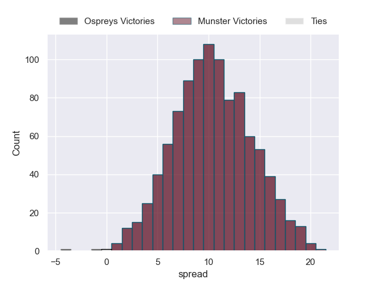
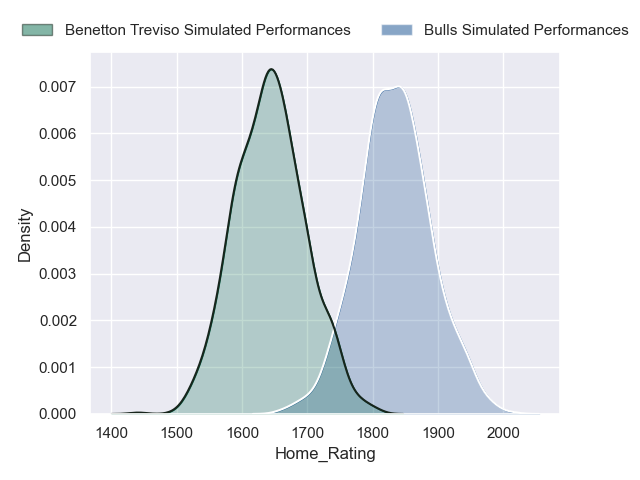
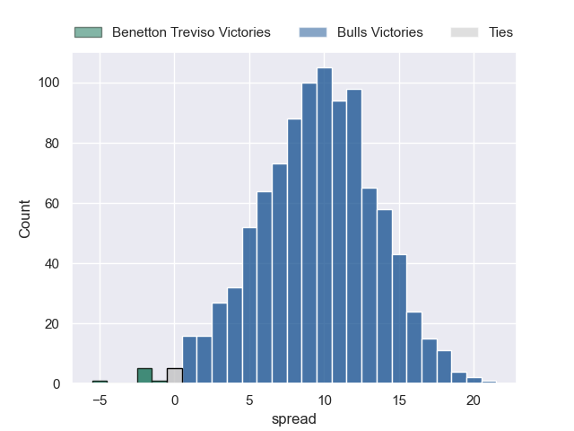
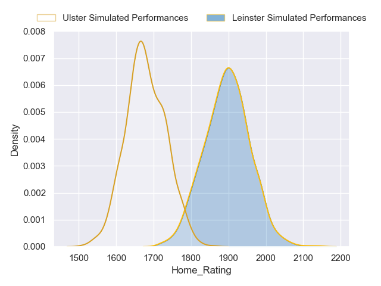
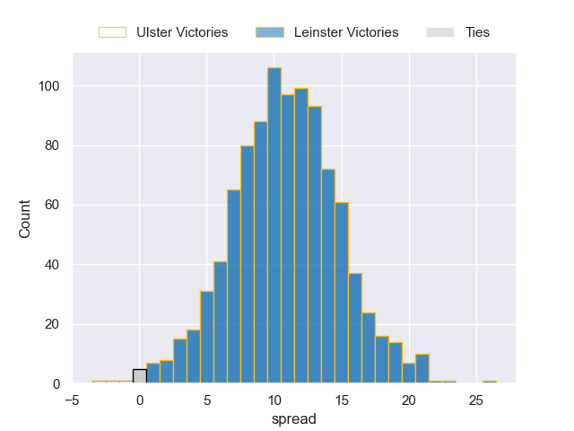
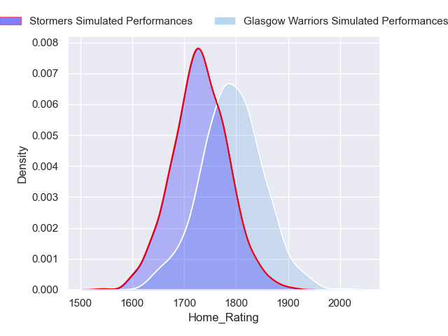
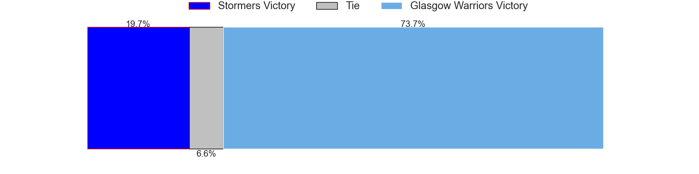
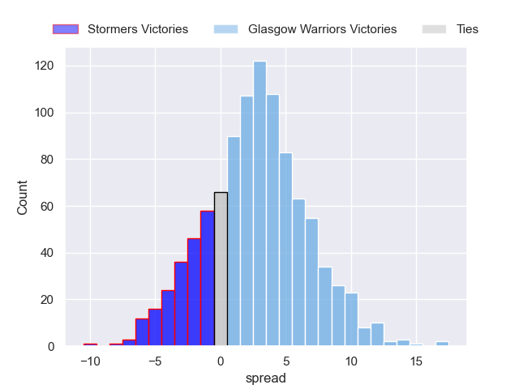

---  
title: "United Rugby Championship 2023 Status"  
date: 2024-06-03 6:00:00 -0500  
categories: model review projection  
layout: article  
aside:  
    toc: true  
---
# Current Team Rankings

# Standings

## Current Standings

| Club             |   Played |   Wins |   Point Differential |   Losing Bonus Points |   Try Bonus Points |   Competition Points |
|:-----------------|---------:|-------:|---------------------:|----------------------:|-------------------:|---------------------:|
| Munster          |       18 |     13 |                  165 |                     3 |                 11 |                   68 |
| Bulls            |       18 |     13 |                  206 |                     3 |                 11 |                   66 |
| Leinster         |       18 |     13 |                  204 |                     2 |                 11 |                   65 |
| Glasgow Warriors |       18 |     13 |                  166 |                     2 |                 11 |                   65 |
| Stormers         |       18 |     12 |                  120 |                     4 |                  7 |                   59 |
| Ulster           |       18 |     11 |                   26 |                     5 |                  5 |                   54 |
| Benetton Treviso |       18 |     11 |                   11 |                     2 |                  6 |                   54 |
| Lions            |       18 |      9 |                  128 |                     6 |                  8 |                   50 |
| Ospreys          |       18 |     10 |                  -35 |                     2 |                  8 |                   50 |
| Edinburgh        |       18 |     11 |                   21 |                     2 |                  3 |                   49 |
| Connacht         |       18 |      9 |                  -28 |                     5 |                  4 |                   45 |
| Cardiff Blues    |       18 |      4 |                  -25 |                    10 |                  4 |                   32 |
| Scarlets         |       18 |      5 |                 -262 |                     3 |                  4 |                   27 |
| Sharks           |       18 |      4 |                  -88 |                     6 |                  3 |                   25 |
| Dragons          |       18 |      3 |                 -311 |                     3 |                  1 |                   16 |
| Zebre            |       18 |      1 |                 -298 |                     5 |                  4 |                   15 |

## Projected Remaining Table

| Club             |   Matches Remaining |   Wins |   Point Differential |   Losing Bonus Points |   Try Bonus Points |   Competition Points |
|:-----------------|--------------------:|-------:|---------------------:|----------------------:|-------------------:|---------------------:|
| Bulls            |                   1 |    1   |              9.53148 |                   0   |                0.6 |                  4.6 |
| Leinster         |                   1 |    1   |             10.8608  |                   0   |                0.4 |                  4.4 |
| Munster          |                   1 |    1   |             10.0924  |                   0   |                0.3 |                  4.3 |
| Glasgow Warriors |                   1 |    0.8 |              2.78906 |                   0.2 |                0.3 |                  3.6 |
| Stormers         |                   1 |    0.2 |             -2.78906 |                   0.6 |                0.2 |                  1.8 |
| Benetton Treviso |                   1 |    0   |             -9.53148 |                   0.2 |                0.3 |                  0.5 |
| Ospreys          |                   1 |    0   |            -10.0924  |                   0.2 |                0.1 |                  0.3 |
| Ulster           |                   1 |    0   |            -10.8608  |                   0.2 |                0.1 |                  0.3 |

## Projected Total Table

| Club             |   Total Matches |   Wins |   Point Differential |   Losing Bonus Points |   Try Bonus Points |   Competition Points |
|:-----------------|----------------:|-------:|---------------------:|----------------------:|-------------------:|---------------------:|
| Munster          |              19 |   14   |            175.092   |                   3   |               11.3 |                 72.3 |
| Bulls            |              19 |   14   |            215.531   |                   3   |               11.6 |                 70.6 |
| Leinster         |              19 |   14   |            214.861   |                   2   |               11.4 |                 69.4 |
| Glasgow Warriors |              19 |   13.8 |            168.789   |                   2.2 |               11.3 |                 68.6 |
| Stormers         |              19 |   12.2 |            117.211   |                   4.6 |                7.2 |                 60.8 |
| Benetton Treviso |              19 |   11   |              1.46852 |                   2.2 |                6.3 |                 54.5 |
| Ulster           |              19 |   11   |             15.1392  |                   5.2 |                5.1 |                 54.3 |
| Ospreys          |              19 |   10   |            -45.0924  |                   2.2 |                8.1 |                 50.3 |
| Lions            |              18 |    9   |            128       |                   6   |                8   |                 50   |
| Edinburgh        |              18 |   11   |             21       |                   2   |                3   |                 49   |
| Connacht         |              18 |    9   |            -28       |                   5   |                4   |                 45   |
| Cardiff Blues    |              18 |    4   |            -25       |                  10   |                4   |                 32   |
| Scarlets         |              18 |    5   |           -262       |                   3   |                4   |                 27   |
| Sharks           |              18 |    4   |            -88       |                   6   |                3   |                 25   |
| Dragons          |              18 |    3   |           -311       |                   3   |                1   |                 16   |
| Zebre            |              18 |    1   |           -298       |                   5   |                4   |                 15   |

# Completed Match Review

| Model | Percent Correct Predictions | Spread Error |
| ------ | ------ | ------ |
| Club Level | 77.1% | 10.4 |
| Player Level: Lineup | 77.2% | 10.4 |
| Player Level: Minutes | 77.9% | 10.3 |

# Future Predictions

## Week 19

### Munster V Ospreys on 2024/06/07

Average Margin: Munster by 10.1

Average Scoreline: 30-20

### Bulls V Benetton Treviso on 2024/06/08

Average Margin: Bulls by 9.5

Average Scoreline: 36-27

### Leinster V Ulster on 2024/06/08

Average Margin: Leinster by 10.9

Average Scoreline: 32-21

### Glasgow Warriors V Stormers on 2024/06/08

Average Margin: Glasgow Warriors by 2.8

Average Scoreline: 25-22

