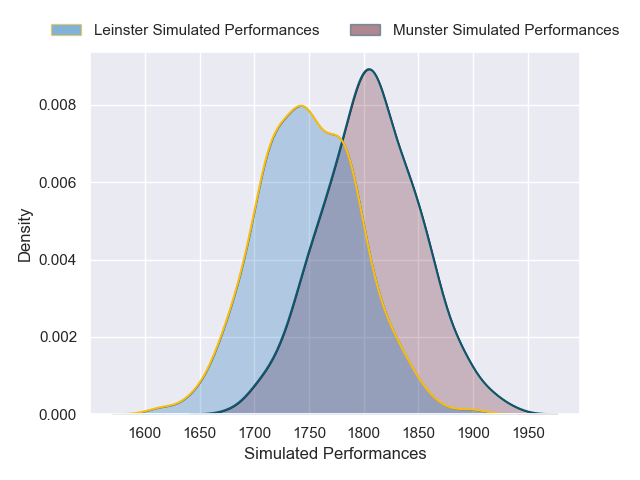
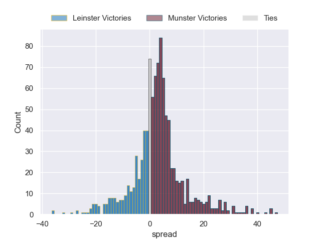
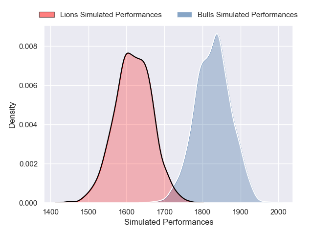
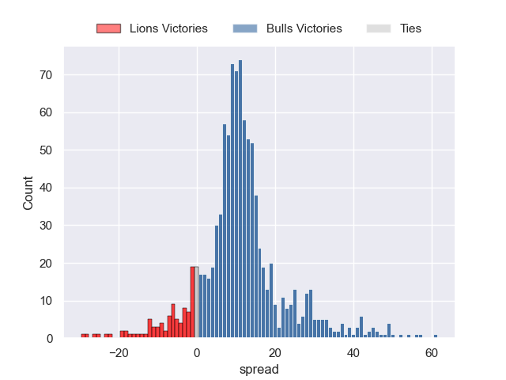

---  
title: "United Rugby Championship 2024 Status"  
date: 2024-12-23 6:00:00 -0500  
categories: model review projection  
layout: article  
aside:  
    toc: true  
---
# Current Team Rankings

# Standings

## Current Standings

| Club             |   Played |   Wins |   Point Differential |   Losing Bonus Points |   Try Bonus Points |   Competition Points |
|:-----------------|---------:|-------:|---------------------:|----------------------:|-------------------:|---------------------:|
| Leinster         |        8 |      8 |                  128 |                     0 |                  6 |                   38 |
| Glasgow Warriors |        8 |      6 |                  105 |                     2 |                  6 |                   32 |
| Bulls            |        7 |      5 |                   54 |                     2 |                  3 |                   25 |
| Sharks           |        7 |      5 |                   -1 |                     1 |                  2 |                   23 |
| Cardiff Blues    |        7 |      4 |                  -17 |                     1 |                  4 |                   21 |
| Munster          |        8 |      4 |                  -20 |                     0 |                  5 |                   21 |
| Lions            |        7 |      4 |                    8 |                     1 |                  2 |                   19 |
| Scarlets         |        8 |      3 |                   16 |                     3 |                  1 |                   18 |
| Edinburgh        |        8 |      3 |                   -3 |                     2 |                  4 |                   18 |
| Connacht         |        8 |      3 |                  -19 |                     2 |                  4 |                   18 |
| Ulster           |        8 |      3 |                  -21 |                     3 |                  3 |                   18 |
| Benetton Treviso |        8 |      3 |                  -42 |                     1 |                  3 |                   18 |
| Stormers         |        7 |      3 |                    4 |                     1 |                  3 |                   16 |
| Ospreys          |        8 |      3 |                  -41 |                     2 |                  1 |                   15 |
| Zebre            |        8 |      2 |                  -76 |                     3 |                  1 |                   12 |
| Dragons          |        7 |      1 |                  -75 |                     2 |                  1 |                    7 |

## Projected Remaining Table

| Club             |   Matches Remaining |   Wins |   Point Differential |   Losing Bonus Points |   Try Bonus Points |   Competition Points |
|:-----------------|--------------------:|-------:|---------------------:|----------------------:|-------------------:|---------------------:|
| Bulls            |                  11 |    8   |            77.5769   |                   1.9 |                4.1 |                 38.1 |
| Stormers         |                  11 |    7.4 |            47.3066   |                   2.2 |                3.8 |                 35.4 |
| Munster          |                  10 |    7.4 |            55.8842   |                   1.7 |                3.3 |                 34.5 |
| Leinster         |                  10 |    7   |            53.9293   |                   1.9 |                3.6 |                 33.4 |
| Glasgow Warriors |                  10 |    6.7 |            40.453    |                   2.1 |                4.1 |                 32.9 |
| Edinburgh        |                  10 |    6.3 |            40.2118   |                   2.2 |                3   |                 30.6 |
| Lions            |                  10 |    4.7 |           -12.5239   |                   2.8 |                5.6 |                 27   |
| Cardiff Blues    |                  11 |    4.9 |           -14.2932   |                   3.2 |                2.6 |                 25.5 |
| Connacht         |                  10 |    5   |            -0.831052 |                   2.9 |                2.5 |                 25.4 |
| Sharks           |                  10 |    4.3 |            -7.04362  |                   3.1 |                3.4 |                 23.9 |
| Scarlets         |                  10 |    4.4 |            -7.91616  |                   3.2 |                2.6 |                 23.6 |
| Ulster           |                  10 |    4.4 |           -12.2796   |                   2.8 |                2.5 |                 22.8 |
| Benetton Treviso |                  10 |    4.2 |           -20.611    |                   3.1 |                2.3 |                 22.2 |
| Ospreys          |                  10 |    4   |           -19.2756   |                   3.2 |                2.3 |                 21.5 |
| Dragons          |                  11 |    1.7 |          -108.472    |                   2.9 |                1.3 |                 11.1 |
| Zebre            |                  10 |    1.6 |          -112.115    |                   2.1 |                1.7 |                 10.1 |

## Projected Total Table

| Club             |   Total Matches |   Wins |   Point Differential |   Losing Bonus Points |   Try Bonus Points |   Competition Points |
|:-----------------|----------------:|-------:|---------------------:|----------------------:|-------------------:|---------------------:|
| Leinster         |              18 |   15   |            181.929   |                   1.9 |                9.6 |                 71.4 |
| Glasgow Warriors |              18 |   12.7 |            145.453   |                   4.1 |               10.1 |                 64.9 |
| Bulls            |              18 |   13   |            131.577   |                   3.9 |                7.1 |                 63.1 |
| Munster          |              18 |   11.4 |             35.8842  |                   1.7 |                8.3 |                 55.5 |
| Stormers         |              18 |   10.4 |             51.3066  |                   3.2 |                6.8 |                 51.4 |
| Edinburgh        |              18 |    9.3 |             37.2118  |                   4.2 |                7   |                 48.6 |
| Sharks           |              17 |    9.3 |             -8.04362 |                   4.1 |                5.4 |                 46.9 |
| Cardiff Blues    |              18 |    8.9 |            -31.2932  |                   4.2 |                6.6 |                 46.5 |
| Lions            |              17 |    8.7 |             -4.52394 |                   3.8 |                7.6 |                 46   |
| Connacht         |              18 |    8   |            -19.8311  |                   4.9 |                6.5 |                 43.4 |
| Scarlets         |              18 |    7.4 |              8.08384 |                   6.2 |                3.6 |                 41.6 |
| Ulster           |              18 |    7.4 |            -33.2796  |                   5.8 |                5.5 |                 40.8 |
| Benetton Treviso |              18 |    7.2 |            -62.611   |                   4.1 |                5.3 |                 40.2 |
| Ospreys          |              18 |    7   |            -60.2756  |                   5.2 |                3.3 |                 36.5 |
| Zebre            |              18 |    3.6 |           -188.115   |                   5.1 |                2.7 |                 22.1 |
| Dragons          |              18 |    2.7 |           -183.472   |                   4.9 |                2.3 |                 18.1 |

# Completed Match Review

| Model | Percent Correct Predictions | Spread Error |
| ------ | ------ | ------ |
| Club Level | 78.7% | 10.0 |
| Player Level: Lineup | 67.7% | 15.1 |
| Player Level: Minutes | 63.9% | 27.6 |

# Future Predictions

## Week 9

### Dragons V Cardiff Blues on 2024/12/26

Average Margin: Cardiff Blues by 6.3

Average Scoreline: 31-25

### Munster V Leinster on 2024/12/27

Average Margin: Munster by 3.2

Average Scoreline: 23-20

### Stormers V Sharks on 2024/12/28

Average Margin: Stormers by 8.0

Average Scoreline: 28-20

### Edinburgh V Glasgow Warriors on 2024/12/28

Average Margin: Edinburgh by 2.1

Average Scoreline: 27-25

### Zebre V Benetton Treviso on 2024/12/28

Average Margin: Benetton Treviso by 6.3

Average Scoreline: 32-25

### Connacht V Ulster on 2024/12/28

Average Margin: Connacht by 5.0

Average Scoreline: 27-22

### Bulls V Lions on 2024/12/29

Average Margin: Bulls by 11.6

Average Scoreline: 39-27

## Week 10

### Scarlets V Dragons on 2025/01/01

Average Margin: Scarlets by 12.1

Average Scoreline: 32-20

### Cardiff Blues V Ospreys on 2025/01/01

Average Margin: Cardiff Blues by 6.2

Average Scoreline: 27-20

## Week 11

### Glasgow Warriors V Connacht on 2025/01/24

Average Margin: Glasgow Warriors by 7.4

Average Scoreline: 28-20

### Ospreys V Benetton Treviso on 2025/01/24

Average Margin: Ospreys by 3.0

Average Scoreline: 22-19

### Lions V Bulls on 2025/01/25

Average Margin: Bulls by 3.8

Average Scoreline: 32-28

### Leinster V Stormers on 2025/01/25

Average Margin: Leinster by 5.8

Average Scoreline: 28-22

### Cardiff Blues V Sharks on 2025/01/25

Average Margin: Cardiff Blues by 3.9

Average Scoreline: 25-21

### Scarlets V Edinburgh on 2025/01/25

Average Margin: Scarlets by 0.9

Average Scoreline: 23-22

### Dragons V Munster on 2025/01/25

Average Margin: Munster by 10.7

Average Scoreline: 33-23

### Ulster V Zebre on 2025/01/26

Average Margin: Ulster by 13.2

Average Scoreline: 36-23

## Week 12

### Stormers V Bulls on 2025/02/01

Average Margin: Stormers by 2.2

Average Scoreline: 33-31

## Week 13

### Edinburgh V Zebre on 2025/02/14

Average Margin: Edinburgh by 15.7

Average Scoreline: 35-20

### Ospreys V Leinster on 2025/02/14

Average Margin: Leinster by 5.0

Average Scoreline: 30-25

### Dragons V Glasgow Warriors on 2025/02/15

Average Margin: Glasgow Warriors by 8.7

Average Scoreline: 34-25

### Connacht V Cardiff Blues on 2025/02/15

Average Margin: Connacht by 3.0

Average Scoreline: 27-24

### Munster V Scarlets on 2025/02/15

Average Margin: Munster by 10.3

Average Scoreline: 28-17

### Benetton Treviso V Ulster on 2025/02/15

Average Margin: Benetton Treviso by 3.3

Average Scoreline: 28-24

### Bulls V Sharks on 2025/02/15

Average Margin: Bulls by 9.6

Average Scoreline: 40-30

### Lions V Stormers on 2025/02/15

Average Margin: Stormers by 1.5

Average Scoreline: 35-34

## Week 14

### Zebre V Dragons on 2025/02/28

Average Margin: Zebre by 1.9

Average Scoreline: 28-27

### Munster V Edinburgh on 2025/02/28

Average Margin: Munster by 7.3

Average Scoreline: 26-19

### Connacht V Benetton Treviso on 2025/03/01

Average Margin: Connacht by 5.0

Average Scoreline: 27-22

### Leinster V Cardiff Blues on 2025/03/01

Average Margin: Leinster by 9.6

Average Scoreline: 31-21

### Bulls V Stormers on 2025/03/01

Average Margin: Bulls by 6.5

Average Scoreline: 32-25

### Glasgow Warriors V Ospreys on 2025/03/01

Average Margin: Glasgow Warriors by 9.5

Average Scoreline: 29-20

### Ulster V Scarlets on 2025/03/01

Average Margin: Ulster by 3.9

Average Scoreline: 26-23

### Lions V Sharks on 2025/03/01

Average Margin: Lions by 2.2

Average Scoreline: 32-30

## Week 15

### Cardiff Blues V Lions on 2025/03/21

Average Margin: Cardiff Blues by 4.7

Average Scoreline: 28-23

### Glasgow Warriors V Munster on 2025/03/21

Average Margin: Glasgow Warriors by 2.6

Average Scoreline: 29-27

### Dragons V Ulster on 2025/03/22

Average Margin: Ulster by 4.7

Average Scoreline: 32-27

### Sharks V Zebre on 2025/03/22

Average Margin: Sharks by 14.4

Average Scoreline: 36-22

### Benetton Treviso V Edinburgh on 2025/03/22

Average Margin: Benetton Treviso by 1.1

Average Scoreline: 27-26

### Ospreys V Connacht on 2025/03/22

Average Margin: Ospreys by 1.6

Average Scoreline: 27-25

### Scarlets V Stormers on 2025/03/22

Average Margin: Stormers by 2.7

Average Scoreline: 29-27

### Bulls V Leinster on 2025/03/22

Average Margin: Bulls by 4.7

Average Scoreline: 29-24

## Week 16

### Ulster V Stormers on 2025/03/28

Average Margin: Stormers by 1.9

Average Scoreline: 27-25

### Edinburgh V Dragons on 2025/03/28

Average Margin: Edinburgh by 13.5

Average Scoreline: 35-21

### Bulls V Zebre on 2025/03/29

Average Margin: Bulls by 19.0

Average Scoreline: 45-26

### Benetton Treviso V Cardiff Blues on 2025/03/29

Average Margin: Benetton Treviso by 2.0

Average Scoreline: 26-24

### Glasgow Warriors V Lions on 2025/03/29

Average Margin: Glasgow Warriors by 8.4

Average Scoreline: 35-27

### Connacht V Munster on 2025/03/29

Average Margin: Munster by 1.9

Average Scoreline: 26-24

### Scarlets V Ospreys on 2025/03/29

Average Margin: Scarlets by 4.9

Average Scoreline: 26-21

### Sharks V Leinster on 2025/03/29

Average Margin: Leinster by 2.1

Average Scoreline: 29-26

## Week 17

### Edinburgh V Sharks on 2025/04/18

Average Margin: Edinburgh by 5.2

Average Scoreline: 26-21

### Lions V Benetton Treviso on 2025/04/19

Average Margin: Lions by 3.8

Average Scoreline: 33-30

### Leinster V Ulster on 2025/04/19

Average Margin: Leinster by 10.4

Average Scoreline: 33-23

### Zebre V Glasgow Warriors on 2025/04/19

Average Margin: Glasgow Warriors by 10.2

Average Scoreline: 35-25

### Munster V Bulls on 2025/04/19

Average Margin: Munster by 3.0

Average Scoreline: 29-26

### Stormers V Connacht on 2025/04/19

Average Margin: Stormers by 8.6

Average Scoreline: 29-20

### Dragons V Scarlets on 2025/04/19

Average Margin: Scarlets by 4.4

Average Scoreline: 30-26

### Ospreys V Cardiff Blues on 2025/04/19

Average Margin: Ospreys by 1.5

Average Scoreline: 26-24

## Week 18

### Glasgow Warriors V Bulls on 2025/04/25

Average Margin: Glasgow Warriors by 0.7

Average Scoreline: 32-32

### Cardiff Blues V Munster on 2025/04/25

Average Margin: Munster by 1.6

Average Scoreline: 27-26

### Ulster V Sharks on 2025/04/26

Average Margin: Ulster by 2.6

Average Scoreline: 26-24

### Stormers V Benetton Treviso on 2025/04/26

Average Margin: Stormers by 10.3

Average Scoreline: 30-20

### Ospreys V Dragons on 2025/04/26

Average Margin: Ospreys by 11.5

Average Scoreline: 33-21

### Scarlets V Leinster on 2025/04/26

Average Margin: Leinster by 3.7

Average Scoreline: 30-26

### Zebre V Edinburgh on 2025/04/26

Average Margin: Edinburgh by 8.9

Average Scoreline: 32-24

### Lions V Connacht on 2025/04/26

Average Margin: Lions by 2.8

Average Scoreline: 33-30

## Week 19

### Sharks V Ospreys on 2025/05/09

Average Margin: Sharks by 6.8

Average Scoreline: 32-25

### Munster V Ulster on 2025/05/09

Average Margin: Munster by 10.1

Average Scoreline: 32-22

### Stormers V Dragons on 2025/05/10

Average Margin: Stormers by 16.2

Average Scoreline: 37-21

### Connacht V Edinburgh on 2025/05/10

Average Margin: Connacht by 1.6

Average Scoreline: 25-23

### Leinster V Zebre on 2025/05/10

Average Margin: Leinster by 19.4

Average Scoreline: 39-19

### Bulls V Cardiff Blues on 2025/05/10

Average Margin: Bulls by 9.8

Average Scoreline: 32-22

### Benetton Treviso V Glasgow Warriors on 2025/05/10

Average Margin: Glasgow Warriors by 0.9

Average Scoreline: 30-29

### Lions V Scarlets on 2025/05/11

Average Margin: Lions by 4.3

Average Scoreline: 33-29

## Week 20

### Edinburgh V Ulster on 2025/05/16

Average Margin: Edinburgh by 5.9

Average Scoreline: 27-21

### Stormers V Cardiff Blues on 2025/05/16

Average Margin: Stormers by 8.0

Average Scoreline: 26-18

### Munster V Benetton Treviso on 2025/05/16

Average Margin: Munster by 10.3

Average Scoreline: 32-21

### Bulls V Dragons on 2025/05/17

Average Margin: Bulls by 18.5

Average Scoreline: 43-25

### Lions V Ospreys on 2025/05/17

Average Margin: Lions by 4.5

Average Scoreline: 35-30

### Zebre V Connacht on 2025/05/17

Average Margin: Connacht by 7.0

Average Scoreline: 33-26

### Sharks V Scarlets on 2025/05/17

Average Margin: Sharks by 5.4

Average Scoreline: 31-26

### Leinster V Glasgow Warriors on 2025/05/17

Average Margin: Leinster by 5.9

Average Scoreline: 25-19

