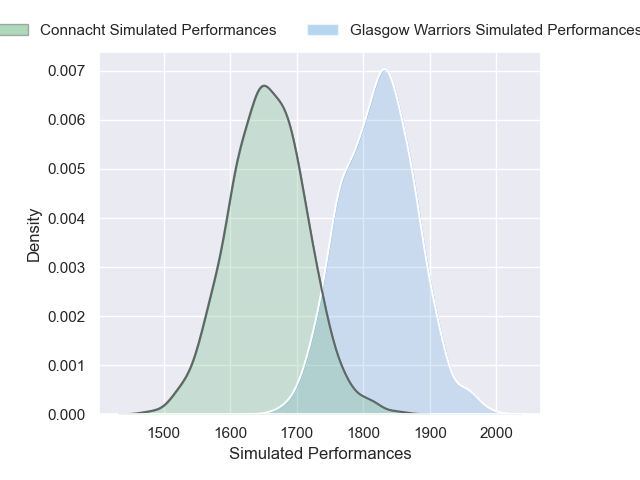
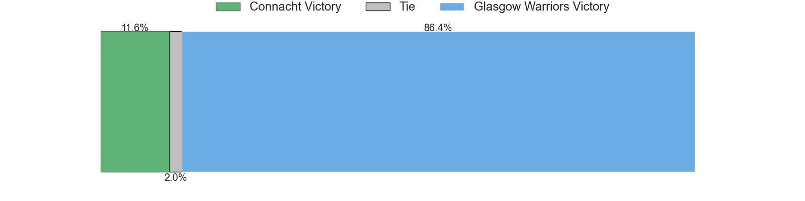
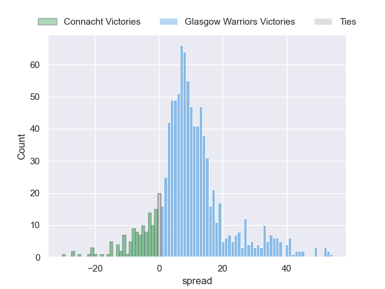

---  
title: "United Rugby Championship 2024 Status"  
date: 2025-01-23 6:00:00 -0500  
categories: model review projection  
layout: article  
aside:  
    toc: true  
---
# Current Team Rankings

# Standings

## Current Standings

| Club             |   Played |   Wins |   Point Differential |   Losing Bonus Points |   Try Bonus Points |   Competition Points |
|:-----------------|---------:|-------:|---------------------:|----------------------:|-------------------:|---------------------:|
| Leinster         |        9 |      9 |                  146 |                     0 |                  7 |                   43 |
| Glasgow Warriors |        9 |      6 |                  102 |                     3 |                  6 |                   33 |
| Cardiff Blues    |        9 |      5 |                  -15 |                     1 |                  5 |                   28 |
| Bulls            |        7 |      5 |                   54 |                     2 |                  3 |                   25 |
| Sharks           |        8 |      5 |                   -5 |                     2 |                  2 |                   24 |
| Scarlets         |        9 |      4 |                   33 |                     3 |                  2 |                   23 |
| Benetton Treviso |        9 |      4 |                  -30 |                     1 |                  4 |                   23 |
| Edinburgh        |        9 |      4 |                    0 |                     2 |                  4 |                   22 |
| Ulster           |        9 |      4 |                  -11 |                     3 |                  3 |                   22 |
| Stormers         |        8 |      4 |                    8 |                     1 |                  4 |                   21 |
| Munster          |        9 |      4 |                  -41 |                     0 |                  5 |                   21 |
| Lions            |        7 |      4 |                    8 |                     1 |                  2 |                   19 |
| Connacht         |        9 |      3 |                  -26 |                     3 |                  4 |                   19 |
| Ospreys          |        9 |      3 |                  -41 |                     2 |                  1 |                   17 |
| Zebre            |        9 |      2 |                  -88 |                     3 |                  1 |                   12 |
| Dragons          |        9 |      1 |                  -94 |                     3 |                  1 |                    8 |

## Projected Remaining Table

| Club             |   Matches Remaining |   Wins |   Point Differential |   Losing Bonus Points |   Try Bonus Points |   Competition Points |
|:-----------------|--------------------:|-------:|---------------------:|----------------------:|-------------------:|---------------------:|
| Leinster         |                   9 |    8   |           124.735    |                   0.6 |                5.7 |                 38.2 |
| Glasgow Warriors |                  10 |    7.8 |            72.9745   |                   1   |                5   |                 37.1 |
| Bulls            |                  11 |    7   |            59.845    |                   2.5 |                4.4 |                 34.9 |
| Lions            |                  10 |    6.1 |            20.0632   |                   2.1 |                3.9 |                 30.6 |
| Munster          |                   9 |    6.3 |            45.2709   |                   1.6 |                3.2 |                 30   |
| Edinburgh        |                   9 |    6.1 |            49.52     |                   1.7 |                3.5 |                 29.5 |
| Stormers         |                  10 |    5.7 |            17.0702   |                   2.2 |                2.8 |                 27.7 |
| Connacht         |                  10 |    5   |             0.580886 |                   2.6 |                2.9 |                 25.4 |
| Ulster           |                   9 |    4.8 |             6.82276  |                   1.9 |                2.7 |                 23.8 |
| Sharks           |                   9 |    4   |            -7.71434  |                   2.4 |                3.1 |                 21.4 |
| Ospreys          |                   9 |    4.1 |           -10.0768   |                   2.2 |                2.1 |                 20.6 |
| Benetton Treviso |                   9 |    3.3 |           -23.5462   |                   3   |                1.9 |                 18.1 |
| Scarlets         |                   9 |    2.6 |           -48.8945   |                   2.7 |                1.9 |                 15   |
| Cardiff Blues    |                   9 |    1.6 |           -83.6995   |                   2.5 |                2.8 |                 11.6 |
| Dragons          |                   9 |    1.3 |          -103.114    |                   1.9 |                0.9 |                  8   |
| Zebre            |                   9 |    1.4 |          -119.837    |                   1.4 |                1.1 |                  8   |

## Projected Total Table

| Club             |   Total Matches |   Wins |   Point Differential |   Losing Bonus Points |   Try Bonus Points |   Competition Points |
|:-----------------|----------------:|-------:|---------------------:|----------------------:|-------------------:|---------------------:|
| Leinster         |              18 |   17   |            270.735   |                   0.6 |               12.7 |                 81.2 |
| Glasgow Warriors |              19 |   13.8 |            174.974   |                   4   |               11   |                 70.1 |
| Bulls            |              18 |   12   |            113.845   |                   4.5 |                7.4 |                 59.9 |
| Edinburgh        |              18 |   10.1 |             49.52    |                   3.7 |                7.5 |                 51.5 |
| Munster          |              18 |   10.3 |              4.27093 |                   1.6 |                8.2 |                 51   |
| Lions            |              17 |   10.1 |             28.0632  |                   3.1 |                5.9 |                 49.6 |
| Stormers         |              18 |    9.7 |             25.0702  |                   3.2 |                6.8 |                 48.7 |
| Ulster           |              18 |    8.8 |             -4.17724 |                   4.9 |                5.7 |                 45.8 |
| Sharks           |              17 |    9   |            -12.7143  |                   4.4 |                5.1 |                 45.4 |
| Connacht         |              19 |    8   |            -25.4191  |                   5.6 |                6.9 |                 44.4 |
| Benetton Treviso |              18 |    7.3 |            -53.5462  |                   4   |                5.9 |                 41.1 |
| Cardiff Blues    |              18 |    6.6 |            -98.6995  |                   3.5 |                7.8 |                 39.6 |
| Scarlets         |              18 |    6.6 |            -15.8945  |                   5.7 |                3.9 |                 38   |
| Ospreys          |              18 |    7.1 |            -51.0768  |                   4.2 |                3.1 |                 37.6 |
| Zebre            |              18 |    3.4 |           -207.837   |                   4.4 |                2.1 |                 20   |
| Dragons          |              18 |    2.3 |           -197.114   |                   4.9 |                1.9 |                 16   |

# Completed Match Review

| Model | Percent Correct Predictions | Spread Error |
| ------ | ------ | ------ |
| Club Level | 75.4% | 9.7 |
| Player Level: Lineup | 65.6% | 10.4 |
| Player Level: Minutes | 65.6% | 9.5 |

# Future Predictions

## Week 10

### Glasgow Warriors V Connacht on 2025/01/24

Average Margin: Glasgow Warriors by 9.8

Average Scoreline: 27-17

### Ospreys V Benetton Treviso on 2025/01/24

Average Margin: Ospreys by 2.6

Average Scoreline: 26-23

### Leinster V Stormers on 2025/01/25

Average Margin: Leinster by 13.8

Average Scoreline: 40-26

### Cardiff Blues V Sharks on 2025/01/25

Average Margin: Sharks by 1.5

Average Scoreline: 30-29

### Lions V Bulls on 2025/01/25

Average Margin: Bulls by 0.1

Average Scoreline: 33-33

### Scarlets V Edinburgh on 2025/01/25

Average Margin: Edinburgh by 2.7

Average Scoreline: 23-20

### Dragons V Munster on 2025/01/25

Average Margin: Munster by 11.3

Average Scoreline: 28-16

### Ulster V Zebre on 2025/01/26

Average Margin: Ulster by 14.9

Average Scoreline: 34-19

### Glasgow Warriors V Connacht on 2025/01/26

Average Margin: Glasgow Warriors by 10.1

Average Scoreline: 27-17

## Week 11

### Stormers V Bulls on 2025/02/01

Average Margin: Stormers by 1.2

Average Scoreline: 30-28

## Week 12

### Ospreys V Leinster on 2025/02/14

Average Margin: Leinster by 10.6

Average Scoreline: 25-14

### Edinburgh V Zebre on 2025/02/14

Average Margin: Edinburgh by 16.8

Average Scoreline: 34-17

### Benetton Treviso V Ulster on 2025/02/15

Average Margin: Benetton Treviso by 2.1

Average Scoreline: 25-23

### Connacht V Cardiff Blues on 2025/02/15

Average Margin: Connacht by 10.7

Average Scoreline: 33-22

### Munster V Scarlets on 2025/02/15

Average Margin: Munster by 11.4

Average Scoreline: 28-17

### Lions V Stormers on 2025/02/15

Average Margin: Lions by 3.1

Average Scoreline: 31-28

### Dragons V Glasgow Warriors on 2025/02/15

Average Margin: Glasgow Warriors by 13.7

Average Scoreline: 29-15

### Bulls V Sharks on 2025/02/15

Average Margin: Bulls by 9.5

Average Scoreline: 36-27

## Week 13

### Bulls V Lions on 2025/02/22

Average Margin: Bulls by 7.8

Average Scoreline: 37-29

## Week 14

### Munster V Edinburgh on 2025/02/28

Average Margin: Munster by 5.1

Average Scoreline: 25-20

### Zebre V Dragons on 2025/02/28

Average Margin: Zebre by 3.1

Average Scoreline: 24-21

### Glasgow Warriors V Ospreys on 2025/03/01

Average Margin: Glasgow Warriors by 11.8

Average Scoreline: 31-19

### Leinster V Cardiff Blues on 2025/03/01

Average Margin: Leinster by 21.3

Average Scoreline: 42-21

### Bulls V Stormers on 2025/03/01

Average Margin: Bulls by 6.0

Average Scoreline: 33-27

### Ulster V Scarlets on 2025/03/01

Average Margin: Ulster by 8.1

Average Scoreline: 30-22

### Lions V Sharks on 2025/03/01

Average Margin: Lions by 5.7

Average Scoreline: 33-27

### Connacht V Benetton Treviso on 2025/03/01

Average Margin: Connacht by 6.5

Average Scoreline: 28-21

## Week 15

### Cardiff Blues V Lions on 2025/03/21

Average Margin: Lions by 3.2

Average Scoreline: 32-29

### Glasgow Warriors V Munster on 2025/03/21

Average Margin: Glasgow Warriors by 6.9

Average Scoreline: 29-23

### Scarlets V Stormers on 2025/03/22

Average Margin: Stormers by 2.8

Average Scoreline: 24-21

### Bulls V Leinster on 2025/03/22

Average Margin: Leinster by 4.5

Average Scoreline: 26-21

### Sharks V Zebre on 2025/03/22

Average Margin: Sharks by 14.2

Average Scoreline: 34-20

### Benetton Treviso V Edinburgh on 2025/03/22

Average Margin: Benetton Treviso by 0.5

Average Scoreline: 22-21

### Ospreys V Connacht on 2025/03/22

Average Margin: Ospreys by 1.1

Average Scoreline: 23-22

### Dragons V Ulster on 2025/03/22

Average Margin: Ulster by 8.2

Average Scoreline: 29-21

## Week 16

### Edinburgh V Dragons on 2025/03/28

Average Margin: Edinburgh by 16.2

Average Scoreline: 31-15

### Ulster V Stormers on 2025/03/28

Average Margin: Ulster by 2.2

Average Scoreline: 19-17

### Connacht V Munster on 2025/03/29

Average Margin: Connacht by 0.9

Average Scoreline: 19-18

### Glasgow Warriors V Lions on 2025/03/29

Average Margin: Glasgow Warriors by 9.1

Average Scoreline: 36-27

### Scarlets V Ospreys on 2025/03/29

Average Margin: Scarlets by 1.5

Average Scoreline: 19-17

### Bulls V Zebre on 2025/03/29

Average Margin: Bulls by 18.7

Average Scoreline: 41-22

### Benetton Treviso V Cardiff Blues on 2025/03/29

Average Margin: Benetton Treviso by 8.6

Average Scoreline: 30-22

### Sharks V Leinster on 2025/03/29

Average Margin: Leinster by 10.1

Average Scoreline: 28-18

## Week 17

### Edinburgh V Sharks on 2025/04/18

Average Margin: Edinburgh by 6.4

Average Scoreline: 27-20

### Dragons V Scarlets on 2025/04/19

Average Margin: Scarlets by 3.8

Average Scoreline: 26-22

### Munster V Bulls on 2025/04/19

Average Margin: Munster by 3.1

Average Scoreline: 27-24

### Ospreys V Cardiff Blues on 2025/04/19

Average Margin: Ospreys by 8.3

Average Scoreline: 29-21

### Leinster V Ulster on 2025/04/19

Average Margin: Leinster by 15.9

Average Scoreline: 32-16

### Lions V Benetton Treviso on 2025/04/19

Average Margin: Lions by 6.3

Average Scoreline: 36-30

### Zebre V Glasgow Warriors on 2025/04/19

Average Margin: Glasgow Warriors by 13.2

Average Scoreline: 30-17

### Stormers V Connacht on 2025/04/19

Average Margin: Stormers by 4.7

Average Scoreline: 26-21

## Week 18

### Cardiff Blues V Munster on 2025/04/25

Average Margin: Munster by 5.7

Average Scoreline: 28-22

### Glasgow Warriors V Bulls on 2025/04/25

Average Margin: Glasgow Warriors by 5.5

Average Scoreline: 33-28

### Stormers V Benetton Treviso on 2025/04/26

Average Margin: Stormers by 7.4

Average Scoreline: 30-22

### Ospreys V Dragons on 2025/04/26

Average Margin: Ospreys by 13.4

Average Scoreline: 32-19

### Zebre V Edinburgh on 2025/04/26

Average Margin: Edinburgh by 10.0

Average Scoreline: 26-16

### Scarlets V Leinster on 2025/04/26

Average Margin: Leinster by 12.4

Average Scoreline: 26-13

### Ulster V Sharks on 2025/04/26

Average Margin: Ulster by 4.7

Average Scoreline: 28-23

### Lions V Connacht on 2025/04/26

Average Margin: Lions by 3.4

Average Scoreline: 32-29

## Week 19

### Munster V Ulster on 2025/05/09

Average Margin: Munster by 7.7

Average Scoreline: 27-20

### Sharks V Ospreys on 2025/05/09

Average Margin: Sharks by 5.4

Average Scoreline: 25-20

### Stormers V Dragons on 2025/05/10

Average Margin: Stormers by 15.3

Average Scoreline: 33-17

### Bulls V Cardiff Blues on 2025/05/10

Average Margin: Bulls by 13.7

Average Scoreline: 42-28

### Connacht V Edinburgh on 2025/05/10

Average Margin: Connacht by 2.5

Average Scoreline: 23-20

### Leinster V Zebre on 2025/05/10

Average Margin: Leinster by 25.9

Average Scoreline: 42-16

### Benetton Treviso V Glasgow Warriors on 2025/05/10

Average Margin: Glasgow Warriors by 3.2

Average Scoreline: 25-22

### Lions V Scarlets on 2025/05/11

Average Margin: Lions by 9.2

Average Scoreline: 37-28

## Week 20

### Munster V Benetton Treviso on 2025/05/16

Average Margin: Munster by 8.7

Average Scoreline: 27-18

### Edinburgh V Ulster on 2025/05/16

Average Margin: Edinburgh by 5.5

Average Scoreline: 27-21

### Stormers V Cardiff Blues on 2025/05/16

Average Margin: Stormers by 10.8

Average Scoreline: 34-23

### Bulls V Dragons on 2025/05/17

Average Margin: Bulls by 18.3

Average Scoreline: 44-25

### Leinster V Glasgow Warriors on 2025/05/17

Average Margin: Leinster by 10.3

Average Scoreline: 39-29

### Sharks V Scarlets on 2025/05/17

Average Margin: Sharks by 7.6

Average Scoreline: 31-23

### Zebre V Connacht on 2025/05/17

Average Margin: Connacht by 9.2

Average Scoreline: 26-17

### Lions V Ospreys on 2025/05/17

Average Margin: Lions by 6.1

Average Scoreline: 32-26

