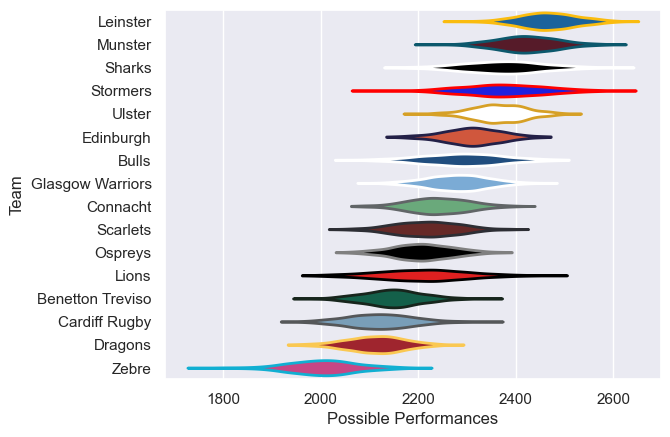

---  
title: "United Rugby Championship 21/22 Status"  
date: 2025-07-28 6:00:00 -0500  
categories: model review projection  
layout: article  
aside:  
    toc: true  
---
# Current Team Rankings

# Standings

## Current Standings

| Club             |   Played |   Wins |   Point Differential |   Losing Bonus Points |   Try Bonus Points |   Competition Points |
|:-----------------|---------:|-------:|---------------------:|----------------------:|-------------------:|---------------------:|
| Leinster         |       22 |     12 |                  306 |                     5 |                 12 |                   73 |
| Bulls            |       24 |     11 |                   99 |                     4 |                 10 |                   70 |
| Ulster           |       20 |     13 |                  132 |                     5 |                  8 |                   65 |
| Stormers         |       18 |     13 |                  159 |                     2 |                  7 |                   63 |
| Sharks           |       21 |     11 |                  152 |                     3 |                  8 |                   63 |
| Munster          |       17 |     11 |                  189 |                     4 |                  8 |                   56 |
| Edinburgh        |       19 |     10 |                   92 |                     4 |                  8 |                   54 |
| Glasgow Warriors |       19 |     10 |                  -29 |                     3 |                  6 |                   49 |
| Ospreys          |       18 |     10 |                  -52 |                     2 |                  4 |                   46 |
| Scarlets         |       18 |      8 |                  -40 |                     3 |                 10 |                   45 |
| Lions            |       16 |      8 |                  -10 |                     2 |                  7 |                   41 |
| Connacht         |       18 |      9 |                 -103 |                     1 |                  4 |                   41 |
| Benetton Treviso |       18 |      6 |                  -76 |                     3 |                  6 |                   35 |
| Cardiff Rugby    |       18 |      7 |                 -208 |                     1 |                  3 |                   32 |
| Dragons          |       18 |      2 |                 -242 |                     5 |                  4 |                   19 |
| Zebre            |       18 |      1 |                 -369 |                     3 |                    |                    7 |

# Completed Match Review

| Model | Percent Correct Predictions | Spread Error |
| ------ | ------ | ------ |
| Club Level | 67.5% | 12.8 |
| Player Level: Lineup | nan% | nan |
| Player Level: Minutes | nan% | nan |

