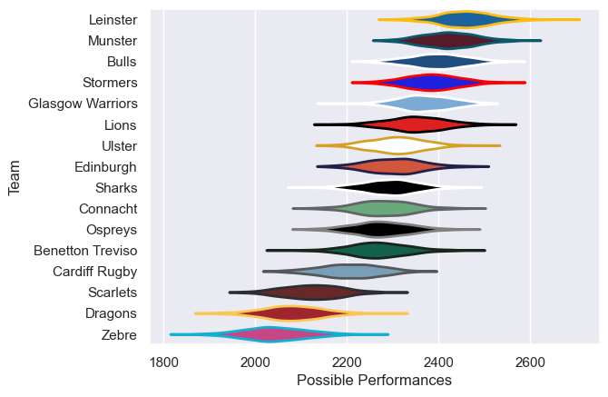

---  
title: "United Rugby Championship 23/24"  
date: 2025-07-29 6:00:00 -0500  
categories: model review projection  
layout: article  
aside:  
    toc: true  
---
# Current Team Rankings

# Standings

## Current Standings

| Club             |   Played |   Wins |   Point Differential |   Losing Bonus Points |   Try Bonus Points |   Competition Points |
|:-----------------|---------:|-------:|---------------------:|----------------------:|-------------------:|---------------------:|
| Glasgow Warriors |       21 |     16 |                  195 |                     2 |                 11 |                   77 |
| Bulls            |       21 |     15 |                  213 |                     4 |                 11 |                   75 |
| Munster          |       20 |     14 |                  174 |                     4 |                 10 |                   72 |
| Leinster         |       20 |     14 |                  222 |                     3 |                 12 |                   71 |
| Stormers         |       19 |     12 |                  103 |                     4 |                  7 |                   59 |
| Benetton Treviso |       19 |     11 |                    4 |                     3 |                  6 |                   55 |
| Ulster           |       19 |     11 |                    5 |                     5 |                  5 |                   54 |
| Lions            |       18 |      9 |                  128 |                     6 |                  8 |                   50 |
| Ospreys          |       19 |     10 |                  -51 |                     2 |                  8 |                   50 |
| Edinburgh        |       18 |     11 |                   19 |                     2 |                  3 |                   49 |
| Connacht         |       18 |      9 |                  -28 |                     5 |                  4 |                   45 |
| Cardiff Rugby    |       18 |      4 |                  -25 |                    10 |                  4 |                   32 |
| Scarlets         |       18 |      5 |                 -262 |                     3 |                  4 |                   27 |
| Sharks           |       18 |      4 |                  -88 |                     6 |                  3 |                   25 |
| Zebre            |       18 |      1 |                 -298 |                     5 |                  4 |                   15 |
| Dragons          |       18 |      3 |                 -311 |                     3 |                    |                   15 |

# Completed Match Review

| Model | Percent Correct Predictions | Spread Error |
| ------ | ------ | ------ |
| Club Level | 74.2% | 10.3 |
| Player Level: Lineup | nan% | nan |
| Player Level: Minutes | nan% | nan |

