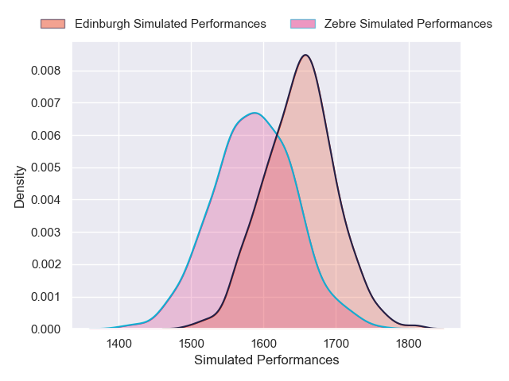
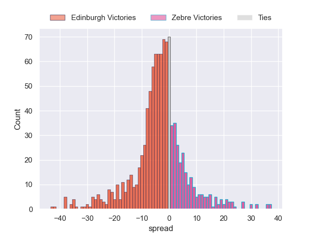

---  
title: "United Rugby Championship 24/25 Status"  
date: 2025-04-25 6:00:00 -0500  
categories: model review projection  
layout: article  
aside:  
    toc: true  
---
# Current Team Rankings

# Standings

## Current Standings

| Club             |   Played |   Wins |   Point Differential |   Losing Bonus Points |   Try Bonus Points |   Competition Points |
|:-----------------|---------:|-------:|---------------------:|----------------------:|-------------------:|---------------------:|
| Leinster         |       16 |     13 |                  175 |                     1 |                nan |                   63 |
| Glasgow Warriors |       16 |     12 |                  212 |                     4 |                nan |                   62 |
| Bulls            |       17 |     11 |                   48 |                     3 |                nan |                   56 |
| Sharks           |       17 |     11 |                   33 |                     3 |                nan |                   55 |
| Stormers         |       17 |      8 |                  -19 |                     3 |                nan |                   45 |
| Cardiff Blues    |       16 |      8 |                  -20 |                     3 |                nan |                   45 |
| Ospreys          |       16 |      8 |                   48 |                     3 |                nan |                   41 |
| Benetton Treviso |       16 |      8 |                  -75 |                     1 |                nan |                   41 |
| Lions            |       17 |      8 |                    9 |                     2 |                nan |                   40 |
| Scarlets         |       16 |      7 |                   26 |                     5 |                nan |                   39 |
| Ulster           |       16 |      7 |                  -11 |                     5 |                nan |                   38 |
| Connacht         |       16 |      6 |                  -62 |                     5 |                nan |                   38 |
| Edinburgh        |       17 |      6 |                    1 |                     6 |                nan |                   37 |
| Munster          |       16 |      6 |                  -52 |                     3 |                nan |                   36 |
| Zebre            |       17 |      7 |                  -59 |                     5 |                nan |                   36 |
| Dragons          |       16 |      1 |                 -254 |                     4 |                nan |                    9 |

## Projected Remaining Table

| Club             |   Matches Remaining |   Wins |   Point Differential |   Losing Bonus Points |   Try Bonus Points |   Competition Points |
|:-----------------|--------------------:|-------:|---------------------:|----------------------:|-------------------:|---------------------:|
| Leinster         |                   3 |    2.7 |             40.4737  |                   0.2 |                1.8 |                 12.7 |
| Stormers         |                   3 |    2.7 |             34.8696  |                   0.2 |                1.2 |                 12.1 |
| Lions            |                   3 |    2.3 |             15.7611  |                   0.4 |                1.5 |                 11.1 |
| Munster          |                   3 |    2.3 |             16.5839  |                   0.4 |                1   |                 10.7 |
| Bulls            |                   3 |    2   |             24.6061  |                   0.5 |                1.5 |                 10   |
| Sharks           |                   3 |    2   |             12.4438  |                   0.7 |                1.2 |                  9.9 |
| Connacht         |                   3 |    1.7 |              3.73279 |                   0.8 |                1.1 |                  8.8 |
| Edinburgh        |                   3 |    1.8 |              4.74494 |                   0.7 |                0.6 |                  8.5 |
| Glasgow Warriors |                   3 |    1.7 |              1.00331 |                   0.6 |                1   |                  8.2 |
| Ospreys          |                   3 |    1.4 |              4.49332 |                   0.9 |                1.2 |                  7.5 |
| Ulster           |                   3 |    1   |             -9.85207 |                   1.1 |                0.5 |                  5.7 |
| Benetton Treviso |                   3 |    0.6 |            -18.3573  |                   1.2 |                0.4 |                  4   |
| Zebre            |                   3 |    0.6 |            -27.2763  |                   1   |                0.3 |                  3.8 |
| Cardiff Blues    |                   3 |    0.6 |            -23.7867  |                   0.9 |                0.4 |                  3.6 |
| Scarlets         |                   3 |    0.4 |            -27.5928  |                   0.9 |                0.7 |                  3.2 |
| Dragons          |                   3 |    0.2 |            -51.8473  |                   0.3 |                0.3 |                  1.5 |

## Projected Total Table

| Club             |   Total Matches |   Wins |   Point Differential |   Losing Bonus Points |   Try Bonus Points |   Competition Points |
|:-----------------|----------------:|-------:|---------------------:|----------------------:|-------------------:|---------------------:|
| Leinster         |              19 |   15.7 |            215.474   |                   1.2 |                1.8 |                 75.7 |
| Glasgow Warriors |              19 |   13.7 |            213.003   |                   4.6 |                1   |                 70.2 |
| Bulls            |              20 |   13   |             72.6061  |                   3.5 |                1.5 |                 66   |
| Sharks           |              20 |   13   |             45.4438  |                   3.7 |                1.2 |                 64.9 |
| Stormers         |              20 |   10.7 |             15.8696  |                   3.2 |                1.2 |                 57.1 |
| Lions            |              20 |   10.3 |             24.7611  |                   2.4 |                1.5 |                 51.1 |
| Cardiff Blues    |              19 |    8.6 |            -43.7867  |                   3.9 |                0.4 |                 48.6 |
| Ospreys          |              19 |    9.4 |             52.4933  |                   3.9 |                1.2 |                 48.5 |
| Connacht         |              19 |    7.7 |            -58.2672  |                   5.8 |                1.1 |                 46.8 |
| Munster          |              19 |    8.3 |            -35.4161  |                   3.4 |                1   |                 46.7 |
| Edinburgh        |              20 |    7.8 |              5.74494 |                   6.7 |                0.6 |                 45.5 |
| Benetton Treviso |              19 |    8.6 |            -93.3573  |                   2.2 |                0.4 |                 45   |
| Ulster           |              19 |    8   |            -20.8521  |                   6.1 |                0.5 |                 43.7 |
| Scarlets         |              19 |    7.4 |             -1.59282 |                   5.9 |                0.7 |                 42.2 |
| Zebre            |              20 |    7.6 |            -86.2763  |                   6   |                0.3 |                 39.8 |
| Dragons          |              19 |    1.2 |           -305.847   |                   4.3 |                0.3 |                 10.5 |

# Completed Match Review

| Model | Percent Correct Predictions | Spread Error |
| ------ | ------ | ------ |
| Club Level | 67.9% | 11.2 |
| Player Level: Lineup | 64.1% | 13.6 |
| Player Level: Minutes | 63.2% | 21.9 |

# Future Predictions

## Week 18

### Glasgow Warriors V Bulls on 2025/04/25

Average Margin: Glasgow Warriors by 6.2

Average Scoreline: 26-20

### Cardiff Blues V Munster on 2025/04/25

Average Margin: Munster by 2.4

Average Scoreline: 27-24

### Zebre V Edinburgh on 2025/04/25

Average Margin: Edinburgh by 3.5

Average Scoreline: 25-21

### Stormers V Benetton Treviso on 2025/04/26

Average Margin: Stormers by 7.1

Average Scoreline: 30-23

### Ospreys V Dragons on 2025/04/26

Average Margin: Ospreys by 14.6

Average Scoreline: 31-17

### Lions V Connacht on 2025/04/26

Average Margin: Lions by 3.4

Average Scoreline: 26-22

### Scarlets V Leinster on 2025/04/26

Average Margin: Leinster by 10.8

Average Scoreline: 27-17

### Ulster V Sharks on 2025/04/26

Average Margin: Ulster by 2.1

Average Scoreline: 27-25

## Week 19

### Munster V Ulster on 2025/05/09

Average Margin: Munster by 6.7

Average Scoreline: 26-19

### Sharks V Ospreys on 2025/05/09

Average Margin: Sharks by 5.6

Average Scoreline: 28-22

### Bulls V Cardiff Blues on 2025/05/10

Average Margin: Bulls by 11.2

Average Scoreline: 36-25

### Benetton Treviso V Glasgow Warriors on 2025/05/10

Average Margin: Glasgow Warriors by 3.8

Average Scoreline: 22-18

### Stormers V Dragons on 2025/05/10

Average Margin: Stormers by 17.6

Average Scoreline: 32-15

### Connacht V Edinburgh on 2025/05/10

Average Margin: Connacht by 3.9

Average Scoreline: 24-20

### Leinster V Zebre on 2025/05/10

Average Margin: Leinster by 20.6

Average Scoreline: 38-18

### Lions V Scarlets on 2025/05/11

Average Margin: Lions by 7.9

Average Scoreline: 34-26

## Week 20

### Munster V Benetton Treviso on 2025/05/16

Average Margin: Munster by 7.4

Average Scoreline: 26-19

### Stormers V Cardiff Blues on 2025/05/16

Average Margin: Stormers by 10.2

Average Scoreline: 33-23

### Edinburgh V Ulster on 2025/05/16

Average Margin: Edinburgh by 5.2

Average Scoreline: 21-16

### Leinster V Glasgow Warriors on 2025/05/17

Average Margin: Leinster by 9.1

Average Scoreline: 30-21

### Zebre V Connacht on 2025/05/17

Average Margin: Connacht by 3.2

Average Scoreline: 21-18

### Lions V Ospreys on 2025/05/17

Average Margin: Lions by 4.4

Average Scoreline: 30-25

### Sharks V Scarlets on 2025/05/17

Average Margin: Sharks by 8.9

Average Scoreline: 32-23

### Bulls V Dragons on 2025/05/17

Average Margin: Bulls by 19.6

Average Scoreline: 44-24

