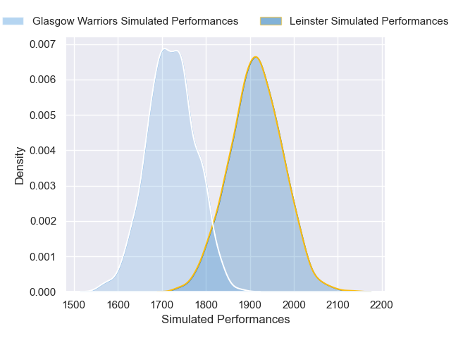
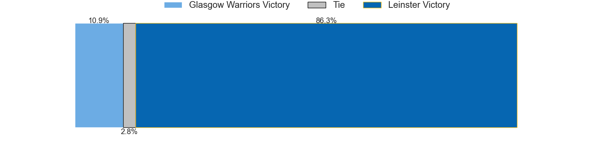
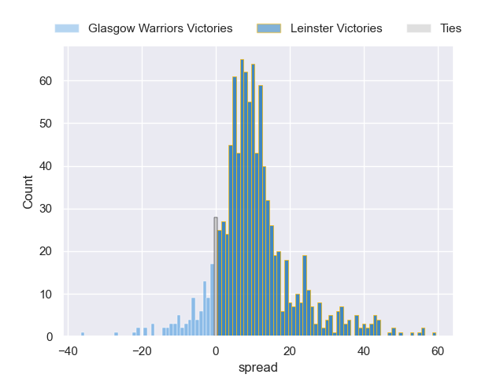
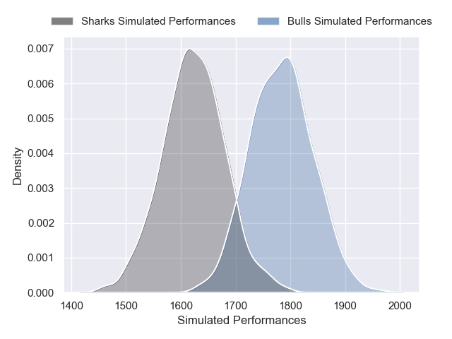
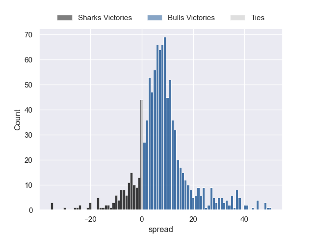

---  
title: "United Rugby Championship 24/25 Status"  
date: 2025-06-02 6:00:00 -0500  
categories: model review projection  
layout: article  
aside:  
    toc: true  
---
# Current Team Rankings

# Standings

## Current Standings

| Club             |   Played |   Wins |   Point Differential |   Losing Bonus Points |   Try Bonus Points |   Competition Points |
|:-----------------|---------:|-------:|---------------------:|----------------------:|-------------------:|---------------------:|
| Leinster         |       19 |     16 |                  281 |                     3 |                nan |                   78 |
| Bulls            |       20 |     14 |                  178 |                     4 |                nan |                   72 |
| Glasgow Warriors |       20 |     14 |                  186 |                     4 |                 11 |                   71 |
| Sharks           |       19 |     14 |                   72 |                     3 |                nan |                   66 |
| Stormers         |       20 |     10 |                   -2 |                     3 |                nan |                   56 |
| Benetton Treviso |       18 |     11 |                    5 |                     1 |                  7 |                   54 |
| Munster          |       19 |      8 |                    2 |                     5 |                 11 |                   50 |
| Scarlets         |       19 |      9 |                    3 |                     4 |                nan |                   48 |
| Cardiff Blues    |       18 |      8 |                  -93 |                     3 |                 10 |                   47 |
| Edinburgh        |       20 |      7 |                  -36 |                     7 |                 10 |                   45 |
| Ulster           |       18 |      8 |                   11 |                     5 |                  5 |                   42 |
| Lions            |       18 |      8 |                  -45 |                     2 |                nan |                   40 |
| Zebre            |       19 |      8 |                 -147 |                     4 |                  3 |                   39 |
| Ospreys          |       18 |      6 |                  -47 |                     4 |                  6 |                   36 |
| Connacht         |       19 |      5 |                  -97 |                     6 |                  9 |                   35 |
| Dragons          |       18 |      1 |                 -271 |                     4 |                  1 |                    9 |

## Projected Remaining Table

| Club             |   Matches Remaining |   Wins |   Point Differential |   Losing Bonus Points |   Try Bonus Points |   Competition Points |
|:-----------------|--------------------:|-------:|---------------------:|----------------------:|-------------------:|---------------------:|
| Leinster         |                   1 |    0.9 |             10.4621  |                   0.1 |                0.4 |                  4   |
| Bulls            |                   1 |    0.9 |              8.22549 |                   0.1 |                0.3 |                  3.9 |
| Sharks           |                   1 |    0.1 |             -8.22549 |                   0.3 |                0.2 |                  1.1 |
| Glasgow Warriors |                   1 |    0.1 |            -10.4621  |                   0.2 |                0.2 |                  0.9 |

## Projected Total Table

| Club             |   Total Matches |   Wins |   Point Differential |   Losing Bonus Points |   Try Bonus Points |   Competition Points |
|:-----------------|----------------:|-------:|---------------------:|----------------------:|-------------------:|---------------------:|
| Leinster         |              20 |   16.9 |             291.462  |                   3.1 |                0.4 |                 82   |
| Bulls            |              21 |   14.9 |             186.225  |                   4.1 |                0.3 |                 75.9 |
| Glasgow Warriors |              21 |   14.1 |             175.538  |                   4.2 |               11.2 |                 71.9 |
| Sharks           |              20 |   14.1 |              63.7745 |                   3.3 |                0.2 |                 67.1 |
| Stormers         |              20 |   10   |              -2      |                   3   |                0   |                 56   |
| Benetton Treviso |              18 |   11   |               5      |                   1   |                7   |                 54   |
| Munster          |              19 |    8   |               2      |                   5   |               11   |                 50   |
| Scarlets         |              19 |    9   |               3      |                   4   |                0   |                 48   |
| Cardiff Blues    |              18 |    8   |             -93      |                   3   |               10   |                 47   |
| Edinburgh        |              20 |    7   |             -36      |                   7   |               10   |                 45   |
| Ulster           |              18 |    8   |              11      |                   5   |                5   |                 42   |
| Lions            |              18 |    8   |             -45      |                   2   |                0   |                 40   |
| Zebre            |              19 |    8   |            -147      |                   4   |                3   |                 39   |
| Ospreys          |              18 |    6   |             -47      |                   4   |                6   |                 36   |
| Connacht         |              19 |    5   |             -97      |                   6   |                9   |                 35   |
| Dragons          |              18 |    1   |            -271      |                   4   |                1   |                  9   |

# Completed Match Review

| Model | Percent Correct Predictions | Spread Error |
| ------ | ------ | ------ |
| Club Level | 66.9% | 11.2 |
| Player Level: Lineup | 70.0% | 11.3 |
| Player Level: Minutes | 52.5% | 15.0 |

# Future Predictions

## Week 21

### Leinster V Glasgow Warriors on 2025/06/07

Average Margin: Leinster by 10.5

Average Scoreline: 34-24

### Bulls V Sharks on 2025/06/07

Average Margin: Bulls by 8.2

Average Scoreline: 30-21

