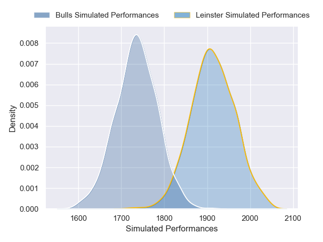
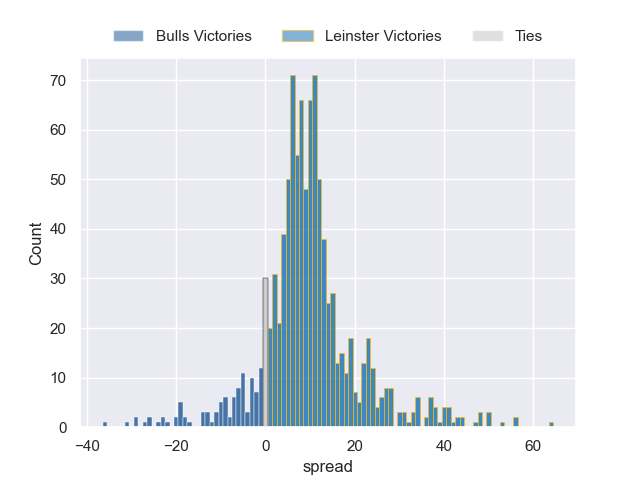

---  
title: "United Rugby Championship 24/25 Status"  
date: 2025-06-12 6:00:00 -0500  
categories: model review projection  
layout: article  
aside:  
    toc: true  
---
# Current Team Rankings

# Standings

## Current Standings

| Club             |   Played |   Wins |   Point Differential |   Losing Bonus Points |   Try Bonus Points |   Competition Points |
|:-----------------|---------:|-------:|---------------------:|----------------------:|-------------------:|---------------------:|
| Leinster         |       21 |     17 |                  336 |                     2 |                nan |                   83 |
| Bulls            |       22 |     15 |                  122 |                     4 |                nan |                   76 |
| Glasgow Warriors |       20 |     14 |                  132 |                     3 |                 11 |                   70 |
| Sharks           |       21 |     13 |                   15 |                     3 |                nan |                   64 |
| Stormers         |       20 |     10 |                   13 |                     4 |                nan |                   57 |
| Cardiff Blues    |       18 |      9 |                  -29 |                     4 |                 10 |                   52 |
| Scarlets         |       19 |      9 |                   21 |                     4 |                  6 |                   48 |
| Munster          |       19 |      8 |                  -19 |                     4 |                 11 |                   47 |
| Edinburgh        |       20 |      7 |                  -10 |                     8 |                 10 |                   46 |
| Benetton Treviso |       18 |      9 |                  -64 |                     1 |                  7 |                   46 |
| Lions            |       19 |      9 |                  -36 |                     2 |                nan |                   45 |
| Connacht         |       18 |      7 |                  -14 |                     5 |                  9 |                   42 |
| Ulster           |       18 |      8 |                  -31 |                     4 |                  5 |                   41 |
| Ospreys          |       18 |      6 |                  -38 |                     4 |                  6 |                   36 |
| Zebre            |       19 |      7 |                 -149 |                     5 |                  3 |                   36 |
| Dragons          |       18 |      2 |                 -249 |                     4 |                  1 |                   13 |

## Projected Remaining Table

| Club     |   Matches Remaining |   Wins |   Point Differential |   Losing Bonus Points |   Try Bonus Points |   Competition Points |
|:---------|--------------------:|-------:|---------------------:|----------------------:|-------------------:|---------------------:|
| Leinster |                   1 |    0.9 |              9.71809 |                   0.1 |                0.4 |                  4   |
| Bulls    |                   1 |    0.1 |             -9.71809 |                   0.3 |                0.2 |                  0.9 |

## Projected Total Table

| Club             |   Total Matches |   Wins |   Point Differential |   Losing Bonus Points |   Try Bonus Points |   Competition Points |
|:-----------------|----------------:|-------:|---------------------:|----------------------:|-------------------:|---------------------:|
| Leinster         |              22 |   17.9 |              345.718 |                   2.1 |                0.4 |                 87   |
| Bulls            |              23 |   15.1 |              112.282 |                   4.3 |                0.2 |                 76.9 |
| Glasgow Warriors |              20 |   14   |              132     |                   3   |               11   |                 70   |
| Sharks           |              21 |   13   |               15     |                   3   |                0   |                 64   |
| Stormers         |              20 |   10   |               13     |                   4   |                0   |                 57   |
| Cardiff Blues    |              18 |    9   |              -29     |                   4   |               10   |                 52   |
| Scarlets         |              19 |    9   |               21     |                   4   |                6   |                 48   |
| Munster          |              19 |    8   |              -19     |                   4   |               11   |                 47   |
| Edinburgh        |              20 |    7   |              -10     |                   8   |               10   |                 46   |
| Benetton Treviso |              18 |    9   |              -64     |                   1   |                7   |                 46   |
| Lions            |              19 |    9   |              -36     |                   2   |                0   |                 45   |
| Connacht         |              18 |    7   |              -14     |                   5   |                9   |                 42   |
| Ulster           |              18 |    8   |              -31     |                   4   |                5   |                 41   |
| Ospreys          |              18 |    6   |              -38     |                   4   |                6   |                 36   |
| Zebre            |              19 |    7   |             -149     |                   5   |                3   |                 36   |
| Dragons          |              18 |    2   |             -249     |                   4   |                1   |                 13   |

# Completed Match Review

| Model | Percent Correct Predictions | Spread Error |
| ------ | ------ | ------ |
| Club Level | 71.4% | 11.0 |
| Player Level: Lineup | 70.7% | 11.9 |
| Player Level: Minutes | 53.7% | 15.1 |

# Future Predictions

## Week 23

### Leinster V Bulls on 2025/06/14

Average Margin: Leinster by 9.7

Average Scoreline: 36-26

