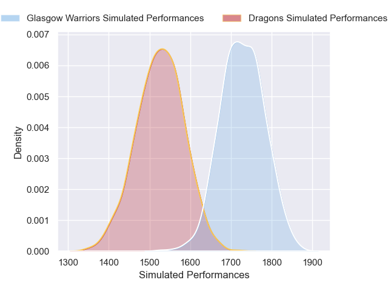
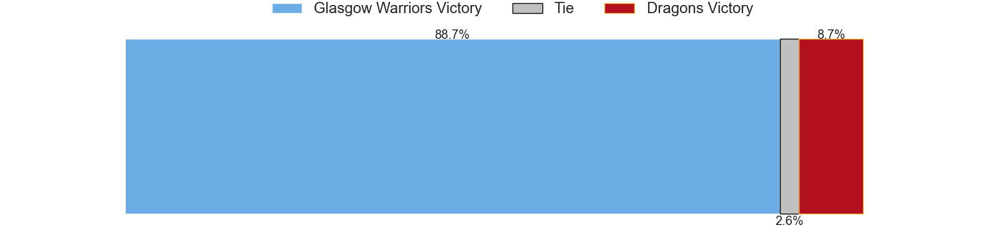
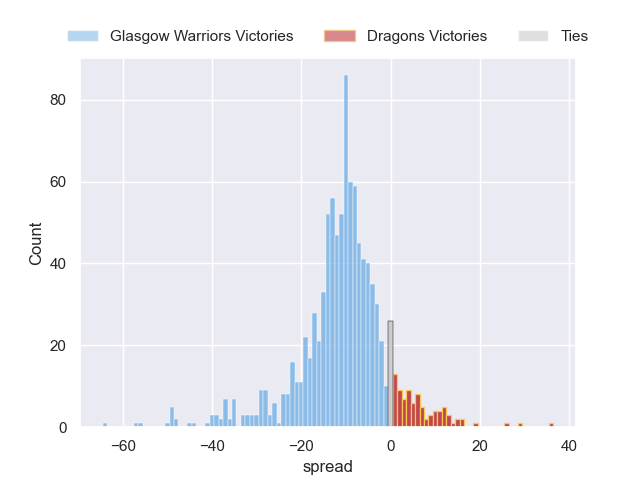

---  
title: "United Rugby Championship 24/25 Status"  
date: 2025-02-14 6:00:00 -0500  
categories: model review projection  
layout: article  
aside:  
    toc: true  
---
# Current Team Rankings

# Standings

## Current Standings

| Club             |   Played |   Wins |   Point Differential |   Losing Bonus Points |   Try Bonus Points |   Competition Points |
|:-----------------|---------:|-------:|---------------------:|----------------------:|-------------------:|---------------------:|
| Leinster         |       10 |     10 |                  173 |                     0 |                  8 |                   48 |
| Glasgow Warriors |       11 |      7 |                   74 |                     3 |                nan |                   37 |
| Bulls            |       10 |      7 |                   68 |                     2 |                nan |                   37 |
| Sharks           |       10 |      6 |                   15 |                     2 |                nan |                   31 |
| Cardiff Blues    |       10 |      5 |                  -35 |                     1 |                  6 |                   29 |
| Scarlets         |       10 |      5 |                   39 |                     3 |                  2 |                   27 |
| Munster          |       10 |      5 |                  -22 |                     0 |                  6 |                   26 |
| Stormers         |       11 |      4 |                  -17 |                     2 |                nan |                   25 |
| Edinburgh        |       10 |      4 |                   -6 |                     3 |                  5 |                   24 |
| Ulster           |       10 |      4 |                  -12 |                     4 |                  3 |                   23 |
| Benetton Treviso |       10 |      4 |                  -73 |                     1 |                  4 |                   23 |
| Ospreys          |       10 |      4 |                    2 |                     2 |                  2 |                   22 |
| Lions            |        9 |      4 |                   -5 |                     1 |                nan |                   21 |
| Connacht         |       10 |      3 |                  -32 |                     3 |                  4 |                   19 |
| Zebre            |       10 |      3 |                  -87 |                     3 |                  1 |                   16 |
| Dragons          |       11 |      2 |                  -82 |                     3 |                nan |                   12 |

## Projected Remaining Table

| Club             |   Matches Remaining |   Wins |   Point Differential |   Losing Bonus Points |   Try Bonus Points |   Competition Points |
|:-----------------|--------------------:|-------:|---------------------:|----------------------:|-------------------:|---------------------:|
| Leinster         |                   8 |    7.1 |            112.955   |                   0.5 |                4.9 |                 33.9 |
| Bulls            |                   9 |    6.3 |             68.0052  |                   1.6 |                3.5 |                 30.3 |
| Lions            |                  10 |    5.7 |             10.1953  |                   2.3 |                3.7 |                 28.6 |
| Glasgow Warriors |                   8 |    5.7 |             40.1224  |                   1.1 |                3.6 |                 27.5 |
| Munster          |                   8 |    5.7 |             40.9181  |                   1.4 |                2.6 |                 26.7 |
| Edinburgh        |                   8 |    5.4 |             42.5016  |                   1.6 |                3   |                 26   |
| Connacht         |                   8 |    4.8 |             21.9054  |                   2.1 |                2.4 |                 23.5 |
| Stormers         |                   8 |    4.9 |             27.8784  |                   1.7 |                1.7 |                 23.1 |
| Sharks           |                   9 |    4.3 |             -2.53498 |                   2.4 |                2.2 |                 21.5 |
| Ulster           |                   8 |    3.6 |            -15.1974  |                   2   |                1.9 |                 18.4 |
| Ospreys          |                   8 |    3.5 |             -8.82213 |                   2.1 |                2.1 |                 18.1 |
| Benetton Treviso |                   8 |    3   |            -22.7472  |                   2.5 |                1.5 |                 15.9 |
| Scarlets         |                   8 |    2.3 |            -44.2779  |                   2.3 |                1.7 |                 13.3 |
| Dragons          |                   8 |    1.4 |            -80.372   |                   1.9 |                0.8 |                  8.2 |
| Zebre            |                   8 |    1.3 |           -102.401   |                   1.3 |                1.1 |                  7.8 |
| Cardiff Blues    |                   8 |    1.1 |            -88.1292  |                   2   |                1.2 |                  7.6 |

## Projected Total Table

| Club             |   Total Matches |   Wins |   Point Differential |   Losing Bonus Points |   Try Bonus Points |   Competition Points |
|:-----------------|----------------:|-------:|---------------------:|----------------------:|-------------------:|---------------------:|
| Leinster         |              18 |   17.1 |            285.955   |                   0.5 |               12.9 |                 81.9 |
| Bulls            |              19 |   13.3 |            136.005   |                   3.6 |                3.5 |                 67.3 |
| Glasgow Warriors |              19 |   12.7 |            114.122   |                   4.1 |                3.6 |                 64.5 |
| Munster          |              18 |   10.7 |             18.9181  |                   1.4 |                8.6 |                 52.7 |
| Sharks           |              19 |   10.3 |             12.465   |                   4.4 |                2.2 |                 52.5 |
| Edinburgh        |              18 |    9.4 |             36.5016  |                   4.6 |                8   |                 50   |
| Lions            |              19 |    9.7 |              5.19526 |                   3.3 |                3.7 |                 49.6 |
| Stormers         |              19 |    8.9 |             10.8784  |                   3.7 |                1.7 |                 48.1 |
| Connacht         |              18 |    7.8 |            -10.0946  |                   5.1 |                6.4 |                 42.5 |
| Ulster           |              18 |    7.6 |            -27.1974  |                   6   |                4.9 |                 41.4 |
| Scarlets         |              18 |    7.3 |             -5.27791 |                   5.3 |                3.7 |                 40.3 |
| Ospreys          |              18 |    7.5 |             -6.82213 |                   4.1 |                4.1 |                 40.1 |
| Benetton Treviso |              18 |    7   |            -95.7472  |                   3.5 |                5.5 |                 38.9 |
| Cardiff Blues    |              18 |    6.1 |           -123.129   |                   3   |                7.2 |                 36.6 |
| Zebre            |              18 |    4.3 |           -189.401   |                   4.3 |                2.1 |                 23.8 |
| Dragons          |              19 |    3.4 |           -162.372   |                   4.9 |                0.8 |                 20.2 |

# Completed Match Review

| Model | Percent Correct Predictions | Spread Error |
| ------ | ------ | ------ |
| Club Level | 70.4% | 10.4 |
| Player Level: Lineup | 63.6% | 11.9 |
| Player Level: Minutes | 68.8% | 15.0 |

# Future Predictions

## Week 12

### Ospreys V Leinster on 2025/02/14

Average Margin: Leinster by 10.2

Average Scoreline: 34-24

### Edinburgh V Zebre on 2025/02/14

Average Margin: Edinburgh by 16.4

Average Scoreline: 34-18

### Bulls V Sharks on 2025/02/15

Average Margin: Bulls by 9.2

Average Scoreline: 30-21

### Lions V Stormers on 2025/02/15

Average Margin: Lions by 2.3

Average Scoreline: 30-28

### Benetton Treviso V Ulster on 2025/02/15

Average Margin: Benetton Treviso by 2.2

Average Scoreline: 31-29

### Munster V Scarlets on 2025/02/15

Average Margin: Munster by 11.5

Average Scoreline: 26-15

### Connacht V Cardiff Blues on 2025/02/15

Average Margin: Connacht by 11.2

Average Scoreline: 28-17

### Dragons V Glasgow Warriors on 2025/02/16

Average Margin: Glasgow Warriors by 10.8

Average Scoreline: 38-27

## Week 13

### Bulls V Lions on 2025/02/22

Average Margin: Bulls by 9.4

Average Scoreline: 32-23

## Week 14

### Munster V Edinburgh on 2025/02/28

Average Margin: Munster by 6.4

Average Scoreline: 29-22

### Zebre V Dragons on 2025/02/28

Average Margin: Zebre by 3.0

Average Scoreline: 25-22

### Connacht V Benetton Treviso on 2025/03/01

Average Margin: Connacht by 6.7

Average Scoreline: 31-24

### Leinster V Cardiff Blues on 2025/03/01

Average Margin: Leinster by 22.5

Average Scoreline: 42-20

### Ulster V Scarlets on 2025/03/01

Average Margin: Ulster by 7.0

Average Scoreline: 32-25

### Bulls V Stormers on 2025/03/01

Average Margin: Bulls by 7.9

Average Scoreline: 30-22

### Lions V Sharks on 2025/03/01

Average Margin: Lions by 4.4

Average Scoreline: 30-25

### Glasgow Warriors V Ospreys on 2025/03/01

Average Margin: Glasgow Warriors by 9.7

Average Scoreline: 34-24

## Week 15

### Sharks V Lions on 2025/03/08

Average Margin: Sharks by 3.4

Average Scoreline: 32-29

## Week 16

### Glasgow Warriors V Munster on 2025/03/21

Average Margin: Glasgow Warriors by 4.9

Average Scoreline: 30-25

### Cardiff Blues V Lions on 2025/03/21

Average Margin: Lions by 3.0

Average Scoreline: 33-30

### Ospreys V Connacht on 2025/03/22

Average Margin: Ospreys by 2.0

Average Scoreline: 32-30

### Dragons V Ulster on 2025/03/22

Average Margin: Ulster by 6.2

Average Scoreline: 36-29

### Benetton Treviso V Edinburgh on 2025/03/22

Average Margin: Edinburgh by 0.2

Average Scoreline: 27-27

### Bulls V Leinster on 2025/03/22

Average Margin: Leinster by 4.5

Average Scoreline: 27-22

### Sharks V Zebre on 2025/03/22

Average Margin: Sharks by 13.7

Average Scoreline: 32-18

### Scarlets V Stormers on 2025/03/22

Average Margin: Stormers by 1.9

Average Scoreline: 32-30

## Week 17

### Ulster V Stormers on 2025/03/28

Average Margin: Ulster by 1.6

Average Scoreline: 29-28

### Edinburgh V Dragons on 2025/03/28

Average Margin: Edinburgh by 14.0

Average Scoreline: 34-20

### Sharks V Leinster on 2025/03/29

Average Margin: Leinster by 9.6

Average Scoreline: 35-26

### Benetton Treviso V Cardiff Blues on 2025/03/29

Average Margin: Benetton Treviso by 8.5

Average Scoreline: 29-20

### Glasgow Warriors V Lions on 2025/03/29

Average Margin: Glasgow Warriors by 8.5

Average Scoreline: 34-26

### Bulls V Zebre on 2025/03/29

Average Margin: Bulls by 19.8

Average Scoreline: 36-17

### Connacht V Munster on 2025/03/29

Average Margin: Connacht by 1.1

Average Scoreline: 32-31

### Scarlets V Ospreys on 2025/03/29

Average Margin: Scarlets by 1.4

Average Scoreline: 36-35

## Week 18

### Edinburgh V Sharks on 2025/04/18

Average Margin: Edinburgh by 5.7

Average Scoreline: 30-24

### Dragons V Scarlets on 2025/04/19

Average Margin: Scarlets by 2.7

Average Scoreline: 34-31

### Stormers V Connacht on 2025/04/19

Average Margin: Stormers by 4.0

Average Scoreline: 29-25

### Leinster V Ulster on 2025/04/19

Average Margin: Leinster by 15.9

Average Scoreline: 36-20

### Ospreys V Cardiff Blues on 2025/04/19

Average Margin: Ospreys by 9.2

Average Scoreline: 33-24

### Zebre V Glasgow Warriors on 2025/04/19

Average Margin: Glasgow Warriors by 12.1

Average Scoreline: 39-27

### Lions V Benetton Treviso on 2025/04/19

Average Margin: Lions by 5.9

Average Scoreline: 29-23

### Munster V Bulls on 2025/04/19

Average Margin: Munster by 2.7

Average Scoreline: 27-24

## Week 19

### Cardiff Blues V Munster on 2025/04/25

Average Margin: Munster by 7.4

Average Scoreline: 38-30

### Glasgow Warriors V Bulls on 2025/04/25

Average Margin: Glasgow Warriors by 2.9

Average Scoreline: 30-27

### Ulster V Sharks on 2025/04/26

Average Margin: Ulster by 3.2

Average Scoreline: 33-29

### Scarlets V Leinster on 2025/04/26

Average Margin: Leinster by 12.7

Average Scoreline: 34-21

### Zebre V Edinburgh on 2025/04/26

Average Margin: Edinburgh by 9.1

Average Scoreline: 44-35

### Ospreys V Dragons on 2025/04/26

Average Margin: Ospreys by 12.0

Average Scoreline: 34-22

### Stormers V Benetton Treviso on 2025/04/26

Average Margin: Stormers by 7.9

Average Scoreline: 25-17

### Lions V Connacht on 2025/04/26

Average Margin: Lions by 2.4

Average Scoreline: 33-31

## Week 20

### Munster V Ulster on 2025/05/09

Average Margin: Munster by 8.9

Average Scoreline: 31-22

### Sharks V Ospreys on 2025/05/09

Average Margin: Sharks by 5.4

Average Scoreline: 32-27

### Leinster V Zebre on 2025/05/10

Average Margin: Leinster by 25.8

Average Scoreline: 43-18

### Connacht V Edinburgh on 2025/05/10

Average Margin: Connacht by 2.8

Average Scoreline: 30-27

### Benetton Treviso V Glasgow Warriors on 2025/05/10

Average Margin: Glasgow Warriors by 2.9

Average Scoreline: 35-32

### Stormers V Dragons on 2025/05/10

Average Margin: Stormers by 14.4

Average Scoreline: 29-15

### Bulls V Cardiff Blues on 2025/05/10

Average Margin: Bulls by 14.7

Average Scoreline: 36-21

### Lions V Scarlets on 2025/05/11

Average Margin: Lions by 8.2

Average Scoreline: 35-27

## Week 21

### Edinburgh V Ulster on 2025/05/16

Average Margin: Edinburgh by 6.3

Average Scoreline: 30-24

### Munster V Benetton Treviso on 2025/05/16

Average Margin: Munster by 10.1

Average Scoreline: 29-19

### Stormers V Cardiff Blues on 2025/05/16

Average Margin: Stormers by 11.5

Average Scoreline: 28-17

### Bulls V Dragons on 2025/05/17

Average Margin: Bulls by 17.2

Average Scoreline: 36-18

### Zebre V Connacht on 2025/05/17

Average Margin: Connacht by 8.5

Average Scoreline: 44-36

### Sharks V Scarlets on 2025/05/17

Average Margin: Sharks by 7.0

Average Scoreline: 32-25

### Leinster V Glasgow Warriors on 2025/05/17

Average Margin: Leinster by 11.8

Average Scoreline: 30-18

### Lions V Ospreys on 2025/05/17

Average Margin: Lions by 5.4

Average Scoreline: 35-30

