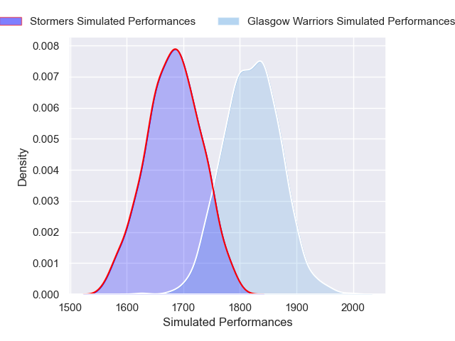
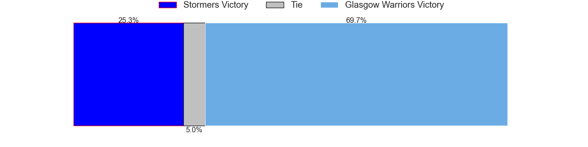
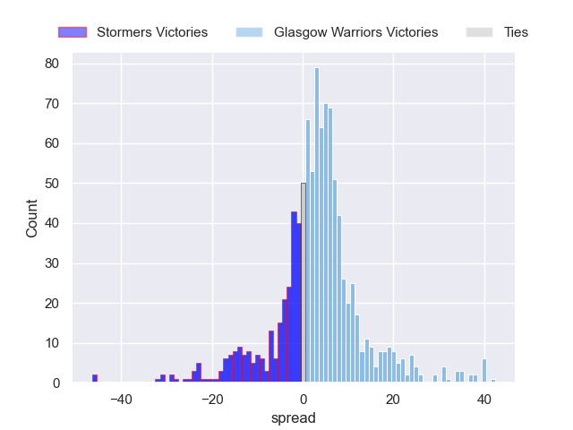
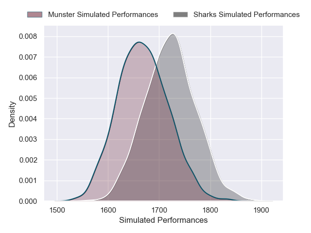
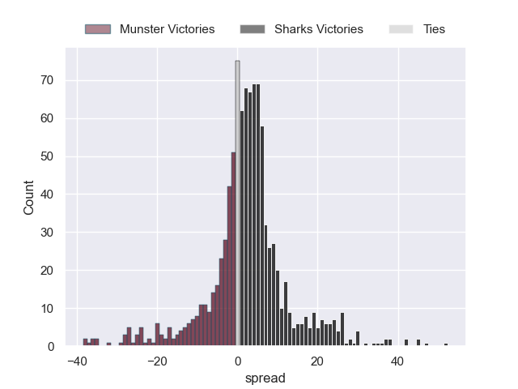
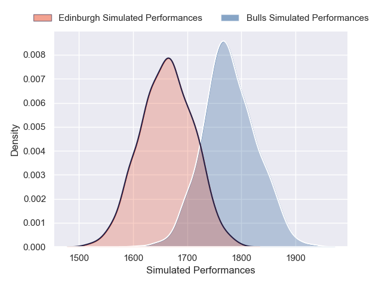
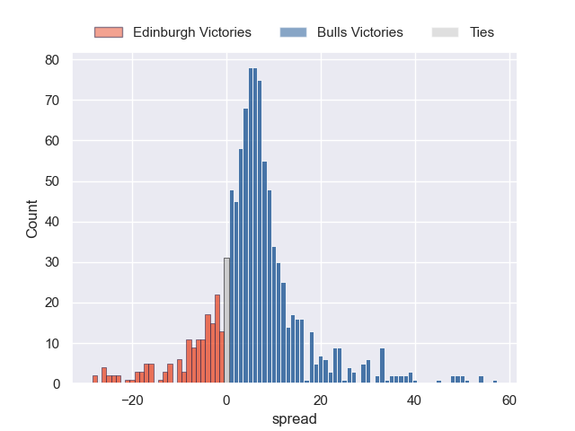
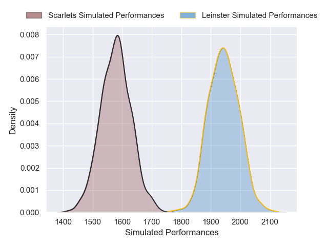
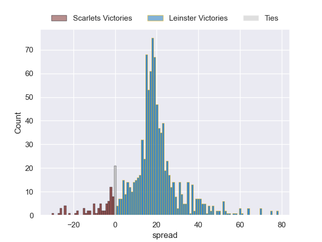

---  
title: "United Rugby Championship 24/25 Status"  
date: 2025-05-30 6:00:00 -0500  
categories: model review projection  
layout: article  
aside:  
    toc: true  
---
# Current Team Rankings

# Standings

## Current Standings

| Club             |   Played |   Wins |   Point Differential |   Losing Bonus Points |   Try Bonus Points |   Competition Points |
|:-----------------|---------:|-------:|---------------------:|----------------------:|-------------------:|---------------------:|
| Leinster         |       19 |     18 |                  348 |                     1 |                nan |                   84 |
| Bulls            |       20 |     14 |                   83 |                     3 |                nan |                   70 |
| Glasgow Warriors |       20 |     13 |                  180 |                     3 |                nan |                   65 |
| Sharks           |       20 |     12 |                   42 |                     4 |                nan |                   61 |
| Stormers         |       20 |     11 |                   46 |                     3 |                nan |                   60 |
| Edinburgh        |       20 |      8 |                   33 |                     7 |                nan |                   50 |
| Cardiff Blues    |       18 |      8 |                  -49 |                     4 |                 10 |                   48 |
| Benetton Treviso |       18 |      9 |                  -84 |                     1 |                  7 |                   46 |
| Scarlets         |       19 |      8 |                  -32 |                     3 |                nan |                   43 |
| Ulster           |       17 |      8 |                    7 |                     5 |                  5 |                   42 |
| Lions            |       19 |      8 |                  -59 |                     3 |                nan |                   42 |
| Connacht         |       19 |      7 |                  -61 |                     5 |                  9 |                   42 |
| Munster          |       18 |      7 |                  -62 |                     3 |                nan |                   41 |
| Zebre            |       19 |      7 |                 -115 |                     5 |                  3 |                   38 |
| Ospreys          |       18 |      6 |                  -47 |                     5 |                  6 |                   37 |
| Dragons          |       18 |      2 |                 -230 |                     5 |                  1 |                   14 |

## Projected Remaining Table

| Club             |   Matches Remaining |   Wins |   Point Differential |   Losing Bonus Points |   Try Bonus Points |   Competition Points |
|:-----------------|--------------------:|-------:|---------------------:|----------------------:|-------------------:|---------------------:|
| Leinster         |                   1 |    0.9 |             18.2973  |                   0   |                0.6 |                  4.3 |
| Bulls            |                   1 |    0.8 |              6.50043 |                   0.1 |                0.4 |                  3.8 |
| Glasgow Warriors |                   1 |    0.7 |              3.57446 |                   0.2 |                0.4 |                  3.5 |
| Sharks           |                   1 |    0.7 |              3.16289 |                   0.2 |                0.1 |                  3.1 |
| Munster          |                   1 |    0.3 |             -3.16289 |                   0.5 |                0.3 |                  1.9 |
| Stormers         |                   1 |    0.3 |             -3.57446 |                   0.4 |                0.2 |                  1.8 |
| Edinburgh        |                   1 |    0.2 |             -6.50043 |                   0.4 |                0.2 |                  1.3 |
| Scarlets         |                   1 |    0.1 |            -18.2973  |                   0.1 |                0.1 |                  0.5 |

## Projected Total Table

| Club             |   Total Matches |   Wins |   Point Differential |   Losing Bonus Points |   Try Bonus Points |   Competition Points |
|:-----------------|----------------:|-------:|---------------------:|----------------------:|-------------------:|---------------------:|
| Leinster         |              20 |   18.9 |             366.297  |                   1   |                0.6 |                 88.3 |
| Bulls            |              21 |   14.8 |              89.5004 |                   3.1 |                0.4 |                 73.8 |
| Glasgow Warriors |              21 |   13.7 |             183.574  |                   3.2 |                0.4 |                 68.5 |
| Sharks           |              21 |   12.7 |              45.1629 |                   4.2 |                0.1 |                 64.1 |
| Stormers         |              21 |   11.3 |              42.4255 |                   3.4 |                0.2 |                 61.8 |
| Edinburgh        |              21 |    8.2 |              26.4996 |                   7.4 |                0.2 |                 51.3 |
| Cardiff Blues    |              18 |    8   |             -49      |                   4   |               10   |                 48   |
| Benetton Treviso |              18 |    9   |             -84      |                   1   |                7   |                 46   |
| Scarlets         |              20 |    8.1 |             -50.2973 |                   3.1 |                0.1 |                 43.5 |
| Munster          |              19 |    7.3 |             -65.1629 |                   3.5 |                0.3 |                 42.9 |
| Ulster           |              17 |    8   |               7      |                   5   |                5   |                 42   |
| Lions            |              19 |    8   |             -59      |                   3   |                0   |                 42   |
| Connacht         |              19 |    7   |             -61      |                   5   |                9   |                 42   |
| Zebre            |              19 |    7   |            -115      |                   5   |                3   |                 38   |
| Ospreys          |              18 |    6   |             -47      |                   5   |                6   |                 37   |
| Dragons          |              18 |    2   |            -230      |                   5   |                1   |                 14   |

# Completed Match Review

| Model | Percent Correct Predictions | Spread Error |
| ------ | ------ | ------ |
| Club Level | 70.2% | 11.2 |
| Player Level: Lineup | 65.0% | 14.4 |
| Player Level: Minutes | 64.1% | 22.8 |

# Future Predictions

## Week 21

### Glasgow Warriors V Stormers on 2025/05/30

Average Margin: Glasgow Warriors by 3.6

Average Scoreline: 31-27

### Sharks V Munster on 2025/05/31

Average Margin: Sharks by 3.2

Average Scoreline: 27-24

### Bulls V Edinburgh on 2025/05/31

Average Margin: Bulls by 6.5

Average Scoreline: 35-29

### Leinster V Scarlets on 2025/05/31

Average Margin: Leinster by 18.3

Average Scoreline: 33-15

