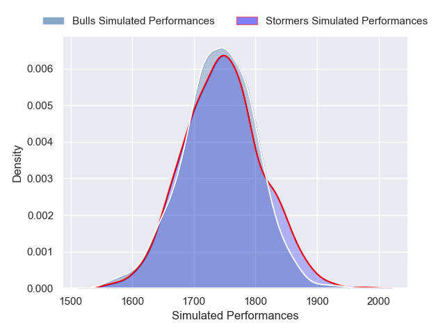
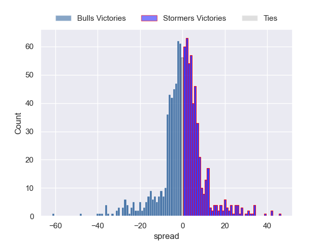

---  
title: "United Rugby Championship 24/25 Status"  
date: 2025-01-31 6:00:00 -0500  
categories: model review projection  
layout: article  
aside:  
    toc: true  
---
# Current Team Rankings

# Standings

## Current Standings

| Club             |   Played |   Wins |   Point Differential |   Losing Bonus Points |   Try Bonus Points |   Competition Points |
|:-----------------|---------:|-------:|---------------------:|----------------------:|-------------------:|---------------------:|
| Leinster         |       10 |     10 |                  173 |                     0 |                  8 |                   48 |
| Glasgow Warriors |       10 |      7 |                  105 |                     3 |                  6 |                   37 |
| Bulls            |        9 |      6 |                   67 |                     2 |                nan |                   32 |
| Sharks           |       10 |      6 |                   15 |                     2 |                nan |                   31 |
| Cardiff Blues    |       10 |      5 |                  -35 |                     1 |                  6 |                   29 |
| Scarlets         |       10 |      5 |                   39 |                     3 |                  2 |                   27 |
| Munster          |       10 |      5 |                  -22 |                     0 |                  6 |                   26 |
| Edinburgh        |       10 |      4 |                   -6 |                     3 |                  5 |                   24 |
| Ulster           |       10 |      4 |                  -12 |                     4 |                  3 |                   23 |
| Stormers         |       10 |      4 |                  -16 |                     1 |                nan |                   23 |
| Benetton Treviso |       10 |      4 |                  -73 |                     1 |                  4 |                   23 |
| Ospreys          |       10 |      4 |                    2 |                     2 |                  2 |                   22 |
| Lions            |        9 |      4 |                   -5 |                     1 |                nan |                   21 |
| Connacht         |       10 |      3 |                  -32 |                     3 |                  4 |                   19 |
| Zebre            |       10 |      3 |                  -87 |                     3 |                  1 |                   16 |
| Dragons          |       10 |      1 |                 -113 |                     3 |                  1 |                    8 |

## Projected Remaining Table

| Club             |   Matches Remaining |   Wins |   Point Differential |   Losing Bonus Points |   Try Bonus Points |   Competition Points |
|:-----------------|--------------------:|-------:|---------------------:|----------------------:|-------------------:|---------------------:|
| Leinster         |                   8 |    7.1 |            113.3     |                   0.5 |                4.9 |                 33.8 |
| Bulls            |                  10 |    6.7 |             66.9214  |                   2   |                4.6 |                 33.5 |
| Glasgow Warriors |                   8 |    6   |             49.3379  |                   0.9 |                4.2 |                 29   |
| Lions            |                  10 |    5.6 |              8.35017 |                   2.2 |                3.9 |                 28.6 |
| Stormers         |                   9 |    5.6 |             31.2254  |                   2   |                2.8 |                 27   |
| Munster          |                   8 |    5.6 |             39.1101  |                   1.5 |                2.7 |                 26.5 |
| Edinburgh        |                   8 |    5.4 |             44.9844  |                   1.6 |                3   |                 25.9 |
| Connacht         |                   8 |    4.7 |             19.7612  |                   2   |                2.7 |                 23.5 |
| Sharks           |                   9 |    4.3 |             -2.10052 |                   2.3 |                2.7 |                 22.1 |
| Ulster           |                   8 |    3.7 |            -14.0358  |                   2   |                2.1 |                 18.8 |
| Ospreys          |                   8 |    3.4 |             -9.87864 |                   2.1 |                2.3 |                 18.1 |
| Benetton Treviso |                   8 |    3   |            -23.5213  |                   2.5 |                1.7 |                 16   |
| Scarlets         |                   8 |    2.4 |            -42.0535  |                   2.3 |                1.8 |                 13.8 |
| Cardiff Blues    |                   8 |    1.1 |            -86.7249  |                   2   |                1.9 |                  8.5 |
| Zebre            |                   8 |    1.4 |            -98.3093  |                   1.3 |                1.3 |                  8.3 |
| Dragons          |                   8 |    1.1 |            -96.3662  |                   1.7 |                1.1 |                  7.2 |

## Projected Total Table

| Club             |   Total Matches |   Wins |   Point Differential |   Losing Bonus Points |   Try Bonus Points |   Competition Points |
|:-----------------|----------------:|-------:|---------------------:|----------------------:|-------------------:|---------------------:|
| Leinster         |              18 |   17.1 |            286.3     |                   0.5 |               12.9 |                 81.8 |
| Glasgow Warriors |              18 |   13   |            154.338   |                   3.9 |               10.2 |                 66   |
| Bulls            |              19 |   12.7 |            133.921   |                   4   |                4.6 |                 65.5 |
| Sharks           |              19 |   10.3 |             12.8995  |                   4.3 |                2.7 |                 53.1 |
| Munster          |              18 |   10.6 |             17.1101  |                   1.5 |                8.7 |                 52.5 |
| Stormers         |              19 |    9.6 |             15.2254  |                   3   |                2.8 |                 50   |
| Edinburgh        |              18 |    9.4 |             38.9844  |                   4.6 |                8   |                 49.9 |
| Lions            |              19 |    9.6 |              3.35017 |                   3.2 |                3.9 |                 49.6 |
| Connacht         |              18 |    7.7 |            -12.2388  |                   5   |                6.7 |                 42.5 |
| Ulster           |              18 |    7.7 |            -26.0358  |                   6   |                5.1 |                 41.8 |
| Scarlets         |              18 |    7.4 |             -3.05353 |                   5.3 |                3.8 |                 40.8 |
| Ospreys          |              18 |    7.4 |             -7.87864 |                   4.1 |                4.3 |                 40.1 |
| Benetton Treviso |              18 |    7   |            -96.5213  |                   3.5 |                5.7 |                 39   |
| Cardiff Blues    |              18 |    6.1 |           -121.725   |                   3   |                7.9 |                 37.5 |
| Zebre            |              18 |    4.4 |           -185.309   |                   4.3 |                2.3 |                 24.3 |
| Dragons          |              18 |    2.1 |           -209.366   |                   4.7 |                2.1 |                 15.2 |

# Completed Match Review

| Model | Percent Correct Predictions | Spread Error |
| ------ | ------ | ------ |
| Club Level | 72.2% | 10.1 |
| Player Level: Lineup | 65.6% | 10.6 |
| Player Level: Minutes | 71.0% | 13.6 |

# Future Predictions

## Week 11

### Stormers V Bulls on 2025/02/08

Average Margin: Stormers by 0.5

Average Scoreline: 25-24

## Week 12

### Ospreys V Leinster on 2025/02/14

Average Margin: Leinster by 11.3

Average Scoreline: 32-20

### Edinburgh V Zebre on 2025/02/14

Average Margin: Edinburgh by 16.0

Average Scoreline: 32-16

### Munster V Scarlets on 2025/02/15

Average Margin: Munster by 11.3

Average Scoreline: 31-20

### Dragons V Glasgow Warriors on 2025/02/15

Average Margin: Glasgow Warriors by 13.7

Average Scoreline: 34-21

### Connacht V Cardiff Blues on 2025/02/15

Average Margin: Connacht by 11.1

Average Scoreline: 32-20

### Bulls V Sharks on 2025/02/15

Average Margin: Bulls by 9.7

Average Scoreline: 29-20

### Lions V Stormers on 2025/02/15

Average Margin: Lions by 2.6

Average Scoreline: 29-27

### Benetton Treviso V Ulster on 2025/02/15

Average Margin: Benetton Treviso by 2.4

Average Scoreline: 26-23

## Week 13

### Bulls V Lions on 2025/02/22

Average Margin: Bulls by 9.7

Average Scoreline: 31-22

## Week 14

### Munster V Edinburgh on 2025/02/28

Average Margin: Munster by 5.6

Average Scoreline: 29-23

### Zebre V Dragons on 2025/02/28

Average Margin: Zebre by 4.2

Average Scoreline: 28-23

### Leinster V Cardiff Blues on 2025/03/01

Average Margin: Leinster by 22.2

Average Scoreline: 41-19

### Bulls V Stormers on 2025/03/01

Average Margin: Bulls by 7.2

Average Scoreline: 33-26

### Glasgow Warriors V Ospreys on 2025/03/01

Average Margin: Glasgow Warriors by 11.1

Average Scoreline: 27-16

### Lions V Sharks on 2025/03/01

Average Margin: Lions by 3.7

Average Scoreline: 28-24

### Connacht V Benetton Treviso on 2025/03/01

Average Margin: Connacht by 6.7

Average Scoreline: 29-22

### Ulster V Scarlets on 2025/03/01

Average Margin: Ulster by 7.1

Average Scoreline: 30-23

## Week 15

### Sharks V Lions on 2025/03/08

Average Margin: Sharks by 3.4

Average Scoreline: 29-25

## Week 16

### Cardiff Blues V Lions on 2025/03/21

Average Margin: Lions by 3.0

Average Scoreline: 30-27

### Glasgow Warriors V Munster on 2025/03/21

Average Margin: Glasgow Warriors by 5.3

Average Scoreline: 26-21

### Benetton Treviso V Edinburgh on 2025/03/22

Average Margin: Edinburgh by 0.5

Average Scoreline: 23-23

### Bulls V Leinster on 2025/03/22

Average Margin: Leinster by 4.4

Average Scoreline: 36-32

### Ospreys V Connacht on 2025/03/22

Average Margin: Ospreys by 1.6

Average Scoreline: 25-23

### Sharks V Zebre on 2025/03/22

Average Margin: Sharks by 13.7

Average Scoreline: 32-18

### Dragons V Ulster on 2025/03/22

Average Margin: Ulster by 7.6

Average Scoreline: 32-24

### Scarlets V Stormers on 2025/03/22

Average Margin: Stormers by 1.7

Average Scoreline: 28-26

## Week 17

### Edinburgh V Dragons on 2025/03/28

Average Margin: Edinburgh by 16.7

Average Scoreline: 32-15

### Ulster V Stormers on 2025/03/28

Average Margin: Ulster by 0.7

Average Scoreline: 24-23

### Sharks V Leinster on 2025/03/29

Average Margin: Leinster by 10.3

Average Scoreline: 32-21

### Bulls V Zebre on 2025/03/29

Average Margin: Bulls by 18.7

Average Scoreline: 40-21

### Scarlets V Ospreys on 2025/03/29

Average Margin: Scarlets by 1.7

Average Scoreline: 27-25

### Benetton Treviso V Cardiff Blues on 2025/03/29

Average Margin: Benetton Treviso by 8.7

Average Scoreline: 29-21

### Glasgow Warriors V Lions on 2025/03/29

Average Margin: Glasgow Warriors by 10.1

Average Scoreline: 29-18

### Connacht V Munster on 2025/03/29

Average Margin: Connacht by 0.4

Average Scoreline: 24-24

## Week 18

### Edinburgh V Sharks on 2025/04/18

Average Margin: Edinburgh by 5.8

Average Scoreline: 27-21

### Munster V Bulls on 2025/04/19

Average Margin: Munster by 2.7

Average Scoreline: 26-23

### Ospreys V Cardiff Blues on 2025/04/19

Average Margin: Ospreys by 9.5

Average Scoreline: 30-21

### Stormers V Connacht on 2025/04/19

Average Margin: Stormers by 5.1

Average Scoreline: 26-21

### Dragons V Scarlets on 2025/04/19

Average Margin: Scarlets by 4.7

Average Scoreline: 30-26

### Leinster V Ulster on 2025/04/19

Average Margin: Leinster by 16.5

Average Scoreline: 40-23

### Lions V Benetton Treviso on 2025/04/19

Average Margin: Lions by 5.9

Average Scoreline: 27-21

### Zebre V Glasgow Warriors on 2025/04/19

Average Margin: Glasgow Warriors by 12.2

Average Scoreline: 34-22

## Week 19

### Cardiff Blues V Munster on 2025/04/25

Average Margin: Munster by 7.3

Average Scoreline: 32-24

### Glasgow Warriors V Bulls on 2025/04/25

Average Margin: Glasgow Warriors by 4.3

Average Scoreline: 29-24

### Zebre V Edinburgh on 2025/04/26

Average Margin: Edinburgh by 9.0

Average Scoreline: 33-24

### Ospreys V Dragons on 2025/04/26

Average Margin: Ospreys by 14.1

Average Scoreline: 31-17

### Scarlets V Leinster on 2025/04/26

Average Margin: Leinster by 12.9

Average Scoreline: 33-20

### Stormers V Benetton Treviso on 2025/04/26

Average Margin: Stormers by 7.6

Average Scoreline: 26-18

### Lions V Connacht on 2025/04/26

Average Margin: Lions by 3.5

Average Scoreline: 27-24

### Ulster V Sharks on 2025/04/26

Average Margin: Ulster by 3.1

Average Scoreline: 27-24

## Week 20

### Munster V Ulster on 2025/05/09

Average Margin: Munster by 7.8

Average Scoreline: 29-21

### Sharks V Ospreys on 2025/05/09

Average Margin: Sharks by 5.4

Average Scoreline: 30-25

### Connacht V Edinburgh on 2025/05/10

Average Margin: Connacht by 3.3

Average Scoreline: 26-23

### Bulls V Cardiff Blues on 2025/05/10

Average Margin: Bulls by 13.8

Average Scoreline: 41-27

### Benetton Treviso V Glasgow Warriors on 2025/05/10

Average Margin: Glasgow Warriors by 3.8

Average Scoreline: 30-27

### Stormers V Dragons on 2025/05/10

Average Margin: Stormers by 15.6

Average Scoreline: 31-15

### Leinster V Zebre on 2025/05/10

Average Margin: Leinster by 24.6

Average Scoreline: 38-14

### Lions V Scarlets on 2025/05/11

Average Margin: Lions by 7.5

Average Scoreline: 30-23

## Week 21

### Munster V Benetton Treviso on 2025/05/16

Average Margin: Munster by 10.1

Average Scoreline: 29-18

### Edinburgh V Ulster on 2025/05/16

Average Margin: Edinburgh by 6.0

Average Scoreline: 30-24

### Stormers V Cardiff Blues on 2025/05/16

Average Margin: Stormers by 11.3

Average Scoreline: 31-19

### Zebre V Connacht on 2025/05/17

Average Margin: Connacht by 8.3

Average Scoreline: 32-23

### Lions V Ospreys on 2025/05/17

Average Margin: Lions by 5.5

Average Scoreline: 28-22

### Bulls V Dragons on 2025/05/17

Average Margin: Bulls by 19.7

Average Scoreline: 46-26

### Sharks V Scarlets on 2025/05/17

Average Margin: Sharks by 7.9

Average Scoreline: 30-22

### Leinster V Glasgow Warriors on 2025/05/17

Average Margin: Leinster by 11.2

Average Scoreline: 31-20

