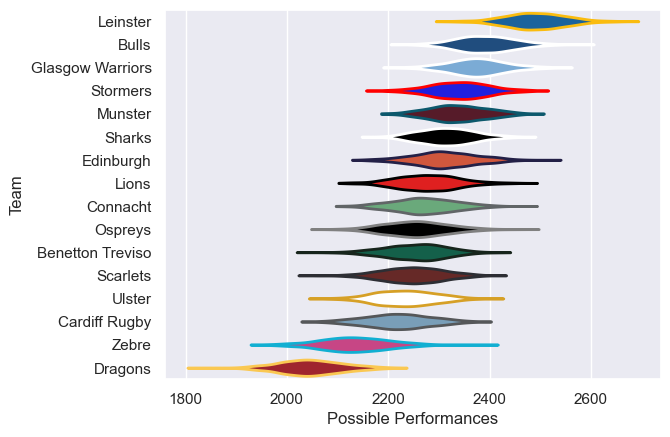

---  
title: "United Rugby Championship 24/25 Status"  
date: 2025-07-28 6:00:00 -0500  
categories: model review projection  
layout: article  
aside:  
    toc: true  
---
# Current Team Rankings

# Standings

## Current Standings

| Club             |   Played |   Wins |   Point Differential |   Losing Bonus Points |   Try Bonus Points |   Competition Points |
|:-----------------|---------:|-------:|---------------------:|----------------------:|-------------------:|---------------------:|
| Leinster         |       18 |     16 |                  286 |                     1 |                 11 |                   76 |
| Bulls            |       19 |     14 |                  181 |                     3 |                  9 |                   70 |
| Sharks           |       19 |     13 |                   34 |                     3 |                  7 |                   64 |
| Glasgow Warriors |       18 |     11 |                  141 |                     5 |                 10 |                   59 |
| Stormers         |       19 |     10 |                   89 |                     4 |                 11 |                   57 |
| Munster          |       18 |      9 |                   15 |                     4 |                 11 |                   51 |
| Edinburgh        |       18 |      8 |                   64 |                     6 |                  9 |                   49 |
| Scarlets         |       18 |      9 |                   45 |                     4 |                  6 |                   48 |
| Cardiff Rugby    |       18 |      8 |                  -68 |                     3 |                 10 |                   47 |
| Benetton Treviso |       18 |      9 |                  -85 |                     1 |                  7 |                   46 |
| Lions            |       19 |      8 |                  -38 |                     3 |                  5 |                   42 |
| Ospreys          |       18 |      7 |                  -17 |                     4 |                  6 |                   40 |
| Connacht         |       18 |      6 |                  -52 |                     6 |                  9 |                   39 |
| Ulster           |       18 |      7 |                  -92 |                     5 |                  5 |                   38 |
| Zebre            |       18 |      5 |                 -201 |                     4 |                  3 |                   29 |
| Dragons          |       18 |      1 |                 -302 |                     4 |                  1 |                    9 |

## Projected Playoff Results

|                  | Reach Quarterfinal   | Win Quarterfinal   | Reach Semifinal   | Win Semifinal   | Reach Final   | Win Final   |
|:-----------------|:---------------------|:-------------------|:------------------|:----------------|:--------------|:------------|
| Leinster         | 100.0 %              | 100.0 %            | 100.0 %           | 100.0 %         | 100.0 %       | 100.0 %     |
| Bulls            | 100.0 %              | 100.0 %            | 100.0 %           | 100.0 %         | 100.0 %       | 0.0 %       |
| Glasgow Warriors | 100.0 %              | 100.0 %            | 100.0 %           | 0.0 %           | 0.0 %         | 0.0 %       |
| Sharks           | 200.0 %              | 0.0 %              | 100.0 %           | 0.0 %           | 0.0 %         | 0.0 %       |
| Munster          | 0.0 %                | 100.0 %            | 0.0 %             | 0.0 %           | 0.0 %         | 0.0 %       |
| Stormers         | 100.0 %              | 0.0 %              | 0.0 %             | 0.0 %           | 0.0 %         | 0.0 %       |
| Scarlets         | 100.0 %              | 0.0 %              | 0.0 %             | 0.0 %           | 0.0 %         | 0.0 %       |
| Edinburgh        | 100.0 %              | 0.0 %              | 0.0 %             | 0.0 %           | 0.0 %         | 0.0 %       |

# Completed Match Review

| Model | Percent Correct Predictions | Spread Error |
| ------ | ------ | ------ |
| Club Level | 71.9% | 10.3 |
| Player Level: Lineup | nan% | nan |
| Player Level: Minutes | nan% | nan |

