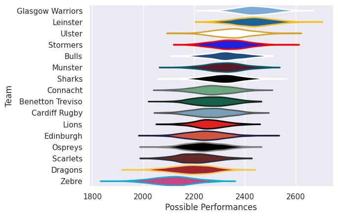

---  
title: "United Rugby Championship 25/26"  
date: 2025-11-21 6:00:00 -0500  
categories: model review projection  
layout: article  
aside:  
    toc: true  
---
# Team Rankings

# Standings

## Current Standings

| Club             |   Played |   Wins |   Point Differential |   Losing Bonus Points |   Try Bonus Points |   Competition Points |
|:-----------------|---------:|-------:|---------------------:|----------------------:|-------------------:|---------------------:|
| Stormers         |        5 |      5 |                  118 |                     0 |                  3 |                   23 |
| Munster          |        5 |      5 |                   36 |                     0 |                  2 |                   22 |
| Glasgow Warriors |        5 |      4 |                   97 |                     1 |                  3 |                   20 |
| Cardiff Rugby    |        5 |      4 |                   24 |                     1 |                  3 |                   20 |
| Ulster           |        5 |      3 |                   32 |                     0 |                  4 |                   18 |
| Bulls            |        5 |      3 |                   -8 |                     0 |                  2 |                   14 |
| Edinburgh        |        5 |      1 |                   38 |                     3 |                  2 |                   11 |
| Leinster         |        5 |      2 |                  -10 |                     0 |                  3 |                   11 |
| Lions            |        5 |      2 |                  -12 |                     1 |                  2 |                   11 |
| Zebre            |        5 |      2 |                  -61 |                     0 |                  2 |                   10 |
| Connacht         |        4 |      1 |                    2 |                     3 |                  2 |                    9 |
| Benetton Treviso |        5 |      2 |                  -41 |                     0 |                  1 |                    9 |
| Ospreys          |        5 |      1 |                  -30 |                     0 |                  1 |                    7 |
| Sharks           |        5 |      1 |                  -40 |                     0 |                  1 |                    7 |
| Dragons          |        5 |      0 |                  -77 |                     1 |                    |                    5 |
| Scarlets         |        4 |      0 |                  -68 |                     0 |                    |                    0 |

## Projected Remaining Table

| Club             |   To Play |   Projected Wins |   Projected Differential |   Projected Losing Bonus Points | Projected Try Bonus Points   |   Projected Competition Points |
|:-----------------|----------:|-----------------:|-------------------------:|--------------------------------:|:-----------------------------|-------------------------------:|
| Leinster         |        13 |            8.071 |                   51.322 |                           2.457 |                              |                         35.911 |
| Stormers         |        13 |            7.701 |                   39.727 |                           2.75  |                              |                         34.736 |
| Bulls            |        13 |            7.572 |                   32.533 |                           2.692 |                              |                         34.18  |
| Glasgow Warriors |        13 |            7.534 |                   34.868 |                           2.781 |                              |                         34.099 |
| Munster          |        13 |            6.756 |                   19.863 |                           3.084 |                              |                         31.456 |
| Edinburgh        |        13 |            6.74  |                   11.474 |                           2.779 |                              |                         30.945 |
| Connacht         |        14 |            6.425 |                   -7.508 |                           3.468 |                              |                         30.562 |
| Scarlets         |        14 |            6.185 |                  -12.974 |                           3.5   |                              |                         29.554 |
| Ulster           |        13 |            6.108 |                   -3.209 |                           3.266 |                              |                         29.07  |
| Sharks           |        13 |            5.845 |                   -6.718 |                           3.38  |                              |                         28.064 |
| Benetton Treviso |        13 |            5.855 |                   -7.132 |                           3.268 |                              |                         27.9   |
| Cardiff Rugby    |        13 |            5.825 |                   -7.29  |                           3.221 |                              |                         27.823 |
| Ospreys          |        13 |            5.745 |                   -8.906 |                           3.257 |                              |                         27.469 |
| Lions            |        13 |            5.521 |                  -18.472 |                           3.133 |                              |                         26.459 |
| Zebre            |        13 |            4.361 |                  -50.276 |                           3.205 |                              |                         21.757 |
| Dragons          |        13 |            3.815 |                  -67.302 |                           3.238 |                              |                         19.494 |

## Projected Total Table

| Club             |   Played |   Wins |   Point Differential |   Losing Bonus Points |   Try Bonus Points |   Competition Points |
|:-----------------|---------:|-------:|---------------------:|----------------------:|-------------------:|---------------------:|
| Stormers         |       18 | 12.701 |              157.727 |                 2.75  |                  3 |               57.736 |
| Glasgow Warriors |       18 | 11.534 |              131.868 |                 3.781 |                  3 |               54.099 |
| Munster          |       18 | 11.756 |               55.863 |                 3.084 |                  2 |               53.456 |
| Bulls            |       18 | 10.572 |               24.533 |                 2.692 |                  2 |               48.18  |
| Cardiff Rugby    |       18 |  9.825 |               16.71  |                 4.221 |                  3 |               47.823 |
| Ulster           |       18 |  9.108 |               28.791 |                 3.266 |                  4 |               47.07  |
| Leinster         |       18 | 10.071 |               41.322 |                 2.457 |                  3 |               46.911 |
| Edinburgh        |       18 |  7.74  |               49.474 |                 5.779 |                  2 |               41.945 |
| Connacht         |       18 |  7.425 |               -5.508 |                 6.468 |                  2 |               39.562 |
| Lions            |       18 |  7.521 |              -30.472 |                 4.133 |                  2 |               37.459 |
| Benetton Treviso |       18 |  7.855 |              -48.132 |                 3.268 |                  1 |               36.9   |
| Sharks           |       18 |  6.845 |              -46.718 |                 3.38  |                  1 |               35.064 |
| Ospreys          |       18 |  6.745 |              -38.906 |                 3.257 |                  1 |               34.469 |
| Zebre            |       18 |  6.361 |             -111.276 |                 3.205 |                  2 |               31.757 |
| Scarlets         |       18 |  6.185 |              -80.974 |                 3.5   |                    |               29.554 |
| Dragons          |       18 |  3.815 |             -144.302 |                 4.238 |                    |               24.494 |

## Projected Playoff Results

|                  | Reach Quarterfinal   | Win Quarterfinal   | Reach Semifinal   | Win Semifinal   | Reach Final   | Win Final   |
|:-----------------|:---------------------|:-------------------|:------------------|:----------------|:--------------|:------------|
| Stormers         | 98.8 %               | 64.7 %             | 64.7 %            | 35.5 %          | 35.5 %        | 18.6 %      |
| Glasgow Warriors | 95.9 %               | 58.0 %             | 58.0 %            | 30.0 %          | 30.0 %        | 16.6 %      |
| Munster          | 96.2 %               | 57.5 %             | 57.5 %            | 32.0 %          | 32.0 %        | 16.3 %      |
| Leinster         | 80.2 %               | 46.0 %             | 46.0 %            | 25.2 %          | 25.2 %        | 14.8 %      |
| Bulls            | 84.0 %               | 43.8 %             | 43.8 %            | 20.2 %          | 20.2 %        | 9.3 %       |
| Ulster           | 78.4 %               | 32.6 %             | 32.6 %            | 14.1 %          | 14.1 %        | 6.2 %       |
| Cardiff Rugby    | 80.9 %               | 30.8 %             | 30.8 %            | 12.1 %          | 12.1 %        | 4.5 %       |
| Connacht         | 44.1 %               | 16.7 %             | 16.7 %            | 8.5 %           | 8.5 %         | 3.8 %       |
| Edinburgh        | 53.7 %               | 20.4 %             | 20.4 %            | 7.9 %           | 7.9 %         | 3.8 %       |
| Lions            | 25.0 %               | 8.8 %              | 8.8 %             | 4.1 %           | 4.1 %         | 2.0 %       |
| Benetton Treviso | 21.6 %               | 7.0 %              | 7.0 %             | 3.0 %           | 3.0 %         | 1.4 %       |
| Sharks           | 16.1 %               | 6.0 %              | 6.0 %             | 3.2 %           | 3.2 %         | 1.2 %       |
| Ospreys          | 13.8 %               | 3.8 %              | 3.8 %             | 2.2 %           | 2.2 %         | 0.6 %       |
| Scarlets         | 2.8 %                | 1.3 %              | 1.3 %             | 1.1 %           | 1.1 %         | 0.4 %       |
| Zebre            | 7.2 %                | 1.9 %              | 1.9 %             | 0.5 %           | 0.5 %         | 0.3 %       |
| Dragons          | 1.3 %                | 0.7 %              | 0.7 %             | 0.4 %           | 0.4 %         | 0.2 %       |

# Completed Match Review

| Model | Percent Correct Predictions | Spread Error |
| ------ | ------ | ------ |
| Club Level | 62.9% | 8.4 |
| Player Level: Lineup | nan% | nan |
| Player Level: Minutes | nan% | nan |

# Future Predictions

## Week 6

### Connacht V Scarlets on 2025/10/04

Average Margin: Connacht by 3.8

## Week 7

### Ulster V Benetton Treviso on 2025/11/28

Average Margin: Ulster by 4.1

### Dragons V Leinster on 2025/11/28

Average Margin: Leinster by 7.8

### Edinburgh V Ospreys on 2025/11/29

Average Margin: Edinburgh by 5.1

### Munster V Stormers on 2025/11/29

Average Margin: Munster by 1.2

### Zebre V Cardiff Rugby on 2025/11/29

Average Margin: Cardiff Rugby by 0.4

### Scarlets V Glasgow Warriors on 2025/11/29

Average Margin: Glasgow Warriors by 2.6

### Bulls V Lions on 2025/11/29

Average Margin: Bulls by 6.0

### Connacht V Sharks on 2025/11/29

Average Margin: Connacht by 2.9

## Week 8

### Leinster V Ulster on 2025/12/19

Average Margin: Leinster by 7.8

### Cardiff Rugby V Scarlets on 2025/12/19

Average Margin: Cardiff Rugby by 3.0

### Ospreys V Munster on 2025/12/20

Average Margin: Munster by 0.8

### Stormers V Lions on 2025/12/20

Average Margin: Stormers by 6.9

### Dragons V Connacht on 2025/12/20

Average Margin: Connacht by 2.9

### Benetton Treviso V Zebre on 2025/12/20

Average Margin: Benetton Treviso by 6.4

### Sharks V Bulls on 2025/12/20

Average Margin: Bulls by 0.1

### Glasgow Warriors V Edinburgh on 2025/12/20

Average Margin: Glasgow Warriors by 5.4

## Week 9

### Cardiff Rugby V Dragons on 2025/12/26

Average Margin: Cardiff Rugby by 7.6

### Scarlets V Ospreys on 2025/12/26

Average Margin: Scarlets by 1.9

### Munster V Leinster on 2025/12/27

Average Margin: Munster by 0.9

### Lions V Sharks on 2025/12/27

Average Margin: Lions by 1.9

### Connacht V Ulster on 2025/12/27

Average Margin: Connacht by 2.7

### Zebre V Benetton Treviso on 2025/12/27

Average Margin: Benetton Treviso by 0.6

### Edinburgh V Glasgow Warriors on 2025/12/27

Average Margin: Edinburgh by 0.8

### Bulls V Stormers on 2025/12/27

Average Margin: Bulls by 1.5

## Week 10

### Ospreys V Cardiff Rugby on 2026/01/01

Average Margin: Ospreys by 2.9

### Dragons V Scarlets on 2026/01/01

Average Margin: Scarlets by 1.0

### Ulster V Munster on 2026/01/02

Average Margin: Ulster by 0.7

### Stormers V Bulls on 2026/01/03

Average Margin: Stormers by 4.3

### Glasgow Warriors V Zebre on 2026/01/03

Average Margin: Glasgow Warriors by 9.4

### Leinster V Connacht on 2026/01/03

Average Margin: Leinster by 7.8

### Benetton Treviso V Edinburgh on 2026/01/03

Average Margin: Benetton Treviso by 0.9

### Sharks V Lions on 2026/01/03

Average Margin: Sharks by 2.5

## Week 11

### Munster V Dragons on 2026/01/23

Average Margin: Munster by 8.9

### Edinburgh V Bulls on 2026/01/23

Average Margin: Edinburgh by 1.9

### Ospreys V Lions on 2026/01/23

Average Margin: Ospreys by 2.8

### Zebre V Glasgow Warriors on 2026/01/24

Average Margin: Glasgow Warriors by 4.6

### Scarlets V Ulster on 2026/01/24

Average Margin: Scarlets by 1.7

### Connacht V Leinster on 2026/01/24

Average Margin: Leinster by 1.5

### Cardiff Rugby V Benetton Treviso on 2026/01/24

Average Margin: Cardiff Rugby by 2.7

### Stormers V Sharks on 2026/01/24

Average Margin: Stormers by 5.9

## Week 12

### Glasgow Warriors V Munster on 2026/01/30

Average Margin: Glasgow Warriors by 4.0

### Benetton Treviso V Scarlets on 2026/01/30

Average Margin: Benetton Treviso by 3.9

### Zebre V Connacht on 2026/01/31

Average Margin: Connacht by 0.6

### Ulster V Cardiff Rugby on 2026/01/31

Average Margin: Ulster by 4.3

### Leinster V Edinburgh on 2026/01/31

Average Margin: Leinster by 5.4

### Sharks V Stormers on 2026/01/31

Average Margin: Stormers by 1.5

### Ospreys V Dragons on 2026/01/31

Average Margin: Ospreys by 7.2

### Lions V Bulls on 2026/01/31

Average Margin: Lions by 0.4

## Week 13

### Edinburgh V Scarlets on 2026/02/27

Average Margin: Edinburgh by 5.4

### Cardiff Rugby V Leinster on 2026/02/27

Average Margin: Leinster by 1.7

### Munster V Zebre on 2026/02/28

Average Margin: Munster by 8.2

### Dragons V Benetton Treviso on 2026/02/28

Average Margin: Benetton Treviso by 0.5

### Ospreys V Ulster on 2026/02/28

Average Margin: Ospreys by 1.8

### Lions V Stormers on 2026/02/28

Average Margin: Stormers by 1.0

### Bulls V Sharks on 2026/02/28

Average Margin: Bulls by 4.7

### Connacht V Glasgow Warriors on 2026/02/28

Average Margin: Connacht by 0.3

## Week 14

### Ulster V Connacht on 2026/03/20

Average Margin: Ulster by 4.3

### Scarlets V Zebre on 2026/03/20

Average Margin: Scarlets by 4.0

### Bulls V Cardiff Rugby on 2026/03/20

Average Margin: Bulls by 5.9

### Sharks V Munster on 2026/03/21

Average Margin: Sharks by 0.9

### Benetton Treviso V Ospreys on 2026/03/21

Average Margin: Benetton Treviso by 4.0

### Stormers V Dragons on 2026/03/21

Average Margin: Stormers by 10.1

### Glasgow Warriors V Leinster on 2026/03/21

Average Margin: Glasgow Warriors by 1.8

### Lions V Edinburgh on 2026/03/21

Average Margin: Lions by 1.9

## Week 15

### Sharks V Cardiff Rugby on 2026/03/27

Average Margin: Sharks by 3.3

### Glasgow Warriors V Benetton Treviso on 2026/03/27

Average Margin: Glasgow Warriors by 6.3

### Lions V Dragons on 2026/03/28

Average Margin: Lions by 6.8

### Leinster V Scarlets on 2026/03/28

Average Margin: Leinster by 6.9

### Connacht V Ospreys on 2026/03/28

Average Margin: Connacht by 4.4

### Zebre V Ulster on 2026/03/28

Average Margin: Ulster by 0.2

### Stormers V Edinburgh on 2026/03/28

Average Margin: Stormers by 5.0

### Bulls V Munster on 2026/03/28

Average Margin: Bulls by 3.6

## Week 16

### Edinburgh V Zebre on 2026/04/17

Average Margin: Edinburgh by 6.8

### Ulster V Leinster on 2026/04/17

Average Margin: Ulster by 0.2

### Dragons V Bulls on 2026/04/17

Average Margin: Bulls by 3.6

### Ospreys V Sharks on 2026/04/18

Average Margin: Ospreys by 1.2

### Lions V Glasgow Warriors on 2026/04/18

Average Margin: Glasgow Warriors by 0.3

### Stormers V Connacht on 2026/04/18

Average Margin: Stormers by 5.6

### Scarlets V Cardiff Rugby on 2026/04/18

Average Margin: Scarlets by 1.5

### Benetton Treviso V Munster on 2026/04/18

Average Margin: Benetton Treviso by 0.5

## Week 17

### Cardiff Rugby V Ospreys on 2026/04/24

Average Margin: Cardiff Rugby by 3.9

### Zebre V Dragons on 2026/04/24

Average Margin: Zebre by 3.8

### Edinburgh V Sharks on 2026/04/24

Average Margin: Edinburgh by 4.0

### Lions V Connacht on 2026/04/25

Average Margin: Lions by 2.6

### Benetton Treviso V Leinster on 2026/04/25

Average Margin: Leinster by 0.9

### Scarlets V Bulls on 2026/04/25

Average Margin: Bulls by 0.2

### Stormers V Glasgow Warriors on 2026/04/25

Average Margin: Stormers by 2.5

### Munster V Ulster on 2026/04/25

Average Margin: Munster by 5.2

## Week 18

### Glasgow Warriors V Cardiff Rugby on 2026/05/08

Average Margin: Glasgow Warriors by 5.3

### Ulster V Stormers on 2026/05/08

Average Margin: Ulster by 0.8

### Ospreys V Scarlets on 2026/05/09

Average Margin: Ospreys by 2.5

### Connacht V Munster on 2026/05/09

Average Margin: Connacht by 1.0

### Leinster V Lions on 2026/05/09

Average Margin: Leinster by 7.2

### Dragons V Edinburgh on 2026/05/09

Average Margin: Edinburgh by 1.9

### Sharks V Benetton Treviso on 2026/05/09

Average Margin: Sharks by 4.0

### Bulls V Zebre on 2026/05/09

Average Margin: Bulls by 7.8

## Week 19

### Edinburgh V Connacht on 2026/05/15

Average Margin: Edinburgh by 4.1

### Cardiff Rugby V Stormers on 2026/05/15

Average Margin: Stormers by 0.2

### Ulster V Glasgow Warriors on 2026/05/15

Average Margin: Ulster by 1.3

### Leinster V Ospreys on 2026/05/16

Average Margin: Leinster by 7.3

### Munster V Lions on 2026/05/16

Average Margin: Munster by 5.2

### Bulls V Benetton Treviso on 2026/05/16

Average Margin: Bulls by 5.8

### Scarlets V Dragons on 2026/05/16

Average Margin: Scarlets by 5.1

### Sharks V Zebre on 2026/05/16

Average Margin: Sharks by 4.8

## Week 20

### Edinburgh V Benetton Treviso on 2026-05-29

Average Margin: Benetton Treviso by 5.0

### Stormers V Leinster on 2026-05-29

Average Margin: Stormers by 3.5

### Glasgow Warriors V Edinburgh on 2026-05-29

Average Margin: Glasgow Warriors by 7.8

### Leinster V Connacht on 2026-05-29

Average Margin: Leinster by 6.2

### Cardiff Rugby V Zebre on 2026-05-29

Average Margin: Cardiff Rugby by 6.5

### Edinburgh V Ulster on 2026-05-29

Average Margin: Ulster by 2.2

### Connacht V Glasgow Warriors on 2026-05-29

Average Margin: Connacht by 1.0

### Leinster V Lions on 2026-05-29

Average Margin: Leinster by 10.1

### Stormers V Edinburgh on 2026-05-29

Average Margin: Stormers by 3.1

### Bulls V Sharks on 2026-05-29

Average Margin: Bulls by 11.0

### Bulls V Lions on 2026-05-29

Average Margin: Bulls by 12.8

### Ulster V Cardiff Rugby on 2026-05-29

Average Margin: Ulster by 4.0

### Stormers V Ulster on 2026-05-29

Average Margin: Stormers by 1.4

### Bulls V Zebre on 2026-05-29

Average Margin: Bulls by 11.0

### Glasgow Warriors V Lions on 2026-05-29

Average Margin: Glasgow Warriors by 0.2

### Leinster V Glasgow Warriors on 2026-05-29

Average Margin: Leinster by 1.4

### Cardiff Rugby V Leinster on 2026-05-29

Average Margin: Cardiff Rugby by 0.9

### Glasgow Warriors V Benetton Treviso on 2026-05-29

Average Margin: Glasgow Warriors by 10.1

### Munster V Ulster on 2026-05-29

Average Margin: Munster by 4.6

### Munster V Lions on 2026-05-29

Average Margin: Munster by 10.7

### Stormers V Connacht on 2026-05-29

Average Margin: Stormers by 5.9

### Munster V Stormers on 2026-05-29

Average Margin: Munster by 2.3

### Munster V Edinburgh on 2026-05-29

Average Margin: Munster by 2.6

### Leinster V Ulster on 2026-05-29

Average Margin: Leinster by 9.0

### Munster V Leinster on 2026-05-29

Average Margin: Munster by 3.9

### Stormers V Cardiff Rugby on 2026-05-29

Average Margin: Stormers by 3.6

### Stormers V Lions on 2026-05-29

Average Margin: Stormers by 2.3

### Stormers V Bulls on 2026-05-29

Average Margin: Stormers by 4.9

### Cardiff Rugby V Ospreys on 2026-05-29

Average Margin: Ospreys by 3.3

### Munster V Connacht on 2026-05-29

Average Margin: Munster by 1.9

### Munster V Glasgow Warriors on 2026-05-29

Average Margin: Munster by 1.8

### Bulls V Cardiff Rugby on 2026-05-29

Average Margin: Bulls by 5.0

### Bulls V Benetton Treviso on 2026-05-29

Average Margin: Bulls by 4.3

### Glasgow Warriors V Cardiff Rugby on 2026-05-29

Average Margin: Glasgow Warriors by 5.3

### Munster V Cardiff Rugby on 2026-05-29

Average Margin: Munster by 2.1

### Leinster V Edinburgh on 2026-05-29

Average Margin: Leinster by 7.0

### Ulster V Bulls on 2026-05-29

Average Margin: Ulster by 5.3

### Connacht V Cardiff Rugby on 2026-05-29

Average Margin: Connacht by 4.8

### Stormers V Sharks on 2026-05-29

Average Margin: Stormers by 6.5

### Ulster V Benetton Treviso on 2026-05-29

Average Margin: Benetton Treviso by 9.3

### Glasgow Warriors V Ulster on 2026-05-29

Average Margin: Glasgow Warriors by 4.3

### Cardiff Rugby V Edinburgh on 2026-05-29

Average Margin: Edinburgh by 0.0

### Cardiff Rugby V Benetton Treviso on 2026-05-29

Average Margin: Cardiff Rugby by 12.7

### Munster V Zebre on 2026-05-29

Average Margin: Munster by 11.8

### Glasgow Warriors V Zebre on 2026-05-29

Average Margin: Glasgow Warriors by 2.2

### Glasgow Warriors V Bulls on 2026-05-29

Average Margin: Glasgow Warriors by 1.7

### Leinster V Sharks on 2026-05-29

Average Margin: Leinster by 2.8

### Lions V Edinburgh on 2026-05-29

Average Margin: Lions by 15.0

### Leinster V Benetton Treviso on 2026-05-29

Average Margin: Benetton Treviso by 2.3

### Glasgow Warriors V Scarlets on 2026-05-29

Average Margin: Glasgow Warriors by 0.6

### Leinster V Ospreys on 2026-05-29

Average Margin: Leinster by 11.2

### Glasgow Warriors V Sharks on 2026-05-29

Average Margin: Glasgow Warriors by 1.5

### Bulls V Leinster on 2026-05-29

Average Margin: Bulls by 2.6

### Bulls V Connacht on 2026-05-29

Average Margin: Bulls by 7.2

### Munster V Bulls on 2026-05-29

Average Margin: Munster by 3.1

### Munster V Scarlets on 2026-05-29

Average Margin: Scarlets by 0.7

### Glasgow Warriors V Ospreys on 2026-05-29

Average Margin: Glasgow Warriors by 4.4

### Stormers V Dragons on 2026-05-29

Average Margin: Stormers by 5.0

### Munster V Benetton Treviso on 2026-05-29

Average Margin: Munster by 2.5

### Bulls V Edinburgh on 2026-05-29

Average Margin: Edinburgh by 2.3

### Glasgow Warriors V Stormers on 2026-05-29

Average Margin: Glasgow Warriors by 2.6

### Bulls V Ospreys on 2026-05-29

Average Margin: Bulls by 4.5

### Stormers V Benetton Treviso on 2026-05-29

Average Margin: Stormers by 6.0

### Benetton Treviso V Connacht on 2026-05-29

Average Margin: Benetton Treviso by 3.0

### Ulster V Sharks on 2026-05-29

Average Margin: Ulster by 2.8

### Munster V Sharks on 2026-05-29

Average Margin: Munster by 5.8

### Edinburgh V Connacht on 2026-05-29

Average Margin: Connacht by 6.7

### Cardiff Rugby V Sharks on 2026-05-29

Average Margin: Cardiff Rugby by 5.2

### Cardiff Rugby V Lions on 2026-05-29

Average Margin: Cardiff Rugby by 6.7

### Stormers V Ospreys on 2026-05-29

Average Margin: Stormers by 2.5

### Connacht V Lions on 2026-05-29

Average Margin: Lions by 19.0

### Benetton Treviso V Lions on 2026-05-29

Average Margin: Benetton Treviso by 20.0

### Benetton Treviso V Edinburgh on 2026-05-29

Average Margin: Benetton Treviso by 29.0

### Leinster V Zebre on 2026-05-29

Average Margin: Leinster by 5.5

### Lions V Ulster on 2026-05-29

Average Margin: Ulster by 13.5

### Munster V Dragons on 2026-05-29

Average Margin: Dragons by 4.0

### Stormers V Scarlets on 2026-05-29

Average Margin: Scarlets by 3.0

### Stormers V Zebre on 2026-05-29

Average Margin: Stormers by 26.0

### Sharks V Ulster on 2026-05-29

Average Margin: Ulster by 1.5

### Connacht V Sharks on 2026-05-29

Average Margin: Connacht by 11.0

### Edinburgh V Sharks on 2026-05-29

Average Margin: Sharks by 1.0

### Glasgow Warriors V Connacht on 2026-05-29

Average Margin: Glasgow Warriors by 4.2

### Glasgow Warriors V Munster on 2026-05-29

Average Margin: Munster by 1.3

### Glasgow Warriors V Leinster on 2026-05-29

Average Margin: Glasgow Warriors by 3.7

### Bulls V Dragons on 2026-05-29

Average Margin: Bulls by 16.0

### Cardiff Rugby V Bulls on 2026-05-29

Average Margin: Cardiff Rugby by 0.2

### Ulster V Lions on 2026-05-29

Average Margin: Ulster by 14.8

### Stormers V Munster on 2026-05-29

Average Margin: Stormers by 3.5

### Bulls V Glasgow Warriors on 2026-05-29

Average Margin: Bulls by 2.6

### Sharks V Dragons on 2026-05-29

Average Margin: Dragons by 3.0

### Bulls V Scarlets on 2026-05-29

Average Margin: Scarlets by 4.0

### Glasgow Warriors V Dragons on 2026-05-29

Average Margin: Dragons by 12.0

### Leinster V Bulls on 2026-05-29

Average Margin: Bulls by 13.0

### Benetton Treviso V Munster on 2026-05-29

Average Margin: Benetton Treviso by 5.6

### Bulls V Ulster on 2026-05-29

Average Margin: Bulls by 5.1

### Leinster V Munster on 2026-05-29

Average Margin: Leinster by 4.8

### Ulster V Leinster on 2026-05-29

Average Margin: Leinster by 2.4

### Stormers V Glasgow Warriors on 2026-05-29

Average Margin: Stormers by 3.9

### Cardiff Rugby V Ulster on 2026-05-29

Average Margin: Cardiff Rugby by 2.7

### Lions V Cardiff Rugby on 2026-05-29

Average Margin: Lions by 5.0

### Connacht V Ulster on 2026-05-29

Average Margin: Connacht by 5.0

### Edinburgh V Cardiff Rugby on 2026-05-29

Average Margin: Edinburgh by 6.4

### Ulster V Edinburgh on 2026-05-29

Average Margin: Edinburgh by 1.0

### Cardiff Rugby V Stormers on 2026-05-29

Average Margin: Stormers by 1.4

### Cardiff Rugby V Connacht on 2026-05-29

Average Margin: Cardiff Rugby by 2.2

### Leinster V Cardiff Rugby on 2026-05-29

Average Margin: Leinster by 7.9

### Sharks V Benetton Treviso on 2026-05-29

Average Margin: Benetton Treviso by 1.0

### Ulster V Munster on 2026-05-29

Average Margin: Ulster by 2.4

### Zebre V Sharks on 2026-05-29

Average Margin: Sharks by 1.0

### Ulster V Glasgow Warriors on 2026-05-29

Average Margin: Ulster by 3.5

### Lions V Stormers on 2026-05-29

Average Margin: Stormers by 2.8

### Benetton Treviso V Leinster on 2026-05-29

Average Margin: Leinster by 1.8

### Edinburgh V Zebre on 2026-05-29

Average Margin: Edinburgh by 4.0

### Benetton Treviso V Glasgow Warriors on 2026-05-29

Average Margin: Benetton Treviso by 8.0

### Connacht V Bulls on 2026-05-29

Average Margin: Connacht by 4.0

### Edinburgh V Leinster on 2026-05-29

Average Margin: Edinburgh by 2.2

### Benetton Treviso V Cardiff Rugby on 2026-05-29

Average Margin: Benetton Treviso by 0.7

### Sharks V Munster on 2026-05-29

Average Margin: Sharks by 0.5

### Ospreys V Edinburgh on 2026-05-29

Average Margin: Edinburgh by 1.5

### Connacht V Dragons on 2026-05-29

Average Margin: Dragons by 13.0

### Lions V Zebre on 2026-05-29

Average Margin: Lions by 7.0

### Benetton Treviso V Bulls on 2026-05-29

Average Margin: Benetton Treviso by 0.3

### Connacht V Leinster on 2026-05-29

Average Margin: Leinster by 4.3

### Lions V Munster on 2026-05-29

Average Margin: Munster by 5.3

### Sharks V Leinster on 2026-05-29

Average Margin: Leinster by 5.2

### Ulster V Zebre on 2026-05-29

Average Margin: Ulster by 15.0

### Sharks V Bulls on 2026-05-29

Average Margin: Sharks by 13.5

### Bulls V Munster on 2026-05-29

Average Margin: Bulls by 4.4

### Ulster V Stormers on 2026-05-29

Average Margin: Stormers by 3.8

### Leinster V Stormers on 2026-05-29

Average Margin: Leinster by 4.2

### Cardiff Rugby V Munster on 2026-05-29

Average Margin: Munster by 1.1

### Zebre V Glasgow Warriors on 2026-05-29

Average Margin: Zebre by 3.3

### Connacht V Ospreys on 2026-05-29

Average Margin: Connacht by 5.0

### Ospreys V Cardiff Rugby on 2026-05-29

Average Margin: Cardiff Rugby by 1.8

### Ospreys V Connacht on 2026-05-29

Average Margin: Connacht by 0.2

### Lions V Benetton Treviso on 2026-05-29

Average Margin: Benetton Treviso by 8.0

### Leinster V Dragons on 2026-05-29

Average Margin: Leinster by 8.0

### Leinster V Scarlets on 2026-05-29

Average Margin: Scarlets by 7.5

### Zebre V Stormers on 2026-05-29

Average Margin: Zebre by 2.0

### Ulster V Ospreys on 2026-05-29

Average Margin: Ulster by 6.0

### Lions V Leinster on 2026-05-29

Average Margin: Lions by 1.3

### Ospreys V Ulster on 2026-05-29

Average Margin: Ospreys by 3.5

### Ulster V Connacht on 2026-05-29

Average Margin: Ulster by 2.9

### Munster V Ospreys on 2026-05-29

Average Margin: Munster by 6.8

## Week 21

### Glasgow Warriors V Zebre on 2026-06-05

Average Margin: Glasgow Warriors by 10.5

### Glasgow Warriors V Benetton Treviso on 2026-06-05

Average Margin: Glasgow Warriors by 0.7

### Bulls V Stormers on 2026-06-05

Average Margin: Bulls by 3.1

### Munster V Bulls on 2026-06-05

Average Margin: Munster by 4.0

### Glasgow Warriors V Bulls on 2026-06-05

Average Margin: Glasgow Warriors by 2.4

### Stormers V Munster on 2026-06-05

Average Margin: Stormers by 3.0

### Leinster V Cardiff Rugby on 2026-06-05

Average Margin: Leinster by 5.1

### Glasgow Warriors V Cardiff Rugby on 2026-06-05

Average Margin: Glasgow Warriors by 4.6

### Munster V Leinster on 2026-06-05

Average Margin: Munster by 2.6

### Munster V Connacht on 2026-06-05

Average Margin: Munster by 3.5

### Leinster V Bulls on 2026-06-05

Average Margin: Leinster by 4.2

### Stormers V Leinster on 2026-06-05

Average Margin: Stormers by 2.9

### Ospreys V Glasgow Warriors on 2026-06-05

Average Margin: Ospreys by 1.8

### Benetton Treviso V Leinster on 2026-06-05

Average Margin: Leinster by 0.3

### Ulster V Leinster on 2026-06-05

Average Margin: Ulster by 0.2

### Stormers V Lions on 2026-06-05

Average Margin: Stormers by 5.1

### Edinburgh V Bulls on 2026-06-05

Average Margin: Edinburgh by 3.2

### Glasgow Warriors V Leinster on 2026-06-05

Average Margin: Leinster by 1.3

### Glasgow Warriors V Connacht on 2026-06-05

Average Margin: Glasgow Warriors by 1.6

### Glasgow Warriors V Edinburgh on 2026-06-05

Average Margin: Glasgow Warriors by 7.3

### Connacht V Stormers on 2026-06-05

Average Margin: Stormers by 1.8

### Ulster V Munster on 2026-06-05

Average Margin: Ulster by 3.7

### Connacht V Ulster on 2026-06-05

Average Margin: Connacht by 5.8

### Cardiff Rugby V Connacht on 2026-06-05

Average Margin: Cardiff Rugby by 1.5

### Glasgow Warriors V Ulster on 2026-06-05

Average Margin: Glasgow Warriors by 8.3

### Stormers V Glasgow Warriors on 2026-06-05

Average Margin: Stormers by 1.0

### Ospreys V Leinster on 2026-06-05

Average Margin: Leinster by 5.0

### Bulls V Lions on 2026-06-05

Average Margin: Bulls by 1.8

### Cardiff Rugby V Edinburgh on 2026-06-05

Average Margin: Cardiff Rugby by 7.0

### Munster V Glasgow Warriors on 2026-06-05

Average Margin: Munster by 3.6

### Stormers V Ulster on 2026-06-05

Average Margin: Stormers by 7.1

### Bulls V Cardiff Rugby on 2026-06-05

Average Margin: Bulls by 7.6

### Sharks V Ulster on 2026-06-05

Average Margin: Sharks by 4.0

### Lions V Munster on 2026-06-05

Average Margin: Munster by 0.5

### Stormers V Edinburgh on 2026-06-05

Average Margin: Stormers by 4.7

### Dragons V Edinburgh on 2026-06-05

Average Margin: Edinburgh by 1.0

### Cardiff Rugby V Munster on 2026-06-05

Average Margin: Cardiff Rugby by 0.3

### Bulls V Ulster on 2026-06-05

Average Margin: Bulls by 5.9

### Edinburgh V Leinster on 2026-06-05

Average Margin: Leinster by 0.6

### Lions V Leinster on 2026-06-05

Average Margin: Lions by 0.2

### Leinster V Connacht on 2026-06-05

Average Margin: Leinster by 6.4

### Zebre V Leinster on 2026-06-05

Average Margin: Leinster by 1.7

### Munster V Edinburgh on 2026-06-05

Average Margin: Munster by 4.0

### Glasgow Warriors V Sharks on 2026-06-05

Average Margin: Glasgow Warriors by 0.3

### Connacht V Bulls on 2026-06-05

Average Margin: Connacht by 4.0

### Stormers V Benetton Treviso on 2026-06-05

Average Margin: Stormers by 2.7

### Ospreys V Edinburgh on 2026-06-05

Average Margin: Edinburgh by 0.0

### Sharks V Bulls on 2026-06-05

Average Margin: Sharks by 3.4

### Benetton Treviso V Cardiff Rugby on 2026-06-05

Average Margin: Cardiff Rugby by 6.8

### Edinburgh V Ulster on 2026-06-05

Average Margin: Edinburgh by 4.8

### Sharks V Connacht on 2026-06-05

Average Margin: Sharks by 8.0

### Munster V Benetton Treviso on 2026-06-05

Average Margin: Munster by 5.8

### Ospreys V Stormers on 2026-06-05

Average Margin: Ospreys by 1.0

### Leinster V Sharks on 2026-06-05

Average Margin: Leinster by 1.0

### Edinburgh V Lions on 2026-06-05

Average Margin: Edinburgh by 10.7

### Stormers V Cardiff Rugby on 2026-06-05

Average Margin: Stormers by 2.7

### Edinburgh V Connacht on 2026-06-05

Average Margin: Connacht by 1.1

### Ospreys V Bulls on 2026-06-05

Average Margin: Ospreys by 14.0

### Lions V Glasgow Warriors on 2026-06-05

Average Margin: Glasgow Warriors by 0.9

### Cardiff Rugby V Ulster on 2026-06-05

Average Margin: Cardiff Rugby by 2.5

### Lions V Ulster on 2026-06-05

Average Margin: Lions by 16.0

### Stormers V Connacht on 2026-06-05

Average Margin: Stormers by 0.8

### Sharks V Benetton Treviso on 2026-06-05

Average Margin: Benetton Treviso by 5.0

### Lions V Cardiff Rugby on 2026-06-05

Average Margin: Lions by 11.7

### Sharks V Stormers on 2026-06-05

Average Margin: Stormers by 0.6

### Munster V Ulster on 2026-06-05

Average Margin: Ulster by 0.6

### Sharks V Munster on 2026-06-05

Average Margin: Munster by 2.2

### Zebre V Sharks on 2026-06-05

Average Margin: Sharks by 2.0

### Sharks V Cardiff Rugby on 2026-06-05

Average Margin: Sharks by 10.0

### Scarlets V Ulster on 2026-06-05

Average Margin: Scarlets by 2.0

### Dragons V Bulls on 2026-06-05

Average Margin: Dragons by 3.0

### Dragons V Stormers on 2026-06-05

Average Margin: Dragons by 27.0

### Lions V Benetton Treviso on 2026-06-05

Average Margin: Lions by 7.0

### Glasgow Warriors V Dragons on 2026-06-05

Average Margin: Dragons by 2.0

### Leinster V Ulster on 2026-06-05

Average Margin: Leinster by 5.1

### Ospreys V Ulster on 2026-06-05

Average Margin: Ospreys by 3.7

### Connacht V Munster on 2026-06-05

Average Margin: Connacht by 2.4

### Glasgow Warriors V Stormers on 2026-06-05

Average Margin: Glasgow Warriors by 2.7

### Connacht V Lions on 2026-06-05

Average Margin: Connacht by 2.0

### Sharks V Lions on 2026-06-05

Average Margin: Sharks by 4.0

### Benetton Treviso V Bulls on 2026-06-05

Average Margin: Benetton Treviso by 3.5

### Zebre V Connacht on 2026-06-05

Average Margin: Connacht by 3.0

### Scarlets V Bulls on 2026-06-05

Average Margin: Scarlets by 2.5

### Cardiff Rugby V Stormers on 2026-06-05

Average Margin: Cardiff Rugby by 5.5

### Ulster V Glasgow Warriors on 2026-06-05

Average Margin: Ulster by 0.8

### Leinster V Munster on 2026-06-05

Average Margin: Leinster by 5.5

### Stormers V Sharks on 2026-06-05

Average Margin: Stormers by 12.7

### Munster V Cardiff Rugby on 2026-06-05

Average Margin: Munster by 4.9

### Munster V Ospreys on 2026-06-05

Average Margin: Munster by 6.0

### Ulster V Lions on 2026-06-05

Average Margin: Ulster by 3.5

### Bulls V Benetton Treviso on 2026-06-05

Average Margin: Bulls by 1.1

### Scarlets V Stormers on 2026-06-05

Average Margin: Scarlets by 3.0

### Leinster V Edinburgh on 2026-06-05

Average Margin: Leinster by 5.1

### Ulster V Zebre on 2026-06-05

Average Margin: Ulster by 13.5

### Benetton Treviso V Edinburgh on 2026-06-05

Average Margin: Benetton Treviso by 6.4

### Ulster V Connacht on 2026-06-05

Average Margin: Ulster by 2.4

### Cardiff Rugby V Glasgow Warriors on 2026-06-05

Average Margin: Glasgow Warriors by 1.7

### Benetton Treviso V Stormers on 2026-06-05

Average Margin: Benetton Treviso by 1.2

### Ulster V Bulls on 2026-06-05

Average Margin: Ulster by 2.6

### Connacht V Leinster on 2026-06-05

Average Margin: Leinster by 0.8

### Zebre V Bulls on 2026-06-05

Average Margin: Zebre by 13.5

### Ulster V Edinburgh on 2026-06-05

Average Margin: Ulster by 0.9

### Ulster V Stormers on 2026-06-05

Average Margin: Ulster by 1.2

### Scarlets V Benetton Treviso on 2026-06-05

Average Margin: Scarlets by 17.0

### Connacht V Glasgow Warriors on 2026-06-05

Average Margin: Connacht by 7.5

### Connacht V Cardiff Rugby on 2026-06-05

Average Margin: Cardiff Rugby by 4.6

### Ospreys V Connacht on 2026-06-05

Average Margin: Ospreys by 29.0

### Scarlets V Glasgow Warriors on 2026-06-05

Average Margin: Scarlets by 11.5

### Ospreys V Munster on 2026-06-05

Average Margin: Ospreys by 5.5

### Ulster V Benetton Treviso on 2026-06-05

Average Margin: Ulster by 5.3

### Lions V Stormers on 2026-06-05

Average Margin: Lions by 3.0

### Lions V Connacht on 2026-06-05

Average Margin: Lions by 5.0

### Bulls V Sharks on 2026-06-05

Average Margin: Bulls by 4.0

### Glasgow Warriors V Lions on 2026-06-05

Average Margin: Glasgow Warriors by 5.3

### Munster V Scarlets on 2026-06-05

Average Margin: Scarlets by 2.3

### Benetton Treviso V Munster on 2026-06-05

Average Margin: Munster by 0.8

### Zebre V Munster on 2026-06-05

Average Margin: Munster by 0.5

### Dragons V Benetton Treviso on 2026-06-05

Average Margin: Benetton Treviso by 22.0

### Ospreys V Cardiff Rugby on 2026-06-05

Average Margin: Ospreys by 13.0

### Zebre V Cardiff Rugby on 2026-06-05

Average Margin: Cardiff Rugby by 0.0

### Sharks V Edinburgh on 2026-06-05

Average Margin: Sharks by 8.2

## Final

### Lions V Stormers on 2026-06-19

Average Margin: Stormers by 12.0

### Connacht V Cardiff Rugby on 2026-06-19

Average Margin: Connacht by 5.0

### Munster V Scarlets on 2026-06-19

Average Margin: Munster by 7.0

### Benetton Treviso V Leinster on 2026-06-19

Average Margin: Leinster by 0.6

### Stormers V Leinster on 2026-06-19

Average Margin: Stormers by 1.2

### Munster V Sharks on 2026-06-19

Average Margin: Sharks by 0.2

### Bulls V Cardiff Rugby on 2026-06-19

Average Margin: Bulls by 1.6

### Munster V Ulster on 2026-06-19

Average Margin: Munster by 4.2

### Leinster V Glasgow Warriors on 2026-06-19

Average Margin: Leinster by 4.0

### Cardiff Rugby V Stormers on 2026-06-19

Average Margin: Stormers by 3.7

### Leinster V Edinburgh on 2026-06-19

Average Margin: Leinster by 8.4

### Glasgow Warriors V Bulls on 2026-06-19

Average Margin: Glasgow Warriors by 3.2

### Munster V Bulls on 2026-06-19

Average Margin: Munster by 2.9

### Glasgow Warriors V Stormers on 2026-06-19

Average Margin: Glasgow Warriors by 0.6

### Bulls V Stormers on 2026-06-19

Average Margin: Bulls by 2.0

### Stormers V Munster on 2026-06-19

Average Margin: Stormers by 3.4

### Glasgow Warriors V Munster on 2026-06-19

Average Margin: Glasgow Warriors by 4.6

### Connacht V Bulls on 2026-06-19

Average Margin: Connacht by 0.2

### Lions V Ulster on 2026-06-19

Average Margin: Lions by 8.5

### Ulster V Edinburgh on 2026-06-19

Average Margin: Edinburgh by 0.4

### Connacht V Stormers on 2026-06-19

Average Margin: Connacht by 1.6

### Munster V Cardiff Rugby on 2026-06-19

Average Margin: Munster by 7.8

### Leinster V Lions on 2026-06-19

Average Margin: Leinster by 1.3

### Bulls V Ospreys on 2026-06-19

Average Margin: Bulls by 5.3

### Glasgow Warriors V Connacht on 2026-06-19

Average Margin: Connacht by 0.8

### Munster V Edinburgh on 2026-06-19

Average Margin: Edinburgh by 2.1

### Ulster V Glasgow Warriors on 2026-06-19

Average Margin: Ulster by 0.2

### Munster V Leinster on 2026-06-19

Average Margin: Munster by 1.2

### Bulls V Sharks on 2026-06-19

Average Margin: Bulls by 10.0

### Glasgow Warriors V Benetton Treviso on 2026-06-19

Average Margin: Benetton Treviso by 1.2

### Glasgow Warriors V Cardiff Rugby on 2026-06-19

Average Margin: Glasgow Warriors by 5.5

### Glasgow Warriors V Lions on 2026-06-19

Average Margin: Glasgow Warriors by 2.2

### Leinster V Ulster on 2026-06-19

Average Margin: Leinster by 7.3

### Cardiff Rugby V Leinster on 2026-06-19

Average Margin: Cardiff Rugby by 0.4

### Leinster V Zebre on 2026-06-19

Average Margin: Zebre by 0.0

### Stormers V Sharks on 2026-06-19

Average Margin: Stormers by 2.7

### Edinburgh V Glasgow Warriors on 2026-06-19

Average Margin: Edinburgh by 2.9

### Sharks V Ulster on 2026-06-19

Average Margin: Ulster by 3.2

### Edinburgh V Scarlets on 2026-06-19

Average Margin: Edinburgh by 1.0

### Ulster V Stormers on 2026-06-19

Average Margin: Ulster by 2.9

### Bulls V Ulster on 2026-06-19

Average Margin: Bulls by 2.7

### Leinster V Bulls on 2026-06-19

Average Margin: Leinster by 3.6

### Leinster V Connacht on 2026-06-19

Average Margin: Leinster by 2.7

### Stormers V Benetton Treviso on 2026-06-19

Average Margin: Benetton Treviso by 4.8

### Lions V Bulls on 2026-06-19

Average Margin: Lions by 1.6

### Bulls V Zebre on 2026-06-19

Average Margin: Zebre by 2.0

### Lions V Munster on 2026-06-19

Average Margin: Munster by 0.3

### Munster V Ospreys on 2026-06-19

Average Margin: Munster by 5.2

### Stormers V Zebre on 2026-06-19

Average Margin: Stormers by 0.5

### Sharks V Edinburgh on 2026-06-19

Average Margin: Edinburgh by 1.0

### Stormers V Scarlets on 2026-06-19

Average Margin: Scarlets by 12.0

### Edinburgh V Stormers on 2026-06-19

Average Margin: Edinburgh by 2.8

### Bulls V Edinburgh on 2026-06-19

Average Margin: Bulls by 7.0

### Cardiff Rugby V Ulster on 2026-06-19

Average Margin: Cardiff Rugby by 0.7

### Edinburgh V Lions on 2026-06-19

Average Margin: Lions by 2.7

### Sharks V Glasgow Warriors on 2026-06-19

Average Margin: Sharks by 6.0

### Benetton Treviso V Ulster on 2026-06-19

Average Margin: Benetton Treviso by 2.0

### Dragons V Stormers on 2026-06-19

Average Margin: Stormers by 7.0

### Sharks V Leinster on 2026-06-19

Average Margin: Leinster by 6.7

### Cardiff Rugby V Edinburgh on 2026-06-19

Average Margin: Edinburgh by 6.6

### Scarlets V Bulls on 2026-06-19

Average Margin: Bulls by 1.5

### Connacht V Sharks on 2026-06-19

Average Margin: Sharks by 12.0

### Connacht V Scarlets on 2026-06-19

Average Margin: Scarlets by 0.0

### Munster V Connacht on 2026-06-19

Average Margin: Munster by 4.1

### Connacht V Edinburgh on 2026-06-19

Average Margin: Edinburgh by 12.0

### Stormers V Ospreys on 2026-06-19

Average Margin: Stormers by 14.0

### Ulster V Connacht on 2026-06-19

Average Margin: Ulster by 3.5

### Lions V Cardiff Rugby on 2026-06-19

Average Margin: Lions by 7.7

### Dragons V Leinster on 2026-06-19

Average Margin: Leinster by 2.0

### Ospreys V Lions on 2026-06-19

Average Margin: Ospreys by 2.0

### Dragons V Bulls on 2026-06-19

Average Margin: Dragons by 5.0

### Benetton Treviso V Munster on 2026-06-19

Average Margin: Munster by 2.0

### Ospreys V Glasgow Warriors on 2026-06-19

Average Margin: Ospreys by 2.2

### Dragons V Cardiff Rugby on 2026-06-19

Average Margin: Dragons by 5.0

### Edinburgh V Ospreys on 2026-06-19

Average Margin: Edinburgh by 10.0

### Sharks V Benetton Treviso on 2026-06-19

Average Margin: Benetton Treviso by 1.0

### Sharks V Ospreys on 2026-06-19

Average Margin: Ospreys by 6.0

### Connacht V Benetton Treviso on 2026-06-19

Average Margin: Connacht by 3.5

### Benetton Treviso V Edinburgh on 2026-06-19

Average Margin: Edinburgh by 2.0

### Leinster V Scarlets on 2026-06-19

Average Margin: Scarlets by 13.0

### Leinster V Ospreys on 2026-06-19

Average Margin: Leinster by 9.0

### Benetton Treviso V Cardiff Rugby on 2026-06-19

Average Margin: Benetton Treviso by 6.0

### Ulster V Scarlets on 2026-06-19

Average Margin: Ulster by 11.0

### Connacht V Ospreys on 2026-06-19

Average Margin: Connacht by 13.0

