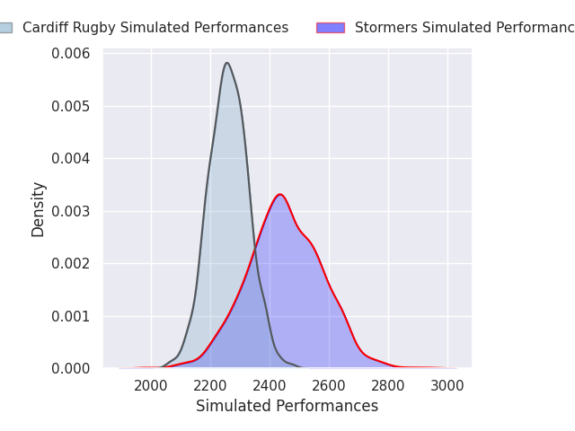
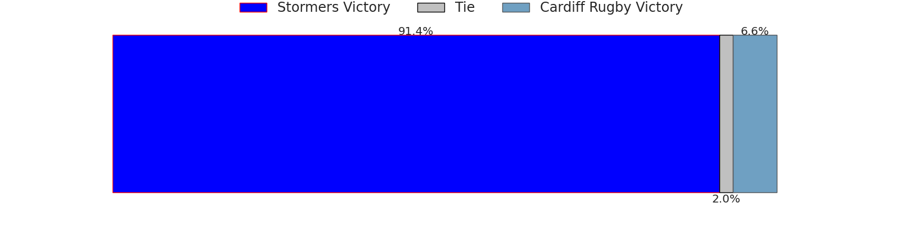
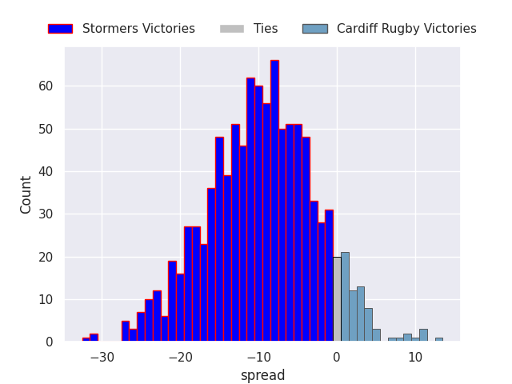

# Team Rankings

# Standings

## Current Standings

| Club             |   Played |   Wins |   Point Differential |   Losing Bonus Points |   Try Bonus Points |   Competition Points |
|:-----------------|---------:|-------:|---------------------:|----------------------:|-------------------:|---------------------:|
| Glasgow Warriors |       18 |     13 |                  141 |                     2 |                 13 |                   67 |
| Leinster         |       18 |     12 |                  145 |                     2 |                 13 |                   63 |
| Bulls            |       18 |     12 |                  160 |                     1 |                 10 |                   59 |
| Stormers         |       18 |     12 |                  160 |                     1 |                  8 |                   59 |
| Ulster           |       19 |      9 |                   74 |                     4 |                 10 |                   54 |
| Connacht         |       18 |     10 |                   47 |                     4 |                 10 |                   54 |
| Munster          |       18 |     11 |                   20 |                     3 |                  7 |                   54 |
| Lions            |       18 |     10 |                   59 |                     3 |                  8 |                   53 |
| Cardiff Rugby    |       18 |     11 |                  -19 |                     4 |                  3 |                   51 |
| Sharks           |       18 |      8 |                   39 |                     3 |                  9 |                   46 |
| Edinburgh        |       19 |      7 |                  -77 |                     4 |                  6 |                   40 |
| Ospreys          |       18 |      7 |                  -78 |                     3 |                  4 |                   39 |
| Benetton Treviso |       18 |      6 |                 -166 |                     1 |                  4 |                   33 |
| Scarlets         |       18 |      4 |                  -99 |                     5 |                  3 |                   28 |
| Dragons          |       18 |      3 |                 -131 |                     4 |                  3 |                   27 |
| Zebre            |       18 |      2 |                 -275 |                     4 |                  3 |                   15 |

## Projected Remaining Table

| Club     |   To Play |   Projected Wins |   Projected Differential |   Projected Losing Bonus Points | Projected Try Bonus Points   |   Projected Competition Points |
|:---------|----------:|-----------------:|-------------------------:|--------------------------------:|:-----------------------------|-------------------------------:|
| Lions    |         1 |            0.814 |                    7.474 |                           0.123 |                              |                          3.447 |
| Connacht |         1 |            0.791 |                    7.561 |                           0.13  |                              |                          3.376 |
| Stormers |         1 |            0.573 |                    1.92  |                           0.258 |                              |                          2.662 |
| Bulls    |         1 |            0.371 |                   -1.92  |                           0.321 |                              |                          1.917 |
| Scarlets |         1 |            0.168 |                   -7.561 |                           0.287 |                              |                          1.041 |
| Sharks   |         1 |            0.152 |                   -7.474 |                           0.305 |                              |                          0.981 |

## Projected Total Table

| Club             |   Played |   Wins |   Point Differential |   Losing Bonus Points |   Try Bonus Points |   Competition Points |
|:-----------------|---------:|-------:|---------------------:|----------------------:|-------------------:|---------------------:|
| Glasgow Warriors |       18 | 13     |              141     |                 2     |                 13 |               67     |
| Leinster         |       18 | 12     |              145     |                 2     |                 13 |               63     |
| Stormers         |       19 | 12.573 |              161.92  |                 1.258 |                  8 |               61.662 |
| Bulls            |       19 | 12.371 |              158.08  |                 1.321 |                 10 |               60.917 |
| Connacht         |       19 | 10.791 |               54.561 |                 4.13  |                 10 |               57.376 |
| Lions            |       19 | 10.814 |               66.474 |                 3.123 |                  8 |               56.447 |
| Ulster           |       19 |  9     |               74     |                 4     |                 10 |               54     |
| Munster          |       18 | 11     |               20     |                 3     |                  7 |               54     |
| Cardiff Rugby    |       18 | 11     |              -19     |                 4     |                  3 |               51     |
| Sharks           |       19 |  8.152 |               31.526 |                 3.305 |                  9 |               46.981 |
| Edinburgh        |       19 |  7     |              -77     |                 4     |                  6 |               40     |
| Ospreys          |       18 |  7     |              -78     |                 3     |                  4 |               39     |
| Benetton Treviso |       18 |  6     |             -166     |                 1     |                  4 |               33     |
| Scarlets         |       19 |  4.168 |             -106.561 |                 5.287 |                  3 |               29.041 |
| Dragons          |       18 |  3     |             -131     |                 4     |                  3 |               27     |
| Zebre            |       18 |  2     |             -275     |                 4     |                  3 |               15     |

## Projected Playoff Results

|                  | Reach Quarterfinal   | Win Quarterfinal   | Reach Semifinal   | Win Semifinal   | Reach Final   | Win Final   |
|:-----------------|:---------------------|:-------------------|:------------------|:----------------|:--------------|:------------|
| Glasgow Warriors | 100.0 %              | 84.3 %             | 84.3 %            | 69.4 %          | 69.4 %        | 49.8 %      |
| Leinster         | 100.0 %              | 92.5 %             | 92.5 %            | 80.2 %          | 80.2 %        | 25.0 %      |
| Bulls            | 100.0 %              | 80.4 %             | 80.4 %            | 14.6 %          | 14.6 %        | 9.7 %       |
| Connacht         | 100.0 %              | 15.7 %             | 15.7 %            | 12.5 %          | 12.5 %        | 9.2 %       |
| Stormers         | 100.0 %              | 91.0 %             | 91.0 %            | 14.2 %          | 14.2 %        | 3.0 %       |
| Munster          | 100.0 %              | 19.6 %             | 19.6 %            | 3.5 %           | 3.5 %         | 2.4 %       |
| Lions            | 100.0 %              | 7.5 %              | 7.5 %             | 5.3 %           | 5.3 %         | 0.9 %       |
| Cardiff Rugby    | 100.0 %              | 9.0 %              | 9.0 %             | 0.3 %           | 0.3 %         | 0.0 %       |

# Completed Match Review

| Model | Percent Correct Predictions | Spread Error |
| ------ | ------ | ------ |
| Club Level | 68.4% | 11.2 |
| Player Level: Lineup | nan% | nan |
| Player Level: Minutes | nan% | nan |

# Future Predictions

## Week 20

### Connacht V Scarlets on 2025/10/04

Average Margin: Connacht by 7.6

## Week 21

### Bulls V Stormers on 2025/12/25

Average Margin: Stormers by 1.9

### Lions V Sharks on 2025/12/25

Average Margin: Lions by 7.5

## Week 22

### Glasgow Warriors V Connacht on 2026/05/29

Average Margin: Glasgow Warriors by 6.9

### Stormers V Cardiff Rugby on 2026/05/30

Average Margin: Stormers by 9.7

### Bulls V Munster on 2026/05/30

Average Margin: Bulls by 6.3

### Leinster V Lions on 2026/05/30

Average Margin: Leinster by 10.1

## Week 23

### Connacht V Bulls on 2026-06-05

Average Margin: Connacht by 6.1

### Glasgow Warriors V Bulls on 2026-06-05

Average Margin: Glasgow Warriors by 6.6

### Glasgow Warriors V Munster on 2026-06-05

Average Margin: Glasgow Warriors by 7.4

### Connacht V Munster on 2026-06-05

Average Margin: Connacht by 6.2

### Leinster V Stormers on 2026-06-05

Average Margin: Leinster by 7.6

### Leinster V Cardiff Rugby on 2026-06-05

Average Margin: Leinster by 12.2

### Lions V Cardiff Rugby on 2026-06-05

Average Margin: Lions by 5.5

### Lions V Stormers on 2026-06-05

Average Margin: Lions by 4.1

## Final

### Connacht V Leinster on 2026-06-19

Average Margin: Connacht by 3.9

### Glasgow Warriors V Leinster on 2026-06-19

Average Margin: Glasgow Warriors by 3.8

### Bulls V Leinster on 2026-06-19

Average Margin: Bulls by 3.3

### Munster V Leinster on 2026-06-19

Average Margin: Munster by 3.0

### Glasgow Warriors V Stormers on 2026-06-19

Average Margin: Glasgow Warriors by 6.4

### Glasgow Warriors V Lions on 2026-06-19

Average Margin: Glasgow Warriors by 8.9

### Connacht V Stormers on 2026-06-19

Average Margin: Connacht by 9.5

### Munster V Stormers on 2026-06-19

Average Margin: Munster by 4.4

### Bulls V Stormers on 2026-06-19

Average Margin: Bulls by 6.3

### Bulls V Cardiff Rugby on 2026-06-19

Average Margin: Bulls by 13.0

### Munster V Lions on 2026-06-19

Average Margin: Munster by 11.3

### Bulls V Lions on 2026-06-19

Average Margin: Bulls by 2.4

### Connacht V Lions on 2026-06-19

Average Margin: Connacht by 9.4

### Glasgow Warriors V Cardiff Rugby on 2026-06-19

Average Margin: Glasgow Warriors by 5.0

