# Team Rankings

# Standings

## Current Standings

| Club             |   Played |   Wins |   Point Differential |   Losing Bonus Points |   Try Bonus Points |   Competition Points |
|:-----------------|---------:|-------:|---------------------:|----------------------:|-------------------:|---------------------:|
| Glasgow Warriors |       12 |      9 |                  150 |                     2 |                  7 |                   45 |
| Ulster           |       13 |      8 |                  104 |                     2 |                  7 |                   43 |
| Leinster         |       12 |      8 |                   66 |                     1 |                  8 |                   41 |
| Stormers         |       12 |      9 |                  112 |                     0 |                  4 |                   40 |
| Cardiff Rugby    |       12 |      8 |                   30 |                     3 |                  3 |                   38 |
| Munster          |       12 |      8 |                   23 |                     2 |                  4 |                   38 |
| Bulls            |       12 |      6 |                   21 |                     1 |                  5 |                   30 |
| Connacht         |       12 |      5 |                   -4 |                     4 |                  6 |                   30 |
| Ospreys          |       12 |      5 |                  -13 |                     1 |                  4 |                   29 |
| Lions            |       11 |      5 |                  -29 |                     2 |                  4 |                   28 |
| Edinburgh        |       13 |      4 |                  -15 |                     4 |                  3 |                   25 |
| Sharks           |       11 |      4 |                  -65 |                     1 |                  5 |                   24 |
| Benetton Treviso |       12 |      4 |                  -65 |                     1 |                  2 |                   23 |
| Dragons          |       12 |      2 |                  -59 |                     4 |                  2 |                   20 |
| Scarlets         |       12 |      3 |                  -88 |                     2 |                    |                   16 |
| Zebre            |       12 |      2 |                 -168 |                     2 |                  2 |                   12 |

## Projected Remaining Table

| Club             |   To Play |   Projected Wins |   Projected Differential |   Projected Losing Bonus Points | Projected Try Bonus Points   |   Projected Competition Points |
|:-----------------|----------:|-----------------:|-------------------------:|--------------------------------:|:-----------------------------|-------------------------------:|
| Sharks           |         8 |            4.213 |                    9.972 |                           1.845 |                              |                         19.467 |
| Bulls            |         7 |            4.088 |                   17.568 |                           1.504 |                              |                         18.49  |
| Lions            |         8 |            3.862 |                    0.52  |                           1.834 |                              |                         18.044 |
| Stormers         |         7 |            3.839 |                   13.852 |                           1.521 |                              |                         17.533 |
| Ulster           |         6 |            3.586 |                   17.083 |                           1.208 |                              |                         16.13  |
| Glasgow Warriors |         6 |            3.504 |                   17.907 |                           1.221 |                              |                         15.809 |
| Connacht         |         7 |            3.267 |                   -2.393 |                           1.627 |                              |                         15.403 |
| Leinster         |         6 |            3.405 |                   18.283 |                           1.188 |                              |                         15.322 |
| Scarlets         |         7 |            3.021 |                  -10.619 |                           1.635 |                              |                         14.345 |
| Munster          |         6 |            2.71  |                   -2.096 |                           1.559 |                              |                         12.989 |
| Edinburgh        |         6 |            2.643 |                   -4.834 |                           1.486 |                              |                         12.686 |
| Dragons          |         6 |            2.421 |                  -10.639 |                           1.561 |                              |                         11.849 |
| Benetton Treviso |         6 |            2.45  |                  -10.92  |                           1.466 |                              |                         11.834 |
| Cardiff Rugby    |         6 |            2.403 |                  -12.11  |                           1.551 |                              |                         11.699 |
| Ospreys          |         6 |            2.374 |                  -12.848 |                           1.445 |                              |                         11.459 |
| Zebre            |         6 |            1.775 |                  -28.726 |                           1.503 |                              |                          9.095 |

## Projected Total Table

| Club             |   Played |   Wins |   Point Differential |   Losing Bonus Points |   Try Bonus Points |   Competition Points |
|:-----------------|---------:|-------:|---------------------:|----------------------:|-------------------:|---------------------:|
| Glasgow Warriors |       18 | 12.504 |              167.907 |                 3.221 |                  7 |               60.809 |
| Ulster           |       19 | 11.586 |              121.083 |                 3.208 |                  7 |               59.13  |
| Stormers         |       19 | 12.839 |              125.852 |                 1.521 |                  4 |               57.533 |
| Leinster         |       18 | 11.405 |               84.283 |                 2.188 |                  8 |               56.322 |
| Munster          |       18 | 10.71  |               20.904 |                 3.559 |                  4 |               50.989 |
| Cardiff Rugby    |       18 | 10.403 |               17.89  |                 4.551 |                  3 |               49.699 |
| Bulls            |       19 | 10.088 |               38.568 |                 2.504 |                  5 |               48.49  |
| Lions            |       19 |  8.862 |              -28.48  |                 3.834 |                  4 |               46.044 |
| Connacht         |       19 |  8.267 |               -6.393 |                 5.627 |                  6 |               45.403 |
| Sharks           |       19 |  8.213 |              -55.028 |                 2.845 |                  5 |               43.467 |
| Ospreys          |       18 |  7.374 |              -25.848 |                 2.445 |                  4 |               40.459 |
| Edinburgh        |       19 |  6.643 |              -19.834 |                 5.486 |                  3 |               37.686 |
| Benetton Treviso |       18 |  6.45  |              -75.92  |                 2.466 |                  2 |               34.834 |
| Dragons          |       18 |  4.421 |              -69.639 |                 5.561 |                  2 |               31.849 |
| Scarlets         |       19 |  6.021 |              -98.619 |                 3.635 |                    |               30.345 |
| Zebre            |       18 |  3.775 |             -196.726 |                 3.503 |                  2 |               21.095 |

## Projected Playoff Results

|                  | Reach Quarterfinal   | Win Quarterfinal   | Reach Semifinal   | Win Semifinal   | Reach Final   | Win Final   |
|:-----------------|:---------------------|:-------------------|:------------------|:----------------|:--------------|:------------|
| Glasgow Warriors | 99.9 %               | 67.7 %             | 67.7 %            | 41.5 %          | 41.5 %        | 22.6 %      |
| Ulster           | 99.7 %               | 65.3 %             | 65.3 %            | 31.3 %          | 31.3 %        | 16.9 %      |
| Leinster         | 99.5 %               | 61.1 %             | 61.1 %            | 33.2 %          | 33.2 %        | 16.0 %      |
| Stormers         | 99.9 %               | 63.5 %             | 63.5 %            | 32.4 %          | 32.4 %        | 14.9 %      |
| Munster          | 87.5 %               | 37.2 %             | 37.2 %            | 18.3 %          | 18.3 %        | 9.8 %       |
| Cardiff Rugby    | 83.2 %               | 31.9 %             | 31.9 %            | 13.4 %          | 13.4 %        | 6.5 %       |
| Bulls            | 72.1 %               | 24.3 %             | 24.3 %            | 10.3 %          | 10.3 %        | 5.3 %       |
| Connacht         | 58.3 %               | 17.6 %             | 17.6 %            | 6.9 %           | 6.9 %         | 2.9 %       |
| Lions            | 59.0 %               | 18.3 %             | 18.3 %            | 6.4 %           | 6.4 %         | 2.8 %       |
| Sharks           | 21.9 %               | 8.0 %              | 8.0 %             | 4.0 %           | 4.0 %         | 1.7 %       |
| Ospreys          | 13.5 %               | 3.3 %              | 3.3 %             | 1.6 %           | 1.6 %         | 0.4 %       |
| Edinburgh        | 4.4 %                | 1.2 %              | 1.2 %             | 0.6 %           | 0.6 %         | 0.2 %       |
| Benetton Treviso | 0.9 %                | 0.5 %              | 0.5 %             | 0.1 %           | 0.1 %         | 0.0 %       |
| Dragons          | 0.2 %                | 0.1 %              | 0.1 %             | 0.0 %           | 0.0 %         | 0.0 %       |

# Completed Match Review

| Model | Percent Correct Predictions | Spread Error |
| ------ | ------ | ------ |
| Club Level | 62.6% | 8.6 |
| Player Level: Lineup | nan% | nan |
| Player Level: Minutes | nan% | nan |

# Future Predictions

## Week 14

### Connacht V Scarlets on 2025/10/04

Average Margin: Connacht by 4.8

## Week 15

### Lions V Sharks on 2025/12/25

Average Margin: Lions by 3.9

### Bulls V Stormers on 2025/12/25

Average Margin: Stormers by 1.0

## Week 16

### Lions V Sharks on 2026/02/21

Average Margin: Lions by 0.1

## Week 17

### Bulls V Cardiff Rugby on 2026/03/20

Average Margin: Bulls by 4.5

### Ulster V Connacht on 2026/03/20

Average Margin: Ulster by 5.9

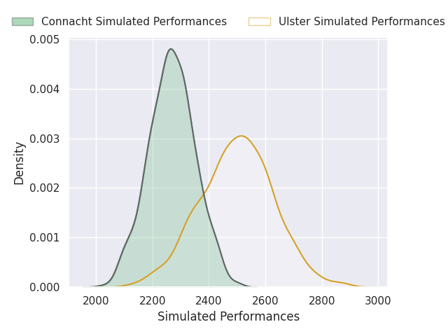
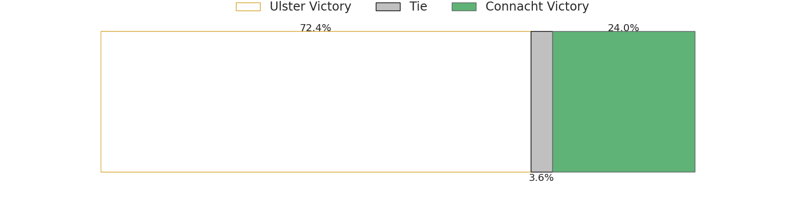
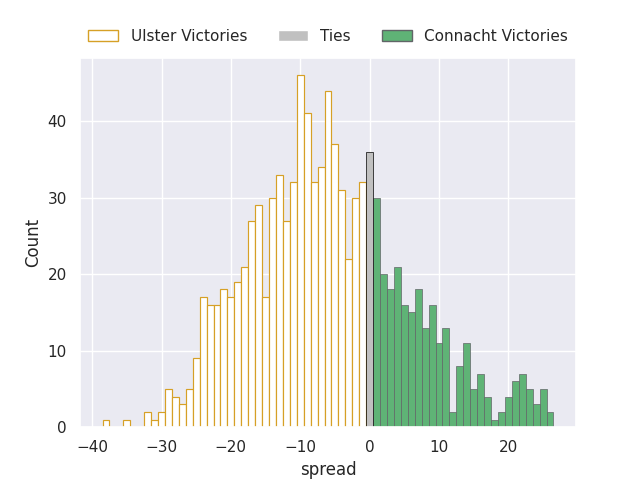

### Scarlets V Zebre on 2026/03/20

Average Margin: Scarlets by 5.4

### Benetton Treviso V Ospreys on 2026/03/21

Average Margin: Benetton Treviso by 4.2

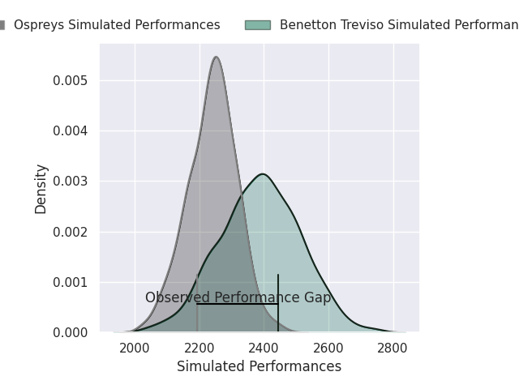

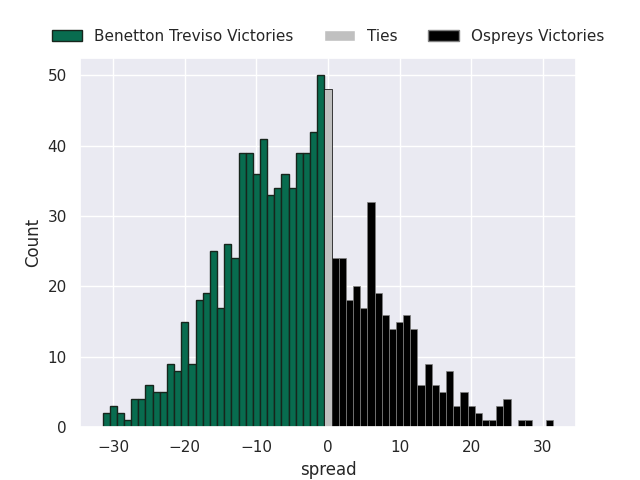

### Sharks V Munster on 2026/03/21

Average Margin: Sharks by 2.3

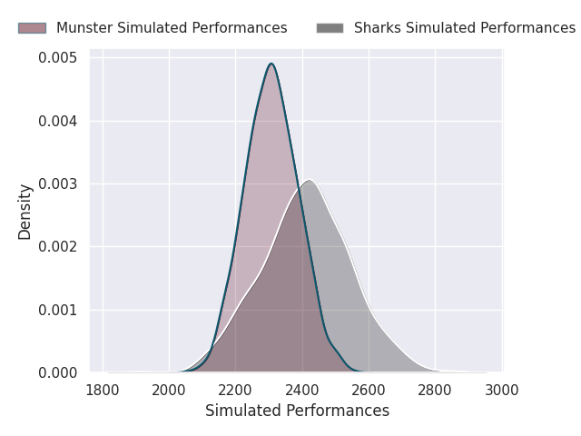

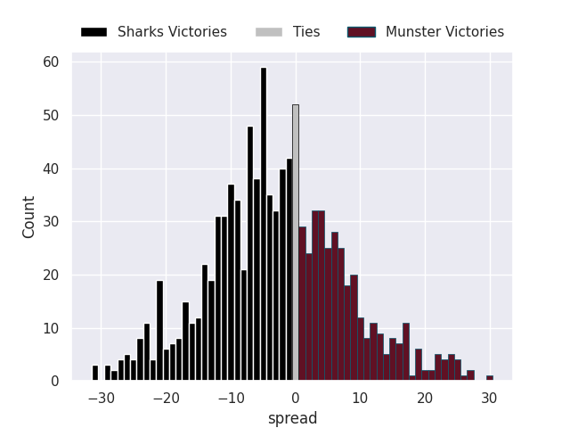

### Stormers V Dragons on 2026/03/21

Average Margin: Stormers by 7.3

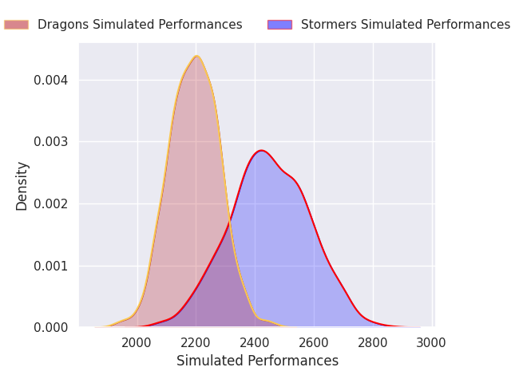
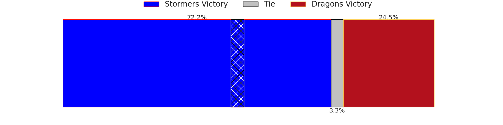
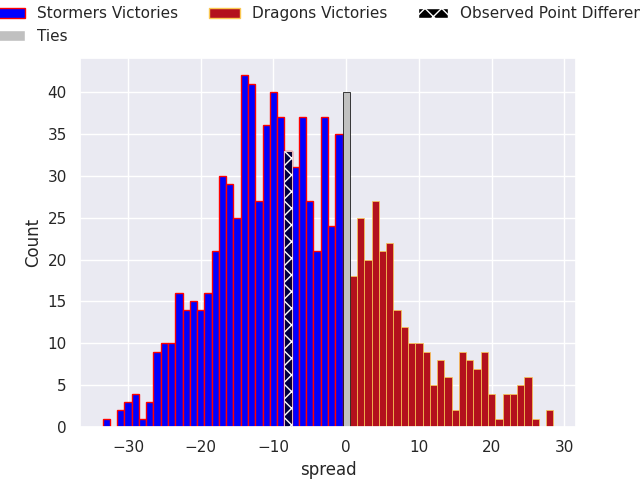

### Glasgow Warriors V Leinster on 2026/03/21

Average Margin: Glasgow Warriors by 3.3

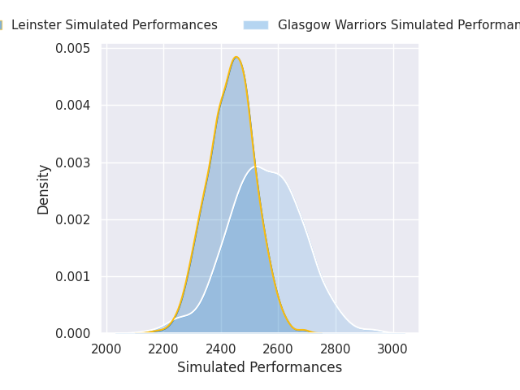

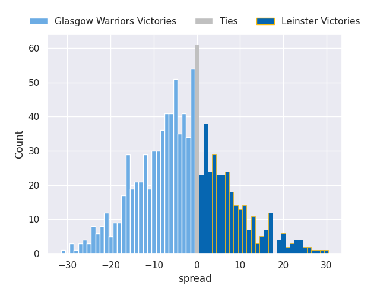

### Lions V Edinburgh on 2026/03/21

Average Margin: Lions by 3.5

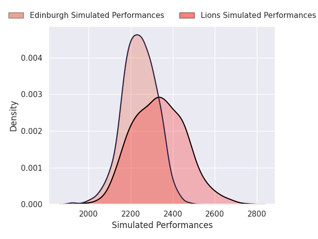
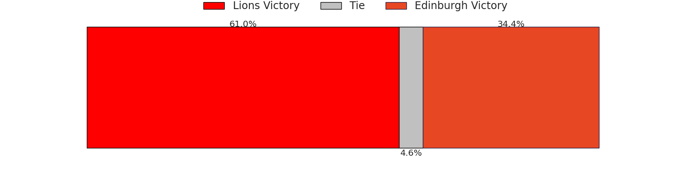
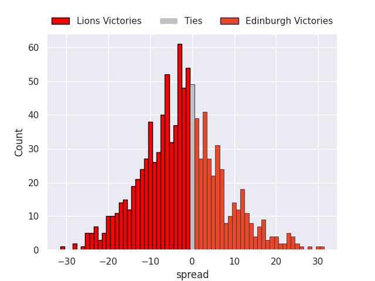

## Week 18

### Sharks V Cardiff Rugby on 2026/03/27

Average Margin: Sharks by 3.6

### Glasgow Warriors V Benetton Treviso on 2026/03/27

Average Margin: Glasgow Warriors by 8.2

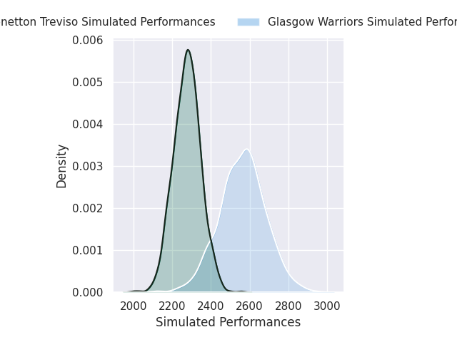
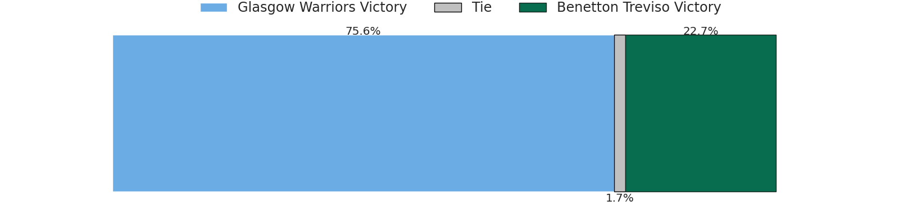
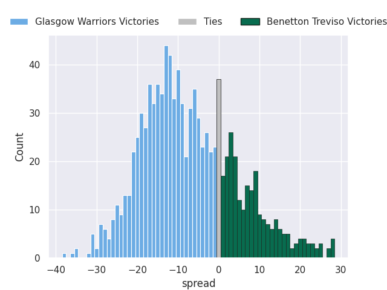

### Connacht V Ospreys on 2026/03/28

Average Margin: Connacht by 4.4

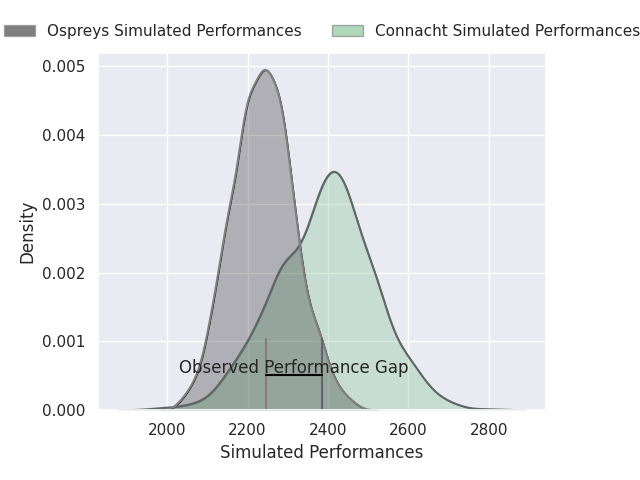

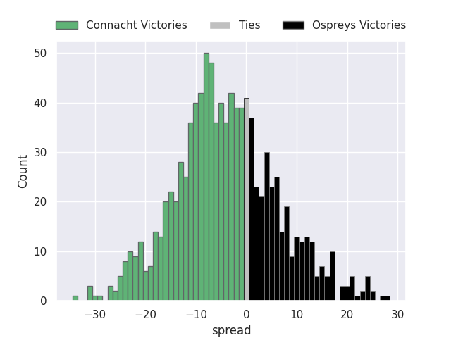

### Bulls V Munster on 2026/03/28

Average Margin: Bulls by 3.3

### Stormers V Edinburgh on 2026/03/28

Average Margin: Stormers by 6.2

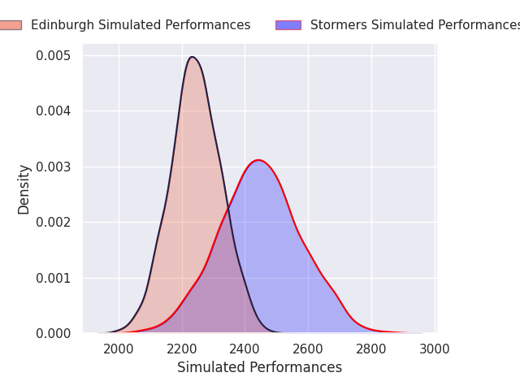
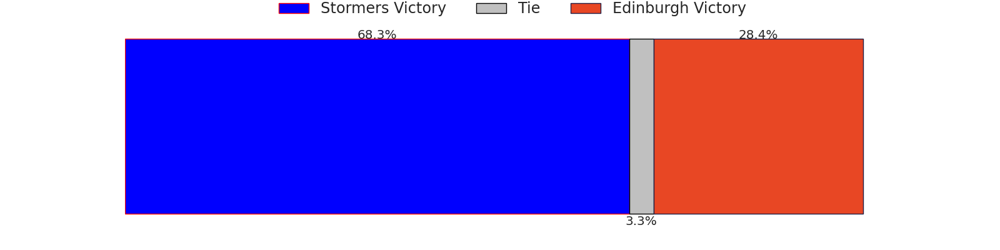
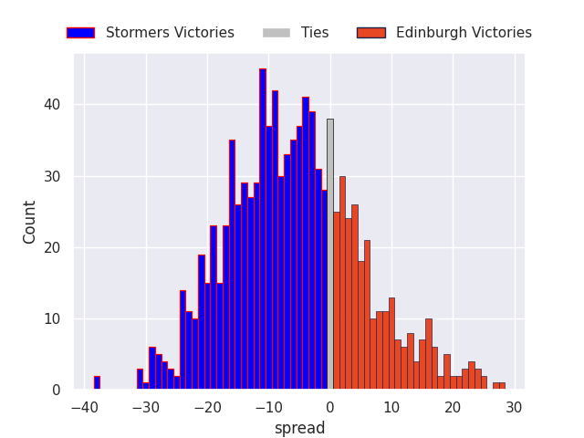

### Zebre V Ulster on 2026/03/28

Average Margin: Ulster by 4.4

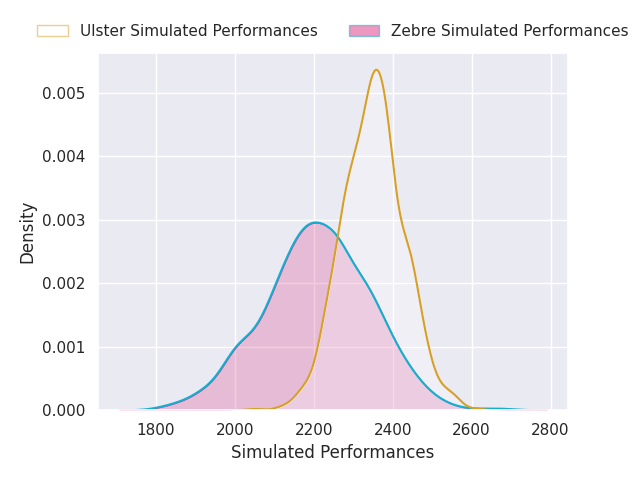
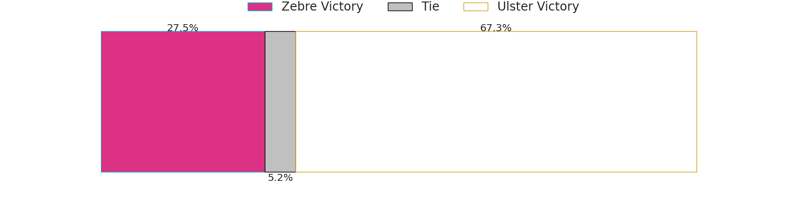
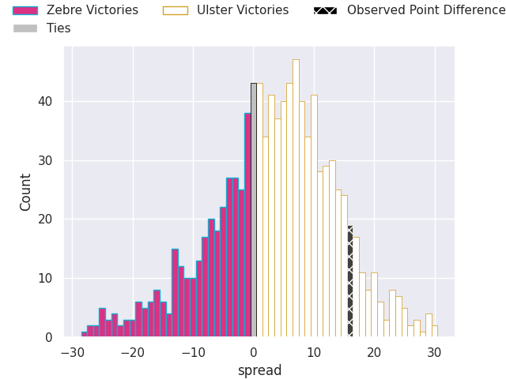

### Leinster V Scarlets on 2026/03/28

Average Margin: Leinster by 8.9

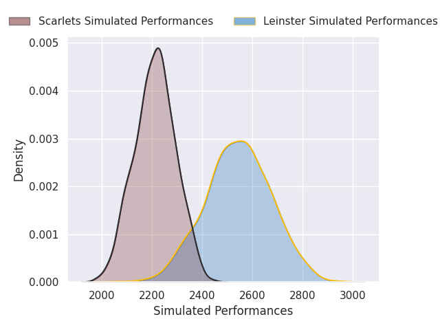

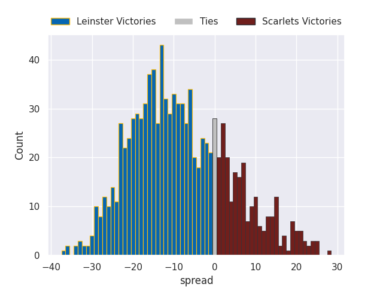

### Lions V Dragons on 2026/03/28

Average Margin: Lions by 4.7

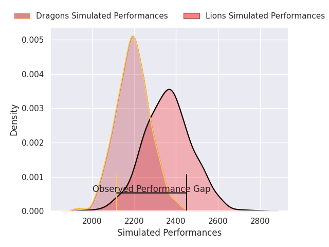
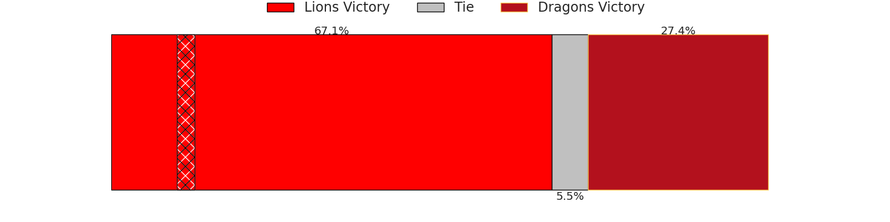
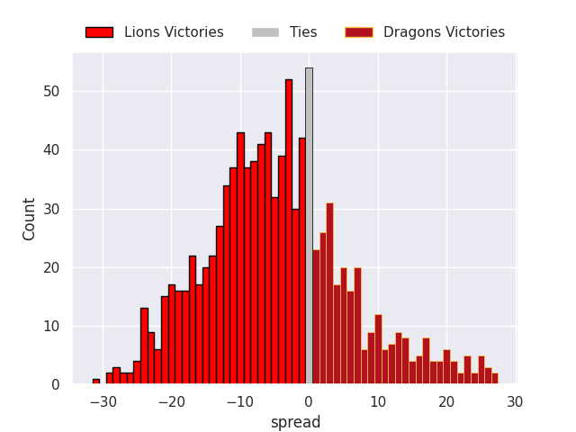

## Week 19

### Dragons V Bulls on 2026/04/17

Average Margin: Dragons by 0.8

### Edinburgh V Zebre on 2026/04/17

Average Margin: Edinburgh by 5.6

### Ulster V Leinster on 2026/04/17

Average Margin: Ulster by 2.2

### Lions V Glasgow Warriors on 2026/04/18

Average Margin: Glasgow Warriors by 2.1

### Benetton Treviso V Munster on 2026/04/18

Average Margin: Benetton Treviso by 1.9

### Ospreys V Sharks on 2026/04/18

Average Margin: Ospreys by 1.4

### Scarlets V Cardiff Rugby on 2026/04/18

Average Margin: Scarlets by 0.6

### Stormers V Connacht on 2026/04/18

Average Margin: Stormers by 3.6

## Week 20

### Edinburgh V Sharks on 2026/04/24

Average Margin: Edinburgh by 0.6

### Cardiff Rugby V Ospreys on 2026/04/24

Average Margin: Cardiff Rugby by 3.0

### Zebre V Dragons on 2026/04/24

Average Margin: Zebre by 0.6

### Lions V Connacht on 2026/04/25

Average Margin: Lions by 2.1

### Benetton Treviso V Leinster on 2026/04/25

Average Margin: Leinster by 1.1

### Scarlets V Bulls on 2026/04/25

Average Margin: Bulls by 0.1

### Munster V Ulster on 2026/04/25

Average Margin: Munster by 1.9

### Stormers V Glasgow Warriors on 2026/04/25

Average Margin: Stormers by 0.5

## Week 21

### Ulster V Stormers on 2026/05/08

Average Margin: Ulster by 4.2

### Glasgow Warriors V Cardiff Rugby on 2026/05/08

Average Margin: Glasgow Warriors by 7.0

### Leinster V Lions on 2026/05/09

Average Margin: Leinster by 6.6

### Bulls V Zebre on 2026/05/09

Average Margin: Bulls by 7.3

### Sharks V Benetton Treviso on 2026/05/09

Average Margin: Sharks by 3.6

### Dragons V Edinburgh on 2026/05/09

Average Margin: Dragons by 2.9

### Connacht V Munster on 2026/05/09

Average Margin: Connacht by 1.4

### Ospreys V Scarlets on 2026/05/09

Average Margin: Ospreys by 4.5

## Week 22

### Ulster V Glasgow Warriors on 2026/05/15

Average Margin: Ulster by 2.2

### Cardiff Rugby V Stormers on 2026/05/15

Average Margin: Cardiff Rugby by 0.6

### Edinburgh V Connacht on 2026/05/15

Average Margin: Edinburgh by 1.5

### Munster V Lions on 2026/05/16

Average Margin: Munster by 4.9

### Sharks V Zebre on 2026/05/16

Average Margin: Sharks by 6.5

### Leinster V Ospreys on 2026/05/16

Average Margin: Leinster by 7.1

### Scarlets V Dragons on 2026/05/16

Average Margin: Scarlets by 1.8

### Bulls V Benetton Treviso on 2026/05/16

Average Margin: Bulls by 4.1

## Week 23

### Stormers V Lions on 2026-05-29

Average Margin: Stormers by 4.6

### Stormers V Ulster on 2026-05-29

Average Margin: Stormers by 8.3

### Lions V Ospreys on 2026-05-29

Average Margin: Lions by 18.0

### Bulls V Munster on 2026-05-29

Average Margin: Bulls by 1.6

### Cardiff Rugby V Lions on 2026-05-29

Average Margin: Cardiff Rugby by 7.1

### Bulls V Stormers on 2026-05-29

Average Margin: Bulls by 2.0

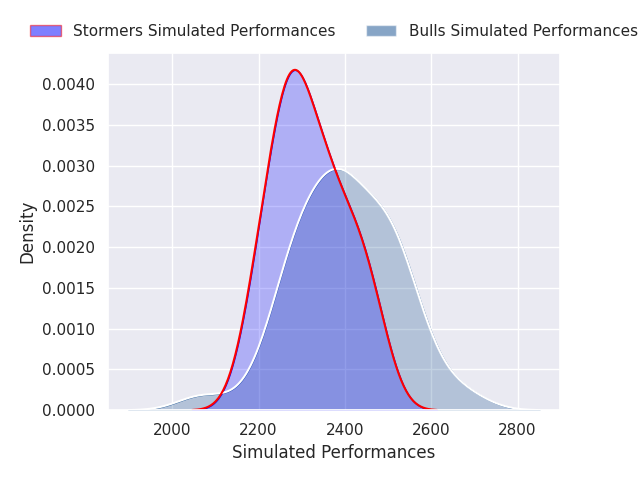

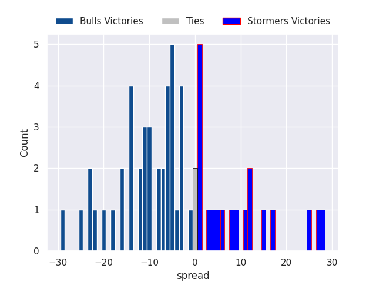

### Lions V Stormers on 2026-05-29

Average Margin: Lions by 4.5

### Lions V Glasgow Warriors on 2026-05-29

Average Margin: Lions by 3.2

### Munster V Leinster on 2026-05-29

Average Margin: Munster by 2.0

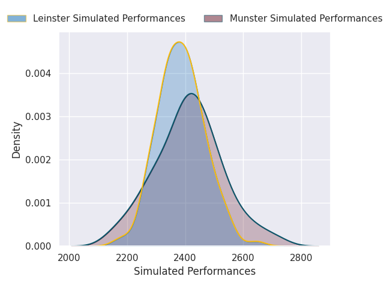

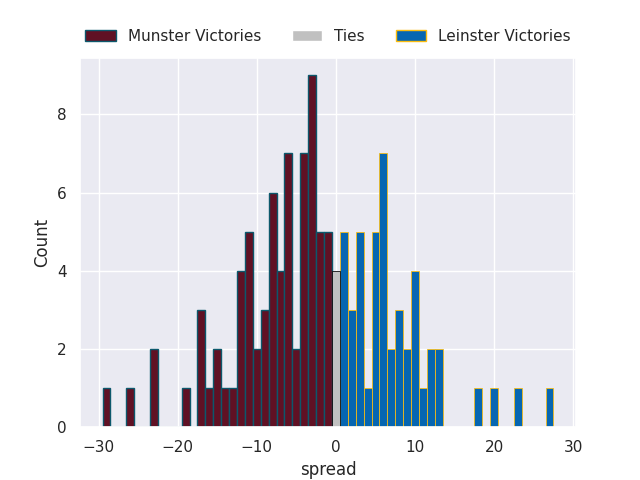

### Bulls V Cardiff Rugby on 2026-05-29

Average Margin: Bulls by 0.5

### Cardiff Rugby V Leinster on 2026-05-29

Average Margin: Cardiff Rugby by 1.0

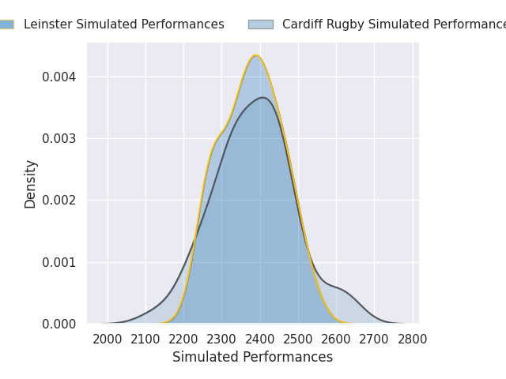

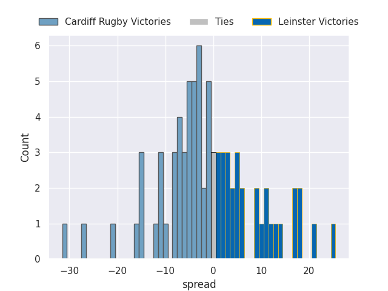

### Munster V Sharks on 2026-05-29

Average Margin: Munster by 14.0

### Munster V Ospreys on 2026-05-29

Average Margin: Munster by 6.0

### Connacht V Bulls on 2026-05-29

Average Margin: Connacht by 7.0

### Lions V Cardiff Rugby on 2026-05-29

Average Margin: Cardiff Rugby by 0.0

### Cardiff Rugby V Connacht on 2026-05-29

Average Margin: Connacht by 9.0

### Munster V Cardiff Rugby on 2026-05-29

Average Margin: Munster by 11.2

### Glasgow Warriors V Leinster on 2026-05-29

Average Margin: Glasgow Warriors by 4.3

### Connacht V Lions on 2026-05-29

Average Margin: Connacht by 8.5

### Ulster V Edinburgh on 2026-05-29

Average Margin: Ulster by 5.3

### Cardiff Rugby V Glasgow Warriors on 2026-05-29

Average Margin: Cardiff Rugby by 1.6

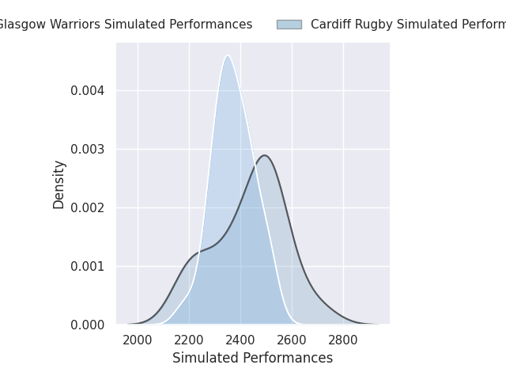
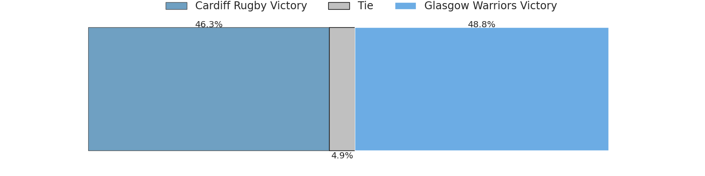
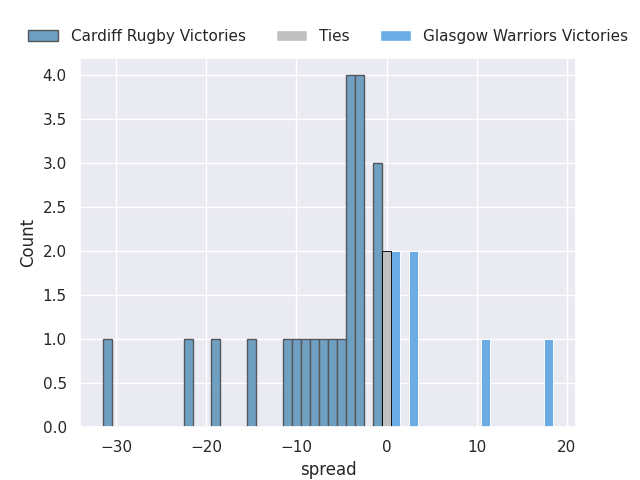

### Bulls V Lions on 2026-05-29

Average Margin: Bulls by 3.0

### Cardiff Rugby V Ulster on 2026-05-29

Average Margin: Cardiff Rugby by 3.2

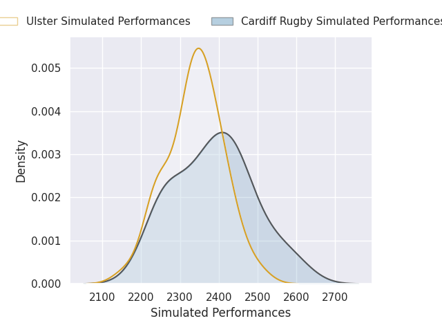

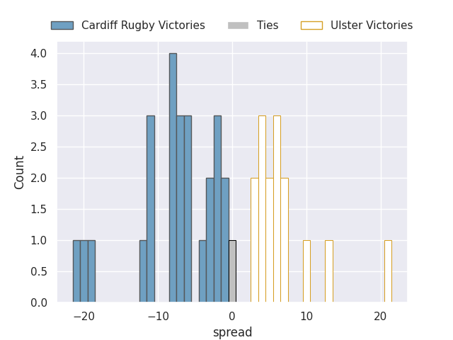

### Lions V Munster on 2026-05-29

Average Margin: Lions by 1.1

### Stormers V Benetton Treviso on 2026-05-29

Average Margin: Stormers by 10.5

### Ulster V Benetton Treviso on 2026-05-29

Average Margin: Ulster by 11.5

### Glasgow Warriors V Dragons on 2026-05-29

Average Margin: Dragons by 0.0

### Glasgow Warriors V Benetton Treviso on 2026-05-29

Average Margin: Glasgow Warriors by 7.0

### Cardiff Rugby V Edinburgh on 2026-05-29

Average Margin: Edinburgh by 2.0

### Ulster V Leinster on 2026-05-29

Average Margin: Ulster by 2.3

### Cardiff Rugby V Sharks on 2026-05-29

Average Margin: Sharks by 12.0

### Sharks V Lions on 2026-05-29

Average Margin: Sharks by 12.0

### Edinburgh V Connacht on 2026-05-29

Average Margin: Connacht by 20.0

### Ospreys V Munster on 2026-05-29

Average Margin: Munster by 8.0

### Stormers V Glasgow Warriors on 2026-05-29

Average Margin: Stormers by 0.8

### Connacht V Cardiff Rugby on 2026-05-29

Average Margin: Connacht by 1.0

### Bulls V Sharks on 2026-05-29

Average Margin: Bulls by 3.0

### Bulls V Connacht on 2026-05-29

Average Margin: Bulls by 4.4

### Sharks V Stormers on 2026-05-29

Average Margin: Stormers by 0.0

### Glasgow Warriors V Ulster on 2026-05-29

Average Margin: Glasgow Warriors by 3.5

### Lions V Connacht on 2026-05-29

Average Margin: Lions by 1.0

### Ulster V Glasgow Warriors on 2026-05-29

Average Margin: Ulster by 1.2

### Ulster V Stormers on 2026-05-29

Average Margin: Ulster by 2.4

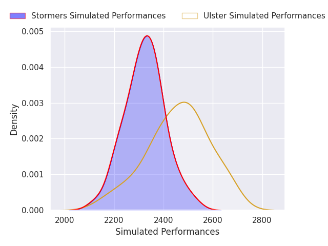

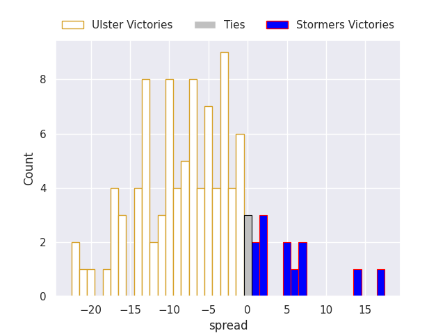

### Glasgow Warriors V Bulls on 2026-05-29

Average Margin: Glasgow Warriors by 3.0

### Glasgow Warriors V Connacht on 2026-05-29

Average Margin: Glasgow Warriors by 3.8

### Leinster V Edinburgh on 2026-05-29

Average Margin: Leinster by 15.5

### Ulster V Lions on 2026-05-29

Average Margin: Ulster by 6.4

### Glasgow Warriors V Sharks on 2026-05-29

Average Margin: Glasgow Warriors by 4.1

### Ulster V Bulls on 2026-05-29

Average Margin: Ulster by 4.4

### Glasgow Warriors V Ospreys on 2026-05-29

Average Margin: Glasgow Warriors by 6.5

### Stormers V Connacht on 2026-05-29

Average Margin: Stormers by 5.6

### Ulster V Connacht on 2026-05-29

Average Margin: Ulster by 6.8

### Leinster V Sharks on 2026-05-29

Average Margin: Sharks by 1.9

### Leinster V Ulster on 2026-05-29

Average Margin: Leinster by 7.0

### Ulster V Ospreys on 2026-05-29

Average Margin: Ulster by 10.9

### Ulster V Munster on 2026-05-29

Average Margin: Ulster by 5.2

### Glasgow Warriors V Cardiff Rugby on 2026-05-29

Average Margin: Glasgow Warriors by 9.4

### Ulster V Cardiff Rugby on 2026-05-29

Average Margin: Ulster by 8.2

### Leinster V Cardiff Rugby on 2026-05-29

Average Margin: Leinster by 6.6

### Glasgow Warriors V Lions on 2026-05-29

Average Margin: Glasgow Warriors by 6.1

### Glasgow Warriors V Munster on 2026-05-29

Average Margin: Glasgow Warriors by 2.0

### Cardiff Rugby V Ospreys on 2026-05-29

Average Margin: Cardiff Rugby by 14.0

### Stormers V Cardiff Rugby on 2026-05-29

Average Margin: Stormers by 3.4

### Stormers V Edinburgh on 2026-05-29

Average Margin: Stormers by 10.3

### Cardiff Rugby V Bulls on 2026-05-29

Average Margin: Cardiff Rugby by 8.0

### Leinster V Ospreys on 2026-05-29

Average Margin: Ospreys by 7.0

### Munster V Lions on 2026-05-29

Average Margin: Lions by 1.8

### Munster V Connacht on 2026-05-29

Average Margin: Munster by 12.8

### Ulster V Sharks on 2026-05-29

Average Margin: Ulster by 6.2

### Stormers V Leinster on 2026-05-29

Average Margin: Stormers by 3.7

### Glasgow Warriors V Stormers on 2026-05-29

Average Margin: Glasgow Warriors by 9.5

### Leinster V Lions on 2026-05-29

Average Margin: Leinster by 8.1

### Leinster V Connacht on 2026-05-29

Average Margin: Leinster by 10.6

### Leinster V Munster on 2026-05-29

Average Margin: Leinster by 7.1

### Glasgow Warriors V Edinburgh on 2026-05-29

Average Margin: Glasgow Warriors by 11.5

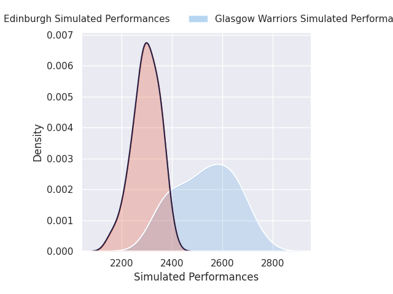
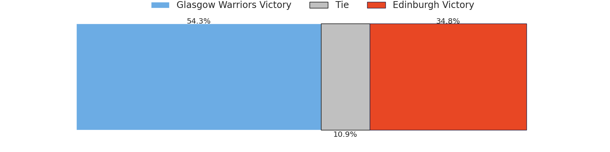
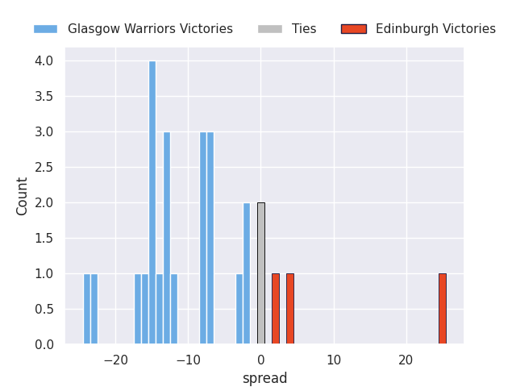

### Stormers V Ospreys on 2026-05-29

Average Margin: Stormers by 2.3

### Leinster V Bulls on 2026-05-29

Average Margin: Leinster by 5.1

### Munster V Bulls on 2026-05-29

Average Margin: Munster by 10.7

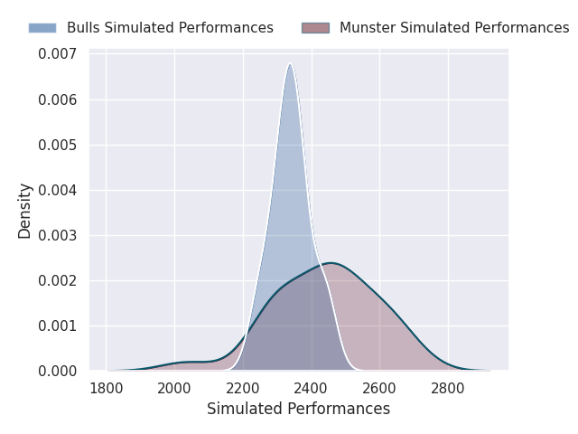

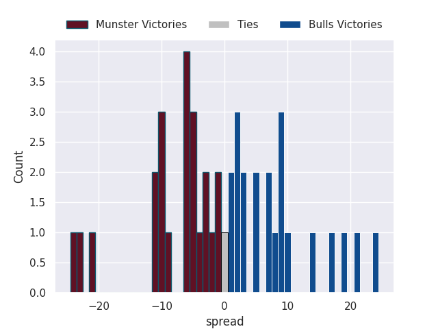

### Ulster V Dragons on 2026-05-29

Average Margin: Ulster by 3.0

### Stormers V Bulls on 2026-05-29

Average Margin: Stormers by 4.8

### Stormers V Sharks on 2026-05-29

Average Margin: Stormers by 2.3

### Stormers V Munster on 2026-05-29

Average Margin: Stormers by 1.2

### Connacht V Munster on 2026-05-29

Average Margin: Connacht by 2.0

## Week 24

### Connacht V Cardiff Rugby on 2026-06-05

Average Margin: Connacht by 3.7

### Benetton Treviso V Stormers on 2026-06-05

Average Margin: Stormers by 3.0

### Edinburgh V Ulster on 2026-06-05

Average Margin: Ulster by 4.0

### Ospreys V Ulster on 2026-06-05

Average Margin: Ulster by 1.0

### Glasgow Warriors V Sharks on 2026-06-05

Average Margin: Glasgow Warriors by 4.0

### Benetton Treviso V Leinster on 2026-06-05

Average Margin: Leinster by 9.0

### Edinburgh V Cardiff Rugby on 2026-06-05

Average Margin: Cardiff Rugby by 7.0

### Benetton Treviso V Cardiff Rugby on 2026-06-05

Average Margin: Cardiff Rugby by 4.0

### Ospreys V Leinster on 2026-06-05

Average Margin: Leinster by 2.0

### Stormers V Sharks on 2026-06-05

Average Margin: Stormers by 1.4

### Edinburgh V Bulls on 2026-06-05

Average Margin: Bulls by 2.0

### Connacht V Sharks on 2026-06-05

Average Margin: Sharks by 4.5

### Sharks V Lions on 2026-06-05

Average Margin: Lions by 21.0

### Ospreys V Cardiff Rugby on 2026-06-05

Average Margin: Ospreys by 6.5

### Ospreys V Bulls on 2026-06-05

Average Margin: Ospreys by 4.0

### Lions V Connacht on 2026-06-05

Average Margin: Lions by 3.8

### Dragons V Leinster on 2026-06-05

Average Margin: Leinster by 15.0

### Edinburgh V Munster on 2026-06-05

Average Margin: Edinburgh by 2.0

### Stormers V Leinster on 2026-06-05

Average Margin: Stormers by 1.5

### Munster V Glasgow Warriors on 2026-06-05

Average Margin: Glasgow Warriors by 0.4

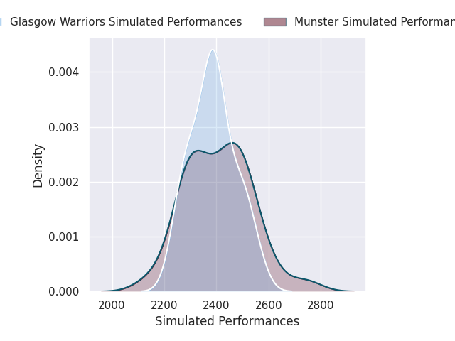
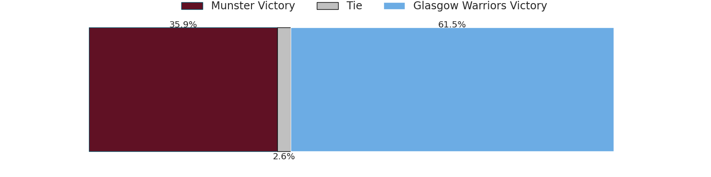
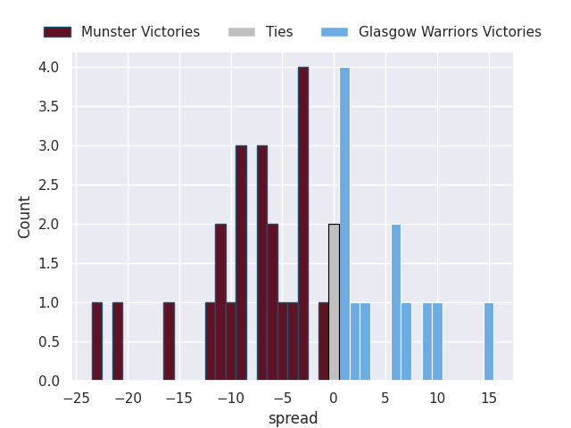

### Bulls V Connacht on 2026-06-05

Average Margin: Connacht by 0.8

### Munster V Sharks on 2026-06-05

Average Margin: Sharks by 1.0

### Cardiff Rugby V Sharks on 2026-06-05

Average Margin: Sharks by 1.5

### Sharks V Stormers on 2026-06-05

Average Margin: Sharks by 4.3

### Lions V Ospreys on 2026-06-05

Average Margin: Ospreys by 3.0

### Connacht V Lions on 2026-06-05

Average Margin: Connacht by 14.5

### Ospreys V Edinburgh on 2026-06-05

Average Margin: Edinburgh by 2.0

### Bulls V Lions on 2026-06-05

Average Margin: Bulls by 8.5

### Ulster V Ospreys on 2026-06-05

Average Margin: Ospreys by 1.3

### Munster V Lions on 2026-06-05

Average Margin: Munster by 5.0

### Connacht V Stormers on 2026-06-05

Average Margin: Connacht by 4.6

### Stormers V Ospreys on 2026-06-05

Average Margin: Ospreys by 0.0

### Bulls V Sharks on 2026-06-05

Average Margin: Bulls by 4.5

### Munster V Bulls on 2026-06-05

Average Margin: Munster by 6.3

### Leinster V Cardiff Rugby on 2026-06-05

Average Margin: Leinster by 3.2

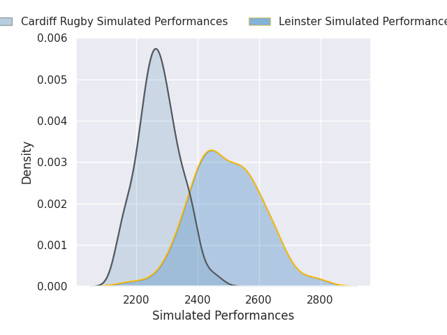
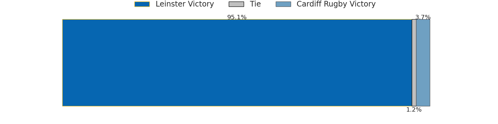
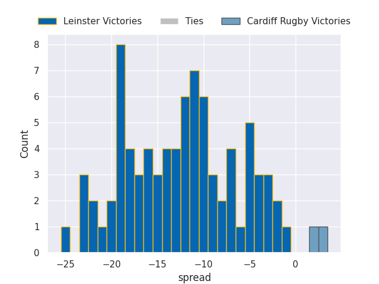

### Bulls V Ulster on 2026-06-05

Average Margin: Bulls by 1.4

### Leinster V Ulster on 2026-06-05

Average Margin: Leinster by 4.1

### Ulster V Cardiff Rugby on 2026-06-05

Average Margin: Ulster by 7.3

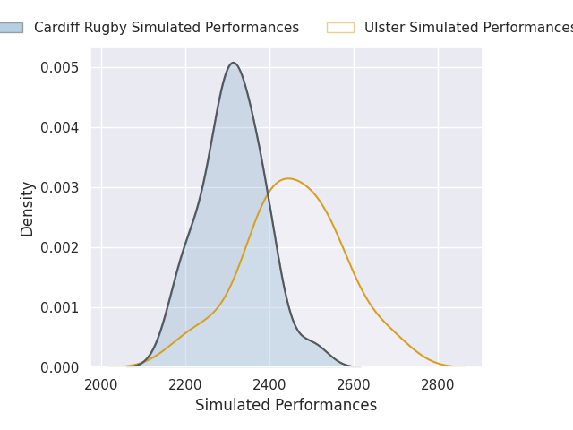
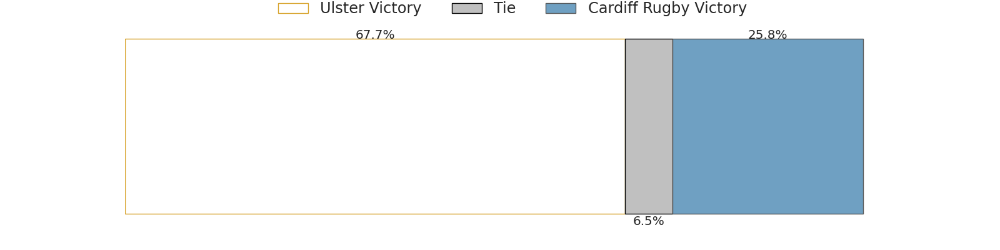
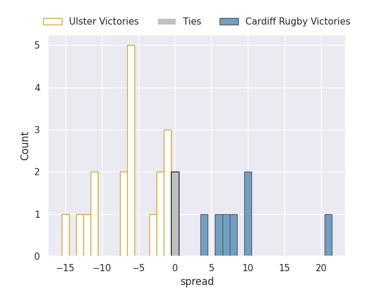

### Munster V Stormers on 2026-06-05

Average Margin: Munster by 1.4

### Bulls V Glasgow Warriors on 2026-06-05

Average Margin: Bulls by 2.9

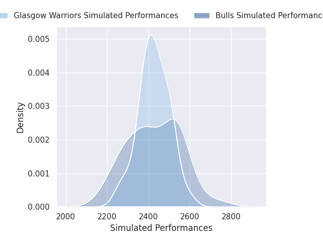

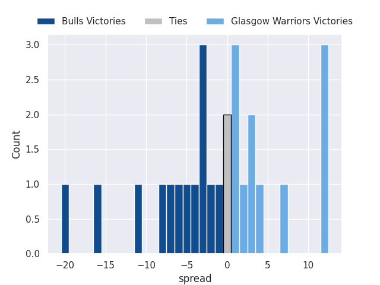

### Munster V Connacht on 2026-06-05

Average Margin: Munster by 4.7

### Edinburgh V Stormers on 2026-06-05

Average Margin: Edinburgh by 5.0

### Ospreys V Glasgow Warriors on 2026-06-05

Average Margin: Glasgow Warriors by 5.3

### Ospreys V Stormers on 2026-06-05

Average Margin: Ospreys by 2.0

### Munster V Leinster on 2026-06-05

Average Margin: Leinster by 2.9

### Stormers V Lions on 2026-06-05

Average Margin: Stormers by 6.1

### Ulster V Lions on 2026-06-05

Average Margin: Ulster by 2.5

### Cardiff Rugby V Ulster on 2026-06-05

Average Margin: Cardiff Rugby by 4.2

### Ulster V Glasgow Warriors on 2026-06-05

Average Margin: Ulster by 2.5

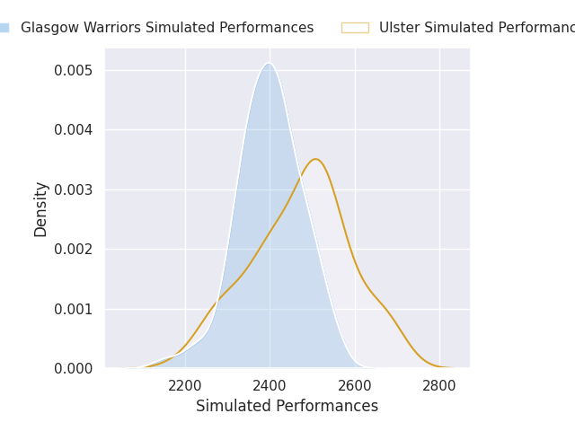

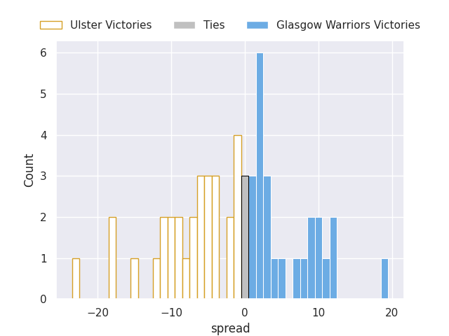

### Bulls V Leinster on 2026-06-05

Average Margin: Bulls by 5.2

### Bulls V Munster on 2026-06-05

Average Margin: Bulls by 1.2

### Glasgow Warriors V Bulls on 2026-06-05

Average Margin: Glasgow Warriors by 6.8

### Glasgow Warriors V Stormers on 2026-06-05

Average Margin: Glasgow Warriors by 4.5

### Glasgow Warriors V Cardiff Rugby on 2026-06-05

Average Margin: Glasgow Warriors by 6.0

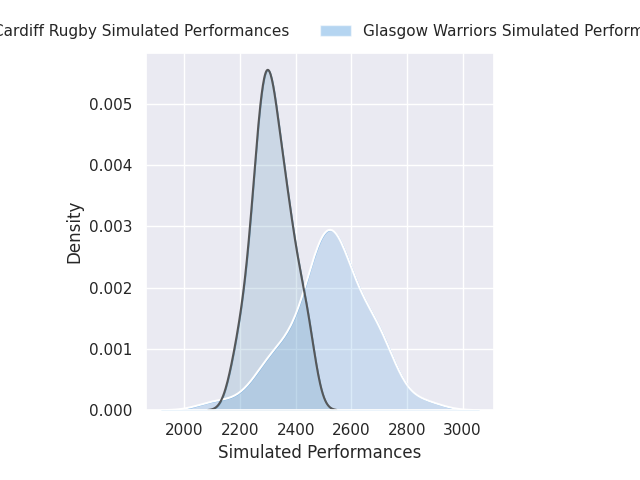
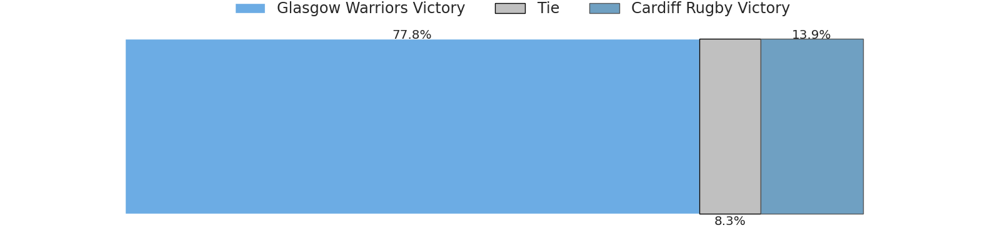
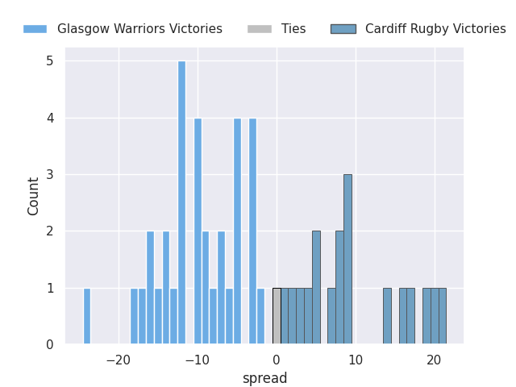

### Glasgow Warriors V Leinster on 2026-06-05

Average Margin: Glasgow Warriors by 2.1

### Leinster V Stormers on 2026-06-05

Average Margin: Leinster by 4.8

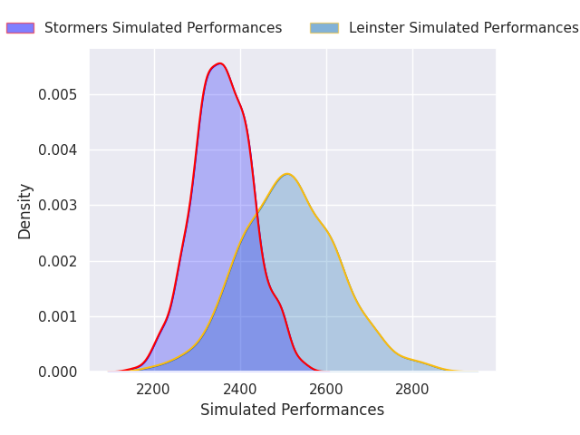

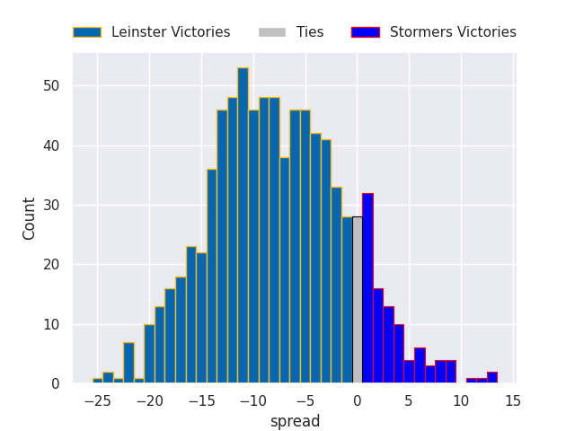

### Ulster V Leinster on 2026-06-05

Average Margin: Ulster by 0.4

### Glasgow Warriors V Munster on 2026-06-05

Average Margin: Glasgow Warriors by 2.3

### Ulster V Bulls on 2026-06-05

Average Margin: Ulster by 4.8

### Stormers V Munster on 2026-06-05

Average Margin: Stormers by 2.7

### Stormers V Ulster on 2026-06-05

Average Margin: Stormers by 6.0

### Munster V Cardiff Rugby on 2026-06-05

Average Margin: Munster by 5.2

### Connacht V Bulls on 2026-06-05

Average Margin: Connacht by 1.0

### Cardiff Rugby V Bulls on 2026-06-05

Average Margin: Cardiff Rugby by 0.9

### Sharks V Leinster on 2026-06-05

Average Margin: Sharks by 1.9

### Sharks V Munster on 2026-06-05

Average Margin: Sharks by 5.8

### Lions V Bulls on 2026-06-05

Average Margin: Lions by 0.1

### Leinster V Connacht on 2026-06-05

Average Margin: Leinster by 3.9

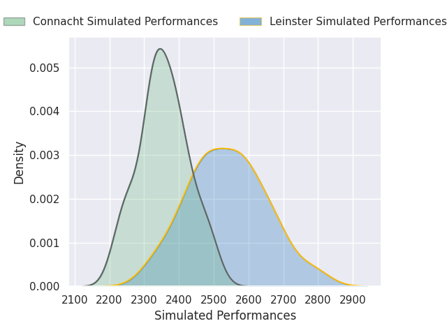

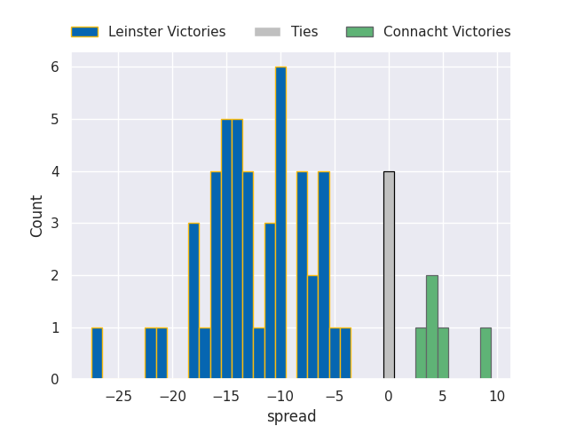

### Sharks V Cardiff Rugby on 2026-06-05

Average Margin: Sharks by 6.8

### Glasgow Warriors V Connacht on 2026-06-05

Average Margin: Glasgow Warriors by 8.9

### Munster V Ospreys on 2026-06-05

Average Margin: Munster by 2.0

### Stormers V Bulls on 2026-06-05

Average Margin: Stormers by 4.8

### Edinburgh V Leinster on 2026-06-05

Average Margin: Leinster by 1.4

### Connacht V Munster on 2026-06-05

Average Margin: Munster by 0.2

### Lions V Munster on 2026-06-05

Average Margin: Lions by 0.8

### Sharks V Ulster on 2026-06-05

Average Margin: Sharks by 14.3

### Leinster V Lions on 2026-06-05

Average Margin: Leinster by 9.1

### Cardiff Rugby V Stormers on 2026-06-05

Average Margin: Stormers by 0.9

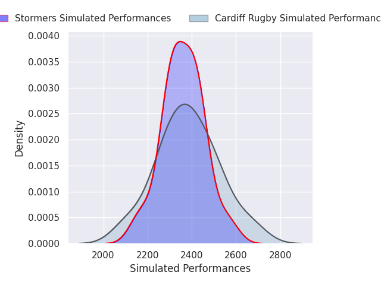
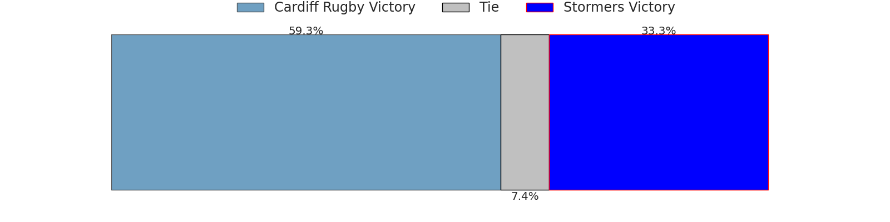
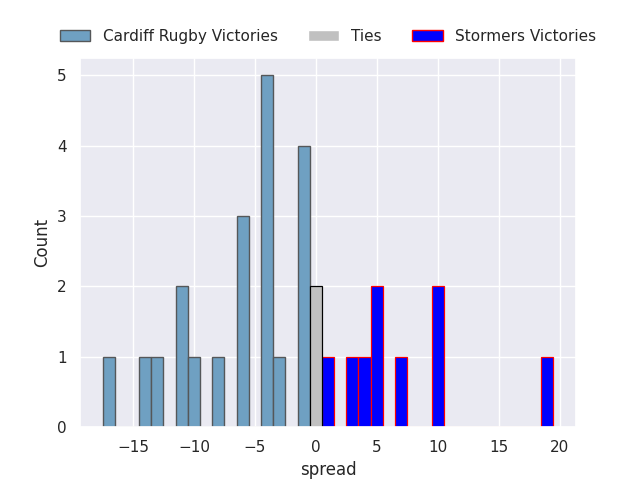

### Cardiff Rugby V Leinster on 2026-06-05

Average Margin: Leinster by 0.6

### Sharks V Bulls on 2026-06-05

Average Margin: Bulls by 2.2

### Ulster V Connacht on 2026-06-05

Average Margin: Ulster by 5.7

### Glasgow Warriors V Lions on 2026-06-05

Average Margin: Glasgow Warriors by 8.8

### Ulster V Munster on 2026-06-05

Average Margin: Ulster by 3.7

### Lions V Cardiff Rugby on 2026-06-05

Average Margin: Cardiff Rugby by 0.2

### Leinster V Benetton Treviso on 2026-06-05

Average Margin: Leinster by 11.0

## Final

### Connacht V Stormers on 2026-06-19

Average Margin: Connacht by 1.1

### Lions V Ulster on 2026-06-19

Average Margin: Ulster by 0.4

### Lions V Connacht on 2026-06-19

Average Margin: Lions by 8.0

### Edinburgh V Stormers on 2026-06-19

Average Margin: Stormers by 0.7

### Ospreys V Bulls on 2026-06-19

Average Margin: Bulls by 1.0

### Cardiff Rugby V Connacht on 2026-06-19

Average Margin: Cardiff Rugby by 4.8

### Stormers V Lions on 2026-06-19

Average Margin: Stormers by 8.0

### Lions V Cardiff Rugby on 2026-06-19

Average Margin: Cardiff Rugby by 3.3

### Bulls V Lions on 2026-06-19

Average Margin: Bulls by 12.4

### Ulster V Connacht on 2026-06-19

Average Margin: Ulster by 4.8

### Glasgow Warriors V Ospreys on 2026-06-19

Average Margin: Glasgow Warriors by 2.7

### Lions V Munster on 2026-06-19

Average Margin: Munster by 3.9

### Connacht V Bulls on 2026-06-19

Average Margin: Connacht by 3.6

### Bulls V Munster on 2026-06-19

Average Margin: Bulls by 3.9

### Edinburgh V Bulls on 2026-06-19

Average Margin: Edinburgh by 14.0

### Munster V Ospreys on 2026-06-19

Average Margin: Ospreys by 0.3

### Sharks V Ulster on 2026-06-19

Average Margin: Sharks by 4.1

### Ospreys V Leinster on 2026-06-19

Average Margin: Leinster by 0.7

### Connacht V Ospreys on 2026-06-19

Average Margin: Connacht by 14.0

### Glasgow Warriors V Edinburgh on 2026-06-19

Average Margin: Glasgow Warriors by 5.0

### Ospreys V Lions on 2026-06-19

Average Margin: Lions by 12.0

### Stormers V Ospreys on 2026-06-19

Average Margin: Stormers by 13.0

### Cardiff Rugby V Edinburgh on 2026-06-19

Average Margin: Cardiff Rugby by 6.0

### Benetton Treviso V Leinster on 2026-06-19

Average Margin: Leinster by 15.0

### Sharks V Lions on 2026-06-19

Average Margin: Lions by 2.0

### Ospreys V Ulster on 2026-06-19

Average Margin: Ulster by 3.0

### Glasgow Warriors V Bulls on 2026-06-19

Average Margin: Glasgow Warriors by 6.6

### Leinster V Connacht on 2026-06-19

Average Margin: Leinster by 5.4

### Munster V Connacht on 2026-06-19

Average Margin: Munster by 7.8

### Sharks V Glasgow Warriors on 2026-06-19

Average Margin: Glasgow Warriors by 0.3

### Stormers V Glasgow Warriors on 2026-06-19

Average Margin: Glasgow Warriors by 0.9

### Munster V Leinster on 2026-06-19

Average Margin: Munster by 4.0

### Bulls V Stormers on 2026-06-19

Average Margin: Bulls by 0.8

### Ulster V Cardiff Rugby on 2026-06-19

Average Margin: Ulster by 5.7

### Ulster V Glasgow Warriors on 2026-06-19

Average Margin: Ulster by 1.9

### Munster V Ulster on 2026-06-19

Average Margin: Munster by 4.4

### Glasgow Warriors V Munster on 2026-06-19

Average Margin: Glasgow Warriors by 4.4

### Glasgow Warriors V Leinster on 2026-06-19

Average Margin: Glasgow Warriors by 3.0

### Bulls V Leinster on 2026-06-19

Average Margin: Leinster by 1.6

### Munster V Sharks on 2026-06-19

Average Margin: Munster by 4.8

### Ulster V Leinster on 2026-06-19

Average Margin: Ulster by 2.8

### Lions V Leinster on 2026-06-19

Average Margin: Lions by 5.0

### Connacht V Sharks on 2026-06-19

Average Margin: Connacht by 7.0

### Munster V Stormers on 2026-06-19

Average Margin: Munster by 3.1

### Stormers V Cardiff Rugby on 2026-06-19

Average Margin: Stormers by 2.9

### Cardiff Rugby V Glasgow Warriors on 2026-06-19

Average Margin: Glasgow Warriors by 0.0

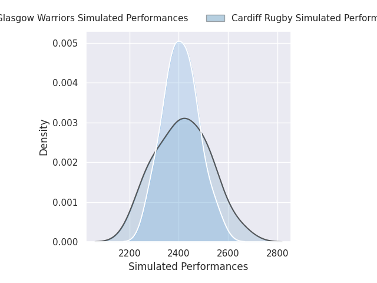
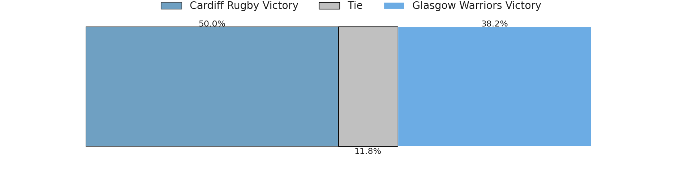
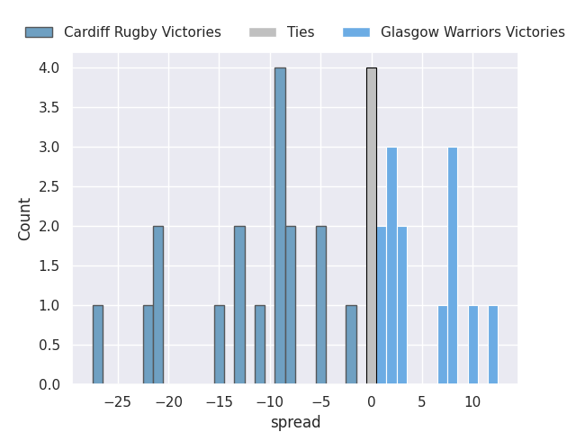

### Cardiff Rugby V Munster on 2026-06-19

Average Margin: Cardiff Rugby by 1.9

### Bulls V Cardiff Rugby on 2026-06-19

Average Margin: Bulls by 5.2

### Leinster V Stormers on 2026-06-19

Average Margin: Leinster by 3.6

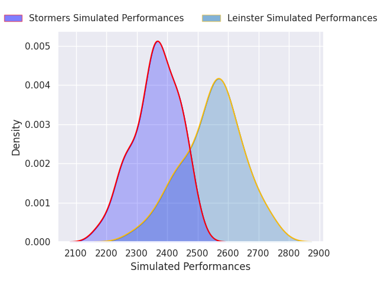

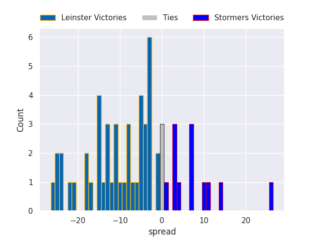

### Lions V Glasgow Warriors on 2026-06-19

Average Margin: Lions by 3.7

### Sharks V Cardiff Rugby on 2026-06-19

Average Margin: Cardiff Rugby by 4.0

### Ulster V Stormers on 2026-06-19

Average Margin: Ulster by 1.7

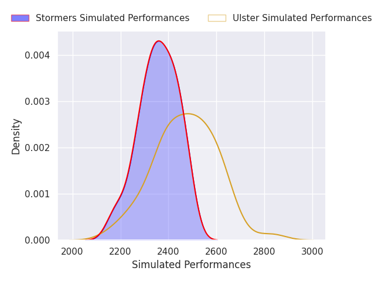

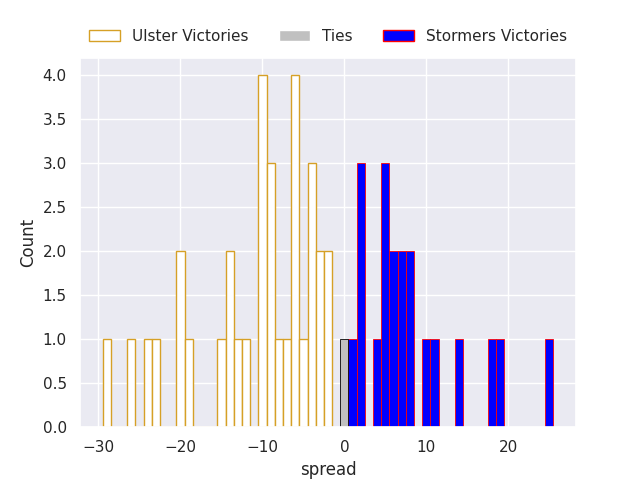

### Connacht V Glasgow Warriors on 2026-06-19

Average Margin: Connacht by 1.5

### Sharks V Stormers on 2026-06-19

Average Margin: Sharks by 3.2

### Leinster V Sharks on 2026-06-19

Average Margin: Leinster by 3.6

### Bulls V Ulster on 2026-06-19

Average Margin: Bulls by 5.5

### Cardiff Rugby V Leinster on 2026-06-19

Average Margin: Cardiff Rugby by 0.5

### Bulls V Sharks on 2026-06-19

Average Margin: Bulls by 5.0

