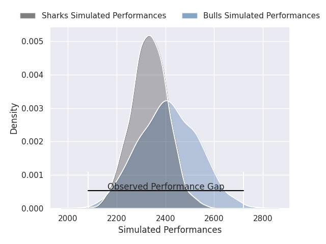
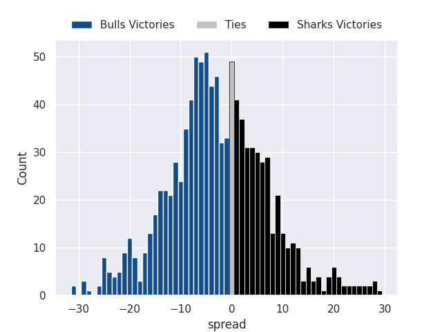
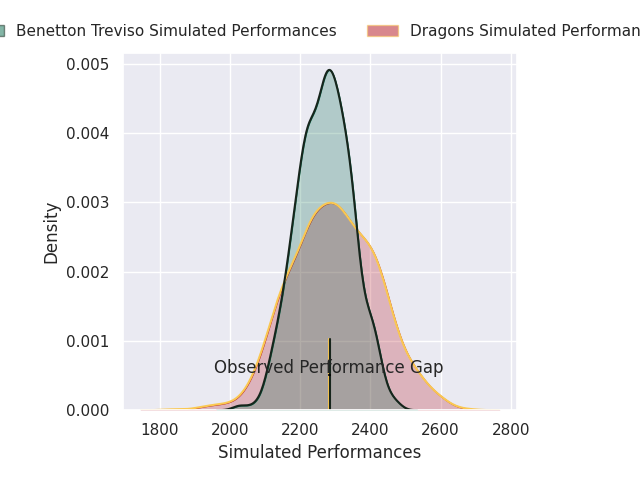
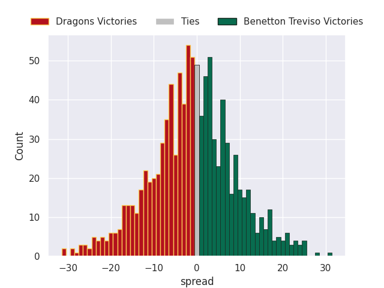
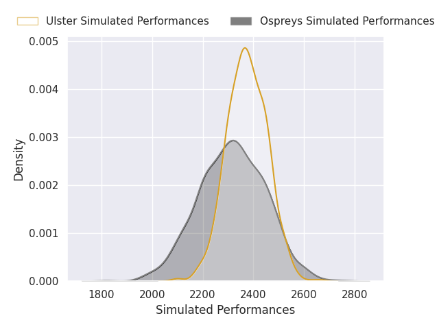
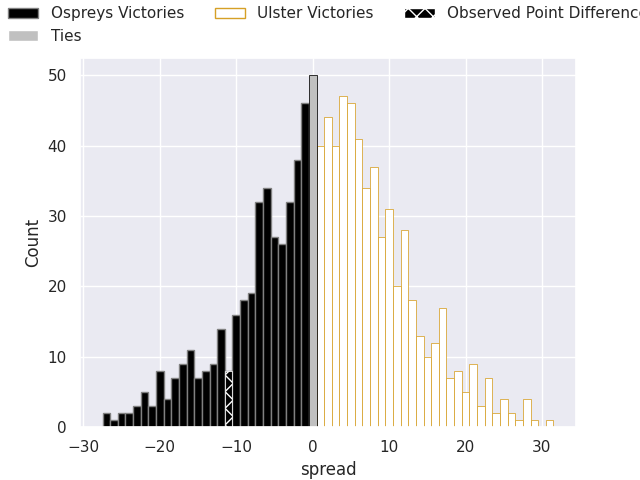

# Team Rankings

# Standings

## Current Standings

| Club             |   Played |   Wins |   Point Differential |   Losing Bonus Points |   Try Bonus Points |   Competition Points |
|:-----------------|---------:|-------:|---------------------:|----------------------:|-------------------:|---------------------:|
| Glasgow Warriors |       11 |      9 |                  155 |                     1 |                  7 |                   44 |
| Leinster         |       11 |      8 |                   67 |                     0 |                  8 |                   40 |
| Ulster           |       11 |      7 |                   94 |                     2 |                  6 |                   38 |
| Stormers         |       10 |      8 |                  113 |                     0 |                  4 |                   36 |
| Cardiff Rugby    |       11 |      7 |                   29 |                     3 |                  3 |                   34 |
| Munster          |       11 |      7 |                    9 |                     2 |                  4 |                   34 |
| Bulls            |       10 |      5 |                    5 |                     1 |                  4 |                   25 |
| Ospreys          |       11 |      4 |                  -24 |                     1 |                  4 |                   25 |
| Lions            |       10 |      4 |                  -43 |                     2 |                  4 |                   24 |
| Sharks           |       10 |      4 |                  -36 |                     1 |                  4 |                   23 |
| Connacht         |       10 |      3 |                  -26 |                     4 |                  5 |                   21 |
| Benetton Treviso |       11 |      4 |                  -65 |                     1 |                  2 |                   21 |
| Edinburgh        |       11 |      3 |                    1 |                     4 |                  2 |                   20 |
| Dragons          |       11 |      2 |                  -59 |                     4 |                  2 |                   18 |
| Scarlets         |       10 |      3 |                  -66 |                     1 |                    |                   15 |
| Zebre            |       11 |      2 |                 -154 |                     2 |                  2 |                   12 |

## Projected Remaining Table

| Club             |   To Play |   Projected Wins |   Projected Differential |   Projected Losing Bonus Points | Projected Try Bonus Points   |   Projected Competition Points |
|:-----------------|----------:|-----------------:|-------------------------:|--------------------------------:|:-----------------------------|-------------------------------:|
| Bulls            |         9 |            5.135 |                   20.794 |                           1.993 |                              |                         23.453 |
| Stormers         |         9 |            4.624 |                   10.605 |                           2.118 |                              |                         21.524 |
| Sharks           |         9 |            4.619 |                    8.468 |                           2.106 |                              |                         21.448 |
| Lions            |         9 |            4.283 |                   -2.459 |                           2.131 |                              |                         20.081 |
| Glasgow Warriors |         7 |            4.183 |                   21.74  |                           1.373 |                              |                         18.783 |
| Ulster           |         7 |            4.047 |                   16.946 |                           1.461 |                              |                         18.449 |
| Leinster         |         7 |            4     |                   21.334 |                           1.437 |                              |                         18.087 |
| Connacht         |         8 |            3.54  |                   -6.28  |                           1.976 |                              |                         16.864 |
| Edinburgh        |         7 |            3.51  |                    3.356 |                           1.581 |                              |                         16.309 |
| Scarlets         |         8 |            3.365 |                  -13.471 |                           1.923 |                              |                         16.095 |
| Munster          |         7 |            3.385 |                    4.946 |                           1.718 |                              |                         15.902 |
| Benetton Treviso |         7 |            2.929 |                  -11.819 |                           1.714 |                              |                         14.106 |
| Dragons          |         7 |            2.871 |                  -10.819 |                           1.835 |                              |                         14.081 |
| Cardiff Rugby    |         7 |            2.792 |                  -13.398 |                           1.813 |                              |                         13.601 |
| Ospreys          |         7 |            2.669 |                  -16.58  |                           1.761 |                              |                         13.129 |
| Zebre            |         7 |            2.099 |                  -33.363 |                           1.665 |                              |                         10.693 |

## Projected Total Table

| Club             |   Played |   Wins |   Point Differential |   Losing Bonus Points |   Try Bonus Points |   Competition Points |
|:-----------------|---------:|-------:|---------------------:|----------------------:|-------------------:|---------------------:|
| Glasgow Warriors |       18 | 13.183 |              176.74  |                 2.373 |                  7 |               62.783 |
| Leinster         |       18 | 12     |               88.334 |                 1.437 |                  8 |               58.087 |
| Stormers         |       19 | 12.624 |              123.605 |                 2.118 |                  4 |               57.524 |
| Ulster           |       18 | 11.047 |              110.946 |                 3.461 |                  6 |               56.449 |
| Munster          |       18 | 10.385 |               13.946 |                 3.718 |                  4 |               49.902 |
| Bulls            |       19 | 10.135 |               25.794 |                 2.993 |                  4 |               48.453 |
| Cardiff Rugby    |       18 |  9.792 |               15.602 |                 4.813 |                  3 |               47.601 |
| Sharks           |       19 |  8.619 |              -27.532 |                 3.106 |                  4 |               44.448 |
| Lions            |       19 |  8.283 |              -45.459 |                 4.131 |                  4 |               44.081 |
| Ospreys          |       18 |  6.669 |              -40.58  |                 2.761 |                  4 |               38.129 |
| Connacht         |       18 |  6.54  |              -32.28  |                 5.976 |                  5 |               37.864 |
| Edinburgh        |       18 |  6.51  |                4.356 |                 5.581 |                  2 |               36.309 |
| Benetton Treviso |       18 |  6.929 |              -76.819 |                 2.714 |                  2 |               35.106 |
| Dragons          |       18 |  4.871 |              -69.819 |                 5.835 |                  2 |               32.081 |
| Scarlets         |       18 |  6.365 |              -79.471 |                 2.923 |                    |               31.095 |
| Zebre            |       18 |  4.099 |             -187.363 |                 3.665 |                  2 |               22.693 |

## Projected Playoff Results

|                  | Reach Quarterfinal   | Win Quarterfinal   | Reach Semifinal   | Win Semifinal   | Reach Final   | Win Final   |
|:-----------------|:---------------------|:-------------------|:------------------|:----------------|:--------------|:------------|
| Glasgow Warriors | 100.0 %              | 72.4 %             | 72.4 %            | 44.6 %          | 44.6 %        | 21.9 %      |
| Leinster         | 99.9 %               | 69.2 %             | 69.2 %            | 33.6 %          | 33.6 %        | 19.5 %      |
| Stormers         | 99.6 %               | 62.5 %             | 62.5 %            | 28.2 %          | 28.2 %        | 16.0 %      |
| Ulster           | 99.7 %               | 54.8 %             | 54.8 %            | 29.6 %          | 29.6 %        | 15.3 %      |
| Munster          | 90.8 %               | 35.5 %             | 35.5 %            | 18.4 %          | 18.4 %        | 7.0 %       |
| Bulls            | 82.7 %               | 31.4 %             | 31.4 %            | 13.2 %          | 13.2 %        | 6.0 %       |
| Cardiff Rugby    | 79.1 %               | 28.6 %             | 28.6 %            | 11.9 %          | 11.9 %        | 5.3 %       |
| Sharks           | 50.9 %               | 17.4 %             | 17.4 %            | 7.8 %           | 7.8 %         | 3.6 %       |
| Lions            | 57.1 %               | 14.3 %             | 14.3 %            | 4.8 %           | 4.8 %         | 2.0 %       |
| Connacht         | 15.5 %               | 5.9 %              | 5.9 %             | 3.7 %           | 3.7 %         | 1.8 %       |
| Edinburgh        | 6.5 %                | 2.4 %              | 2.4 %             | 1.7 %           | 1.7 %         | 0.9 %       |
| Benetton Treviso | 4.1 %                | 1.5 %              | 1.5 %             | 0.9 %           | 0.9 %         | 0.4 %       |
| Ospreys          | 12.6 %               | 3.6 %              | 3.6 %             | 1.6 %           | 1.6 %         | 0.3 %       |
| Scarlets         | 0.4 %                | 0.3 %              | 0.3 %             | 0.0 %           | 0.0 %         | 0.0 %       |
| Dragons          | 1.1 %                | 0.2 %              | 0.2 %             | 0.0 %           | 0.0 %         | 0.0 %       |

# Completed Match Review

| Model | Percent Correct Predictions | Spread Error |
| ------ | ------ | ------ |
| Club Level | 63.5% | 9.1 |
| Player Level: Lineup | nan% | nan |
| Player Level: Minutes | nan% | nan |

# Future Predictions

## Week 12

### Connacht V Scarlets on 2025/10/04

Average Margin: Connacht by 4.7

## Week 13

### Bulls V Stormers on 2025/12/25

Average Margin: Stormers by 0.2

### Lions V Sharks on 2025/12/25

Average Margin: Lions by 4.5

## Week 14

### Lions V Sharks on 2026/02/21

Average Margin: Lions by 0.3

## Week 15

### Cardiff Rugby V Leinster on 2026/02/27

Average Margin: Leinster by 2.4

### Edinburgh V Scarlets on 2026/02/27

Average Margin: Edinburgh by 4.1

### Connacht V Glasgow Warriors on 2026/02/28

Average Margin: Glasgow Warriors by 1.9

### Bulls V Sharks on 2026/02/28

Average Margin: Bulls by 2.8

### Lions V Stormers on 2026/02/28

Average Margin: Stormers by 0.4

### Dragons V Benetton Treviso on 2026/02/28

Average Margin: Dragons by 1.0

### Munster V Zebre on 2026/02/28

Average Margin: Munster by 8.0

### Ospreys V Ulster on 2026/02/28

Average Margin: Ulster by 1.6

## Week 16

### Bulls V Stormers on 2026/03/14

Average Margin: Bulls by 1.9

## Week 17

### Ulster V Connacht on 2026/03/20

Average Margin: Ulster by 6.5

### Bulls V Cardiff Rugby on 2026/03/20

Average Margin: Bulls by 4.2

### Scarlets V Zebre on 2026/03/20

Average Margin: Scarlets by 4.6

### Benetton Treviso V Ospreys on 2026/03/21

Average Margin: Benetton Treviso by 3.9

### Lions V Edinburgh on 2026/03/21

Average Margin: Lions by 3.2

### Glasgow Warriors V Leinster on 2026/03/21

Average Margin: Glasgow Warriors by 3.5

### Sharks V Munster on 2026/03/21

Average Margin: Sharks by 3.0

### Stormers V Dragons on 2026/03/21

Average Margin: Stormers by 6.5

## Week 18

### Glasgow Warriors V Benetton Treviso on 2026/03/27

Average Margin: Glasgow Warriors by 8.0

### Sharks V Cardiff Rugby on 2026/03/27

Average Margin: Sharks by 3.8

### Bulls V Munster on 2026/03/28

Average Margin: Bulls by 2.9

### Lions V Dragons on 2026/03/28

Average Margin: Lions by 3.9

### Stormers V Edinburgh on 2026/03/28

Average Margin: Stormers by 5.2

### Zebre V Ulster on 2026/03/28

Average Margin: Ulster by 3.3

### Connacht V Ospreys on 2026/03/28

Average Margin: Connacht by 4.8

### Leinster V Scarlets on 2026/03/28

Average Margin: Leinster by 8.7

## Week 19

### Ulster V Leinster on 2026/04/17

Average Margin: Ulster by 1.6

### Edinburgh V Zebre on 2026/04/17

Average Margin: Edinburgh by 5.7

### Dragons V Bulls on 2026/04/17

Average Margin: Dragons by 0.8

### Lions V Glasgow Warriors on 2026/04/18

Average Margin: Glasgow Warriors by 3.7

### Scarlets V Cardiff Rugby on 2026/04/18

Average Margin: Scarlets by 0.5

### Ospreys V Sharks on 2026/04/18

Average Margin: Ospreys by 0.3

### Stormers V Connacht on 2026/04/18

Average Margin: Stormers by 4.9

### Benetton Treviso V Munster on 2026/04/18

Average Margin: Benetton Treviso by 2.1

## Week 20

### Edinburgh V Sharks on 2026/04/24

Average Margin: Edinburgh by 1.0

### Zebre V Dragons on 2026/04/24

Average Margin: Zebre by 1.0

### Cardiff Rugby V Ospreys on 2026/04/24

Average Margin: Cardiff Rugby by 3.1

### Lions V Connacht on 2026/04/25

Average Margin: Lions by 2.3

### Stormers V Glasgow Warriors on 2026/04/25

Average Margin: Glasgow Warriors by 0.2

### Scarlets V Bulls on 2026/04/25

Average Margin: Scarlets by 0.2

### Munster V Ulster on 2026/04/25

Average Margin: Munster by 1.6

### Benetton Treviso V Leinster on 2026/04/25

Average Margin: Leinster by 0.9

## Week 21

### Ulster V Stormers on 2026/05/08

Average Margin: Ulster by 3.5

### Glasgow Warriors V Cardiff Rugby on 2026/05/08

Average Margin: Glasgow Warriors by 6.5

### Dragons V Edinburgh on 2026/05/09

Average Margin: Dragons by 1.6

### Bulls V Zebre on 2026/05/09

Average Margin: Bulls by 6.2

### Leinster V Lions on 2026/05/09

Average Margin: Leinster by 7.1

### Ospreys V Scarlets on 2026/05/09

Average Margin: Ospreys by 3.9

### Connacht V Munster on 2026/05/09

Average Margin: Connacht by 2.3

### Sharks V Benetton Treviso on 2026/05/09

Average Margin: Sharks by 4.0

## Week 22

### Cardiff Rugby V Stormers on 2026/05/15

Average Margin: Cardiff Rugby by 0.9

### Edinburgh V Connacht on 2026/05/15

Average Margin: Edinburgh by 2.4

### Ulster V Glasgow Warriors on 2026/05/15

Average Margin: Ulster by 2.0

### Munster V Lions on 2026/05/16

Average Margin: Munster by 5.6

### Bulls V Benetton Treviso on 2026/05/16

Average Margin: Bulls by 4.0

### Sharks V Zebre on 2026/05/16

Average Margin: Sharks by 6.6

### Scarlets V Dragons on 2026/05/16

Average Margin: Scarlets by 2.6

### Leinster V Ospreys on 2026/05/16

Average Margin: Leinster by 7.4

## Week 23

### Glasgow Warriors V Bulls on 2026-05-29

Average Margin: Glasgow Warriors by 9.0

### Stormers V Dragons on 2026-05-29

Average Margin: Stormers by 15.0

### Leinster V Scarlets on 2026-05-29

Average Margin: Scarlets by 1.0

### Ulster V Dragons on 2026-05-29

Average Margin: Ulster by 23.0

### Cardiff Rugby V Lions on 2026-05-29

Average Margin: Cardiff Rugby by 2.0

### Bulls V Ospreys on 2026-05-29

Average Margin: Bulls by 21.0

### Munster V Edinburgh on 2026-05-29

Average Margin: Munster by 8.0

### Bulls V Sharks on 2026-05-29

Average Margin: Sharks by 3.0

### Bulls V Connacht on 2026-05-29

Average Margin: Connacht by 20.0

### Stormers V Ospreys on 2026-05-29

Average Margin: Stormers by 4.5

### Munster V Lions on 2026-05-29

Average Margin: Lions by 0.0

### Glasgow Warriors V Ulster on 2026-05-29

Average Margin: Glasgow Warriors by 1.6

### Ulster V Edinburgh on 2026-05-29

Average Margin: Edinburgh by 0.0

### Glasgow Warriors V Edinburgh on 2026-05-29

Average Margin: Edinburgh by 3.7

### Munster V Cardiff Rugby on 2026-05-29

Average Margin: Munster by 8.8

### Glasgow Warriors V Leinster on 2026-05-29

Average Margin: Glasgow Warriors by 7.0

### Stormers V Connacht on 2026-05-29

Average Margin: Stormers by 9.8

### Glasgow Warriors V Stormers on 2026-05-29

Average Margin: Stormers by 4.5

### Leinster V Stormers on 2026-05-29

Average Margin: Leinster by 9.5

### Bulls V Ulster on 2026-05-29

Average Margin: Bulls by 4.2

### Bulls V Munster on 2026-05-29

Average Margin: Bulls by 5.4

### Sharks V Cardiff Rugby on 2026-05-29

Average Margin: Sharks by 1.4

### Glasgow Warriors V Scarlets on 2026-05-29

Average Margin: Scarlets by 0.0

### Ulster V Scarlets on 2026-05-29

Average Margin: Ulster by 2.0

### Glasgow Warriors V Dragons on 2026-05-29

Average Margin: Glasgow Warriors by 7.8

### Leinster V Glasgow Warriors on 2026-05-29

Average Margin: Glasgow Warriors by 29.0

### Sharks V Bulls on 2026-05-29

Average Margin: Bulls by 0.2

### Connacht V Munster on 2026-05-29

Average Margin: Connacht by 16.0

### Cardiff Rugby V Leinster on 2026-05-29

Average Margin: Leinster by 0.4

### Munster V Ospreys on 2026-05-29

Average Margin: Ospreys by 5.0

### Cardiff Rugby V Sharks on 2026-05-29

Average Margin: Cardiff Rugby by 5.5

### Leinster V Ulster on 2026-05-29

Average Margin: Leinster by 5.7

### Lions V Ulster on 2026-05-29

Average Margin: Lions by 3.9

### Munster V Glasgow Warriors on 2026-05-29

Average Margin: Glasgow Warriors by 1.8

### Stormers V Leinster on 2026-05-29

Average Margin: Leinster by 2.1

### Stormers V Ulster on 2026-05-29

Average Margin: Stormers by 6.3

### Cardiff Rugby V Ulster on 2026-05-29

Average Margin: Cardiff Rugby by 2.2

### Sharks V Connacht on 2026-05-29

Average Margin: Sharks by 27.0

### Lions V Bulls on 2026-05-29

Average Margin: Lions by 1.0

### Bulls V Lions on 2026-05-29

Average Margin: Bulls by 2.0

### Glasgow Warriors V Benetton Treviso on 2026-05-29

Average Margin: Benetton Treviso by 2.0

### Glasgow Warriors V Connacht on 2026-05-29

Average Margin: Glasgow Warriors by 1.7

### Stormers V Sharks on 2026-05-29

Average Margin: Stormers by 6.6

### Ulster V Cardiff Rugby on 2026-05-29

Average Margin: Ulster by 2.1

### Leinster V Munster on 2026-05-29

Average Margin: Leinster by 5.8

### Ulster V Benetton Treviso on 2026-05-29

Average Margin: Ulster by 2.0

### Leinster V Lions on 2026-05-29

Average Margin: Leinster by 7.6

### Stormers V Cardiff Rugby on 2026-05-29

Average Margin: Stormers by 5.6

### Stormers V Munster on 2026-05-29

Average Margin: Stormers by 0.7

### Ulster V Sharks on 2026-05-29

Average Margin: Ulster by 6.3

### Ulster V Bulls on 2026-05-29

Average Margin: Ulster by 6.1

### Stormers V Lions on 2026-05-29

Average Margin: Stormers by 7.8

### Glasgow Warriors V Sharks on 2026-05-29

Average Margin: Glasgow Warriors by 3.7

### Glasgow Warriors V Cardiff Rugby on 2026-05-29

Average Margin: Glasgow Warriors by 4.0

### Ulster V Munster on 2026-05-29

Average Margin: Ulster by 0.9

### Leinster V Cardiff Rugby on 2026-05-29

Average Margin: Leinster by 5.3

### Glasgow Warriors V Ospreys on 2026-05-29

Average Margin: Glasgow Warriors by 7.3

### Glasgow Warriors V Munster on 2026-05-29

Average Margin: Glasgow Warriors by 5.5

### Cardiff Rugby V Bulls on 2026-05-29

Average Margin: Cardiff Rugby by 2.8

### Leinster V Edinburgh on 2026-05-29

Average Margin: Leinster by 8.7

### Stormers V Bulls on 2026-05-29

Average Margin: Stormers by 6.8

### Stormers V Edinburgh on 2026-05-29

Average Margin: Stormers by 9.0

### Leinster V Dragons on 2026-05-29

Average Margin: Leinster by 8.0

### Munster V Bulls on 2026-05-29

Average Margin: Bulls by 0.8

### Cardiff Rugby V Connacht on 2026-05-29

Average Margin: Cardiff Rugby by 1.0

### Ulster V Ospreys on 2026-05-29

Average Margin: Ulster by 6.9

### Ulster V Connacht on 2026-05-29

Average Margin: Ulster by 12.0

### Leinster V Connacht on 2026-05-29

Average Margin: Leinster by 6.4

### Munster V Sharks on 2026-05-29

Average Margin: Sharks by 3.2

### Ulster V Leinster on 2026-05-29

Average Margin: Ulster by 4.8

### Stormers V Benetton Treviso on 2026-05-29

Average Margin: Stormers by 11.0

### Ulster V Lions on 2026-05-29

Average Margin: Ulster by 4.2

### Leinster V Ospreys on 2026-05-29

Average Margin: Leinster by 4.1

### Ulster V Stormers on 2026-05-29

Average Margin: Ulster by 4.9

### Glasgow Warriors V Lions on 2026-05-29

Average Margin: Glasgow Warriors by 6.1

### Leinster V Bulls on 2026-05-29

Average Margin: Leinster by 2.1

### Leinster V Sharks on 2026-05-29

Average Margin: Leinster by 5.4

### Leinster V Benetton Treviso on 2026-05-29

Average Margin: Benetton Treviso by 4.7

### Cardiff Rugby V Edinburgh on 2026-05-29

Average Margin: Edinburgh by 6.0

## Week 24

### Sharks V Munster on 2026-06-05

Average Margin: Sharks by 0.8

### Scarlets V Stormers on 2026-06-05

Average Margin: Stormers by 6.0

### Benetton Treviso V Glasgow Warriors on 2026-06-05

Average Margin: Glasgow Warriors by 2.0

### Edinburgh V Lions on 2026-06-05

Average Margin: Edinburgh by 12.0

### Munster V Connacht on 2026-06-05

Average Margin: Munster by 1.5

### Ospreys V Ulster on 2026-06-05

Average Margin: Ulster by 9.3

### Benetton Treviso V Sharks on 2026-06-05

Average Margin: Sharks by 0.0

### Dragons V Stormers on 2026-06-05

Average Margin: Stormers by 6.0

### Benetton Treviso V Ulster on 2026-06-05

Average Margin: Benetton Treviso by 12.0

### Edinburgh V Sharks on 2026-06-05

Average Margin: Edinburgh by 8.0

### Scarlets V Leinster on 2026-06-05

Average Margin: Leinster by 1.0

### Connacht V Bulls on 2026-06-05

Average Margin: Connacht by 10.0

### Ospreys V Stormers on 2026-06-05

Average Margin: Ospreys by 7.4

### Ospreys V Munster on 2026-06-05

Average Margin: Munster by 4.5

### Edinburgh V Bulls on 2026-06-05

Average Margin: Edinburgh by 3.0

### Glasgow Warriors V Connacht on 2026-06-05

Average Margin: Connacht by 3.2

### Edinburgh V Cardiff Rugby on 2026-06-05

Average Margin: Edinburgh by 4.0

### Lions V Munster on 2026-06-05

Average Margin: Lions by 0.5

### Benetton Treviso V Munster on 2026-06-05

Average Margin: Benetton Treviso by 5.5

### Edinburgh V Leinster on 2026-06-05

Average Margin: Edinburgh by 5.0

### Cardiff Rugby V Stormers on 2026-06-05

Average Margin: Cardiff Rugby by 0.7

### Munster V Cardiff Rugby on 2026-06-05

Average Margin: Munster by 1.1

### Ulster V Stormers on 2026-06-05

Average Margin: Ulster by 3.4

### Munster V Glasgow Warriors on 2026-06-05

Average Margin: Munster by 5.3

### Benetton Treviso V Stormers on 2026-06-05

Average Margin: Benetton Treviso by 15.0

### Cardiff Rugby V Connacht on 2026-06-05

Average Margin: Cardiff Rugby by 11.0

### Cardiff Rugby V Ospreys on 2026-06-05

Average Margin: Cardiff Rugby by 7.0

### Stormers V Connacht on 2026-06-05

Average Margin: Connacht by 3.8

### Connacht V Sharks on 2026-06-05

Average Margin: Sharks by 0.0

### Lions V Bulls on 2026-06-05

Average Margin: Lions by 2.8

### Bulls V Edinburgh on 2026-06-05

Average Margin: Edinburgh by 2.5

### Connacht V Leinster on 2026-06-05

Average Margin: Connacht by 6.2

### Lions V Glasgow Warriors on 2026-06-05

Average Margin: Glasgow Warriors by 1.1

### Bulls V Ospreys on 2026-06-05

Average Margin: Bulls by 11.5

### Glasgow Warriors V Sharks on 2026-06-05

Average Margin: Glasgow Warriors by 7.3

### Benetton Treviso V Cardiff Rugby on 2026-06-05

Average Margin: Benetton Treviso by 14.0

### Munster V Bulls on 2026-06-05

Average Margin: Munster by 2.6

### Ulster V Cardiff Rugby on 2026-06-05

Average Margin: Ulster by 3.3

### Bulls V Glasgow Warriors on 2026-06-05

Average Margin: Glasgow Warriors by 0.8

### Stormers V Sharks on 2026-06-05

Average Margin: Stormers by 1.1

### Sharks V Ulster on 2026-06-05

Average Margin: Ulster by 1.4

### Munster V Sharks on 2026-06-05

Average Margin: Munster by 6.0

### Leinster V Glasgow Warriors on 2026-06-05

Average Margin: Leinster by 3.5

### Munster V Ulster on 2026-06-05

Average Margin: Munster by 1.5

### Leinster V Ospreys on 2026-06-05

Average Margin: Leinster by 3.0

### Scarlets V Ulster on 2026-06-05

Average Margin: Ulster by 13.0

### Edinburgh V Stormers on 2026-06-05

Average Margin: Edinburgh by 3.0

### Sharks V Bulls on 2026-06-05

Average Margin: Sharks by 1.5

### Leinster V Connacht on 2026-06-05

Average Margin: Connacht by 0.7

### Lions V Stormers on 2026-06-05

Average Margin: Lions by 0.5

### Glasgow Warriors V Ulster on 2026-06-05

Average Margin: Glasgow Warriors by 4.6

### Connacht V Ulster on 2026-06-05

Average Margin: Connacht by 2.7

### Ospreys V Leinster on 2026-06-05

Average Margin: Ospreys by 4.2

### Glasgow Warriors V Cardiff Rugby on 2026-06-05

Average Margin: Glasgow Warriors by 5.8

### Ulster V Lions on 2026-06-05

Average Margin: Ulster by 6.3

### Ulster V Bulls on 2026-06-05

Average Margin: Ulster by 3.7

### Stormers V Ulster on 2026-06-05

Average Margin: Stormers by 5.8

### Glasgow Warriors V Stormers on 2026-06-05

Average Margin: Glasgow Warriors by 4.7

### Ospreys V Glasgow Warriors on 2026-06-05

Average Margin: Ospreys by 2.5

### Cardiff Rugby V Leinster on 2026-06-05

Average Margin: Cardiff Rugby by 1.5

### Stormers V Cardiff Rugby on 2026-06-05

Average Margin: Stormers by 3.9

### Glasgow Warriors V Leinster on 2026-06-05

Average Margin: Glasgow Warriors by 3.4

### Glasgow Warriors V Munster on 2026-06-05

Average Margin: Glasgow Warriors by 3.5

### Stormers V Bulls on 2026-06-05

Average Margin: Stormers by 3.3

### Ulster V Sharks on 2026-06-05

Average Margin: Ulster by 4.4

### Glasgow Warriors V Bulls on 2026-06-05

Average Margin: Glasgow Warriors by 6.6

### Stormers V Leinster on 2026-06-05

Average Margin: Stormers by 0.4

### Ulster V Leinster on 2026-06-05

Average Margin: Ulster by 3.3

### Munster V Leinster on 2026-06-05

Average Margin: Munster by 2.5

### Bulls V Cardiff Rugby on 2026-06-05

Average Margin: Bulls by 8.1

### Connacht V Stormers on 2026-06-05

Average Margin: Connacht by 6.0

### Benetton Treviso V Bulls on 2026-06-05

Average Margin: Bulls by 9.0

### Connacht V Cardiff Rugby on 2026-06-05

Average Margin: Connacht by 4.6

### Benetton Treviso V Leinster on 2026-06-05

Average Margin: Leinster by 11.0

### Lions V Sharks on 2026-06-05

Average Margin: Sharks by 0.3

### Lions V Cardiff Rugby on 2026-06-05

Average Margin: Cardiff Rugby by 5.0

### Munster V Stormers on 2026-06-05

Average Margin: Munster by 2.2

### Dragons V Cardiff Rugby on 2026-06-05

Average Margin: Cardiff Rugby by 8.0

### Ulster V Munster on 2026-06-05

Average Margin: Ulster by 6.8

### Ospreys V Sharks on 2026-06-05

Average Margin: Ospreys by 10.0

### Sharks V Cardiff Rugby on 2026-06-05

Average Margin: Sharks by 9.5

### Edinburgh V Munster on 2026-06-05

Average Margin: Munster by 4.5

### Bulls V Lions on 2026-06-05

Average Margin: Bulls by 9.3

### Cardiff Rugby V Munster on 2026-06-05

Average Margin: Cardiff Rugby by 3.2

### Bulls V Munster on 2026-06-05

Average Margin: Munster by 1.0

### Sharks V Glasgow Warriors on 2026-06-05

Average Margin: Sharks by 0.4

### Glasgow Warriors V Lions on 2026-06-05

Average Margin: Glasgow Warriors by 7.1

### Leinster V Bulls on 2026-06-05

Average Margin: Leinster by 4.9

### Sharks V Leinster on 2026-06-05

Average Margin: Leinster by 0.1

### Cardiff Rugby V Ulster on 2026-06-05

Average Margin: Cardiff Rugby by 2.6

### Sharks V Stormers on 2026-06-05

Average Margin: Sharks by 0.1

### Lions V Leinster on 2026-06-05

Average Margin: Lions by 0.1

### Ulster V Edinburgh on 2026-06-05

Average Margin: Ulster by 8.0

## Final

### Sharks V Glasgow Warriors on 2026-06-19

Average Margin: Glasgow Warriors by 3.7

### Lions V Ulster on 2026-06-19

Average Margin: Lions by 2.2

### Bulls V Benetton Treviso on 2026-06-19

Average Margin: Bulls by 13.0

### Ospreys V Cardiff Rugby on 2026-06-19

Average Margin: Cardiff Rugby by 6.0

### Ospreys V Ulster on 2026-06-19

Average Margin: Ulster by 3.8

### Sharks V Ospreys on 2026-06-19

Average Margin: Sharks by 8.0

### Leinster V Sharks on 2026-06-19

Average Margin: Leinster by 1.6

### Ulster V Connacht on 2026-06-19

Average Margin: Ulster by 7.9

### Glasgow Warriors V Edinburgh on 2026-06-19

Average Margin: Glasgow Warriors by 7.0

### Sharks V Cardiff Rugby on 2026-06-19

Average Margin: Sharks by 0.7

### Lions V Ospreys on 2026-06-19

Average Margin: Lions by 23.0

### Stormers V Lions on 2026-06-19

Average Margin: Stormers by 1.2

### Edinburgh V Sharks on 2026-06-19

Average Margin: Sharks by 4.0

### Stormers V Edinburgh on 2026-06-19

Average Margin: Stormers by 5.8

### Munster V Sharks on 2026-06-19

Average Margin: Sharks by 2.8

### Ospreys V Leinster on 2026-06-19

Average Margin: Leinster by 6.0

### Edinburgh V Munster on 2026-06-19

Average Margin: Edinburgh by 4.0

### Cardiff Rugby V Stormers on 2026-06-19

Average Margin: Cardiff Rugby by 3.0

### Connacht V Sharks on 2026-06-19

Average Margin: Connacht by 7.2

### Bulls V Lions on 2026-06-19

Average Margin: Bulls by 9.2

### Benetton Treviso V Leinster on 2026-06-19

Average Margin: Benetton Treviso by 17.5

### Lions V Cardiff Rugby on 2026-06-19

Average Margin: Cardiff Rugby by 0.2

### Edinburgh V Lions on 2026-06-19

Average Margin: Edinburgh by 6.0

### Edinburgh V Leinster on 2026-06-19

Average Margin: Leinster by 9.0

### Edinburgh V Cardiff Rugby on 2026-06-19

Average Margin: Edinburgh by 14.0

### Connacht V Munster on 2026-06-19

Average Margin: Munster by 1.3

### Edinburgh V Bulls on 2026-06-19

Average Margin: Edinburgh by 12.0

### Ospreys V Stormers on 2026-06-19

Average Margin: Stormers by 3.0

### Ospreys V Bulls on 2026-06-19

Average Margin: Bulls by 0.0

### Connacht V Lions on 2026-06-19

Average Margin: Lions by 6.0

### Cardiff Rugby V Bulls on 2026-06-19

Average Margin: Cardiff Rugby by 2.3

### Cardiff Rugby V Ulster on 2026-06-19

Average Margin: Cardiff Rugby by 2.3

### Leinster V Lions on 2026-06-19

Average Margin: Leinster by 9.5

### Sharks V Ulster on 2026-06-19

Average Margin: Sharks by 0.9

### Leinster V Glasgow Warriors on 2026-06-19

Average Margin: Leinster by 2.7

### Glasgow Warriors V Cardiff Rugby on 2026-06-19

Average Margin: Glasgow Warriors by 5.3

### Ulster V Glasgow Warriors on 2026-06-19

Average Margin: Ulster by 2.8

### Stormers V Munster on 2026-06-19

Average Margin: Stormers by 1.5

### Stormers V Leinster on 2026-06-19

Average Margin: Stormers by 2.3

### Stormers V Glasgow Warriors on 2026-06-19

Average Margin: Stormers by 1.1

### Cardiff Rugby V Munster on 2026-06-19

Average Margin: Cardiff Rugby by 0.1

### Leinster V Munster on 2026-06-19

Average Margin: Leinster by 6.7

### Leinster V Ulster on 2026-06-19

Average Margin: Leinster by 4.5

### Stormers V Benetton Treviso on 2026-06-19

Average Margin: Benetton Treviso by 3.0

### Stormers V Sharks on 2026-06-19

Average Margin: Stormers by 5.0

### Bulls V Glasgow Warriors on 2026-06-19

Average Margin: Bulls by 0.7

### Stormers V Ulster on 2026-06-19

Average Margin: Stormers by 3.6

### Leinster V Bulls on 2026-06-19

Average Margin: Leinster by 3.2

### Sharks V Lions on 2026-06-19

Average Margin: Lions by 4.0

### Connacht V Stormers on 2026-06-19

Average Margin: Stormers by 2.0

### Lions V Munster on 2026-06-19

Average Margin: Lions by 5.0

### Connacht V Leinster on 2026-06-19

Average Margin: Connacht by 3.7

### Connacht V Glasgow Warriors on 2026-06-19

Average Margin: Connacht by 3.8

### Ulster V Munster on 2026-06-19

Average Margin: Ulster by 2.0

### Stormers V Bulls on 2026-06-19

Average Margin: Stormers by 3.3

### Glasgow Warriors V Lions on 2026-06-19

Average Margin: Glasgow Warriors by 6.3

### Glasgow Warriors V Ospreys on 2026-06-19

Average Margin: Glasgow Warriors by 14.0

### Connacht V Cardiff Rugby on 2026-06-19

Average Margin: Connacht by 3.0

### Sharks V Bulls on 2026-06-19

Average Margin: Sharks by 10.3

### Bulls V Munster on 2026-06-19

Average Margin: Bulls by 2.6

### Glasgow Warriors V Munster on 2026-06-19

Average Margin: Glasgow Warriors by 3.3

### Glasgow Warriors V Benetton Treviso on 2026-06-19

Average Margin: Glasgow Warriors by 7.0

### Ulster V Bulls on 2026-06-19

Average Margin: Ulster by 4.7

### Cardiff Rugby V Leinster on 2026-06-19

Average Margin: Leinster by 1.4

### Ulster V Edinburgh on 2026-06-19

Average Margin: Ulster by 2.0

### Connacht V Bulls on 2026-06-19

Average Margin: Connacht by 10.0

